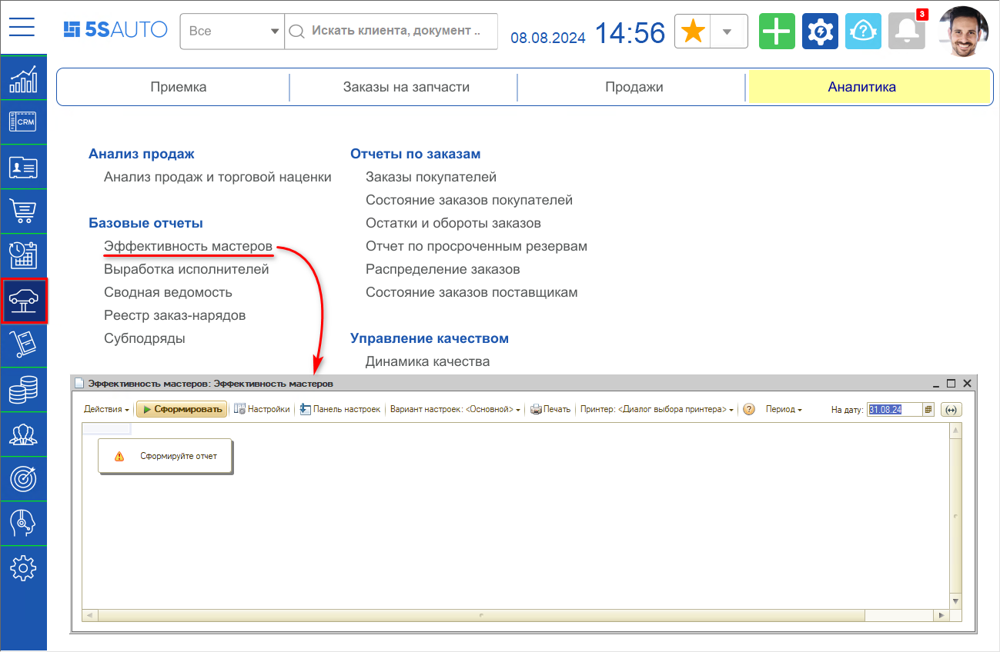
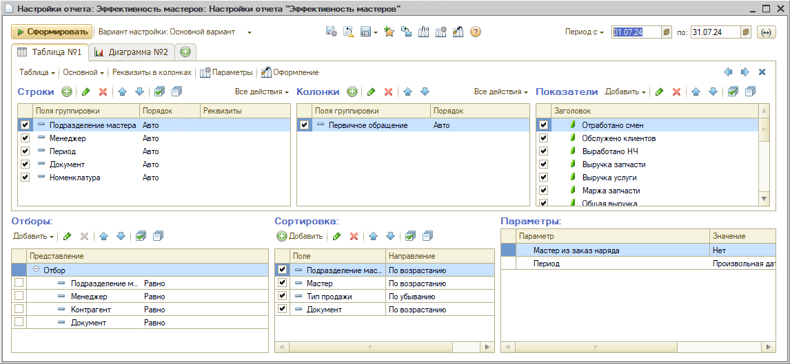
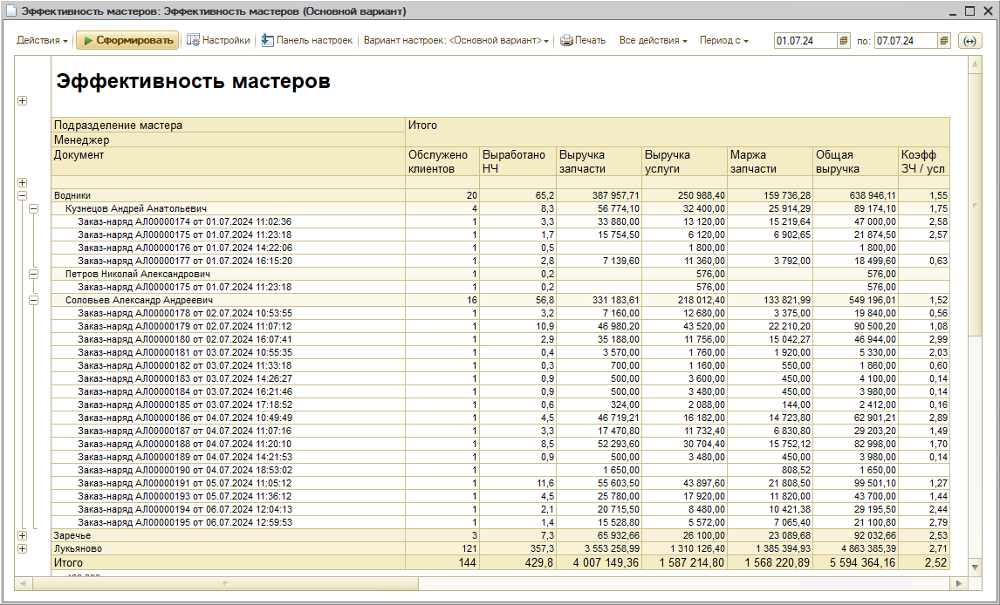
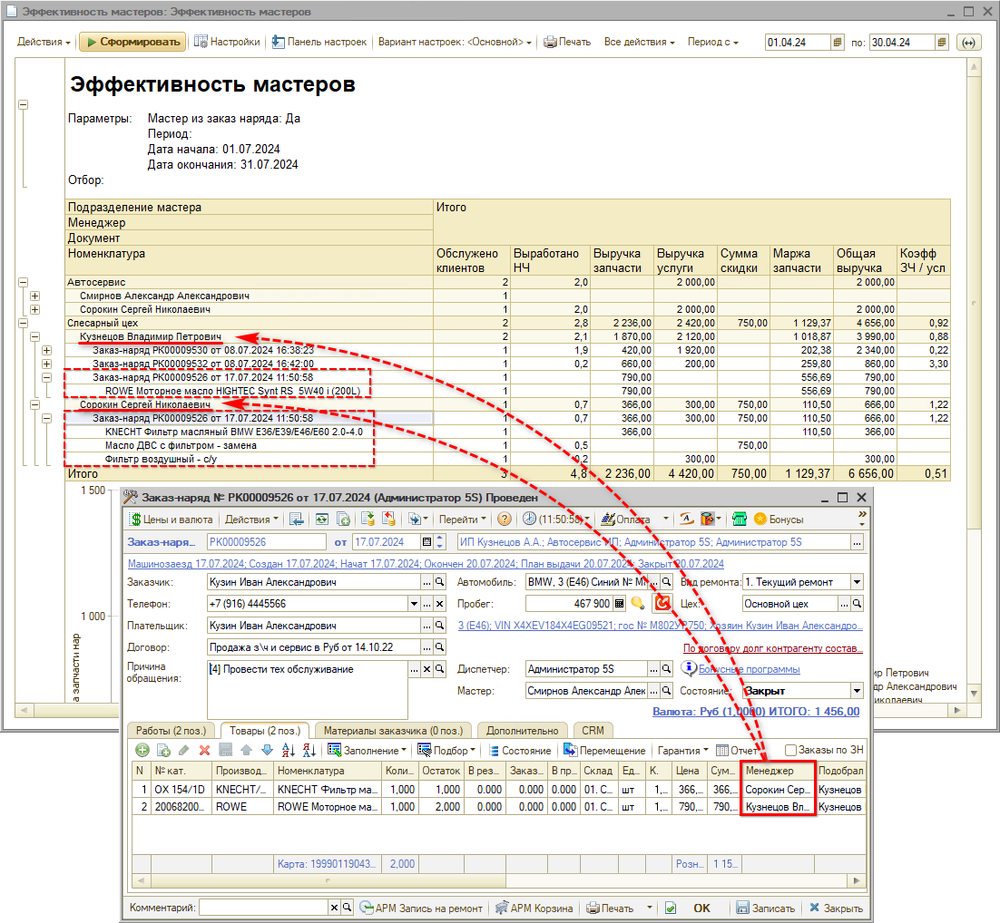
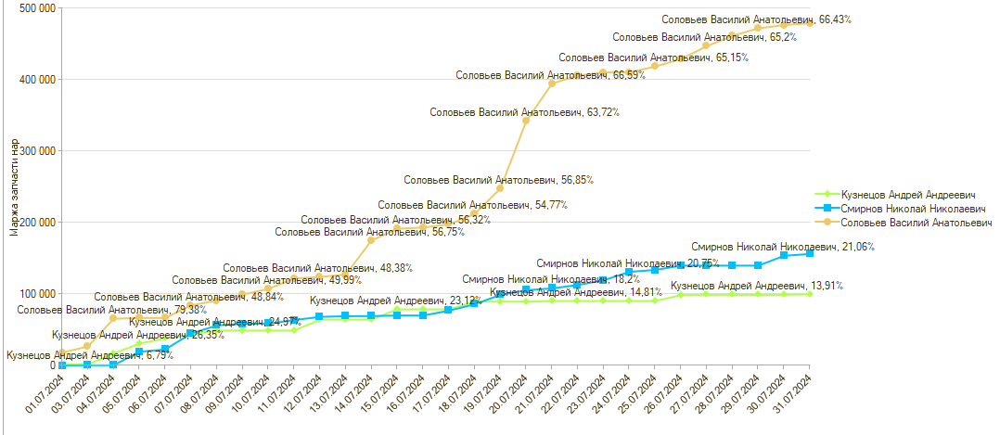

# Отчет "Эффективность мастеров"

<table><tr><td><b>Время чтения:</b> 12 мин.</td><td><b>Обновлено:</b> 09.08.2024</td></tr></table>

Источник: https://www.5systems.ru/help/otchet-effektivnost-masterov

## Содержание

1. [Введение](#введение)
2. [Как перейти](#как-перейти)
3. [Настройки](#настройки)
4. [Описание](#описание)
   - [Группировка строк отчета](#группировка-строк-отчета)
   - [Показатели отчета](#показатели-отчета)
   - [График](#график)

## Введение

***Отчет "Эффективность мастеров"*** позволяет просмотреть ключевые показатели работы мастеров-приемщиков по заказ-нарядам. Данные ключевые показатели могут быть использованы при расчете заработной платы.

## Как перейти

Расположение отчета в меню интерфейса – *Автосервис → Аналитика → Базовые отчеты:*

## Настройки

Следует установить нужный период и задать настройки отчета – например, вывести или убрать некоторые поля группировки строк:

## Описание

Пример сформированного отчета:

### Группировка строк отчета

Отчет по умолчанию имеет 4 ***уровня группировки:***

1. *Подразделение мастера* – подразделение сотрудника, указанного в параметре "Мастер" в Заказ-наряде.
2. *Менеджер.* В отчете выводятся сотрудники:
   - которые указаны в параметре "Менеджер" документа "Реализация товаров",
   - которые указаны в колонке "Менеджер" или "Мастер"[\*](#snoska) в табличных частях "Товары", "Работы" Заказ-нарядов в состоянии "Закрыт".  
     
   Если в колонке "Менеджер" или "Мастер" не заполнено значение, то подтягивается сотрудник, указанный в параметре "Мастер" Заказ-наряда. 
   \* *Наименование колонки "Менеджер" или "Мастер" в Заказ-наряде зависит от настройки системы "Заполнять специалиста по запчастям в ТЧ Товары заказ-наряда" (группа прав и настроек Основные → АВТОСЕРВИС). Если установлено значение для настройки "Да", то колонка "Менеджер" переименовывается в "Мастер" и появляется колонка "Подобрал з/ч". Настройка используется для учета выработки отдельно выделенных специалистов по запчастям.*
3. *Документ* – Заказ-наряд или Реализация товаров.
4. *Период* – группировка по дате документа.

Дополнительно можно вывести поле *"Номенклатура"* – позиция номенклатуры, которая была реализована в Документе.

### Показатели отчета

**Показатели отчета по умолчанию:**

- *Отработано смен* – Количество фактически отработанных смен из [*Табеля учета рабочего времени*](../../Персонал%20и%20мотивация/Табель%20учета%20рабочего%20времени/tabel-ucheta-rabochego-vremeni.md)
- *Обслужено клиентов* – количество клиентов из документов (продаж)
- *Выработано н/ч* – количество нормочасов по работам в Заказ-наряде
- *Выручка запчасти* – выручка по реализации запчастей
- *Выручка услуги* – выручка по реализации авторабот
- *Сумма скидки* – сумма скидки в Заказ-наряде
- *Общая выручка* – сумма: <Выручка запчасти> + <Выручка услуги>
- *Коэфф. (ЗЧ/услуги)* – соотношение: <Выручка запчасти>/<Выручка услуги>

### График

В отчете можно вывести ***ключевые показатели с нарастающим итогом*** по дням:

1. Выручка (нарастающим итогом)
2. Себестоимость (нарастающим итогом)
3. Маржа запчасти (нарастающим итогом)
4. Маржа общая (нарастающим итогом)

Данные показатели будут отражать динамику по дням.

Ключевые показатели с нарастающим итогом удобно отображать и анализировать в виде ***графика**.* Пример графика с нарастающим итогом по полю "Маржа запчасти (нарастающим итогом)":

---

**Теги:** отчеты, эффективность мастеров, мастера, выработка, табель

