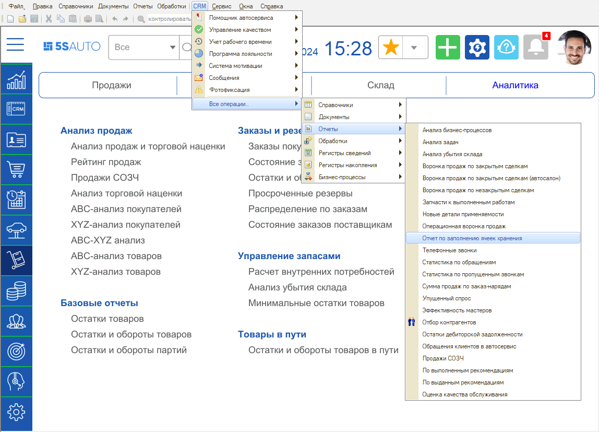
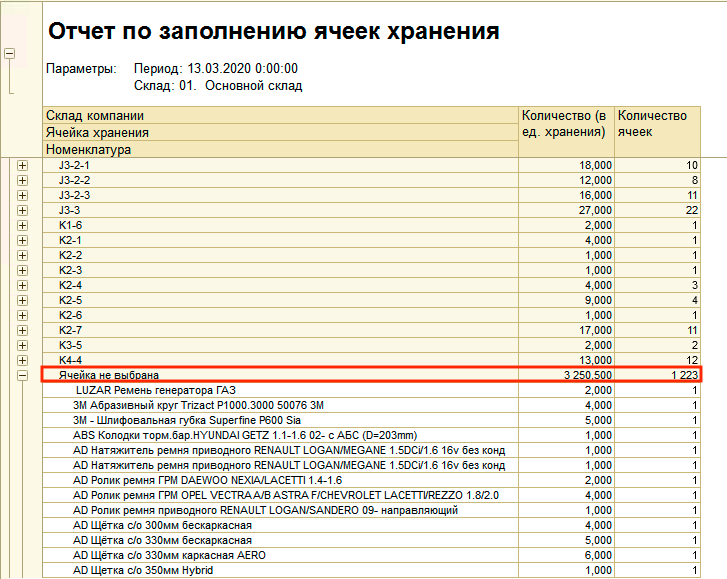
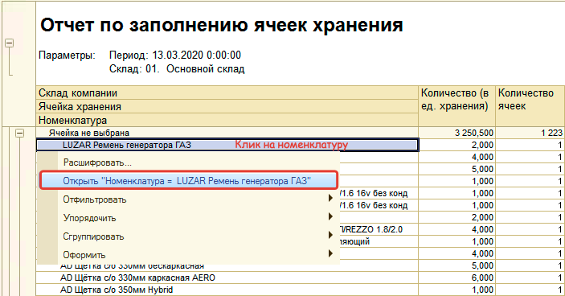
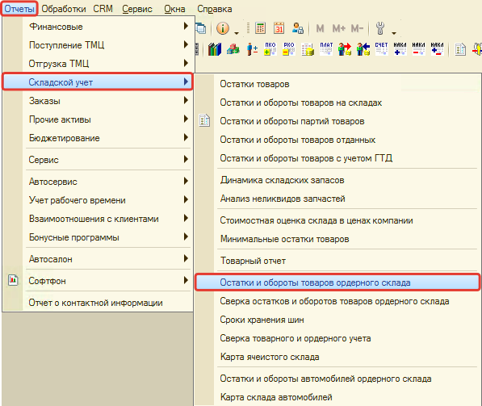
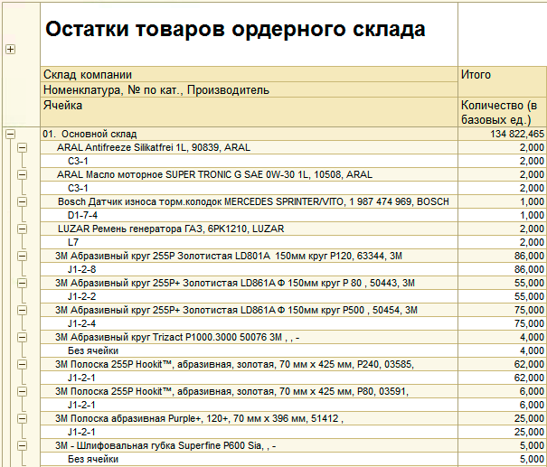
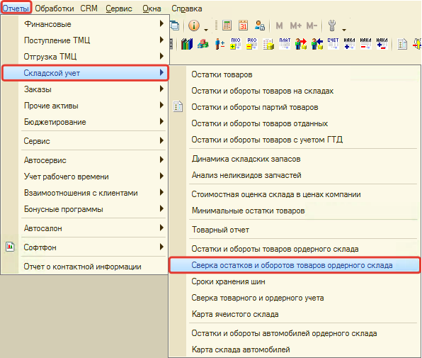
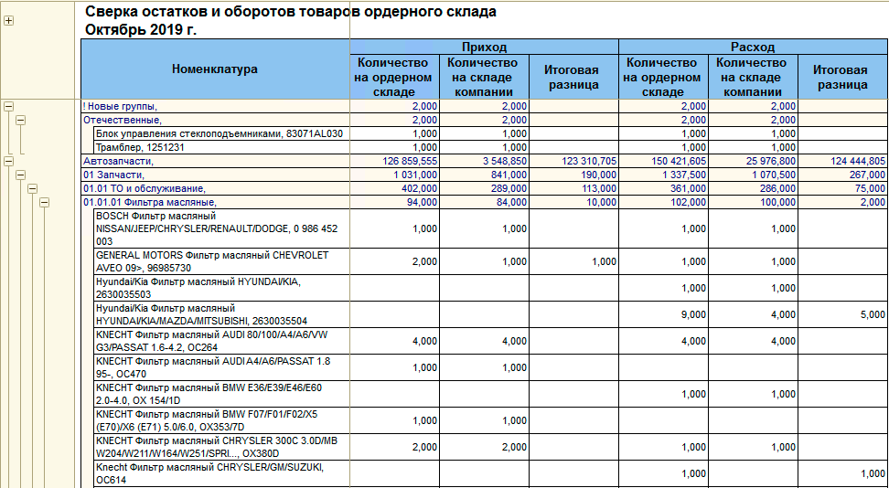
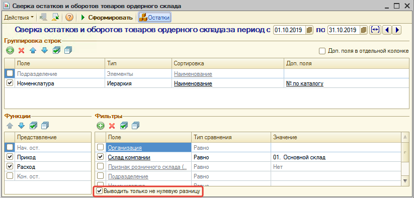

# Отчеты по складскому учету

<table><tr><td><b>Время чтения:</b> 7 мин.</td><td><b>Обновлено:</b> 28.06.2022</td></tr></table>

Источник: https://www.5systems.ru/help/otchety-po-skladskomu-uchetu

## Содержание

- [1. Отчет по заполнению ячеек хранения](#1-отчет-по-заполнению-ячеек-хранения)
  - [Как перейти к отчету](#как-перейти-к-отчету)
  - [Описание](#описание)
- [2. Остатки и обороты ордерного склада](#2-остатки-и-обороты-ордерного-склада)
  - [Как перейти к отчету](#как-перейти-к-отчету-1)
  - [Описание](#описание-1)
- [3. Сверка остатков и оборотов ордерного склада](#3-сверка-остатков-и-оборотов-ордерного-склада)
  - [Как перейти к отчету](#как-перейти-к-отчету-2)
  - [Описание](#описание-2)

## 1. Отчет по заполнению ячеек хранения

### Как перейти к отчету

### Описание

С помощью отчета по заполнению ячеек хранения можно отследить поступившие на [*обычный склад*](../../Склад%20и%20запчасти/Виды%20склада/vidy-sklada.md) товары, которым не присвоены ячейки хранения, и перейти к заполнению ячейки хранения товара на складе.

Все товары на складе без заданных ячеек хранения, сгруппированы в группе "Ячейка не выбрана":

Из отчета можно открыть карточку номенклатуры и присвоить ячейку хранения для склада:

## 2. Остатки и обороты ордерного склада

### Как перейти к отчету

### Описание

Отчет позволяет отследить остатки по ячейкам хранения на [*ордерно-ячеистом складе*](../../Склад%20и%20запчасти/Виды%20склада/vidy-sklada.md#ордерно-ячеистый-склад).

## 3. Сверка остатков и оборотов ордерного склада

### Как перейти к отчету

### Описание

Отчет используется для сверки расхождений в оборотах товаров по документам прихода и расхода (Поступление товаров, Реализация товаров и др.) и оборотах по ордерному учету (Приходный складской ордер, Расходный складской ордер).

В отчете имеется настройка, которая позволяет выводить только те документы, в которых есть расхождения:

---

**Теги:** отчеты, складской учет, ячейки хранения, ордерный склад, остатки и обороты

