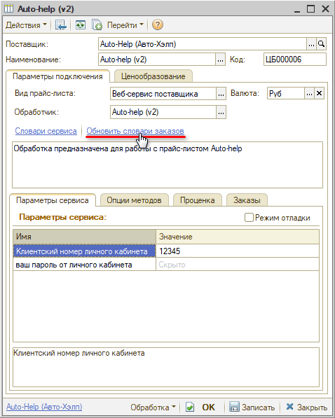
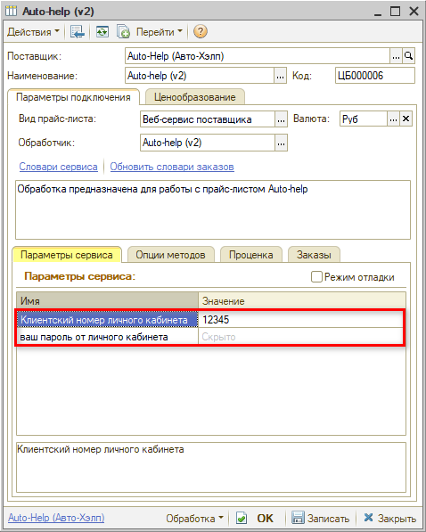
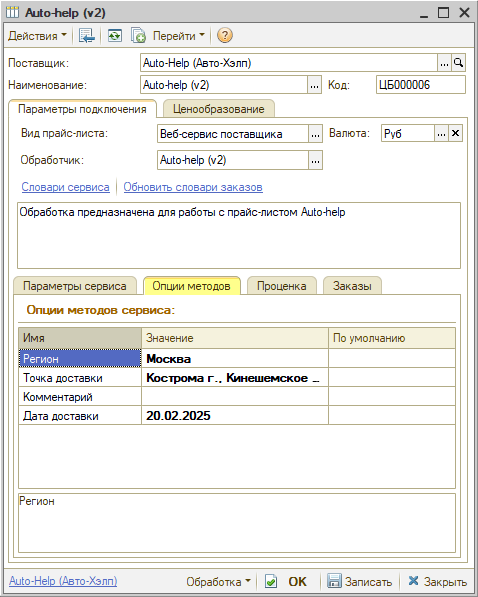

# Настройка Веб-сервиса Auto-help (Авто-Хэлп)

<table><tr><td><b>Время чтения:</b> 5 мин.</td><td><b>Обновлено:</b> 14.03.2025</td></tr></table>

Источник: https://www.5systems.ru/help/nastroyka-veb-servisa-auto-help-avto-khelp

## Содержание

1. [Описание](#описание)
2. [Параметры подключения](#параметры-подключения)
3. [Опции методов](#опции-методов)

*Доступно начиная с релиза 2.8.2.*

## Описание

Обработка предназначена для использования сервиса проценки компании **Auto-help (Авто-Хэлп)**, сайт: [https://opt.auto-help.ru](https://opt.auto-help.ru/).

Документация: [Описание API Авто-Хэлп Опт](https://docs.google.com/document/d/1BBUSE8Z_F4KeulMI-Ick5NvsrbwoJAmB/edit#heading=h.gjdgxs).

Для подключения требуются *клиентский номер личного кабинета* и *пароль* – необходимо запросить их у менеджера компании.

**Места использования Веб-сервисов:**

- Проценка;
- Отправка Веб-заказа поставщику.

После получения всех необходимых для подключения параметров выполняются следующие действия для Веб прайс-листа:

1. Заполнение параметров подключения (см. [Параметры подключения](#параметры-подключения)).
2. Сохранение параметров подключения.
3. Обновление словарей сервиса нажатием кнопки-ссылки “Обновить словари для заказов”:  
   
4. Настройка опций методов (см. [Опции методов](#опции-методов)).
5. Настройка параметров проценки (см. *[Создание и настройка Веб прайс-листа → Настройка параметров для проценки](../../Склад%20и%20запчасти/Создание%20и%20настройка%20Веб%20прайс-листа/sozdanie-i-nastroyka-veb-prays-lista.md#настройка-параметров-для-проценки)).*
6. Настройка параметров отправки заказа (см. *[Создание и настройка Веб прайс-листа → Настройка параметров для отправки заказа поставщику](../../Склад%20и%20запчасти/Создание%20и%20настройка%20Веб%20прайс-листа/sozdanie-i-nastroyka-veb-prays-lista.md#настройка-параметров-для-отправки-заказа-поставщику)).*
7. Сохранение всех изменений.

## Параметры подключения

Параметры подключения к Веб-сервису поставщика настраиваются на вкладке *“Параметры сервиса”:*

Для подключения Веб-сервисов *Auto-help (Авто-Хэлп)* необходимо указать следующие параметры:

- Клиентский номер личного кабинета;
- Пароль от личного кабинета.

## Опции методов

Опции методов используются как при поиске цен, так и при отправке заказа поставщику. По умолчанию используются опции, установленные в карточке прайс-листа. Если требуется, то при проценке или отправке заказа поставщику вручную, могут быть назначены собственные значения опций, необходимые в данный момент.

Опции методов настраиваются на вкладке *“Опции методов”:*

В Веб-сервисах Auto-help (Авто-Хэлп) предусмотрены следующие опции:

| **Опция** | **Значения** | **Описание** |
| --- | --- | --- |
| **Регион** | Из словаря сервиса “Регионы” | Идентификатор региона |
| **Точка доставки** | Из словаря сервиса “Точки доставки” | Идентификатор точки доставки |
| **Комментарий** | Строка | Комментарий к заказу |
| **Дата доставки** | Дата | Идентификатор даты доставки. При формировании заказа по умолчанию подставляется текущая дата, вечером завтрашняя |

---

**Теги:** Auto-help, Авто-Хэлп, веб-сервис, веб прайс-лист, настройка веб-сервиса, параметры подключения, проценка, веб-заказ поставщику, опции методов

