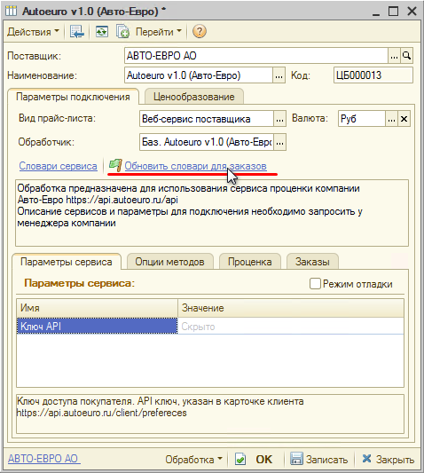
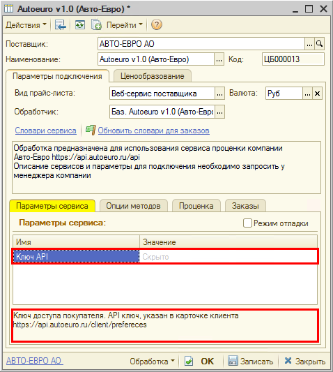
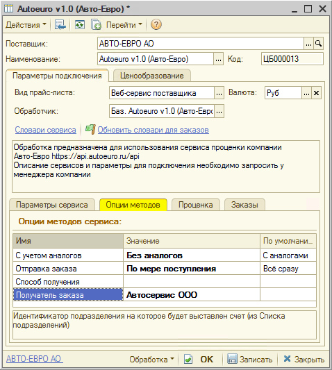

# Настройка Веб-сервиса Autoeuro v1.0 (Авто-Евро)

<table><tr><td><b>Время чтения:</b> 8 мин.</td><td><b>Обновлено:</b> 20.06.2022</td></tr></table>

Источник: https://www.5systems.ru/help/nastroyka-veb-servisa-autoeuro-v10-avto-evro

## Содержание

1. [Описание](#описание)
2. [Параметры подключения](#параметры-подключения)
3. [Опции методов](#опции-методов)

## Описание

Обработка предназначена для использования сервиса проценки компании **«Авто-Евро»** [https://api.autoeuro.ru](https://api.autoeuro.ru/)

Описание сервисов и параметры для подключения (Ключ API) необходимо запросить у менеджера компании.

**Места использования Веб-сервисов:**

- Проценка;
- Отправка Веб-заказа поставщику.

После получения всех необходимых для подключения параметров выполняются следующие действия для Веб прайс-листа:

1. Заполнение параметров подключения (см. [*Параметры подключения*](#параметры-подключения)*).*
2. Сохранение параметров подключения.
3. Обновление словарей сервиса нажатием кнопки-ссылки «Обновить словари для заказов»:

4. Настройка опций методов (см. [*Опции методов*](#опции-методов)*).*
5. Настройка параметров проценки (см. [*Создание и настройка Веб прайс-листа→Настройка параметров для проценки*](../../Склад%20и%20запчасти/Создание%20и%20настройка%20Веб%20прайс-листа/sozdanie-i-nastroyka-veb-prays-lista.md#настройка-параметров-для-проценки)).
6. Настройка параметров отправки заказа (см. [*Создание и настройка Веб прайс-листа→Настройка параметров для отправки заказа поставщику*](../../Склад%20и%20запчасти/Создание%20и%20настройка%20Веб%20прайс-листа/sozdanie-i-nastroyka-veb-prays-lista.md#настройка-параметров-для-отправки-заказа-поставщику)).
7. Сохранение всех изменений.

## Параметры подключения

Параметры подключения к Веб-сервису поставщика настраиваются на вкладке «Параметры сервиса».

Для подключения Веб-сервисов Autoeuro v1.0 (Авто-Евро) необходимо указать следующие параметры:

- *Ключ API* – Ключ доступа покупателя. API ключ, указан в карточке клиента [https://api.autoeuro.ru/client/prefereces](https://api.autoeuro.ru/client/prefereces)

## Опции методов

Опции методов используются как при поиске цен, так и при отправке заказа поставщику. По умолчанию используются опции, установленные в карточке прайс-листа. Если требуется, то при проценке или отправке заказа поставщику вручную, могут быть назначены собственные значения опций, необходимые в данный момент.

Опции методов настраиваются на вкладке «Опции методов».

В Веб-сервисах Autoeuro v1.0 (Авто-Евро) предусмотрены следующие опции:

| Опция | Значения | Описание |
| --- | --- | --- |
| **С учетом аналогов** | - С аналогами (по умолчанию) - Без аналогов | Получение предложений в проценке с аналогами или без |
| **Отправка заказа** | - По мере поступления (по умолчанию) - Все сразу | Доставка всего заказа сразу или по мере поступления на склад |
| **Способ доставки** | Из словаря сервиса «Варианты получения» | Идентификатор способа доставки |
| **Получатель заказа** | <наименование подразделения> из словаря сервиса «Список подразделений» | Идентификатор подразделения, на которое будет выставлен счет |

---

**Теги:** Autoeuro v1.0, Авто-Евро, веб-сервис, веб прайс-лист, настройка веб-сервиса, параметры подключения, проценка, веб-заказ поставщику, опции методов

