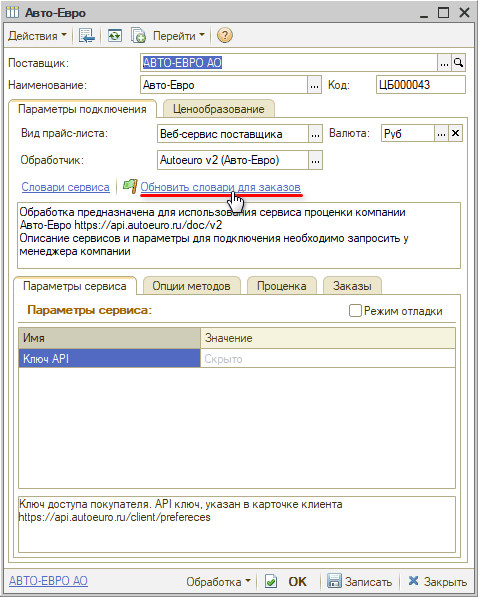
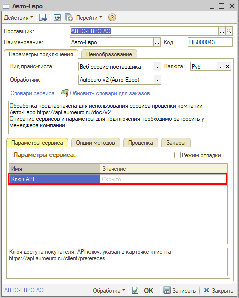
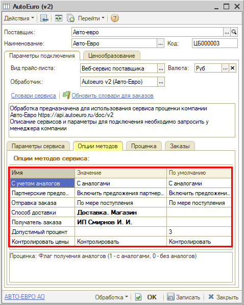

# Настройка Веб-сервиса Autoeuro v2.0 (Авто-Евро)

<table><tr><td><b>Время чтения:</b> 4 мин.</td><td><b>Обновлено:</b> 03.04.2026</td></tr></table>

Источник: https://www.5systems.ru/help/nastroyka-veb-servisa-autoeuro-v20-avto-evro

## Содержание

1. [Описание](#описание)
2. [Параметры подключения](#параметры-подключения)
3. [Опции методов](#опции-методов)

*Актуально начиная с версии релиза 2.8.2*

## Описание

Обработка предназначена для использования сервиса проценки компании **Autoeuro (Авто-Евро) v.2** [https://api.autoeuro.ru](https://api.autoeuro.ru).

Документация: [https://api.autoeuro.ru/doc/v2](https://api.autoeuro.ru/doc/v2).

Параметры для подключения (ключ API) необходимо скопировать в ЛК на сайте [shop.autoeuro.ru](https://shop.autoeuro.ru/main/api) активировать API и получить письмо с регистрационными данными.

**Места использования Веб-сервисов:**

- Проценка;
- Отправка Веб-заказа поставщику;
- Отслеживание статуса заказа.

После получения всех необходимых для подключения параметров выполняются следующие действия для Веб прайс-листа:

1. Заполнение параметров подключения (см. [Параметры подключения](#параметры-подключения)).
2. Сохранение параметров подключения.
3. Обновление словарей сервиса нажатием кнопки-ссылки *“Обновить словари заказов”:*

*\*Примечание:* У Auto-Euro долго загружается словарь производителей.

4. Настройка опций методов (см. [Опции методов](#опции-методов)).
5. Настройка параметров проценки (см. [Создание и настройка Веб прайс-листа → Настройка параметров для проценки](../../Склад%20и%20запчасти/Создание%20и%20настройка%20Веб%20прайс-листа/sozdanie-i-nastroyka-veb-prays-lista.md#настройка-параметров-для-проценки)).
6. Настройка параметров отправки заказа (см. [Создание и настройка Веб прайс-листа → Настройка параметров для отправки заказа поставщику](../../Склад%20и%20запчасти/Создание%20и%20настройка%20Веб%20прайс-листа/sozdanie-i-nastroyka-veb-prays-lista.md#настройка-параметров-для-отправки-заказа-поставщику)).
7. Сохранение всех изменений.

## Параметры подключения

Параметры подключения к Веб-сервису поставщика настраиваются на вкладке *“Параметры сервиса”:*

Для подключения Веб-сервисов Autoeuro (Авто-Евро) v.2 необходимо указать следующие параметры:

- ***Ключ API*** – ключ доступа покупателя. API ключ указан в карточке клиента в ЛК на сайте [shop.autoeuro.ru](https://shop.autoeuro.ru/main/api), требуется активировать API и получить письмо с регистрационными данными.

## Опции методов

Опции методов используются как при поиске цен, так и при отправке заказа поставщику. По умолчанию используются опции, установленные в карточке прайс-листа. Если требуется, то при проценке или отправке заказа поставщику вручную, могут быть назначены собственные значения опций, необходимые в данный момент.

Опции методов настраиваются на вкладке *“Опции методов”:*

В Веб-сервисах Autoeuro (Авто-Евро) v.2 предусмотрены следующие опции:

| Опция | Значения | Описание |
| --- | --- | --- |
| **С учетом аналогов** | ● С аналогами (по умолчанию);  ● Без аналогов | Получение предложений в проценке с аналогами или без |
| **Партнерские предложения** | ● Включить предложения партнеров (по умолчанию);  ● Только складское наличие | Включить в результаты партнерские предложения или отображать только складское наличие |
| **Отправка заказа** | ● Всё сразу;  ● По мере поступления (по умолчанию) | Доставить весь заказ сразу или по мере поступления на склад |
| **Способ доставки** | Выбор из словаря сервиса “Способы доставки” | Идентификатор способа доставки товара |
| **Получатель заказа** | <наименование подразделения> из словаря сервиса “Подразделения” | Идентификатор подразделения, на которое будет выставлен счет |
| **Допустимый процент** | Числовое значение (по умолчанию "3") | Допустимый процент повышения цены заказа. Если параметр указан, то делается сверка с актуальной ценой предложения, и в случае превышения последней заказ не будет оформлен. Цены будут контролироваться, если это указано в параметре "Контролировать цены" |
| **Контролировать цены** | ● Контролировать (по умолчанию);  ● Не ограничивать | Контролировать цены при заказе. Если да, тогда поставщику будет оправляться возможная максимальная цена, с учетом допустимого процента повышения цены |

---

**Теги:** Autoeuro v2.0, Авто-Евро, веб-сервис, веб прайс-лист, настройка веб-сервиса, параметры подключения, проценка, веб-заказ поставщику, опции методов

