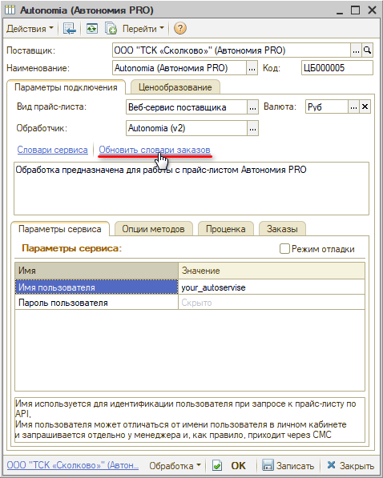
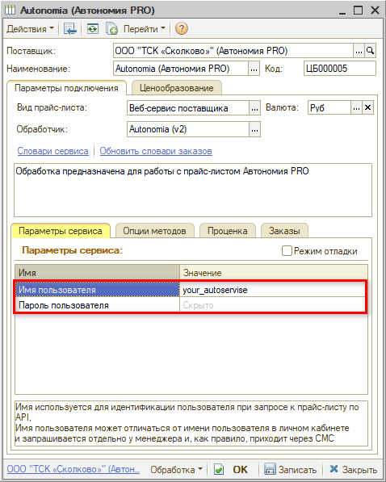
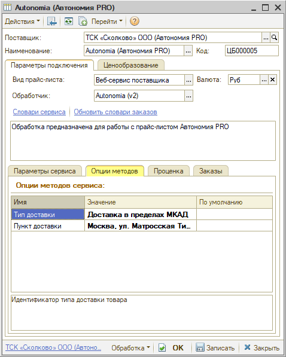

# Настройка Веб-сервиса Autonomia (Автономия PRO)

<table><tr><td><b>Время чтения:</b> 5 мин.</td><td><b>Обновлено:</b> 17.03.2025</td></tr></table>

Источник: https://www.5systems.ru/help/nastroyka-veb-servisa-autonomia-avtonomiya-pro

## Содержание

1. [Описание](#описание)
2. [Параметры подключения](#параметры-подключения)
3. [Опции методов](#опции-методов)

*Доступно начиная с релиза 2.8.2.*

## Описание

Обработка предназначена для использования сервиса интернет-магазина компании **Autonomia (Автономия PRO)**, сайт: [https://autonomia.pro](https://autonomia.pro/).

Документация: [https://api.autonomia.pro/swagger/index.html](https://api.autonomia.pro/swagger/index.html).

Параметры для подключения – *имя пользователя* и *пароль* – необходимо запросить у менеджера компании.

**Места использования Веб-сервисов:**

- Проценка;
- Отправка Веб-заказа поставщику;
- Отслеживание статуса заказа;
- Отмена заказа.

После получения всех необходимых для подключения параметров выполняются следующие действия для Веб прайс-листа:

1. Заполнение параметров подключения (см. [Параметры подключения](#параметры-подключения)). 
2. Сохранение параметров подключения. 
3. Обновление словарей сервиса нажатием кнопки-ссылки *“Обновить словари заказов”:*  
    
4. Настройка опций методов (см. [Опции методов](#опции-методов)). 
5. Настройка параметров проценки (см. *[Создание и настройка Веб прайс-листа → Настройка параметров для проценки](../../Склад%20и%20запчасти/Создание%20и%20настройка%20Веб%20прайс-листа/sozdanie-i-nastroyka-veb-prays-lista.md#настройка-параметров-для-проценки)).* 
6. Настройка параметров отправки заказа (см. *[Создание и настройка Веб прайс-листа → Настройка параметров для отправки заказа поставщику](../../Склад%20и%20запчасти/Создание%20и%20настройка%20Веб%20прайс-листа/sozdanie-i-nastroyka-veb-prays-lista.md#настройка-параметров-для-отправки-заказа-поставщику)).* 
7. Сохранение всех изменений.

## Параметры подключения

Параметры подключения к Веб-сервису поставщика настраиваются на вкладке *“Параметры сервиса”:*

**

Для подключения Веб-сервисов *Autonomia (Автономия PRO)* необходимо указать следующие параметры:

- *Имя пользователя* – имя используется для идентификации пользователя при запросе к прайс-листу по API. 
  Имя пользователя может отличаться от имени пользователя в личном кабинете и запрашивается отдельно у менеджера и, как правило, приходит через СМС; 
- *Пароль пользователя* – пароль используется для идентификации пользователя при запросе к прайс-листу по API. 
  Пароль пользователя может отличаться от пароля в личном кабинете и запрашивается отдельно у менеджера, и, как правило, приходит через СМС.

## Опции методов

Опции методов используются как при поиске цен, так и при отправке заказа поставщику. По умолчанию используются опции, установленные в карточке прайс-листа. Если требуется, то при проценке или отправке заказа поставщику вручную, могут быть назначены собственные значения опций, необходимые в данный момент.

Опции методов настраиваются на вкладке *“Опции методов”:*

В Веб-сервисах Autonomia (Автономия PRO) предусмотрены следующие опции:

| Опция | Значения | Описание |
| --- | --- | --- |
| **Тип доставки** | Выбор из словаря сервиса “Типы доставки” | Идентификатор типа доставки товара |
| **Пункт доставки** | *<наименование>* из словаря сервиса “Пункты доставки” | Идентификатор пункта доставки товара |

---

**Теги:** Autonomia, Автономия PRO, веб-сервис, веб прайс-лист, настройка веб-сервиса, параметры подключения, проценка, веб-заказ поставщику, опции методов

