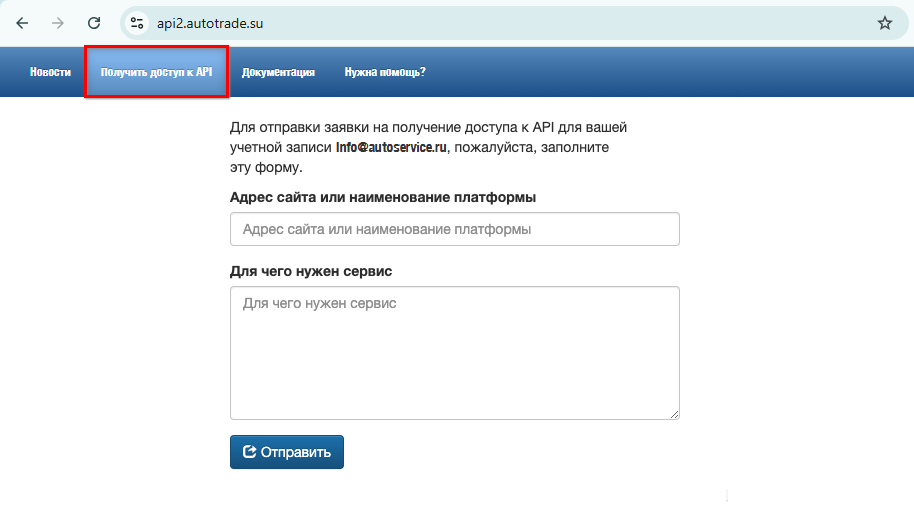
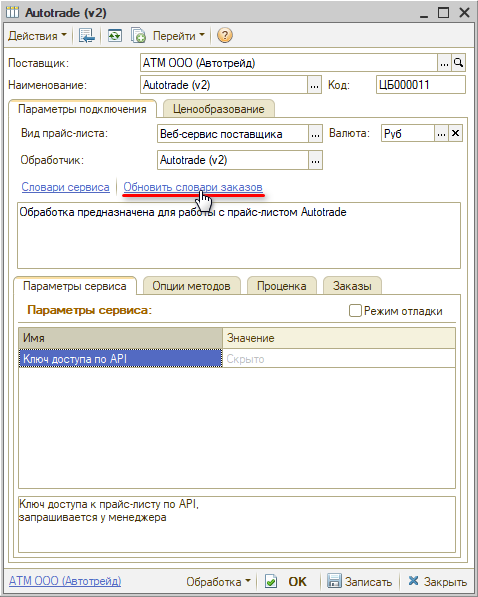
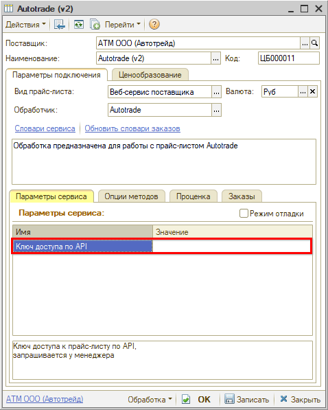
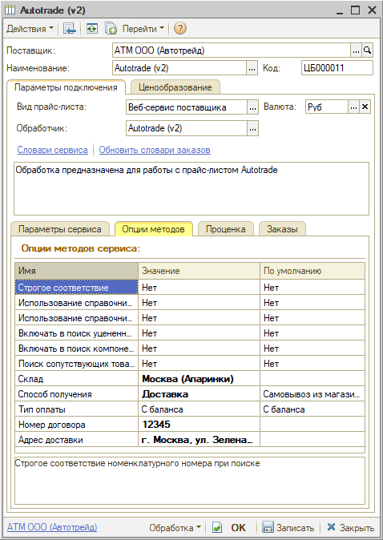

# Настройка Веб-сервиса Autotrade (Автотрейд) v.2

<table><tr><td><b>Время чтения:</b> 8 мин.</td><td><b>Обновлено:</b> 13.04.2026</td></tr></table>

Источник: https://www.5systems.ru/help/nastroyka-veb-servisa-autotrade-avtotreyd-v2

## Содержание

1. [Описание](#описание)
2. [Параметры подключения](#параметры-подключения)
3. [Опции методов](#опции-методов)

*Актуально начиная с версии релиза 2.8.2*

## Описание

Обработчик предназначен для работы с Веб-сервисами компании **Autotrade (Автотрейд) v.2**: [https://sklad.autotrade.su](https://sklad.autotrade.su).

Документация к веб-сервисам: [https://api2.autotrade.su/#doc](https://api2.autotrade.su/#doc).

**Места использования Веб-сервисов:**

- Проценка;
- Отправка Веб-заказа поставщику;
- Отслеживание статуса заказа.

Для подключения поставщика через обработку Autotrade (Автотрейд) v.2 необходимо иметь ***доступ к API**.*

Для этого:

1. Зарегистрируйтесь и активируйте учетную запись на [https://sklad.autotrade.su](https://sklad.autotrade.su).
2. Авторизуйтесь на [https://api2.autotrade.su/](https://api2.autotrade.su/) и перейдите в раздел *"Получить доступ к API":*

   

3. Заполните форму и отправьте запрос на получение доступа.
4. Дождитесь пока доступ к API разрешат.

*Внимание!* Веб-сервис имеет ограничения: на данный момент действует ограничение по числу запросов в секунду – не более одного запроса под одной учетной записью. Данное ограничение не распространяется на запросы с вызовами методов манипулирования корзиной, оформления заказов и получения информации по статусам заказов. Механизм интеграции с веб-сервисом необходимо реализовать так, чтобы исключить параллельные запросы.

После того, как доступ к API будет получен, в карточке прайс-листа:

1. Заполните параметры подключения (см. [Параметры подключения](#параметры-подключения)).
2. Сохраните изменения, нажав кнопку "Записать".
3. Обновите словари сервиса, нажав кнопку-ссылку *"Обновить словари заказов":*

   

4. Настройте опции методов (см. [Опции методов](#опции-методов)).
5. Настройте параметры проценки (см. [Создание и настройка Веб прайс-листа → Настройка параметров для проценки](../../Склад%20и%20запчасти/Создание%20и%20настройка%20Веб%20прайс-листа/sozdanie-i-nastroyka-veb-prays-lista.md#настройка-параметров-для-проценки)).
6. Настройте параметры отправки заказа (см. [Создание и настройка Веб прайс-листа → Настройка параметров для отправки заказа поставщику](../../Склад%20и%20запчасти/Создание%20и%20настройка%20Веб%20прайс-листа/sozdanie-i-nastroyka-veb-prays-lista.md#настройка-параметров-для-отправки-заказа-поставщику)).
7. Сохраните изменения.

## Параметры подключения

Параметры подключения к Веб-сервису поставщика настраиваются на вкладке *"Параметры сервиса":*

Для подключения Веб-сервисов Autotrade (Автотрейд) v.2 необходимо указать следующие параметры:

- *Ключ доступа по API* – ключ доступа к прайс-листу по API, запрашивается у менеджера. Также ключ отображается в ЛК на [сайте](http://sklad.autotrade.su) в блоке “Доступ к сервису API” на странице “Профиль” (предварительно должен быть получен доступ к API – см. [выше](#dostup_k_api)).

## Опции методов

Опции методов используются как при поиске цен, так и при отправке заказа поставщику. По умолчанию используются опции, установленные в карточке прайс-листа. Если требуется, то при проценке или отправке заказа поставщику вручную, могут быть назначены собственные значения опций, необходимые в данный момент.

Опции методов настраиваются на вкладке *"Опции методов":*

В Веб-сервисах Autotrade (Автотрейд) v.2 предусмотрены следующие опции:

| Опция | Значения | Описание |
| --- | --- | --- |
| **Строгое соответствие** | ● Да  ● Нет (по умолчанию) | Строгое соответствие номенклатурного номера при поиске |
| **Использование справочников кроссов** | ● Да  ● Нет (по умолчанию) | Получение предложений в проценке с использованием справочника кроссов или без |
| **Использование справочников замен** | ● Да  ● Нет (по умолчанию) | Получение предложений в проценке с использованием справочника замен или без |
| **Включать в поиск уцененные детали** | ● Да  ● Нет (по умолчанию) | Получение предложений вместе с уцененными товарами |
| **Включать в поиск компоненты детали** | ● Да  ● Нет (по умолчанию) | Поиск деталей, входящих в состав запрошенного товара, и деталей, содержащих запрошенный товар |
| **Поиск сопутствующих товаров** | ● Да  ● Нет (по умолчанию) | Получение предложений вместе с сопутствующими товарами |
| **Склад** | Выбор из словаря сервиса “Склады” | Склад для товаров под заказ |
| **Способ получения** | ● Самовывоз из магазина (по умолчанию)  ● Самовывоз со склада  ● Доставка  ● Под заказ | Способ получения товаров от поставщика |
| **Тип оплаты** | ● С баланса (по умолчанию)  ● При получении | Выбор типа оплаты заказа |
| **Номер договора** | Строка | Номер договора с поставщиком |
| **Адрес доставки** | Строка | Адрес доставки для способа получения "Доставка" |

---

**Теги:** Autotrade, Автотрейд, веб-сервис, веб прайс-лист, настройка веб-сервиса, параметры подключения, проценка, веб-заказ поставщику, опции методов

