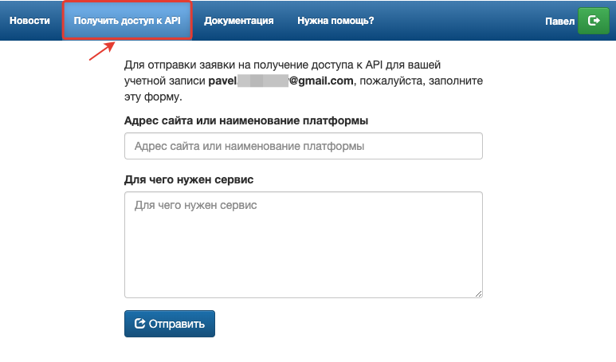
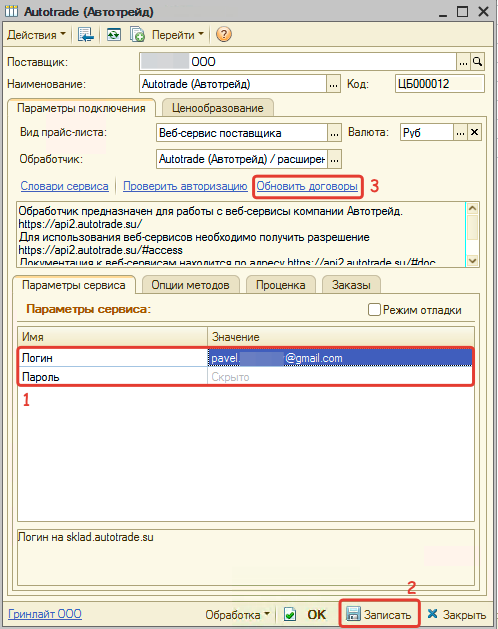

# Настройка Веб-сервиса Autotrade (Автотрейд)

<table><tr><td><b>Время чтения:</b> 8 мин.</td><td><b>Обновлено:</b> 20.06.2022</td></tr></table>

Источник: https://www.5systems.ru/help/nastroyka-veb-servisa-autotrade-avtotreyd

## Содержание

1. [Описание](#описание)
2. [Параметры подключения](#параметры-подключения)
3. [Опции методов](#опции-методов)

## Описание

Обработчик предназначен для работы с Веб-сервисами компании **Автотрейд**: [https://api2.autotrade.su/](https://api2.autotrade.su/).

Документация к веб-сервисам находится по адресу [https://api2.autotrade.su/#doc](https://api2.autotrade.su/#doc)

**Места использования Веб-сервисов:**

- Проценка;
- Отправка Веб-заказа поставщику.

Для подключения поставщика через обработку Autotrade (Автотрейд) иметь доступ к API.

Для этого:

1. Зарегистрируйтесь и активируйте учетную запись на [https://sklad.autotrade.su](https://sklad.autotrade.su/).
2. Авторизуйтесь на [https://api2.autotrade.su/](https://api2.autotrade.su/) и перейдите в раздел "Получить доступ к API":  
   
3. Заполните форму и отправьте запрос на получение доступа.
4. Дождитесь пока доступ к API разрешат.

*Внимание!* Веб сервис имеет ограничения по количеству запросов 1 в секунду.

После того, как доступ к API будет получен, в карточке прайс-листа:

1. Заполните параметры подключения (см. *Параметры подключения*).
2. Сохраните изменения, нажав кнопку "Записать".
3. Обновите словари сервиса, нажав кнопку-ссылку "Обновить договоры":  
   
4. Настройте опции методов (см. *Опции методов*).
5. Настройте параметры проценки (см. *[Создание и настройка Веб прайс-листа→Настройка параметров для проценки](../../Склад%20и%20запчасти/Создание%20и%20настройка%20Веб%20прайс-листа/sozdanie-i-nastroyka-veb-prays-lista.md#настройка-параметров-для-проценки)*).
6. Настройте параметры отправки заказа (см. *[Создание и настройка Веб прайс-листа→Настройка параметров для отправки заказа поставщику](../../Склад%20и%20запчасти/Создание%20и%20настройка%20Веб%20прайс-листа/sozdanie-i-nastroyka-veb-prays-lista.md#настройка-параметров-для-отправки-заказа-поставщику)*).
7. Сохраните изменения.

## Параметры подключения

Параметры подключения к Веб-сервису поставщика настраиваются на вкладке "Параметры сервиса".

Для подключения Веб-сервисов Autotrade (Автотрейд) необходимо указать следующие параметры:

- *Логин* - логин на сайте поставщика sklad.autotrade.su,
- *Пароль* - пароль на сайте поставщика sklad.autotrade.su.

## Опции методов

Опции методов используются как при поиске цен, так и при отправке заказа поставщику. По умолчанию используются опции, установленные в карточке прайс-листа. Если требуется, то при проценке или отправке заказа поставщику вручную, могут быть назначены собственные значения опций, необходимые в данный момент.

Опции методов настраиваются на вкладке "Опции методов".

В Веб-сервисах Autotrade (Автотрейд) предусмотрены следующие опции:

| Опция | Значения | Описание |
| --- | --- | --- |
| **Учитывать кроссы** | - Учитывать (по умолчанию) - Не учитывать | Получение предложений в проценке с кроссами или без |
| **Учитывать замены** | - Учитывать (по умолчанию) - Не учитывать | Получение предложений в проценке с заменами или без |
| **Другие склады** | - Получать - Не получать (по умолчанию) | Получение предложений с других складов или только с прикрепленного к аккаунту склада |
| **Сопутствующие товары** | - Искать - Не искать (по умолчанию) | Получение предложений вместе с сопутствующими товарами |
| **Уцененные товары** | - Искать - Не искать (по умолчанию) | Получение предложений вместе с уцененными товарами |
| **Договор с поставщиком** | Из словаря сервиса | Идентификатор договора с поставщиком |
| **Способ получения** | - Со склада - Доставка (по умолчанию) - Под заказ | Способ получения товаров от поставщика |
| **Адрес доставки** | Строка | Определяет адрес доставки для способа получения "Доставка" |

---

**Теги:** Autotrade, Автотрейд, веб-сервис, веб прайс-лист, настройка веб-сервиса, параметры подключения, проценка, веб-заказ поставщику, опции методов

