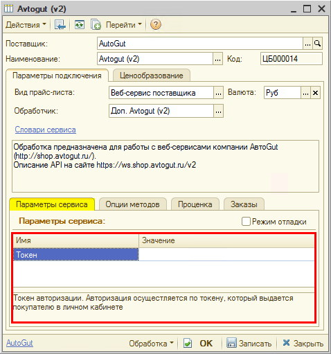
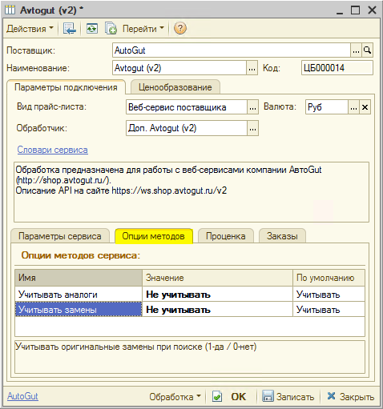

# Настройка Веб-сервиса Avtogut 2 (АвтоGüT 2)

<table><tr><td><b>Время чтения:</b> 5 мин.</td><td><b>Обновлено:</b> 20.06.2022</td></tr></table>

Источник: https://www.5systems.ru/help/nastroyka-veb-servisa-avtogut-2-avtogut-2

## Содержание

1. [Описание](#описание)
2. [Параметры подключения](#параметры-подключения)
3. [Опции методов](#опции-методов)

## Описание

Обработка предназначена для работы с веб-сервисами компании **АвтоGut** ([http://shop.avtogut.ru/](http://shop.avtogut.ru/)).

Описание API на сайте [https://ws.shop.avtogut.ru/v2](https://ws.shop.avtogut.ru/v2)

**Места использования Веб-сервисов:**

- Проценка;
- Отправка Веб-заказа поставщику.

После получения всех необходимых для подключения параметров выполняются следующие действия для Веб прайс-листа:

1. Заполнение параметров подключения (см. *Параметры подключения*).
2. Сохранение параметров подключения.
3. Настройка опций методов (см. *Опции методов*).
4. Настройка параметров проценки (см. [*Создание и настройка Веб прайс-листа→Настройка параметров для проценки*](../../Склад%20и%20запчасти/Создание%20и%20настройка%20Веб%20прайс-листа/sozdanie-i-nastroyka-veb-prays-lista.md#настройка-параметров-для-проценки)).
5. Настройка параметров отправки заказа (см. [*Создание и настройка Веб прайс-листа→Настройка параметров для отправки заказа поставщику*](../../Склад%20и%20запчасти/Создание%20и%20настройка%20Веб%20прайс-листа/sozdanie-i-nastroyka-veb-prays-lista.md#настройка-параметров-для-отправки-заказа-поставщику)).
6. Сохранение всех изменений.

## Параметры подключения

Параметры подключения к Веб-сервису поставщика настраиваются на вкладке «Параметры сервиса».

Для подключения Веб-сервисов АвтоGut 2 (АвтоGüT 2) необходимо указать следующие параметры:

- *Токен* – Токен авторизации. Авторизация осуществляется по токену, который выдается покупателю в личном кабинете.

## Опции методов

Опции методов используются как при поиске цен, так и при отправке заказа поставщику. По умолчанию используются опции, установленные в карточке прайс-листа. Если требуется, то при проценке или отправке заказа поставщику вручную, могут быть назначены собственные значения опций, необходимые в данный момент.

Опции методов настраиваются на вкладке «Опции методов».

В Веб-сервисах АвтоGut 2 (АвтоGüT 2) предусмотрены следующие опции:

| Опция | Значения | Описание |
| --- | --- | --- |
| **Учитывать аналоги** | - Учитывать (по умолчанию) - Не учитывать | Учитывать аналоги (неоригинальные замены) при поиске |
| **Учитывать замены** | - Учитывать (по умолчанию) - Не учитывать | Учитывать оригинальные замены при поиске |

---

**Теги:** Avtogut 2, АвтоGüT 2, веб-сервис, веб прайс-лист, настройка веб-сервиса, параметры подключения, проценка, веб-заказ поставщику, опции методов

