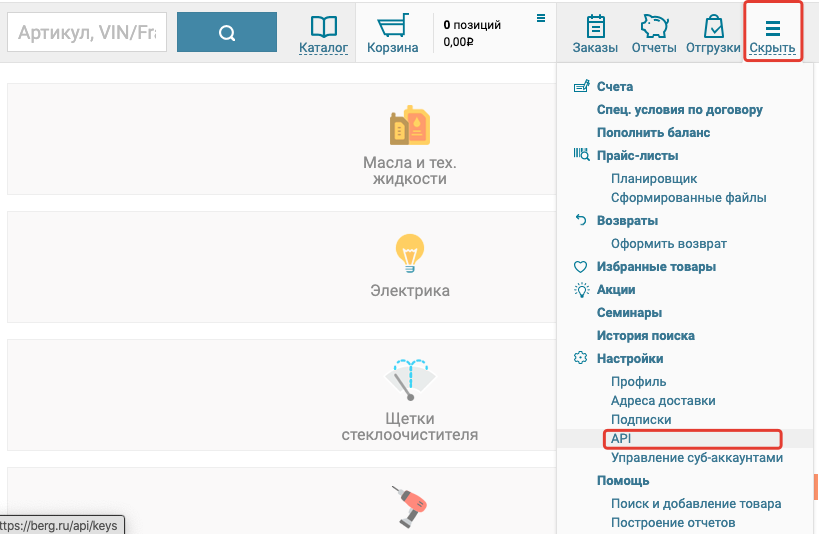
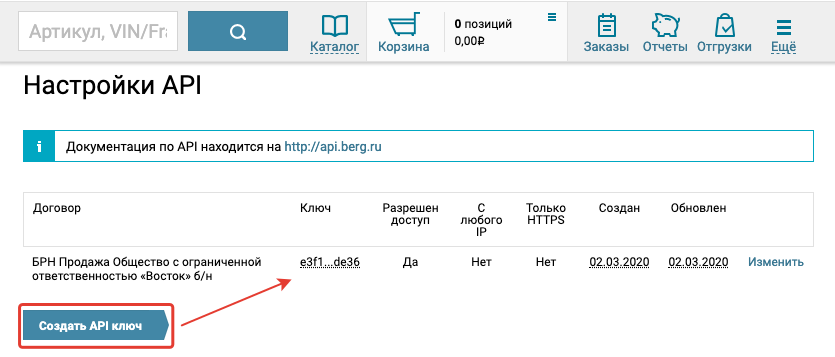
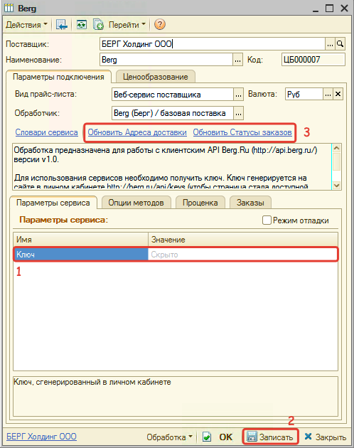

# Настройка Веб-сервиса Berg (Берг)

<table><tr><td><b>Время чтения:</b> 10 мин.</td><td><b>Обновлено:</b> 20.06.2022</td></tr></table>

Источник: https://www.5systems.ru/help/nastroyka-veb-servisa-berg-berg

## Содержание

1. [Описание](#описание)
2. [Параметры подключения](#параметры-подключения)
3. [Опции методов](#опции-методов)

## Описание

Обработчик предназначен для работы с Веб-сервисами компании **"Берг"**: [https://berg.ru](https://berg.ru/). Используется [API Berg.Ru версии v1.0.](http://api.berg.ru/)

**Места использования Веб-сервисов:**

- Проценка;
- Отправка Веб-заказа поставщику;
- Формирование заказа через Веб-сервис из локальных прайс-листов.

  Для использования Веб-сервисов Berg (Берг) необходимо получить ключ доступа. Для этого:

1. Зарегистрируйтесь и/или авторизуйтесь на сайте поставщика: [http://berg.ru](http://berg.ru/).
2. Перейдите на страницу [http://berg.ru/api/keys](http://berg.ru/api/keys) напрямую или через меню "Еще"→Настройки API:  
     
   *\*Если страница недоступна, то запросите у назначенного вам менеджера доступ к ней.*
3. Сгенерируйте ключ на данной странице:  
   

   При наличии ключа доступа в карточке прайс-листа:

1. Заполните параметры подключения (см. *Параметры подключения*).
2. Запишите изменения, нажав кнопку "Записать".
3. Обновите словари сервиса, нажав кнопки-ссылки "Обновить Адреса доставки" и "Обновить Статусы заказов":  
   
4. Настройте опции методов (см. *Опции методов*).
5. Настройте параметры проценки (см. *Настройка параметров для проценки*).
6. Настройте параметры отправки заказа (см. [*Создание и настройка Веб прайс-листа→Настройка параметров для отправки заказа поставщику*](../../Склад%20и%20запчасти/Создание%20и%20настройка%20Веб%20прайс-листа/sozdanie-i-nastroyka-veb-prays-lista.md#настройка-параметров-для-отправки-заказа-поставщику)).
7. Настройте локальные прайс-листы, доступные для Веб-заказа (см. [*Создание и настройка Веб прайс-листа→Настройка параметров для формирования заказа поставщику из локальных прайс-листов*](../../Склад%20и%20запчасти/Создание%20и%20настройка%20Веб%20прайс-листа/sozdanie-i-nastroyka-veb-prays-lista.md#настройка-параметров-для-формирования-заказа-поставщику-из-локальных-прайс-листов)).
8. Запишите изменения.

## Параметры подключения

Параметры подключения к Веб-сервису поставщика настраиваются на вкладке "Параметры сервиса".

Для подключения Веб-сервисов Berg (Берг) необходимо указать следующие параметры:

- *ключ* - ключ, сгенерированный в личном кабинете на сайте поставщика, на странице [http://berg.ru/api/keys](http://berg.ru/api/keys).

## Опции методов

Опции методов используются как при поиске цен, так и при отправке заказа поставщику. По умолчанию используются опции, установленные в карточке прайс-листа. Если требуется, то при проценке или отправке заказа поставщику вручную, могут быть назначены собственные значения опций, необходимые в данный момент.

Опции методов настраиваются на вкладке "Опции методов".

В Веб-сервисах Berg (Берг) предусмотрены следующие опции:

| Опция | Значения | Описание |
| --- | --- | --- |
| **С учетом аналогов** | - С аналогами - Без аналогов (по умолчанию) | Определяет показывать предложения в проценке с аналогами или без |
| **Тип склада** | - Любой склад (по умолчанию) - Склад текущего филиала - Центральный склад - Дополнительные склады | Определяет какие склады должны быть в результатах проценки |
| **Тестовый заказ** | - Да - Нет (по умолчанию) | Определяет реальный или тестовый заказ отправлять поставщику. Тестовый заказа будет сохранен и доступен в истории заказов, но не будет принят к дальнейшей обработке. |
| **Force** | - Да (по умолчанию) - Нет | Определяет осуществлять ли заказ даже если запрашиваемого количества нет на складе, с которого производится заказа, либо заказывается количество товара не кратное минимальной норме отгрузки, либо позиция дороже переданной клиентом максимальной цены. Если установить значение "Да", то позиция с неверным количеством или максимальной ценой будет пропущена, а информация о ней будет добавлена в массив warning. Все остальные позиции будут размещены в заказ. |
| **Тип оплаты** | - Безналичный расчет (по умолчанию) - Наличный расчет | Определяет тип оплаты заказа |
| **Тип отгрузки** | - Самовывоз - Доставка (по умолчанию) | Определяет тип отгрузки заказа |
| **Дата доставки** | Строка | Определяет дату доставки. По умолчанию устанавливается ближайшая дата доставки. |
| **Время доставки** | - До 15:00 - После 15:00 - ближайшее (по умолчанию) | Определяет время доставки |
| **Адрес доставки** | Из словаря сервиса | Определяет адрес доставки для типа отгрузки "Доставка" |
| **Контактное лицо** | Строка | Контактное лицо по заказу |
| **Телефон контактного лица** | Строка | Телефон для связи с контактным лицом |
| **Комментарий к заказу** | Строка | Произвольный комментарий к заказу |

---

**Теги:** Berg, Берг, веб-сервис, веб прайс-лист, настройка веб-сервиса, параметры подключения, проценка, веб-заказ поставщику, опции методов

