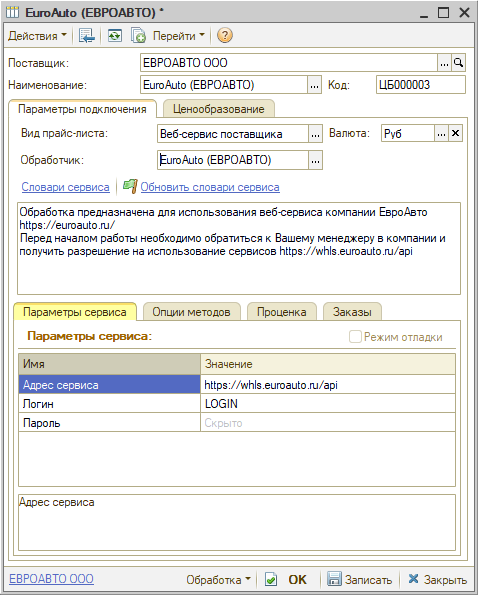
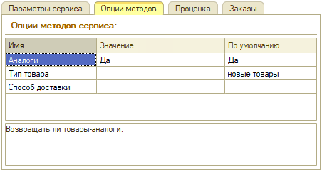

# Настройка Веб-сервиса EuroAuto (ЕвроАвто)

<table><tr><td><b>Время чтения:</b> 5 мин.</td><td><b>Обновлено:</b> 04.04.2023</td></tr></table>

Источник: https://www.5systems.ru/help/nastroyka-veb-servisa-euroauto-evroavto

## Содержание

1. [Описание](#описание)
2. [Параметры подключения](#параметры-подключения)
3. [Опции методов](#опции-методов)

## Описание

Обработчик предназначен для использования веб-сервиса компании ***EuroAuto (ЕвроАвто):*** [https://euroauto.ru/](https://euroauto.ru/).

**Для работы с Веб-сервисом EuroAuto необходимо:**

- обратиться к Вашему менеджеру в компании и получить разрешение на использование сервисов [https://whls.euroauto.ru/api](https://whls.euroauto.ru/api);
- зарегистрироваться на сайте поставщика, получить логин и пароль.

**Места использования Веб-сервисов:**

- Проценка;
- Оформление заказа.

После получения всех необходимых для подключения параметров выполняются следующие действия для Веб прайс-листа:

1. Заполнить параметры подключения (см. [*Параметры подключения*](#параметры-подключения)).
2. Сохранить параметры подключения.
3. Обновить словари сервиса нажатием на кнопку-ссылку *“Обновить словари сервиса”.*
4. Настроить опции методов (см. [*Опции методов*](#опции-методов)).
5. Настроить параметры проценки (см.[ *Создание и настройка Веб прайс-листа→Настройка параметров для проценки*](../../Склад%20и%20запчасти/Создание%20и%20настройка%20Веб%20прайс-листа/sozdanie-i-nastroyka-veb-prays-lista.md#настройка-параметров-для-проценки)).
6. Настроить параметры отправки заказа (см.[ *Создание и настройка Веб прайс-листа→Настройка параметров для отправки заказа поставщику*](../../Склад%20и%20запчасти/Создание%20и%20настройка%20Веб%20прайс-листа/sozdanie-i-nastroyka-veb-prays-lista.md#настройка-параметров-для-отправки-заказа-поставщику)).
7. Сохранить все изменения.

## Параметры подключения

Параметры подключения к Веб-сервису поставщика настраиваются на вкладке “Параметры сервиса”:

Для подключения Веб-сервиса EuroAuto (ЕвроАвто) необходимо указать следующие параметры:

- *Адрес сервиса* – адрес сервиса;
- *Логин* – логин для входа в API;
- *Пароль* – пароль для входа в API.

## Опции методов

Опции методов используются при поиске цен. По умолчанию используются опции, установленные в карточке прайс-листа. Если требуется, то при проценке могут быть назначены собственные значения опций, необходимые в данный момент.

Опции методов настраиваются на вкладке “Опции методов”:

На данный момент в Веб-сервисе EuroAuto (ЕвроАвто) предусмотрены следующие опции методов:

| Опция | Значения | Описание |
| --- | --- | --- |
| **Аналоги** | - Да (по умолчанию); - Нет. | Возвращать ли товары-аналоги |
| **Тип товара** | - Новые товары (по умолчанию); - Товары бывшие в употреблении. | Тип товара для поиска |
| **Способ доставки** |  | Способ доставки товара |

---

**Теги:** веб-сервисы, euroauto, евроавто, проценка, заказ поставщику

