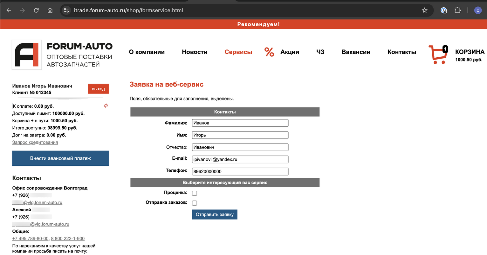

# Настройка Веб-сервиса Forum-auto (Форум-Авто)

<table><tr><td><b>Время чтения:</b> 6 мин.</td><td><b>Обновлено:</b> 28.08.2026</td></tr></table>

Источник: https://www.5systems.ru/help/nastroyka-veb-servisa-forum-auto-forum-avto

## Содержание

1. [Описание](#описание)
2. [Параметры подключения](#параметры-подключения)
3. [Опции методов](#опции-методов)

## Описание

Обработчик предназначен для работы с Веб-сервисами компании **"Форум-Авто"** [https://api.forum-auto.ru](https://api.forum-auto.ru/).

**Для использования Веб-сервисов Forum-auto (Форум-Авто) необходимо:**

1. Быть зарегистрированным на сайте поставщика (forum-auto.ru).
2. Отправить заявку на подключение в разделе "Веб-сервисы" личного кабинета.

*Внимание!* Веб-сервисы имеют минутные ограничения по количеству запросов.

**Места использования Веб-сервисов:**

- Проценка;
- Отправка Веб-заказа поставщику.

  После получения всех необходимых для подключения параметров выполняются следующие действия для Веб прайс-листа:

1. Заполнение параметров подключения (см. *Параметры подключения*).
2. Сохранение параметров подключения.
3. Настройка опций методов (см. *Опции методов*).
4. Настройка параметров проценки (см. [*Создание и настройка Веб прайс-листа→Настройка параметров для проценки*](../../Склад%20и%20запчасти/Создание%20и%20настройка%20Веб%20прайс-листа/sozdanie-i-nastroyka-veb-prays-lista.md#настройка-параметров-для-проценки)).
5. Настройка параметров отправки заказа (см. [*Создание и настройка Веб прайс-листа→Настройка параметров для отправки заказа поставщику*](../../Склад%20и%20запчасти/Создание%20и%20настройка%20Веб%20прайс-листа/sozdanie-i-nastroyka-veb-prays-lista.md#настройка-параметров-для-отправки-заказа-поставщику)).
6. Сохранение всех изменений.

## Параметры подключения

Параметры подключения к Веб-сервису поставщика настраиваются на вкладке "Параметры сервиса".

Для подключения Веб-сервисов Forum-auto (Форум-Авто) необходимо указать следующие параметры:

- логин,
- пароль.

## Опции методов

Опции методов используются как при поиске цен, так и при отправке заказа поставщику. По умолчанию используются опции, установленные в карточке прайс-листа. Если требуется, то при проценке или отправке заказа поставщику вручную, могут быть назначены собственные значения опций, необходимые в данный момент.

Опции методов настраиваются на вкладке "Опции методов".

В Веб-сервисах Forum-auto (Форум-Авто) предусмотрены следующие опции:

| Опция | Значения | Описание |
| --- | --- | --- |
| **Кроссы товара** | - Без учета кроссов - С учетом кроссов (по умолчанию) | Определяет выводить предложения в проценке с аналогами или без |
| **Тестовый режим** | - Тестовый режим - Рабочий режим (по умолчанию) | В тестовом режиме заказы после отправки аннулируются. В рабочем режиме заказы после отправки идут в работу. |

---

**Теги:** Forum-auto, Форум-Авто, веб-сервис, веб прайс-лист, настройка веб-сервиса, параметры подключения, проценка, веб-заказ поставщику, опции методов

