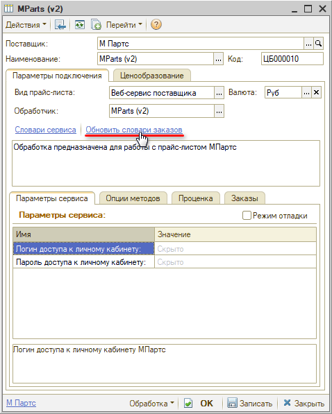
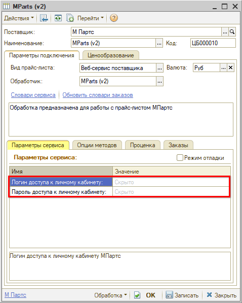
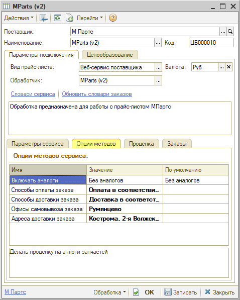

# Настройка Веб-сервиса MParts (МПартс) v.2

<table><tr><td><b>Время чтения:</b> 6 мин.</td><td><b>Обновлено:</b> 04.09.2026</td></tr></table>

Источник: https://www.5systems.ru/help/nastroyka-veb-servisa-mparts-mparts-v2

> *Актуально начиная с версии релиза 2.8.2*

## Содержание

1. [Описание](#описание)
2. [Параметры подключения](#параметры-подключения)
3. [Опции методов](#опции-методов)

## Описание

Обработчик предназначен для работы с Веб-сервисами компании **MParts (МПартс) v.2** [https://v01.ru/](https://v01.ru/).

Документация: [https://v01.ru/api/devinsight/documentation/](https://v01.ru/api/devinsight/documentation/).

Для использования Веб-сервисов MParts (МПартс) v.2 необходимо авторизоваться в личном кабинете на сайте и получить авторизационные данные – *логин и пароль.*

**Места использования Веб-сервисов:**

- Проценка;
- Отправка Веб-заказа поставщику;
- Отслеживание статуса заказа.

После получения всех необходимых для подключения параметров выполняются следующие действия для Веб прайс-листа:

1. Заполните параметры подключения (см. [Параметры подключения](#параметры-подключения)).
2. Сохраните изменения, нажав кнопку "Записать".
3. Обновите словари сервиса, нажав кнопку-ссылку "Обновить словари оформления заказов":  
   
4. Настройте опции методов (см. [Опции методов](#опции-методов)).
5. Настройте параметры проценки (см. [Создание и настройка Веб прайс-листа → Настройка параметров для проценки](../../Склад%20и%20запчасти/Создание%20и%20настройка%20Веб%20прайс-листа/sozdanie-i-nastroyka-veb-prays-lista.md#настройка-параметров-для-проценки)).
6. Настройте параметры отправки заказа (см. [Создание и настройка Веб прайс-листа → Настройка параметров для отправки заказа поставщику](../../Склад%20и%20запчасти/Создание%20и%20настройка%20Веб%20прайс-листа/sozdanie-i-nastroyka-veb-prays-lista.md#настройка-параметров-для-отправки-заказа-поставщику)).
7. Сохраните изменения.

## Параметры подключения

Параметры подключения к Веб-сервису поставщика настраиваются на вкладке *"Параметры сервиса":*

Для подключения Веб-сервисов MParts (МПартс) v.2 необходимо указать следующие параметры:

- *логин доступа к личному кабинету* – логин для доступа к ЛК на сайте МПартс;
- *пароль доступа к личному кабинету* – пароль для доступа к ЛК на сайте.

## Опции методов

Опции методов используются как при поиске цен, так и при отправке заказа поставщику. По умолчанию используются опции, установленные в карточке прайс-листа. Если требуется, то при проценке или отправке заказа поставщику вручную, могут быть назначены собственные значения опций, необходимые в данный момент.

Опции методов настраиваются на вкладке *"Опции методов":*

В Веб-сервисах MParts (МПартс) v.2 предусмотрены следующие опции:

| Опция | Значения | Описание |
| --- | --- | --- |
| **Включать аналоги** | ● Без аналогов (по умолчанию)  ● С аналогами | Включать в проценку аналоги запчастей |
| **Способ оплаты заказа** | Выбор из словаря сервиса “Способы оплаты” | Выбор способа оплаты заказа |
| **Способ доставки** | Выбор из словаря сервиса “Способы доставки” | Выбор способа доставки заказа |
| **Офисы самовывоза заказа** | Выбор из словаря сервиса “Офисы самовывоза” | Выбор офиса самовывоза заказа |
| **Адреса доставки заказа** | Выбор из словаря сервиса “Адреса доставки” | Выбор адреса доставки заказа |

---

**Теги:** MParts, МПартс, веб-сервис, веб прайс-лист, настройка веб-сервиса, параметры подключения, проценка, веб-заказ поставщику, опции методов

