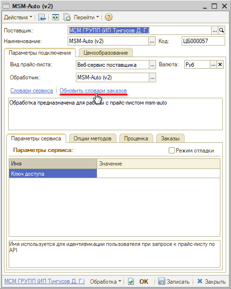
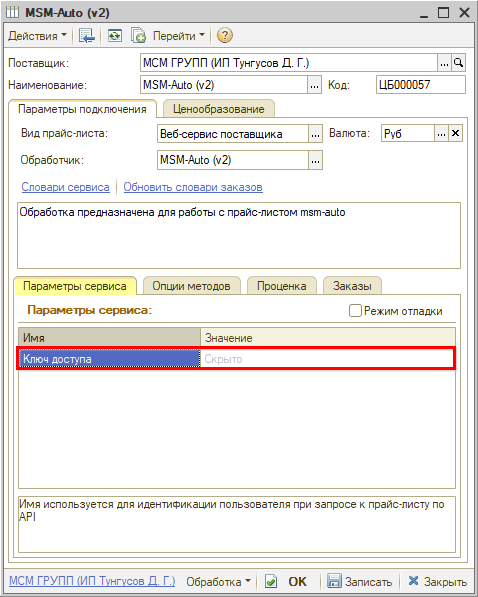

# Настройка Веб-сервиса MSMAuto (МСМ ГРУПП)

<table><tr><td><b>Время чтения:</b> 4 мин.</td><td><b>Обновлено:</b> 23.06.2026</td></tr></table>

Источник: https://www.5systems.ru/help/nastroyka-veb-servisa-msmauto-msm-grupp

## Содержание

1. [Описание](#описание)
2. [Параметры подключения](#параметры-подключения)
3. [Опции методов](#опции-методов)

*Актуально начиная с версии релиза 2.8.4*

## Описание

Обработка предназначена для работы с Веб-сервисами компании **MSMAuto (МСМ ГРУПП)** [https://mcmauto.ru/](https://mcmauto.ru/).

Документация: [https://mcmauto.ru/info/api](https://mcmauto.ru/info/api).

Параметры для подключения (**key** **–** ключ авторизации) необходимо узнать у вашего менеджера МСМ ГРУПП.

**Места использования Веб-сервисов:**

- Проценка;
- Отправка Веб-заказа поставщику;
- Отслеживание статуса заказа.

После получения всех необходимых для подключения параметров выполняются следующие действия для Веб прайс-листа:

1. Заполнение параметров подключения (см. [Параметры подключения](#параметры-подключения)).
2. Сохранение параметров подключения.
3. Обновление словарей сервиса нажатием кнопки-ссылки *“Обновить словари заказов”:*

4. Настройка опций методов (см. [Опции методов](#опции-методов)).
5. Настройка параметров проценки (см. [Создание и настройка Веб прайс-листа → Настройка параметров для проценки](../../Склад%20и%20запчасти/Создание%20и%20настройка%20Веб%20прайс-листа/sozdanie-i-nastroyka-veb-prays-lista.md#настройка-параметров-для-проценки)).
6. Настройка параметров отправки заказа (см. [Создание и настройка Веб прайс-листа → Настройка параметров для отправки заказа поставщику](../../Склад%20и%20запчасти/Создание%20и%20настройка%20Веб%20прайс-листа/sozdanie-i-nastroyka-veb-prays-lista.md#настройка-параметров-для-отправки-заказа-поставщику)).
7. Сохранение всех изменений.

## Параметры подключения

Параметры подключения к Веб-сервису поставщика настраиваются на вкладке *“Параметры сервиса”:*

Для подключения Веб-сервисов MSMAuto (МСМ ГРУПП) необходимо указать следующие параметры:

- ***Ключ доступа*** – API ключ авторизации, необходим для осуществления запросов к API сервисам МСМ ГРУПП. Дает доступ к товарам, ценам и остаткам на складе, к которому привязан контрагент. Узнать ключ следует у вашего менеджера MCM ГРУПП.

## Опции методов

Опции методов используются как при поиске цен, так и при отправке заказа поставщику. По умолчанию используются опции, установленные в карточке прайс-листа. Если требуется, то при проценке или отправке заказа поставщику вручную, могут быть назначены собственные значения опций, необходимые в данный момент.

Опции методов настраиваются на вкладке *“Опции методов”.*

В Веб-сервисах MSMAuto (МСМ ГРУПП) предусмотрены следующие опции:

| Опция | Значения | Описание |
| --- | --- | --- |
| **Показывать товары, которых нет в наличии** | ● Показывать;  ● Не показывать (по умолчанию) | Включать в предложения в проценке товары, которых на данный момент нет в наличии, либо отображать только предложения в наличии |
| **Идентификатор точки доставки** | Значение идентификатора из раздела ЛК "Мои точки доставки" | Идентификатор точки доставки товара, который можно найти в личном кабинете в разделе "Мои точки доставки". Можно не указывать в случае самовывоза |

---

**Теги:** MSMAuto, МСМ ГРУПП, веб-сервис, веб прайс-лист, настройка веб-сервиса, параметры подключения, проценка, веб-заказ поставщику, опции методов

