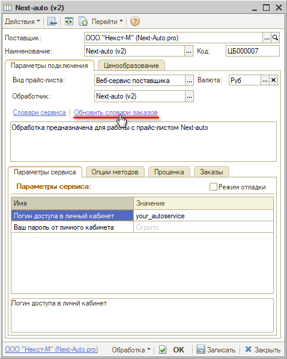
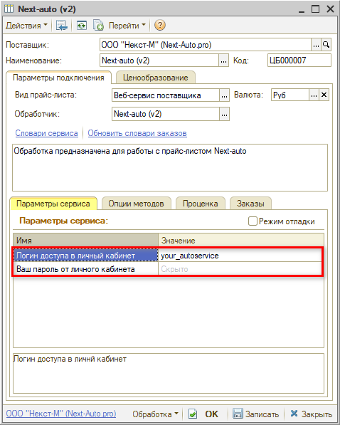
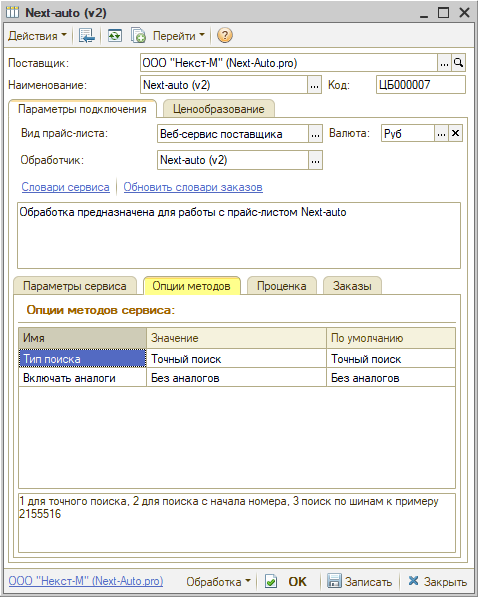

# Настройка Веб-сервиса Next-Auto.pro

<table><tr><td><b>Время чтения:</b> 5 мин.</td><td><b>Обновлено:</b> 17.03.2025</td></tr></table>

Источник: https://www.5systems.ru/help/nastroyka-veb-servisa-next-autopro

## Содержание

1. [Описание](#описание)
2. [Параметры подключения](#параметры-подключения)
3. [Опции методов](#опции-методов)

*Доступно начиная с релиза 2.8.2.*

## Описание

Обработка предназначена для использования сервиса интернет-магазина компании **Next-Auto.pro**, сайт: [http://next-auto.pro/](http://next-auto.pro/).

Документация:

- [http://next-auto.pro/xmlprice.php?help](http://next-auto.pro/xmlprice.php?help) – проценка;
- [http://next-auto.pro/xmlcart.php?help](http://next-auto.pro/xmlcart.php?help) – заказы/корзина;
- [http://next-auto.pro/xmlorders.php?help](http://next-auto.pro/xmlorders.php?help) – статусы заказов.

Параметры для подключения – *логин* и *пароль* – необходимо запросить у менеджера компании (писать на почту [info@next-auto.pro](mailto:info@next-auto.pro)).

**Места использования Веб-сервисов:**

- Проценка;
- Отправка Веб-заказа поставщику;
- Отслеживание статуса заказа.

После получения всех необходимых для подключения параметров выполняются следующие действия для Веб прайс-листа:

1. Заполнение параметров подключения (см. [Параметры подключения](#параметры-подключения)).
2. Сохранение параметров подключения.
3. Обновление словарей сервиса нажатием кнопки-ссылки *“Обновить словари заказов”:*

   

4. Настройка опций методов (см. [Опции методов](#опции-методов)).
5. Настройка параметров проценки (см. [Создание и настройка Веб прайс-листа → Настройка параметров для проценки](../../Склад%20и%20запчасти/Создание%20и%20настройка%20Веб%20прайс-листа/sozdanie-i-nastroyka-veb-prays-lista.md#настройка-параметров-для-проценки)).
6. Настройка параметров отправки заказа (см. [Создание и настройка Веб прайс-листа → Настройка параметров для отправки заказа поставщику](../../Склад%20и%20запчасти/Создание%20и%20настройка%20Веб%20прайс-листа/sozdanie-i-nastroyka-veb-prays-lista.md#настройка-параметров-для-отправки-заказа-поставщику)).
7. Сохранение всех изменений.

## Параметры подключения

Параметры подключения к Веб-сервису поставщика настраиваются на вкладке *“Параметры сервиса”:*

Для подключения Веб-сервисов *Next-Auto.pro* необходимо указать следующие параметры:

- Логин доступа в личный кабинет;
- Пароль от личного кабинета.

## Опции методов

Опции методов используются как при поиске цен, так и при отправке заказа поставщику. По умолчанию используются опции, установленные в карточке прайс-листа. Если требуется, то при проценке или отправке заказа поставщику вручную, могут быть назначены собственные значения опций, необходимые в данный момент.

Опции методов настраиваются на вкладке *“Опции методов”:*

В Веб-сервисах *Next-Auto.pro* предусмотрены следующие опции:

| Опция | Значения | Описание |
| --- | --- | --- |
| **Тип поиска** | - Точный поиск (по умолчанию); - Поиск с начала номера; - Поиск по шинам | 1 – для точного поиска  2 – для поиска с начала номера  3 – поиск по шинам, например 2155516 |
| **Включать аналоги** | - С аналогами; - Без аналогов (по умолчанию) | Получение предложений в проценке с аналогами или без |

---

**Теги:** Next-Auto.pro, веб-сервис, веб прайс-лист, настройка веб-сервиса, параметры подключения, проценка, веб-заказ поставщику, опции методов

