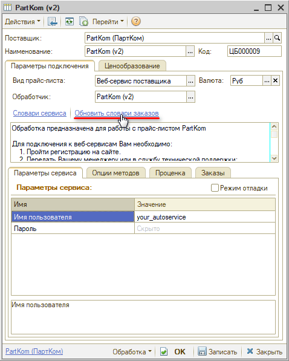
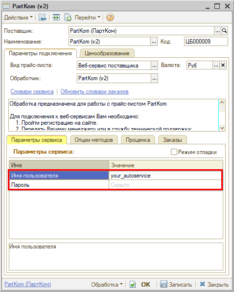
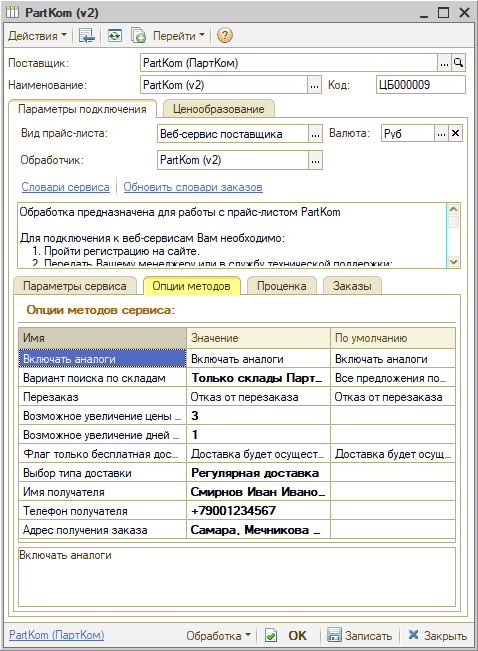

# Настройка Веб-сервиса PartKom (ПартКом) v.2

<table><tr><td><b>Время чтения:</b> 7 мин.</td><td><b>Обновлено:</b> 13.04.2026</td></tr></table>

Источник: https://www.5systems.ru/help/nastroyka-veb-servisa-partkom-partkom-v2

> *Актуально начиная с версии релиза 2.8.2*

## Содержание

1. [Описание](#описание)
2. [Параметры подключения](#параметры-подключения)
3. [Опции методов](#опции-методов)

## Описание

Обработчик предназначен для работы с Веб-сервисами компании **PartKom (ПартКом) v.2** [www.part-kom.ru](http://www.part-kom.ru).

Описание на сайте [http://www.part-kom.ru/webservices/](http://www.part-kom.ru/webservices/).

Поддерживается работа с api/v4. Документация на сайте: [https://www.part-kom.ru/webservices/](https://www.part-kom.ru/webservices/).

Для использования Веб-сервисов *PartKom (ПартКом) v.2* необходимо:

1. Пройти [регистрацию](https://www.part-kom.ru/registration/) на сайте [part-kom.ru](https://www.part-kom.ru/registration/).
2. Запросить подключение к Веб-сервисам у менеджера компании, передав ему: 
   **1)** Статический IP-адрес (один или несколько), с которого будет производиться обращение к веб-сервисам (это необходимо для вашей безопасности). 
   **2)** Если в рамках одной регистрации Вы работаете по нескольким договорам, то указать, какой из них должен использоваться для размещения заказов через веб-сервис.
3. Получить авторизационные данные – *логин (имя пользователя) и пароль.*

**Места использования Веб-сервисов:**

- Проценка;
- Отправка Веб-заказа поставщику;
- Отслеживание статуса заказа.

После получения всех необходимых для подключения параметров выполняются следующие действия для Веб прайс-листа:

1. Заполните параметры подключения (см. [Параметры подключения](#параметры-подключения)).
2. Сохраните изменения, нажав кнопку "Записать".
3. Обновите словари сервиса, нажав кнопку-ссылку *"Обновить словари оформления заказов":*  
   
4. Настройте опции методов (см. [Опции методов](#опции-методов)).
5. Настройте параметры проценки (см. [Создание и настройка Веб прайс-листа → Настройка параметров для проценки](../../Склад%20и%20запчасти/Создание%20и%20настройка%20Веб%20прайс-листа/sozdanie-i-nastroyka-veb-prays-lista.md#настройка-параметров-для-проценки)).
6. Настройте параметры отправки заказа (см. [Создание и настройка Веб прайс-листа → Настройка параметров для отправки заказа поставщику](../../Склад%20и%20запчасти/Создание%20и%20настройка%20Веб%20прайс-листа/sozdanie-i-nastroyka-veb-prays-lista.md#настройка-параметров-для-отправки-заказа-поставщику)).
7. Сохраните изменения.

## Параметры подключения

Параметры подключения к Веб-сервису поставщика настраиваются на вкладке "Параметры сервиса":

Для подключения Веб-сервисов *PartKom (ПартКом) v.2* необходимо указать следующие параметры:

- *Имя пользователя* – логин на сайте;
- *Пароль* – пароль на сайте.

## Опции методов

Опции методов используются как при поиске цен, так и при отправке заказа поставщику. По умолчанию используются опции, установленные в карточке прайс-листа. Если требуется, то при проценке или отправке заказа поставщику вручную, могут быть назначены собственные значения опций, необходимые в данный момент.

Опции методов настраиваются на вкладке *"Опции методов":*

В Веб-сервисах *PartKom (ПартКом) v.2* предусмотрены следующие опции:

| Опция | Значения | Описание |
| --- | --- | --- |
| **Включать аналоги** | ● Включать аналоги (по умолчанию)  ● Не включать аналоги | Определяет выводить предложения в проценке с заменами и аналогами или без |
| **Вариант поиска по складам** | ● Только склады ПартКом  ● Все предложения поставщиков (по умолчанию) | Позволяет отображать в проценке только те предложения, которые есть в наличии на складе "ПартКом", либо все предложения, включая под заказ от других поставщиков |
| **Перезаказ** | ● Отказ от перезаказа (по умолчанию)  ● Есть возможность перезаказа | Флаг, есть ли возможность перезаказа (для товаров под заказ) |
| **Возможное увеличение цены при автоматическом перезаказе** | Строка | Определяет процент возможного увеличения цены при перезаказе |
| **Возможное увеличение дней при перезаказе** | Строка | Количество дней |
| **Флаг только бесплатная доставка** | ● Доставка будет осуществляться в ближайшую волну (по умолчанию)  ● Доставка будет осуществляться только в бесплатные волны | Определяет, будет ли осуществляться доставка в ближайшую волну или только в бесплатные волны |
| **Выбор типа доставки** | ● Регулярная доставка  ● Экспресс доставка (не поддерживается)  ● Доставка самовывозом | Определяет тип доставки |
| **Имя получателя** | Строка | Имя получателя |
| **Телефон получателя** | Строка | Телефон получателя |
| **Адрес получения заказа** | Выбор из словаря сервиса “Пункты самовывоза” | Выбор склада для получения заказа |

---

**Теги:** PartKom, ПартКом, веб-сервис, веб прайс-лист, настройка веб-сервиса, параметры подключения, проценка, веб-заказ поставщику, опции методов

