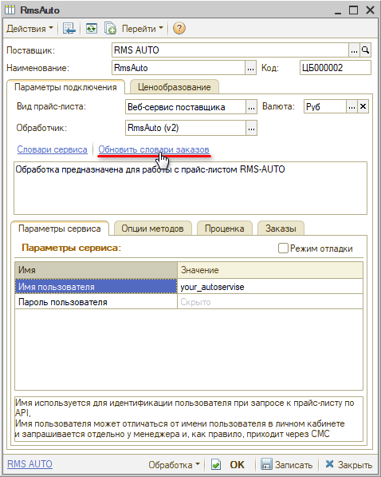
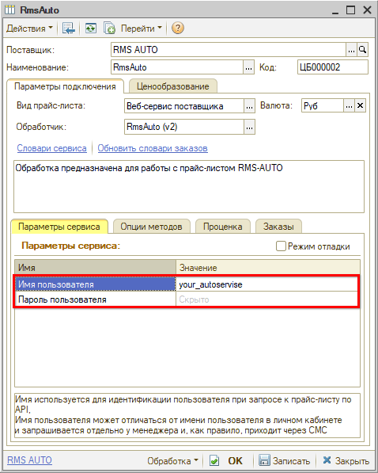
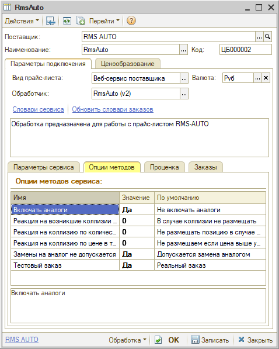

# Настройка Веб-сервиса RmsAuto

<table><tr><td><b>Время чтения:</b> 6 мин.</td><td><b>Обновлено:</b> 17.03.2025</td></tr></table>

Источник: https://www.5systems.ru/help/nastroyka-veb-servisa-rmsauto

## Содержание

1. [Описание](#описание)
2. [Параметры подключения](#параметры-подключения)
3. [Опции методов](#опции-методов)

*Доступно начиная с релиза 2.8.2.*

## Описание

Обработка предназначена для использования сервиса интернет-магазина компании **RmsAuto**, сайт: [https://rmsauto.ru](https://rmsauto.ru/).

Документация: [https://api.rmsauto.ru](https://api.rmsauto.ru).

Параметры для подключения – *логин* и *пароль* – необходимо запросить у менеджера компании.

**Места использования Веб-сервисов:**

- Проценка;
- Отправка Веб-заказа поставщику;
- Отслеживание статуса заказа.

После получения всех необходимых для подключения параметров выполняются следующие действия для Веб прайс-листа:

1. Заполнение параметров подключения (см. [Параметры подключения](#параметры-подключения)).
2. Сохранение параметров подключения.
3. Обновление словарей сервиса нажатием кнопки-ссылки *“Обновить словари заказов”:*  
   
4. Настройка опций методов (см. [Опции методов](#опции-методов)).
5. Настройка параметров проценки (см. [Создание и настройка Веб прайс-листа → Настройка параметров для проценки](../../Склад%20и%20запчасти/Создание%20и%20настройка%20Веб%20прайс-листа/sozdanie-i-nastroyka-veb-prays-lista.md#настройка-параметров-для-проценки)).
6. Настройка параметров отправки заказа (см. [Создание и настройка Веб прайс-листа → Настройка параметров для отправки заказа поставщику](../../Склад%20и%20запчасти/Создание%20и%20настройка%20Веб%20прайс-листа/sozdanie-i-nastroyka-veb-prays-lista.md#настройка-параметров-для-отправки-заказа-поставщику)).
7. Сохранение всех изменений.

## Параметры подключения

Параметры подключения к Веб-сервису поставщика настраиваются на вкладке *“Параметры сервиса”:*

Для подключения Веб-сервисов *RmsAuto* необходимо указать следующие параметры:

- *Логин* – имя используется для идентификации пользователя при запросе к прайс-листу по API. 
  Имя пользователя может отличаться от имени пользователя в личном кабинете и запрашивается отдельно у менеджера и, как правило, приходит через СМС;
- *Пароль* – пароль пользователя используется для идентификации пользователя при запросе к прайс-листу по API. 
  Пароль пользователя может отличаться от пароля в личном кабинете и запрашивается отдельно у менеджера и, как правило, приходит через СМС.

## Опции методов

Опции методов используются как при поиске цен, так и при отправке заказа поставщику. По умолчанию используются опции, установленные в карточке прайс-листа. Если требуется, то при проценке или отправке заказа поставщику вручную, могут быть назначены собственные значения опций, необходимые в данный момент.

Опции методов настраиваются на вкладке **“Опции методов”:**

В Веб-сервисах RmsAuto предусмотрены следующие опции:

| Опция | Значения | Описание |
| --- | --- | --- |
| **Включать аналоги** | - Да - Нет (по умолчанию) | Получение предложений в проценке с аналогами или без |
| **Реакция на возникшие коллизии на весь заказ** | - В случае коллизии не размещать (по умолчанию) - Размещать все из наличия - Размещение обрабатывать построчно | Что делать в случае отсутствия товара или другой цены |
| **Реакция на коллизию по количеству в текущей позиции** | - Не размещать позицию в случае любой коллизии (по умолчанию) - Размещать позицию с увеличением по кратности - Размещать позицию с уменьшением по кратности | Что делать, если количество не соответствует кратности или недостаточно у поставщика |
| **Реакция на коллизию по цене в текущей позиции** | - Не размещаем, если цена выше указанной в заказе (по умолчанию) - Размещаем по цене поставщика | Что делать, если цена у поставщика выше, чем в заказе |
| **Замена на аналог не допускается** | - Допускается замена аналогом (по умолчанию) - Замена не допускается | Допускается ли замена при отсутствии указанной запчасти |
| **Тестовый заказ** | - Реальный заказ (по умолчанию) - Тестовый заказ | Заказ создается в тестовом режиме и будет удален в течение 24 часов без выполнения |

---

**Теги:** RmsAuto, веб-сервис, веб прайс-лист, настройка веб-сервиса, параметры подключения, проценка, веб-заказ поставщику, опции методов

