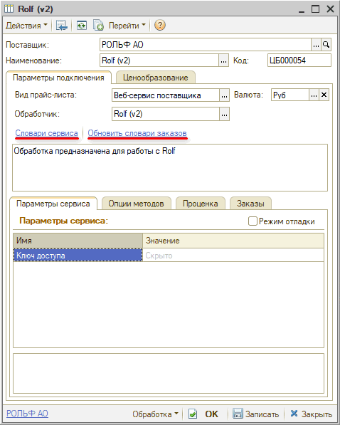
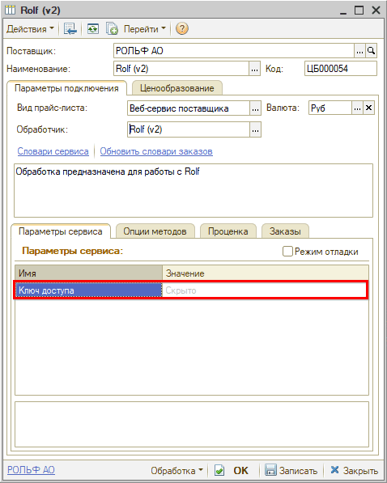
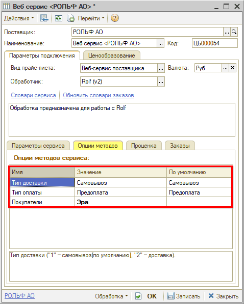

# Настройка Веб-сервиса Rolf (РОЛЬФ)

<table><tr><td><b>Время чтения:</b> 3 мин.</td><td><b>Обновлено:</b> 26.03.2026</td></tr></table>

Источник: https://www.5systems.ru/help/nastroyka-veb-servisa-rolf-rolf

## Содержание

1. [Описание](#описание)
2. [Параметры подключения](#параметры-подключения)
3. [Опции методов](#опции-методов)

* Доступно начиная с релиза 2.8.3.*

## Описание

Обработчик предназначен для работы с Веб-сервисами компании **"РОЛЬФ"** [https://parts.rolf.ru/](https://parts.rolf.ru/).

**Для использования Веб-сервисов Rolf (РОЛЬФ) требуется*** API-ключ* – ключ доступа покупателя, его следует получить у менеджера РОЛЬФ.

**Места использования Веб-сервисов:**

- Проценка;
- Отправка Веб-заказа поставщику.

После получения необходимых для подключения параметров требуется выполнить следующие действия для **настройки Веб прайс-листа**:

1. Заполнить и сохранить параметры подключения (см. [Параметры подключения](#параметры-подключения)).
2. Обновить словари сервиса путем нажатия кнопки-ссылки *"Обновить словари заказов"**:*

3. Настроить опции методов (см. [Опции методов](#опции-методов)).
4. Настроить параметры проценки (см. [*Создание и настройка Веб прайс-листа → Настройка параметров для проценки*](../../Склад%20и%20запчасти/Создание%20и%20настройка%20Веб%20прайс-листа/sozdanie-i-nastroyka-veb-prays-lista.md#настройка-параметров-для-проценки)*).*
5. Настроить параметры отправки заказа (см. *[Создание и настройка Веб прайс-листа → Настройка параметров для отправки заказа поставщику](../../Склад%20и%20запчасти/Создание%20и%20настройка%20Веб%20прайс-листа/sozdanie-i-nastroyka-veb-prays-lista.md#настройка-параметров-для-отправки-заказа-поставщику)).*
6. *Сохранить* все изменения.

## Параметры подключения

Параметры подключения к Веб-сервису поставщика настраиваются на вкладке "Параметры сервиса".

Для подключения Веб-сервисов Rolf (РОЛЬФ) необходимо указать следующие параметры:

- *ключ доступа –* API-ключ доступа покупателя, полученный у менеджера "РОЛЬФ":

## Опции методов

Опции методов используются как при поиске цен, так и при отправке заказа поставщику. По умолчанию используются опции, установленные в карточке прайс-листа. Если требуется, то при проценке или отправке заказа поставщику вручную могут быть назначены собственные значения опций, необходимые в данный момент.

Опции методов настраиваются на вкладке* "Опции методов":*

В Веб-сервисах Rolf (РОЛЬФ) предусмотрены следующие опции:

| Опция | Значения | Описание |
| --- | --- | --- |
| **Тип доставки** | ● Самовывоз (по умолчанию)  ● Доставка | Определяет тип доставки заказа |
| **Тип оплаты** | ● Предоплата (по умолчанию)  ● Постоплата | Определяет, требуется ли предоплата для оформления заказа |
| **Покупатели** | Из словаря сервиса "Покупатели" | ИД грузополучателя – следует взять из личного кабинета |

---

**Теги:** Rolf, РОЛЬФ, веб-сервис, веб прайс-лист, настройка веб-сервиса, параметры подключения, проценка, веб-заказ поставщику, опции методов

