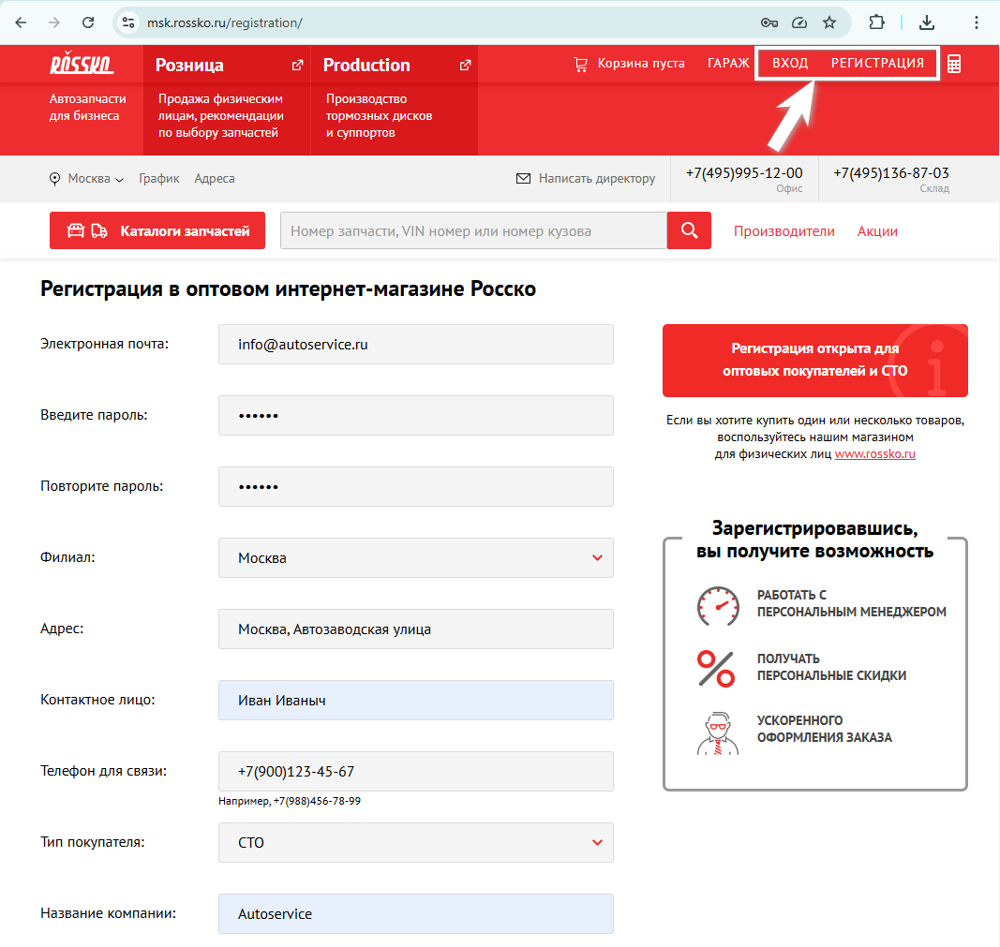
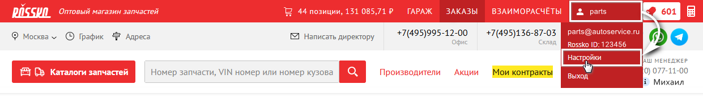
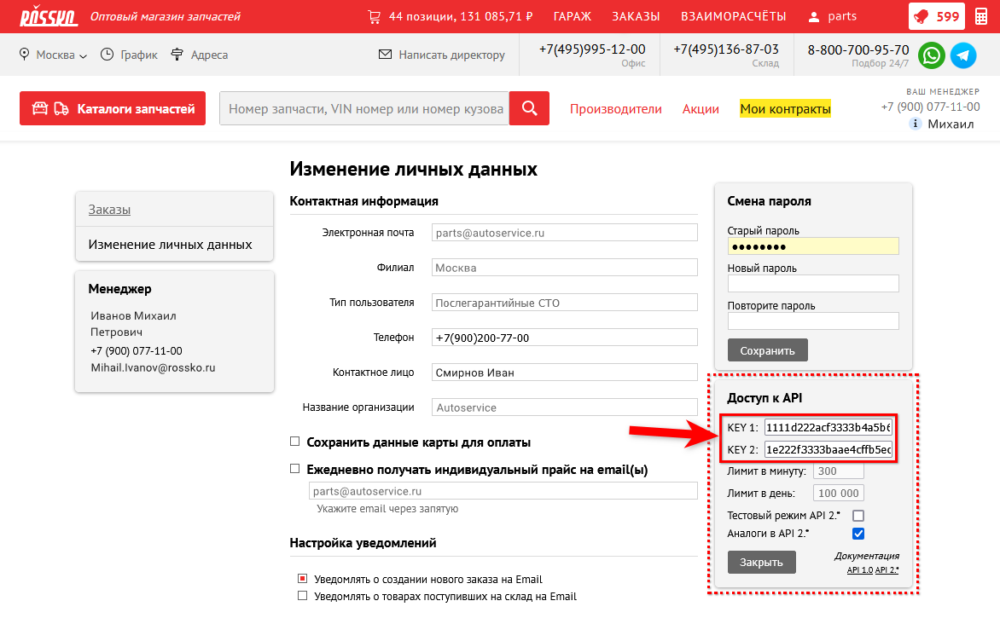
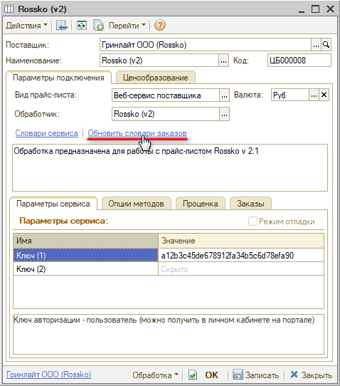
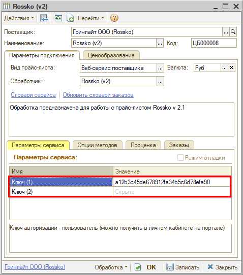
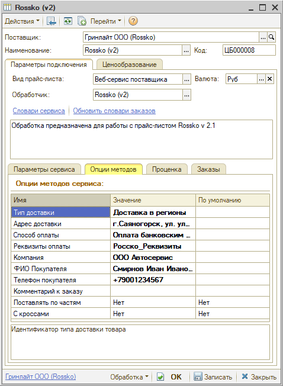

# Настройка Веб-сервиса Rossko (Росско) v.2

<table><tr><td><b>Время чтения:</b> 8 мин.</td><td><b>Обновлено:</b> 03.04.2026</td></tr></table>

Источник: https://www.5systems.ru/help/nastroyka-veb-servisa-rossko-rossko-v2

> *Актуально начиная с версии релиза 2.8.2*

## Содержание

1. [Описание](#описание)
2. [Параметры подключения](#параметры-подключения)
3. [Опции методов](#опции-методов)

## Описание

Обработчик предназначен для работы с Веб-сервисами компании **Rossko (Росско) v.2** [https://rossko.ru/](https://rossko.ru/).

Документация: [http://api.rossko.ru/](http://api.rossko.ru/).

Для использования веб-сервисов компании Rossko (Росско) v.2 необходимо самостоятельно получить ключи доступа в личном кабинете на портале.

**Места использования Веб-сервисов:**

- Проценка;
- Отправка Веб-заказа поставщику;
- Отслеживание статуса заказа.

  Чтобы получить ключи доступа:

1. Перейдите на сайт [https://rossko.ru/#where](https://rossko.ru/#where).
2. Выберите город для начала работы.
3. Зарегистрируйтесь и/или авторизуйтесь на сайте города, выбранного на предыдущем шаге:  
   
4. Перейдите к настройкам через личный кабинет:  
   
5. В блоке “Доступ к API” нажмите кнопку “Получить”. 
   В результате будут предоставлены ключи доступа:  
   

Там же, в личном кабинете, можно произвести остальные настройки (аналоги, предложения сторонних поставщиков и др.).

*Внимание!* Веб сервис имеет минутные и дневные ограничения по количеству запросов.

После получения ключей доступа:

1. Заполните параметры подключения (см. [Параметры подключения](#параметры-подключения)).
2. Сохраните изменения, нажав кнопку "Записать".
3. Обновите словари сервиса, нажав кнопку-ссылку *"Обновить словари оформления заказов":*  
   
4. Настройте опции методов (см. [Опции методов](#опции-методов)).
5. Настройте параметры проценки (см. [Создание и настройка Веб прайс-листа → Настройка параметров для проценки](../../Склад%20и%20запчасти/Создание%20и%20настройка%20Веб%20прайс-листа/sozdanie-i-nastroyka-veb-prays-lista.md#настройка-параметров-для-проценки)).
6. Настройте параметры отправки заказа (см. [Создание и настройка Веб прайс-листа → Настройка параметров для отправки заказа поставщику](../../Склад%20и%20запчасти/Создание%20и%20настройка%20Веб%20прайс-листа/sozdanie-i-nastroyka-veb-prays-lista.md#настройка-параметров-для-отправки-заказа-поставщику)).
7. Сохраните изменения.

## Параметры подключения

Параметры подключения к Веб-сервису поставщика настраиваются на вкладке *"Параметры сервиса".*

Для подключения Веб-сервисов Rossko (Росско) v.2 необходимо указать ключи доступа, полученные в личном кабинете сайта поставщика (см. [Описание](#описание)):

- Ключ 1 - KEY 1, ключ авторизации “пользователь”;
- Ключ 2 - KEY 2, ключ авторизации “пароль”.

  

## Опции методов

Опции методов используются как при поиске цен, так и при отправке заказа поставщику. По умолчанию используются опции, установленные в карточке прайс-листа. Если требуется, то при проценке или отправке заказа поставщику вручную, могут быть назначены собственные значения опций, необходимые в данный момент.

Опции методов настраиваются на вкладке *"Опции методов":*

В Веб-сервисах Rossko (Росско) v.2 предусмотрены следующие опции:

| Опция | Значения | Описание |
| --- | --- | --- |
| **Тип доставки** | Выбор из словаря сервиса “Типы доставки”: самовывоз, курьерская доставка и т.д. | Идентификатор типа доставки товара |
| **Адрес доставки** | Из словаря сервиса “Адреса доставки” | Идентификатор адреса доставки заказа. Используется при проценке и при заказе товара |
| **Способ оплаты** | Выбор из словаря сервиса “Типы платежей” | Идентификатор способа оплаты заказа |
| **Реквизиты оплаты** | Выбор из словаря сервиса *(на текущий момент недоступно)* | Определяет реквизиты организации, оформляющей заказы |
| **Компания** | Выбор из словаря сервиса “Компании” | Определяет организацию, оформляющую заказы |
| **ФИО покупателя** | Строка | Контактное лицо по заказу |
| **Телефон покупателя** | Строка | Номер телефона для связи с контактным лицом |
| **Комментарий к заказу** | Строка | Комментарий к заказу |
| **Поставлять по частям** | ● Да  ● Нет (по умолчанию) | Доставлять заказ по частям или нет |
| **С кроссами** | ● Да  ● Нет (по умолчанию) | Выводить кроссы |

---

**Теги:** Rossko, Росско, веб-сервис, веб прайс-лист, настройка веб-сервиса, параметры подключения, проценка, веб-заказ поставщику, опции методов

