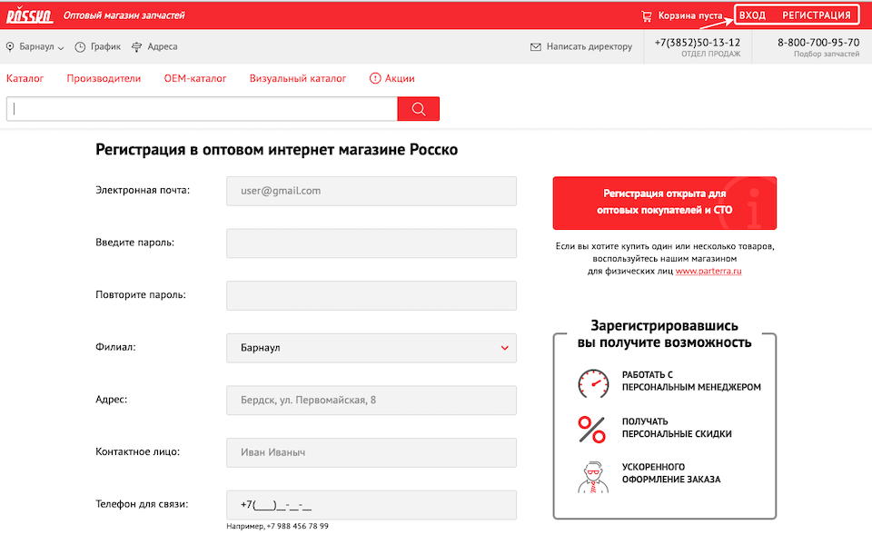
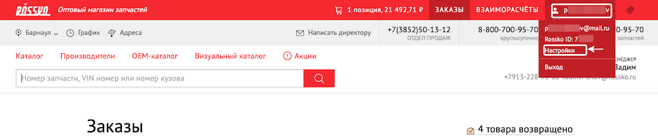
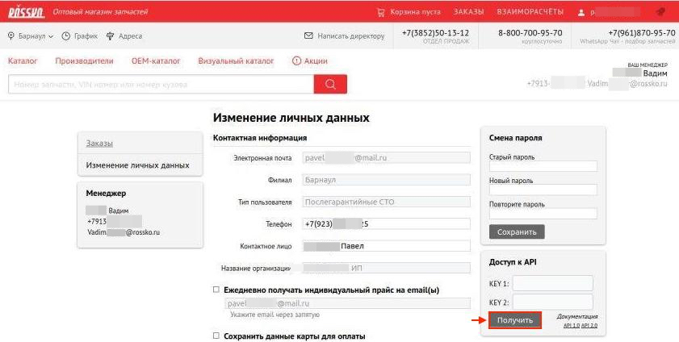
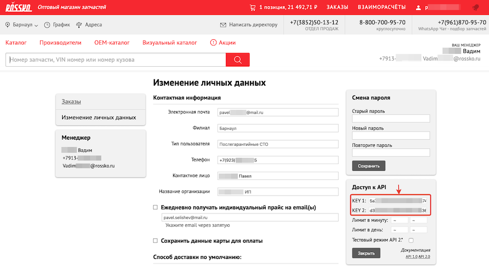
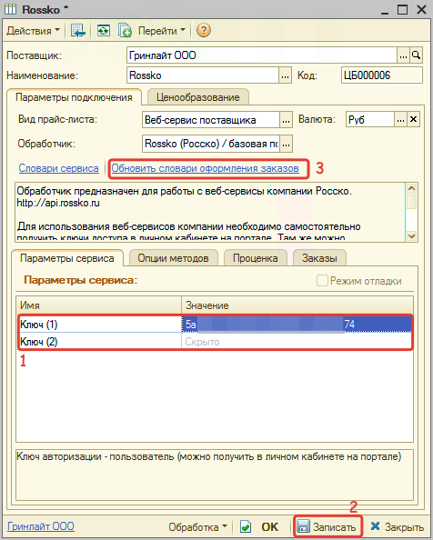
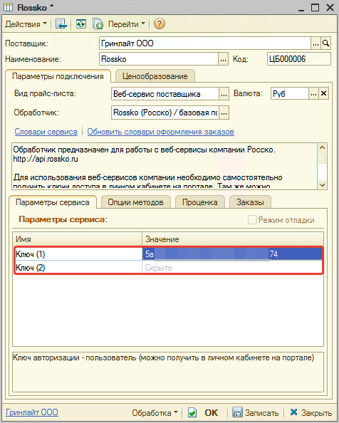
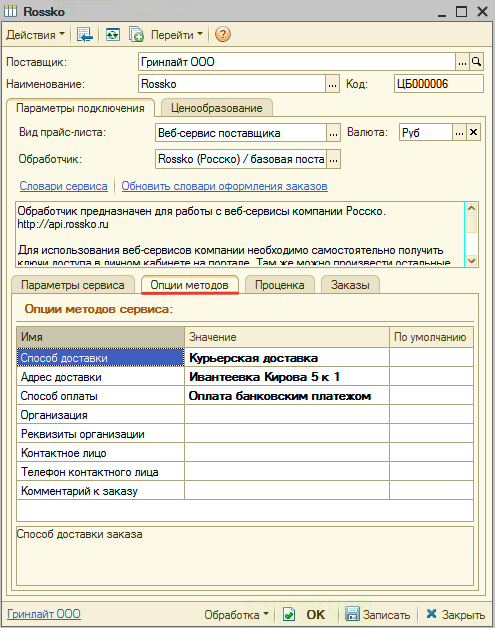

# Настройка Веб-сервиса Rossko (Росско) v.2.1

<table><tr><td><b>Время чтения:</b> 9 мин.</td><td><b>Обновлено:</b> 20.06.2022</td></tr></table>

Источник: https://www.5systems.ru/help/nastroyka-veb-servisa-rossko-rossko-v21

## Содержание

1. [Описание](#описание)
2. [Параметры подключения](#параметры-подключения)
3. [Опции методов](#опции-методов)

## Описание

Обработчик предназначен для работы с Веб-сервисами компании **"Росско"**.

[http://api.rossko.ru/service/v2.1/](http://api.rossko.ru/service/v2.1/)

**Места использования Веб-сервисов:**

- Проценка;
- Отправка Веб-заказа поставщику.
- Формирование заказа через Веб-сервис из локальных прайс-листов.

Для использования веб-сервисов компании Rossko (Росско) необходимо самостоятельно получить ключи доступа в личном кабинете на портале.

**Чтобы получить ключи доступа:**

1. Перейдите на сайт [https://rossko.ru/#where](https://rossko.ru/#where).
2. Выберите город для начала работы.
3. Зарегистрируйтесь и/или авторизуйтесь на сайте города, выбранного на предыдущем шаге:

4. Перейдите к настройкам через личный кабинет:

5. Получите ключи доступа:

В результате будут предоставлены ключи доступа:

Там же, в личном кабинете, можно произвести остальные настройки (аналоги, предложения сторонних поставщиков).

*Внимание!* Веб сервис имеет минутные и дневные ограничения по количеству запросов.

При наличии ключей доступа в карточке прайс-листа:

1. Заполните параметры подключения (см. *Параметры подключения*).
2. Сохраните изменения, нажав кнопку "Записать".
3. Обновите словари сервиса, нажав кнопку-ссылку "Обновить словари оформления заказов":

4. Настройте опции методов (см. *Опции методов*).
5. Настройте параметры проценки (см. [*Создание и настройка Веб прайс-листа→Настройка параметров для проценки*](../../Склад%20и%20запчасти/Создание%20и%20настройка%20Веб%20прайс-листа/sozdanie-i-nastroyka-veb-prays-lista.md#настройка-параметров-для-проценки)).
6. Настройте параметры отправки заказа (см. [*Создание и настройка Веб прайс-листа→Настройка параметров для отправки заказа поставщику*](../../Склад%20и%20запчасти/Создание%20и%20настройка%20Веб%20прайс-листа/sozdanie-i-nastroyka-veb-prays-lista.md#настройка-параметров-для-отправки-заказа-поставщику)).
7. Настройте локальные прайс-листы, доступные для Веб-заказа (см. [*Создание и настройка Веб прайс-листа→Настройка параметров для формирования заказа поставщику из локальных прайс-листов*](../../Склад%20и%20запчасти/Создание%20и%20настройка%20Веб%20прайс-листа/sozdanie-i-nastroyka-veb-prays-lista.md#настройка-параметров-для-формирования-заказа-поставщику-из-локальных-прайс-листов)).
8. Сохраните изменения.

## Параметры подключения

Параметры подключения к Веб-сервису поставщика настраиваются на вкладке "Параметры сервиса".

Для подключения Веб-сервисов Rossko (Росско) необходимо указать ключи доступа, полученные в личном кабинете сайта поставщика (см. *Описание*):

- Ключ (1) - KEY 1, ключ авторизации (пользователь),
- Ключ (2) - KEY 2, ключ авторизации (пароль).

## Опции методов

Опции методов используются как при поиске цен, так и при отправке заказа поставщику. По умолчанию используются опции, установленные в карточке прайс-листа. Если требуется, то при проценке или отправке заказа поставщику вручную, могут быть назначены собственные значения опций, необходимые в данный момент.

Опции методов настраиваются на вкладке "Опции методов".

В Веб-сервисах Rossko (Росско) предусмотрены следующие опции:

| Опция | Значения | Описание |
| --- | --- | --- |
| **Способ доставки** | Из словаря сервиса | Определяет способ доставки заказа |
| **Адрес доставки** | Из словаря сервиса | Определяет адрес доставки заказа |
| **Способ оплаты** | Из словаря сервиса | Определяет способ оплаты заказа |
| **Организация** | Из словаря сервиса | Определяет организацию, оформляющую заказы |
| **Реквизиты организации** | Строка | Определяет реквизиты организации, оформляющей заказы |
| **Контактное лицо** | Строка | Определяет контактное лицо по заказу |
| **Телефон контактного лица** | Строка | Определяет телефон для связи с контактным лицо |
| **Комментарий к заказу** | Строка | Комментарий к заказу |
| **Склады для поиска** | Строка | Ограничение складов для поиска остатков (например: "HST924, HST228, HST28") |

---

**Теги:** Rossko, Росско, веб-сервис, веб прайс-лист, настройка веб-сервиса, параметры подключения, проценка, веб-заказ поставщику, опции методов

