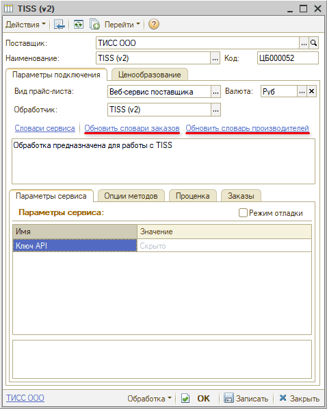
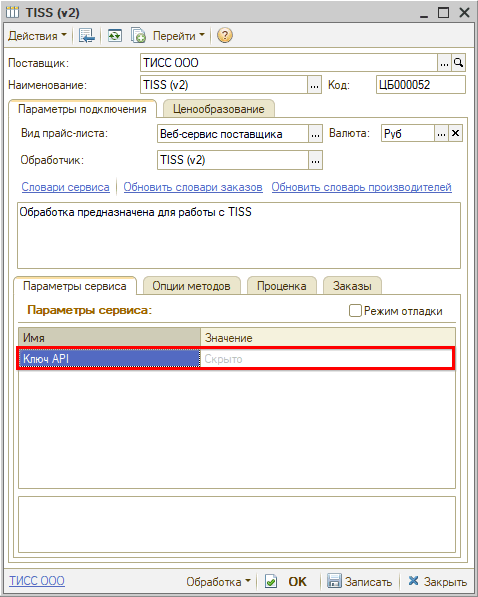
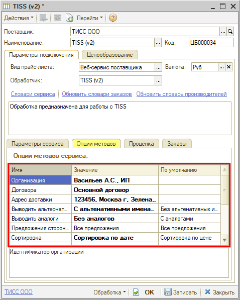

# Настройка Веб-сервиса TISS (ТИСС)

<table><tr><td><b>Время чтения:</b> 7 мин.</td><td><b>Обновлено:</b> 11.03.2026</td></tr></table>

Источник: https://www.5systems.ru/help/nastroyka-veb-servisa-tiss-tiss

## Содержание

1. [Описание](#описание)
2. [Параметры подключения](#параметры-подключения)
3. [Опции методов](#опции-методов)

*Доступно начиная с релиза 2.8.3.*

## Описание

Обработчик предназначен для работы с Веб-сервисами компании **"ТИСС"** [https://tiss.ru](https://tiss.ru/).

**Для использования Веб-сервисов TISS (ТИСС) требуется*** ключ API* – ключ доступа покупателя, его следует заказать в личном кабинете и получить на электронную почту.

**Места использования Веб-сервисов:**

- Проценка;
- Отправка Веб-заказа поставщику.

После получения необходимых для подключения параметров требуется выполнить следующие действия для **настройки Веб прайс-листа**:

1. Заполнить и сохранить параметры подключения (см. [Параметры подключения](#параметры-подключения)).
2. Обновить словари сервиса путем нажатия кнопок-ссылок *"Обновить словари заказов"* и *"Обновить словари производителей":*

3. Настроить опции методов (см. [Опции методов](#опции-методов)).
4. Настроить параметры проценки (см. [*Создание и настройка Веб прайс-листа → Настройка параметров для проценки*](../../Склад%20и%20запчасти/Создание%20и%20настройка%20Веб%20прайс-листа/sozdanie-i-nastroyka-veb-prays-lista.md#настройка-параметров-для-проценки)*).*
5. Настроить параметры отправки заказа (см. *[Создание и настройка Веб прайс-листа → Настройка параметров для отправки заказа поставщику](../../Склад%20и%20запчасти/Создание%20и%20настройка%20Веб%20прайс-листа/sozdanie-i-nastroyka-veb-prays-lista.md#настройка-параметров-для-отправки-заказа-поставщику)).*
6. *Сохранить* все изменения.

## Параметры подключения

Параметры подключения к Веб-сервису поставщика настраиваются на вкладке "Параметры сервиса".

Для подключения Веб-сервисов TISS (ТИСС) необходимо указать следующие параметры:

- *ключ API –* ключ доступа покупателя, заказанный в личном кабинете и полученный на электронную почту:

## Опции методов

Опции методов используются как при поиске цен, так и при отправке заказа поставщику. По умолчанию используются опции, установленные в карточке прайс-листа. Если требуется, то при проценке или отправке заказа поставщику вручную могут быть назначены собственные значения опций, необходимые в данный момент.

Опции методов настраиваются на вкладке* "Опции методов":*

В Веб-сервисах TISS (ТИСС) предусмотрены следующие опции:

| Опция | Значения | Описание |
| --- | --- | --- |
| **Организация** | Из словаря сервиса "Организации" | Определяет организацию, на которую будут оформляться заказы |
| **Договора** | Из словаря сервиса "Договора" | Определяет договор, по которому будут оформляться заказы |
| **Адрес доставки** | Из словаря сервиса "Адрес доставки" | Определяет адрес доставки заказа |
| **Выводить альтернативные имена производителей** | ● С альтернативными именами производителей  ● Без альтернативных имен производителей (по умолчанию) | Определяет, выводить ли альтернативные имена производителей в проценке |
| **Выводить аналоги** | ● С аналогами (по умолчанию)  ● Без аналогов | Определяет, выводить предложения в проценке с аналогами или без |
| **Предложения сторонних поставщиков** | ● Все предложения (по умолчанию)  ● Только TISS | Определяет, выводить в проценке предложения сторонних поставщиков или только TISS |
| **Сортировка** | ● Сортировка по цене (по умолчанию)  ● Сортировка по дате | Определяет, сортировать предложения в проценке по цене или по дате доставки |
| **Минимальное количество дней доставки** | Число | Возможность задать диапазон сроков доставки: минимальное количество дней |
| **Максимальное количество дней доставки** | Число (по умолчанию "10") | Возможность задать диапазон сроков доставки: максимальное количество дней |
| **Максимальное количество предложений** | Число (по умолчанию "100") | Возможность задать максимальное количество предложений в запросе (с сортировкой по цене) |
| **Тип доставки** | ● До города (по умолчанию)  ● Самовывоз  ● До склада  ● Экспресс-доставка  ● До клиента | Определяет тип доставки заказа |
| **Доставка: весь заказ за один раз или по мере поступления** | ● Все вместе (по умолчанию)  ● Отдельно | Определяет, оформлять доставку всего заказа за один раз или по частям по мере поступления товаров на склад поставщика |
| **Контактный телефон по заказу** | Строка | Контактный телефон для связи по заказу |

---

**Теги:** TISS, ТИСС, веб-сервис, веб прайс-лист, настройка веб-сервиса, параметры подключения, проценка, веб-заказ поставщику, опции методов

