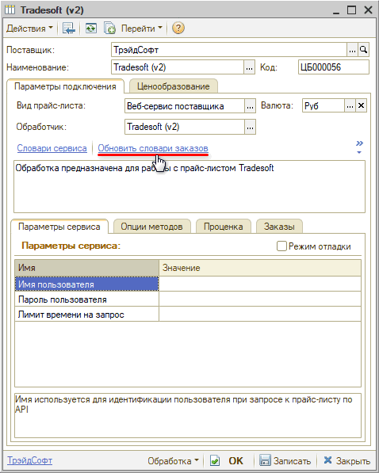
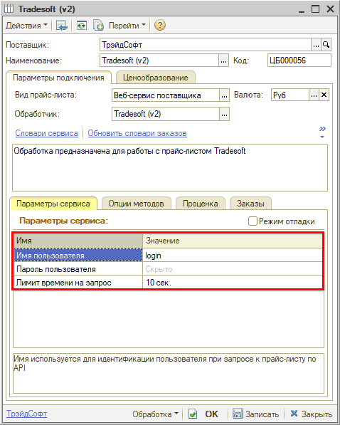

# Настройка Веб-сервиса Tradesoft (ТрэйдСофт) v.2

<table><tr><td><b>Время чтения:</b> 4 мин.</td><td><b>Обновлено:</b> 22.06.2026</td></tr></table>

Источник: https://www.5systems.ru/help/nastroyka-veb-servisa-tradesoft-treydsoft-v2

## Содержание

1. [Описание](#описание)
2. [Параметры подключения](#параметры-подключения)
3. [Опции методов](#опции-методов)

*Актуально начиная с версии релиза 2.8.4*

## Описание

Обработчик **Tradesoft v.2 (ТрэйдСофт)** предназначен для работы с Веб-сервисами поставщиков, которые используют платформу **"Tradesoft.ru"**.

**Для использования Веб-сервисов необходимо:**

**1.** Зарегистрироваться на сайте *сервиса "Tradesoft.ru";*

**2.** Узнать у *поставщика,* работает ли он на платформе "Tradesoft.ru";

**3.** Зарегистрироваться *на сайте поставщика;*

**4.** Уточнить у поставщика параметры подключения к сервису и запросить разрешение на использование (ваш IP адрес должен быть в списке разрешенных).

**Места использования Веб-сервисов:**

- Проценка;
- Отправка Веб-заказа поставщику.

После получения всех необходимых для подключения параметров выполняются следующие действия для Веб прайс-листа:

1. Заполнение параметров подключения (см. *[Параметры подключения](#параметры-подключения)).*
2. Сохранение параметров подключения.
3. Обновление словарей заказов с помощью кнопки-ссылки *"Обновить словари заказов":*  
   
4. Настройка опций методов (см. *[Опции методов](#опции-методов)).*
5. Настройка параметров проценки (см. [*Создание и настройка Веб прайс-листа → Настройка параметров для проценки*](../../Склад%20и%20запчасти/Создание%20и%20настройка%20Веб%20прайс-листа/sozdanie-i-nastroyka-veb-prays-lista.md#настройка-параметров-для-проценки)).
6. Сохранение всех изменений.

## Параметры подключения

Параметры подключения к Веб-сервисам поставщика настраиваются на вкладке *"Параметры сервиса":*

Для подключения необходимо указать следующие параметры:

- *Имя пользователя* – логин на сайте "Tradesoft.ru", используется для идентификации пользователя при запросе к прайс-листу по API;
- *Пароль пользователя* – пароль на сайте "Tradesoft.ru", используется для идентификации пользователя при запросе к прайс-листу по API;
- *Лимит времени на запрос* – лимит времени на выполнение запроса в секундах, допустимые значения от 1 до 50.

## Опции методов

Опции методов используются при поиске цен. По умолчанию используются опции, установленные в карточке прайс-листа. Если требуется, то при проценке могут быть назначены собственные значения опций, необходимые в данный момент.

Опции методов настраиваются на вкладке *"Опции методов".* Для Веб-сервиса "Tradesoft" предусмотрены следующие опции:

| Опция | Значения | Описание |
| --- | --- | --- |
| **Уникальный идентификатор поставщика товаров** | Из словаря сервиса | Код поставщика в системе Tradesoft.ru, значение выбирается из списка доступных поставщиков |
| **Ваш логин на сайте сервиса/поставщика** | Строка | Логин на сайте поставщика |
| **Ваш пароль на сайте сервиса/поставщика** | Строка | Пароль на сайте поставщика |

---

**Теги:** Tradesoft, ТрэйдСофт, веб-сервис, веб прайс-лист, настройка веб-сервиса, параметры подключения, проценка, веб-заказ поставщику, опции методов

