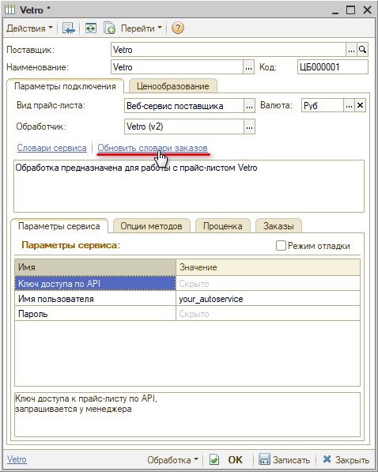
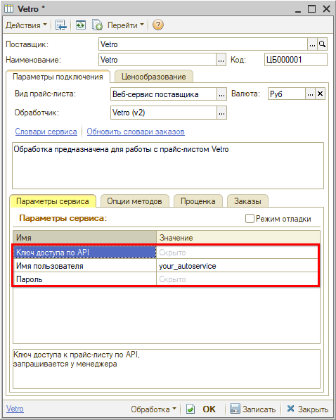
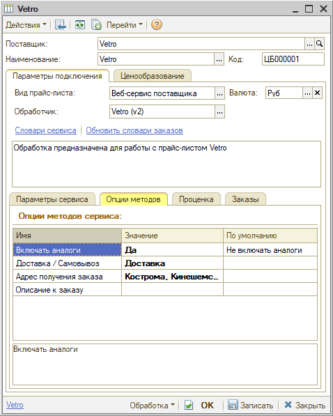

# Настройка Веб-сервиса Vetro

<table><tr><td><b>Время чтения:</b> 5 мин.</td><td><b>Обновлено:</b> 17.03.2025</td></tr></table>

Источник: https://www.5systems.ru/help/nastroyka-veb-servisa-vetro

## Содержание

1. [Описание](#описание)
2. [Параметры подключения](#параметры-подключения)
3. [Опции методов](#опции-методов)

*Доступно начиная с релиза 2.8.2.*

## Описание

Обработка предназначена для использования сервиса интернет-магазина компании **Vetro**, сайт: [https://spb.vetro.pro](https://spb.vetro.pro).

Документация: [https://vetro3.sbps.ru/api/docs#/](https://vetro3.sbps.ru/api/docs#/).

Параметры для подключения:

- *имя пользователя* и *пароль* – логин и пароль от ЛК на сайте [https://vetro3.sbps.ru/](https://vetro3.sbps.ru/);
- *Ключ API* необходимо запросить у менеджера компании.

**Места использования Веб-сервисов:**

- Проценка;
- Отправка Веб-заказа поставщику;
- Отслеживание статуса заказа.

Реализован поиск по артикулу и еврокоду.

После получения всех необходимых для подключения параметров выполняются следующие действия для Веб прайс-листа:

1. Заполнение параметров подключения (см. [Параметры подключения](#параметры-подключения)).
2. Сохранение параметров подключения.
3. Обновление словарей сервиса нажатием кнопки-ссылки *“Обновить словари заказов”:*

4. Настройка опций методов (см. [Опции методов](#опции-методов)).
5. Настройка параметров проценки (см. [Создание и настройка Веб прайс-листа → Настройка параметров для проценки](../../Склад%20и%20запчасти/Создание%20и%20настройка%20Веб%20прайс-листа/sozdanie-i-nastroyka-veb-prays-lista.md#настройка-параметров-для-проценки)).
6. Настройка параметров отправки заказа (см. [Создание и настройка Веб прайс-листа → Настройка параметров для отправки заказа поставщику](../../Склад%20и%20запчасти/Создание%20и%20настройка%20Веб%20прайс-листа/sozdanie-i-nastroyka-veb-prays-lista.md#настройка-параметров-для-отправки-заказа-поставщику)).
7. Сохранение всех изменений.

## Параметры подключения

Параметры подключения к Веб-сервису поставщика настраиваются на вкладке *“Параметры сервиса”:*

Для подключения Веб-сервисов *Vetro* необходимо указать следующие параметры:

- *Ключ API *– ключ доступа к прайс-листу по API, запрашивается у менеджера;
- *Логин *– имя пользователя, адрес электронной почты для входа в личный кабинет;
- *Пароль *– пароль для входа в личный кабинет.

## Опции методов

Опции методов используются как при поиске цен, так и при отправке заказа поставщику. По умолчанию используются опции, установленные в карточке прайс-листа. Если требуется, то при проценке или отправке заказа поставщику вручную, могут быть назначены собственные значения опций, необходимые в данный момент.

Опции методов настраиваются на вкладке *“Опции методов”:*

В Веб-сервисах *Vetro* предусмотрены следующие опции:

| Опция | Значения | Описание |
| --- | --- | --- |
| **Включать аналоги** | - Включать аналоги - Не включать аналоги (по умолчанию) | Получение предложений в проценке с аналогами или без |
| **Доставка / Самовывоз** | - Доставка - Самовывоз | Вариант получения заказа |
| **Адрес получения заказа** | Выбор из словаря сервиса “Адреса доставки” | Выбор склада для получения заказа |
| **Описание к заказу** | Строка | Произвольный комментарий к заказу |

---

**Теги:** Vetro, веб-сервис, веб прайс-лист, настройка веб-сервиса, параметры подключения, проценка, веб-заказ поставщику, опции методов

