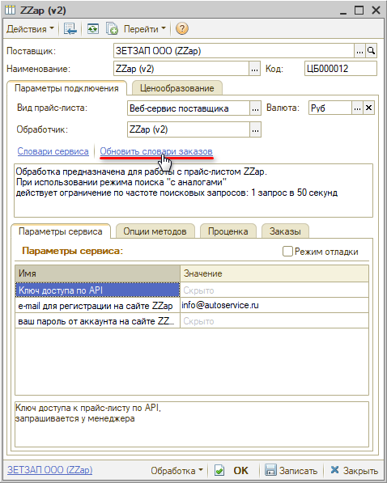
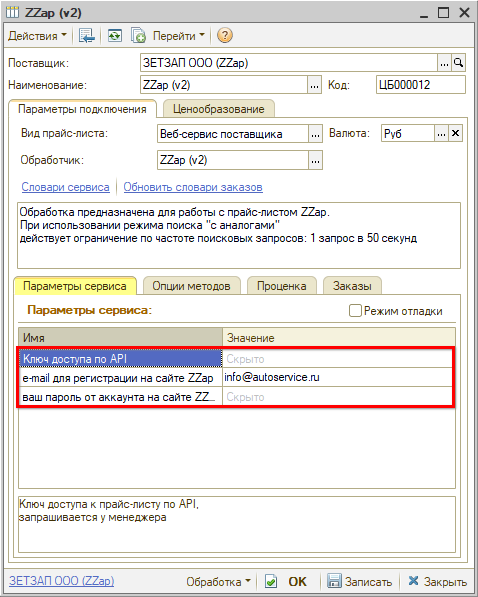
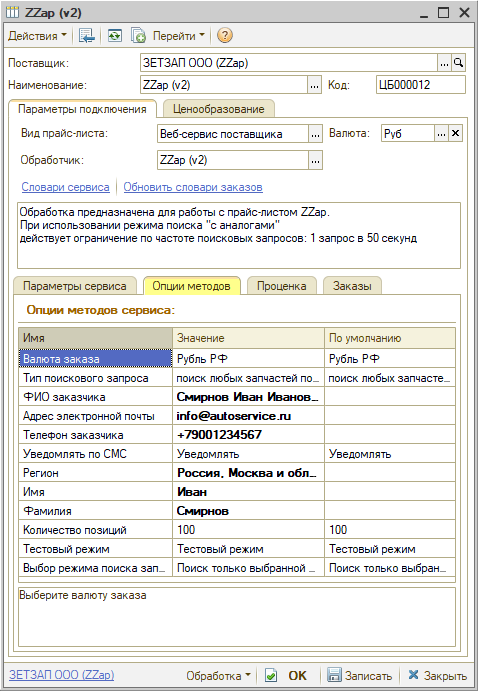

# Настройка Веб-сервиса ZZAP (Зетзап) v.2

<table><tr><td><b>Время чтения:</b> 8 мин.</td><td><b>Обновлено:</b> 13.04.2026</td></tr></table>

Источник: https://www.5systems.ru/help/nastroyka-veb-servisa-zzap-zetzap-v2

## Содержание

1. [Описание](#описание)
2. [Параметры подключения](#параметры-подключения)
3. [Опции методов](#опции-методов)

*Актуально начиная с версии релиза 2.8.2*

## Описание

Обработчик предназначен для работы с *клиентским API **ZZap v.2**:* [https://zzap.ru](https://zzap.ru/).

Документация: [https://wiki.zzap.ru/api-zzap/](https://wiki.zzap.ru/api-zzap/)

**Для использования Веб-сервисов *ZZap v.2* необходимо:**

1. Быть зарегистрированным на сайте [https://zzap.ru](https://zzap.ru/).
2. Получить *api_key:*

   **1)** Если вы покупатель, напишите на почту support@zzap.pro или создайте заявку в разделе "Заявки на тех.поддержку", и вам пришлют api_key.

   **2)** Если вы продавец и знаете, кто ваш менеджер, обратитесь к нему – менеджер вышлет вам api_key.

   **3)** Если вы продавец, но по каким-то причинам не знаете, кто ваш менеджер, или на данный момент к вам не прикреплен ни один из менеджеров, поступайте, как покупатель.

Правила работы: частота запросов по API должна быть не выше 1 запроса в 3 секунды.

**Места использования Веб-сервисов:**

- Проценка;
- Отправка Веб-заказа поставщику.
- Отслеживание статусов заказа.

После получения всех необходимых для подключения параметров выполняются следующие действия для Веб прайс-листа:

1. Заполнение параметров подключения (см. [Параметры подключения](#параметры-подключения)).
2. Сохранение параметров подключения.
3. Обновление словарей сервиса нажатием кнопки-ссылки *"Обновить словари заказов":*

4. Настройка опций методов (см. [Опции методов](#опции-методов)).
5. Настройка параметров проценки (см. [Создание и настройка Веб прайс-листа → Настройка параметров для проценки](../../Склад%20и%20запчасти/Создание%20и%20настройка%20Веб%20прайс-листа/sozdanie-i-nastroyka-veb-prays-lista.md#настройка-параметров-для-проценки)).
6. Настройка параметров отправки заказа (см. [Создание и настройка Веб прайс-листа → Настройка параметров для отправки заказа поставщику](../../Склад%20и%20запчасти/Создание%20и%20настройка%20Веб%20прайс-листа/sozdanie-i-nastroyka-veb-prays-lista.md#настройка-параметров-для-отправки-заказа-поставщику)).
7. Сохранение всех изменений.

## Параметры подключения

Параметры подключения к Веб-сервису поставщика настраиваются на вкладке *"Параметры сервиса":*

Для подключения Веб-сервисов *ZZap v.2* необходимо указать следующие параметры:

- *Ключ доступа по API* – ключ доступа к прайс-листу по API, запрашивается у менеджера;
- *e-mail для регистрации на сайте ZZap* – логин для регистрации на сайте;
- *ваш пароль от аккаунта на сайте ZZap* - пароль для регистрации на сайте.

## Опции методов

Опции методов используются как при поиске цен, так и при отправке заказа поставщику. По умолчанию используются опции, установленные в карточке прайс-листа. Если требуется, то при проценке или отправке заказа поставщику вручную, могут быть назначены собственные значения опций, необходимые в данный момент.

Опции методов настраиваются на вкладке *"Опции методов":*

В Веб-сервисах *Zzap v.2* предусмотрены следующие опции:

| Опция | Значения | Описание |
| --- | --- | --- |
| **Валюта заказа** | ● Рубль РФ (по умолчанию)  ● Доллар США  ● Евро  ● Гривна  ● Рубль Белоруссии  ● Тенге | Выбор валюты заказа |
| **Тип поискового запроса** | ● поиск любых запчастей по номеру (по умолчанию);  ● поиск только новых запчастей по номеру;  ● поиск по б/у и уценке (по введенным в поисковую строку словам);  ● любые предложения только по запрошенному номеру;  ● новые только по запрошенному номеру | Тип поискового запроса – какие запчасти включать в поиск: новые, б/у, уценка и т.д. |
| **ФИО заказчика** | Строка | ФИО заказчика (может отличаться от имени, указанного в аккаунте при регистрации) |
| **Адрес электронной почты** | Строка | Адрес электронной почты заказчика (может отличаться от e-mail, указанного в аккаунте при регистрации) |
| **Телефон заказчика** | Строка | Телефон заказчика (может отличаться от телефона, указанного в аккаунте при регистрации) |
| **Уведомлять по СМС** | ● Уведомлять (по умолчанию);  ● Не уведомлять | Указание о необходимости оповещения по СМС |
| **Регион** | Выбор из словаря сервиса “Регионы” | Выбор регион получения заказа (может отличаться от региона, указанного при регистрации) |
| **Имя** | Строка | Имя заказчика |
| **Фамилия** | Строка | Фамилия заказчика |
| **Количество позиций** | От 1 до 500 (по умолчанию 100) | Максимальное количество позиций, возвращаемых по запросу к поставщику (от 1 до 500) |
| **Тестовый режим** | ● Обычный режим;  ● Тестовый режим (по умолчанию) | При выборе тестового режима заказ не будет сформирован; при выборе обычного рабочего режима заказ будет сформирован и отправлен продавцу |
| **Выбор режима поиска запчастей** | ● Поиск только выбранной запчасти (по умолчанию);  ● Поиск с заменами | Выбор режима поиска запчастей: с учетом кроссов или нет. В режиме с кроссами действует ограничение: один запрос в 6-50 секунд |

---

**Теги:** ZZAP, Зетзап, веб-сервис, веб прайс-лист, настройка веб-сервиса, параметры подключения, проценка, веб-заказ поставщику, опции методов

