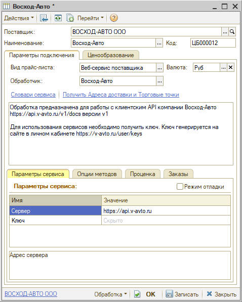
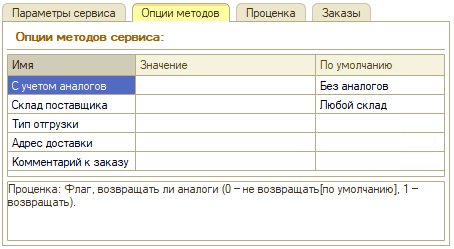

# Настройка Веб-сервиса Восход-Авто

<table><tr><td><b>Время чтения:</b> 5 мин.</td><td><b>Обновлено:</b> 03.04.2023</td></tr></table>

Источник: https://www.5systems.ru/help/nastroyka-veb-servisa-voskhod-avto

## Содержание

1. [Описание](#описание)
2. [Параметры подключения](#параметры-подключения)
3. [Опции методов](#опции-методов)

## Описание

Обработчик предназначен для работы с клиентским API компании ***Восход-Авто:*** [https://api.v-avto.ru/v1/docs](https://api.v-avto.ru/v1/docs) версии v1.

**Для работы с Веб-сервисом Восход-Авто необходимо:**

- быть зарегистрированным на сайте поставщика;
- получить ключ. Ключ генерируется на сайте в личном кабинете:  [https://v-avto.ru/user/keys](https://v-avto.ru/user/keys).
- согласовать условия подключения с менеджером поставщика.

  **Места использования Веб-сервисов:**

- Проценка;
- Оформление заказа.

  После получения всех необходимых для подключения параметров выполняются следующие действия для Веб прайс-листа:

1. Заполнить параметры подключения (см. [*Параметры подключения*](#параметры-подключения)*).*
2. Сохранить параметры подключения.
3. Обновить словари сервиса нажатием на кнопку-ссылку “Получить адреса доставки и Торговые точки”.
4. Настроить опции методов (см. [*Опции методов*](#опции-методов)*).*
5. Настроить параметры проценки (см.[ Создание и настройка Веб прайс-листа→Настройка параметров для проценки](../../Склад%20и%20запчасти/Создание%20и%20настройка%20Веб%20прайс-листа/sozdanie-i-nastroyka-veb-prays-lista.md#настройка-параметров-для-проценки)).
6. Настроить параметры отправки заказа (см.[ Создание и настройка Веб прайс-листа→Настройка параметров для отправки заказа поставщику](../../Склад%20и%20запчасти/Создание%20и%20настройка%20Веб%20прайс-листа/sozdanie-i-nastroyka-veb-prays-lista.md#настройка-параметров-для-отправки-заказа-поставщику)).
7. Сохранить все изменения.

## Параметры подключения

Параметры подключения к Веб-сервису поставщика настраиваются на вкладке “Параметры сервиса”:

Для подключения Веб-сервиса “Восход-Авто” необходимо указать следующие параметры:

- *Сервер* – адрес сервера;
- *Ключ* – ключ, сгенерированный в личном кабинете.

## Опции методов

Опции методов используются при поиске цен. По умолчанию используются опции, установленные в карточке прайс-листа. Если требуется, то при проценке могут быть назначены собственные значения опций, необходимые в данный момент.

Опции методов настраиваются на вкладке "Опции методов":

На данный момент в Веб-сервисе Восход-Авто предусмотрены следующие опции методов:

| Опция | Значения | Описание |
| --- | --- | --- |
| **С учетом аналогов** | - С аналогами; - Без аналогов (по умолчанию) | Проценка: Флаг, возвращать ли аналоги (0 – не возвращать [по умолчанию], 1 – возвращать). |
| **Склад поставщика** | - Любой склад (по умолчанию); - Екатеринбург; - Магнитогорск; - Сургут; - Тюмень; - Челябинск. | Какие склады должны быть в результатах выполнения запроса |
| **Тип отгрузки** | - Самовывоз; - Доставка. | Тип отгрузки заказа |
| **Адрес доставки** |  | Адрес доставки заказа. Может быть указан как адрес клиента, так и адрес торговой точки компании. Обязательно выбрать "Тип отгрузки – Доставка". |
| **Комментарий к заказу** |  | Произвольный комментарий к заказу. |

---

**Теги:** Восход-Авто, веб-сервис, веб прайс-лист, настройка веб-сервиса, параметры подключения, проценка, веб-заказ поставщику, опции методов

