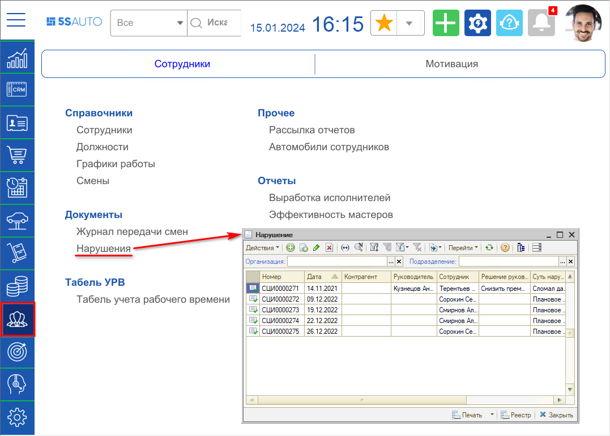
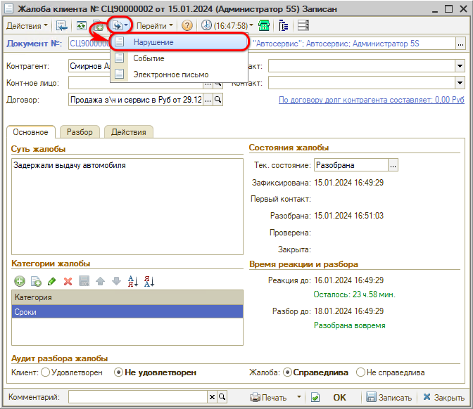
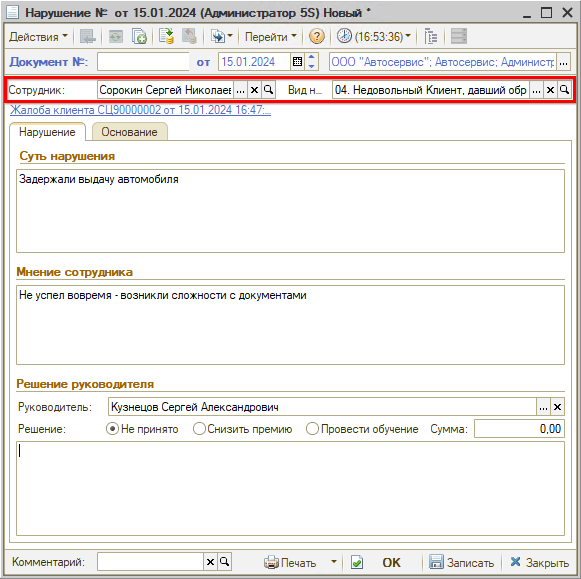
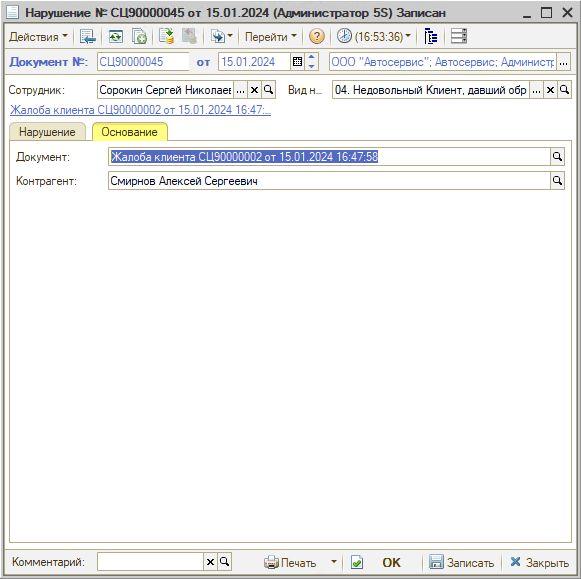
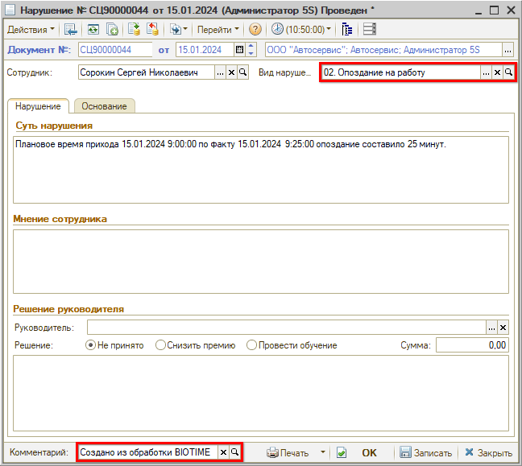

# Выявление и разбор нарушений

<table><tr><td><b>Время чтения:</b> 12 мин.</td><td><b>Обновлено:</b> 17.01.2024</td></tr></table>

Источник: https://www.5systems.ru/help/vyyavlenie-i-razbor-narusheniy

## Содержание

1. [Введение](#введение)
2. [Как перейти](#как-перейти)
3. [Создание нарушения](#создание-нарушения)
4. [Работа с формой документа "Нарушение"](#работа-с-формой-документа-нарушение)
5. [Нарушения по данным BioTime](#нарушения-по-данным-biotime)

## Введение

Для контроля исполнения внутренних процессов компании предусмотрен документ ***"Нарушение"***.

## Как перейти

Переход к списку выявленных нарушений осуществляется через меню *Управление персоналом → Сотрудники → Документы → Нарушения:*

## Создание нарушения

Документ "Нарушение" может быть создан следующими способами:

1. на основании документа "Жалоба" вручную:  
   
2. на основании документа "Жалоба" автоматически через [*Преднастроенные значимые события*](../../Сообщения/Преднастроенные%20значимые%20события/prednastroennye-znachimye-sobytiya.md).
3. из системы учета рабочего времени BioTime (см. ниже [*Нарушения по данным BioTime*](#нарушения-по-данным-biotime)).

## Работа с формой документа "Нарушение"

На форме документа "Нарушение" заполняются основные реквизиты:

1. *Сотрудник* — сотрудник, для которого фиксируется нарушение. Подтягивается автоматически из документа-основания.
2. *Вид нарушения* — при необходимости нарушения можно классифицировать. Например, различать нарушения по качеству обслуживания и опоздания.

На вкладке "Нарушение" заполняются:

1. *Суть нарушения* — описание, в чем заключается факт нарушения внутреннего процесса компании.
2. *Мнение сотрудника* — объяснительная от сотрудника, для которого зафиксировано нарушение.
3. Блок "Решение руководителя"
   - 1\. *Руководитель* - сотрудник, являющийся руководителем.
   - 2\. *Решение* - состоит из:
     - 1\) выбора варианта решения: решение может быть не принято или принято — снизить премию на сумму / провести обучение;
     - 2\) описания решения.

На вкладке "Основание" отображается документ-основание и контрагент, который является участником в выявлении нарушения — например, недовольный качеством обслуживания клиент из документа "Жалоба":

## Нарушения по данным BioTime

Нарушение за опоздание, зафиксированное в BioTime, или при отсутствии отметки в BioTime о приходе на работу создается автоматически при наличии настроенной [*интеграции*](../../Интеграция%20с%20внешними%20сервисами/Интеграция%20с%20BioTime/integraciya-s-biotime.md):

---

**Теги:** работа с персоналом, сотрудники, нарушения, дисциплина, biotime

