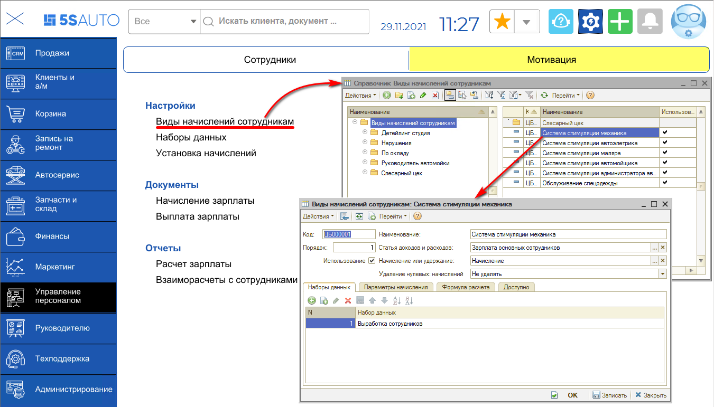
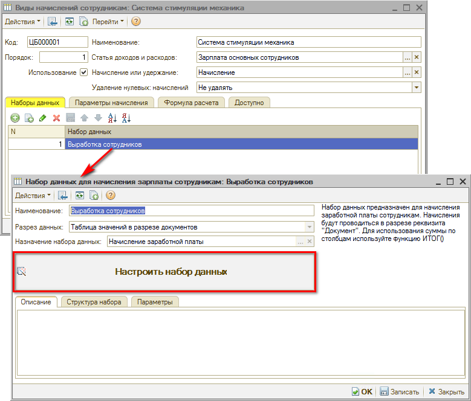
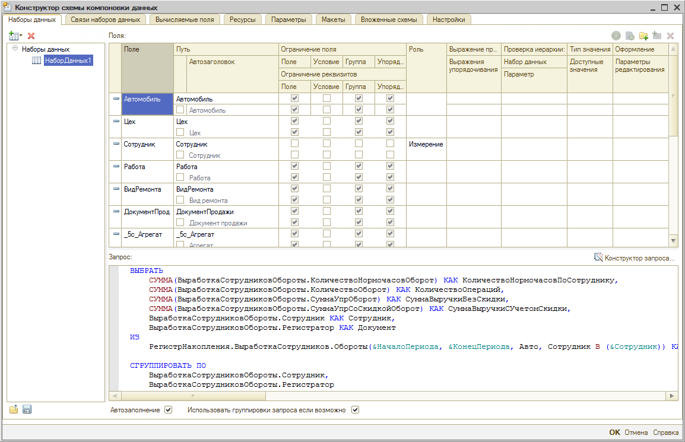
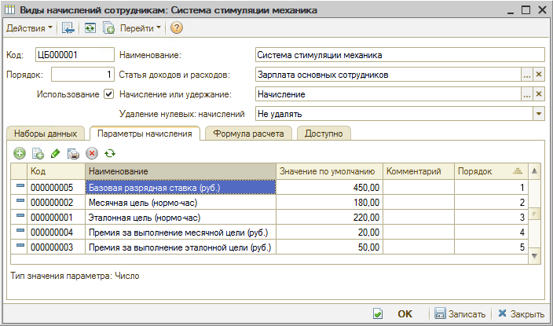
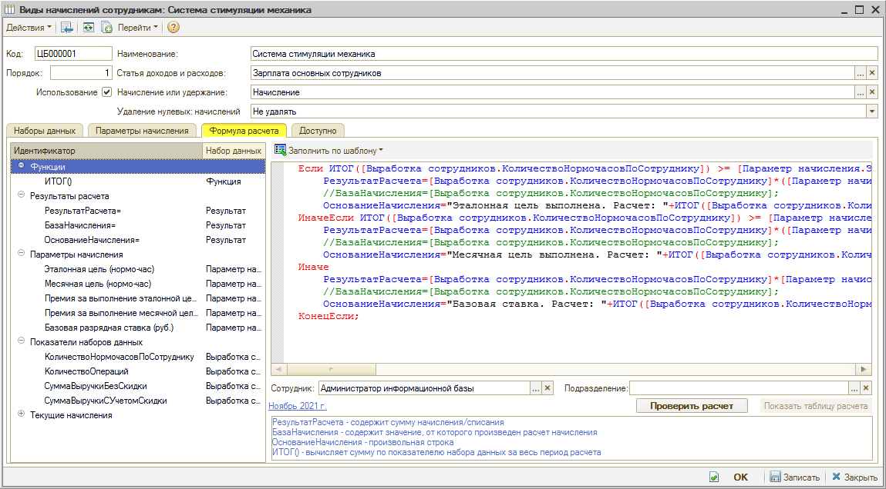
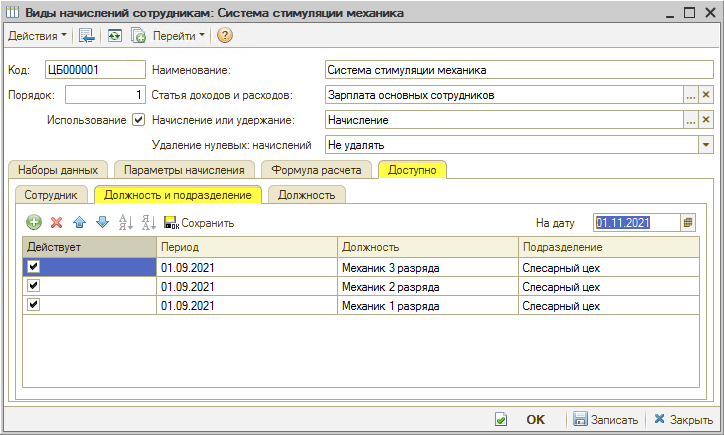
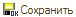
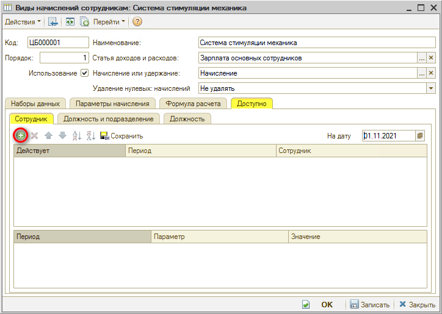

# Настройка системы мотивации

<table><tr><td><b>Время чтения:</b> 9 мин.</td><td><b>Обновлено:</b> 14.06.2022</td></tr></table>

Источник: https://www.5systems.ru/help/nastroyka-sistemy-motivacii

> *Актуально начиная с версии релиза 5S AUTO **2.001.001**.*

## Содержание

[Настройка видов начислений](#настройка-видов-начислений)

1. [Вкладка “Наборы данных”](#вкладка-наборы-данных)
2. [Вкладка “Параметры начисления”](#вкладка-параметры-начисления)
3. [Вкладка “Формула расчета”](#вкладка-формула-расчета)
4. [Вкладка “Доступно”](#вкладка-доступно)

## Настройка видов начислений

В справочнике “Виды начислений сотрудникам” требуется выбрать нужный вид начисления, например "Система стимуляции механика":

### Вкладка “Наборы данных”

Вид начисления считается на основе определенной выборки данных.

Нажатием кнопки “Настроить набор данных” открывается конструктор схемы компоновки данных.

Например, выработка по работам, данные табеля, продажа запчастей и т.д.

### Вкладка “Параметры начисления”

### Вкладка “Формула расчета”

Для создания новых формул есть панель параметров:

- функции;
- результаты расчета – три итоговых ожидаемых результата;
- параметры начисления – заданные нами параметры;
- показатели наборов данных;
- текущие начисления.

Для проверки формулы требуется выбрать сотрудника и подразделение в соответствующих полях, установить месяц и нажать кнопку "Проверить расчет".

### Вкладка “Доступно”

*<устаревший функционал>*

Задается, кому доступно это начисление, на вкладках: “Сотрудник”, “Должность и подразделение” или “Должность”.

Для добавления новых строк в нужном разделе используется кнопка  "Добавить". После добавления сотрудников или должностей, которым будет доступно данное начисление, следует нажать кнопку "Сохранить" .

---

**Теги:** работа с персоналом, мотивация, виды начислений, формула расчета, настройка

