# Описание возможностей системы мотивации

<table><tr><td><b>Время чтения:</b> 14 мин.</td><td><b>Обновлено:</b> 29.12.2025</td></tr></table>

Источник: https://www.5systems.ru/help/opisanie-vozmozhnostey-sistemy-motivacii

> *Актуально начиная с версии релиза 5S AUTO **2.001.001**.*

## Содержание

1. [Введение](#введение)
2. [Описание](#описание)
   - [1. Путь перехода](#путь-перехода)
   - [2. Установка начислений](#установка-начислений)
   - [3. Документ “Начисление зарплаты”](#документ-начисление-зарплаты)
   - [4. Документ “Выплата зарплаты”](#документ-выплата-зарплаты)
   - [5. Отчет “Расчет зарплаты”](#отчет-расчет-зарплаты)

## Введение

Функционал используется для автоматического расчета заработной платы сотрудникам по заданным параметрам, с учетом всех необходимых начислений и удержаний.

## Описание

### Путь перехода

Расположение в [меню интерфейса](../../CRM/Структура%20интерфейса%205S%20AUTO/struktura-interfeysa-5s-auto.md): Управление персоналом → Мотивация

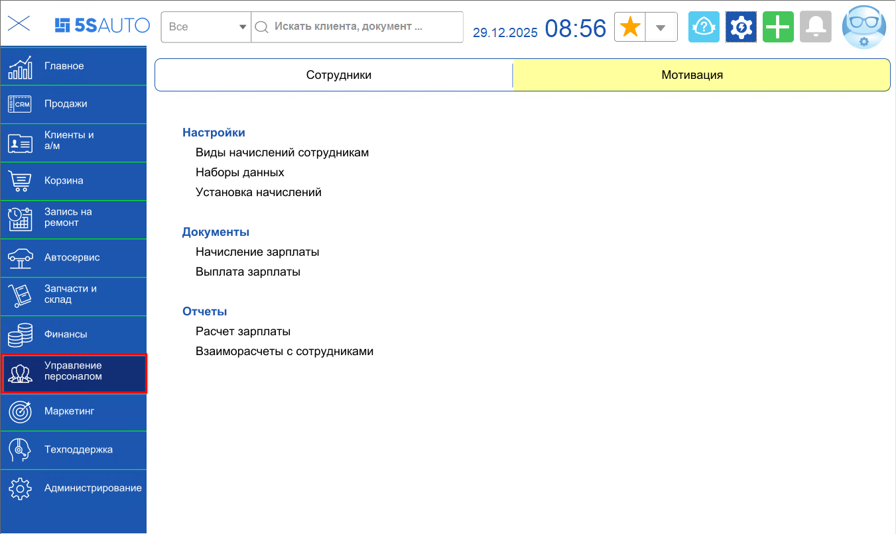

Все инструменты по работе и настройке системы мотивации 5S AUTO собраны в этом блоке.

### Установка начислений

Способы открытия обработки:

1. Обработку можно вызвать отдельно: 
   Путь из меню интерфейса: Управление персоналом → Мотивация → Настройки → Установка начислений  
   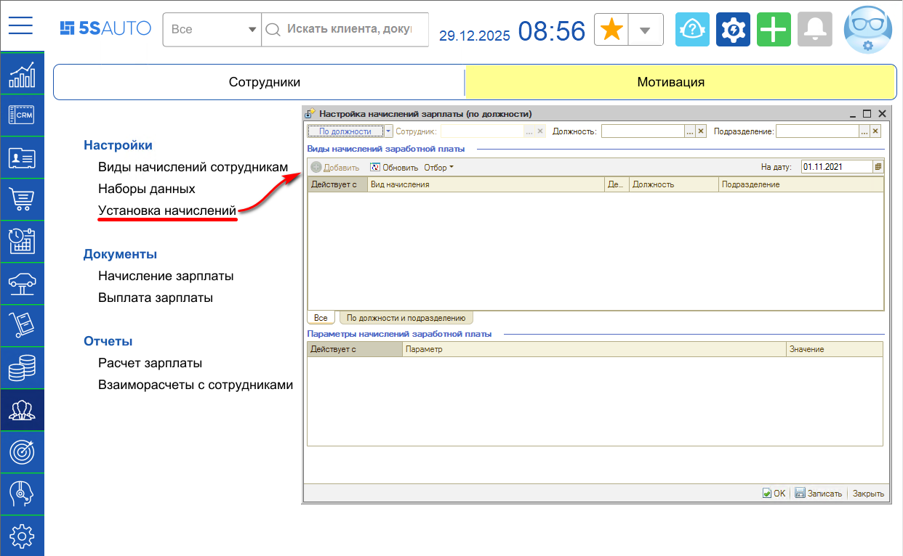В открывшемся окне нужно выбрать подразделение и должность.
2. Можно вызвать обработку из справочника “Сотрудники”. 
   Путь из меню интерфейса: Управление персоналом → Сотрудники → Справочники → Сотрудники  
   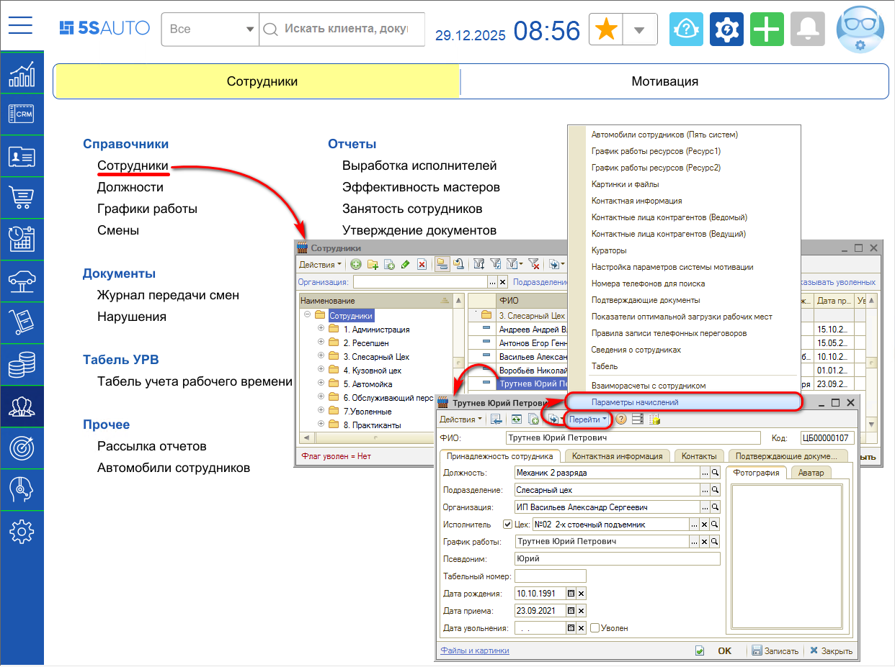

В справочнике требуется выбрать подразделение и сотрудника. По кнопке *“Перейти → Параметры начислений”* открывается окно “Настройка начислений зарплаты (по сотруднику)”:

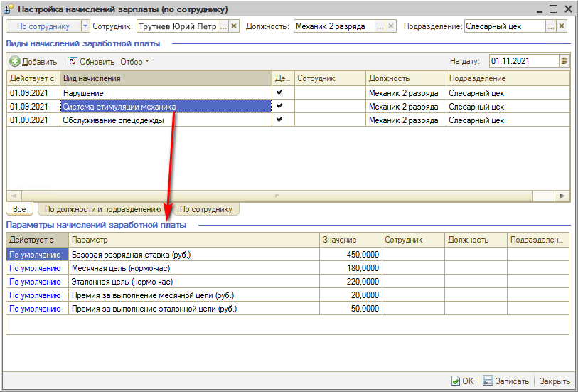

Отображаются виды начислений з/п: основное – система стимуляции, нарушение и т.д. Могут быть установлены цели и премии за их достижение.

Виды начислений можно назначить как на конкретного сотрудника, так и на должность и подразделение (например, всем механикам 3 разряда).

### Документ “Начисление зарплаты”

Документ **“Начисление зарплаты”** предназначен для подсчета и суммирования всех начислений по сотруднику за период. Формирует задолженность компании перед сотрудником на сумму его начислений.

Переход в реестр документов: Управление персоналом → Мотивация → Документы → Начисление зарплаты

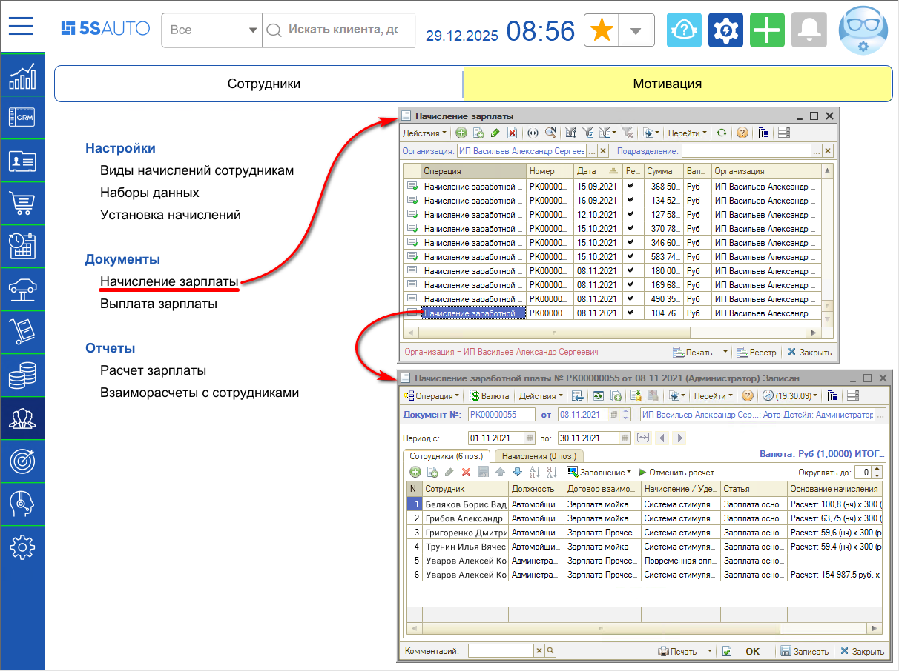

Ниже представлены начисления, которые рассчитываются в документе “Начисление заработной платы”.

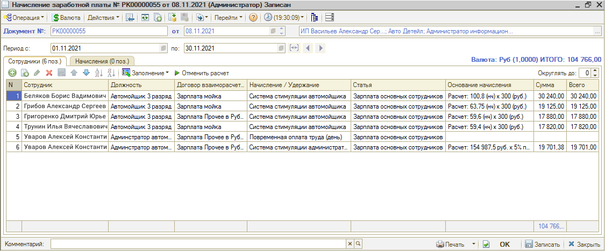

Возможно использование стандартных начислений Альфа-Авто либо начислений 5S AUTO.

В виде начисления можно выбрать тип данных: Виды начислений сотрудникам (справочник 5S AUTO) или Начисления и удержания (справочник Раруса).

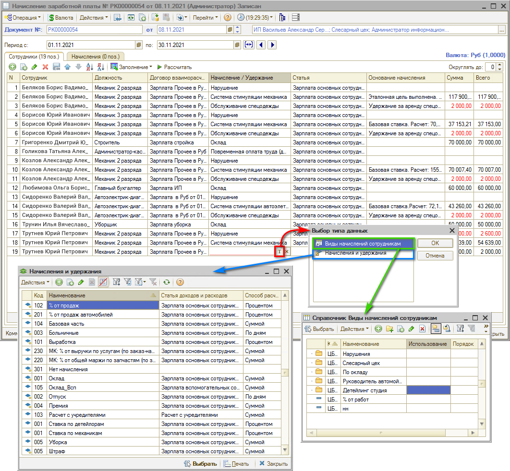

#### Вкладка “Сотрудники”

Чтобы заполнить документ начислениями за текущий период, требуется нажать кнопку “Рассчитать”.

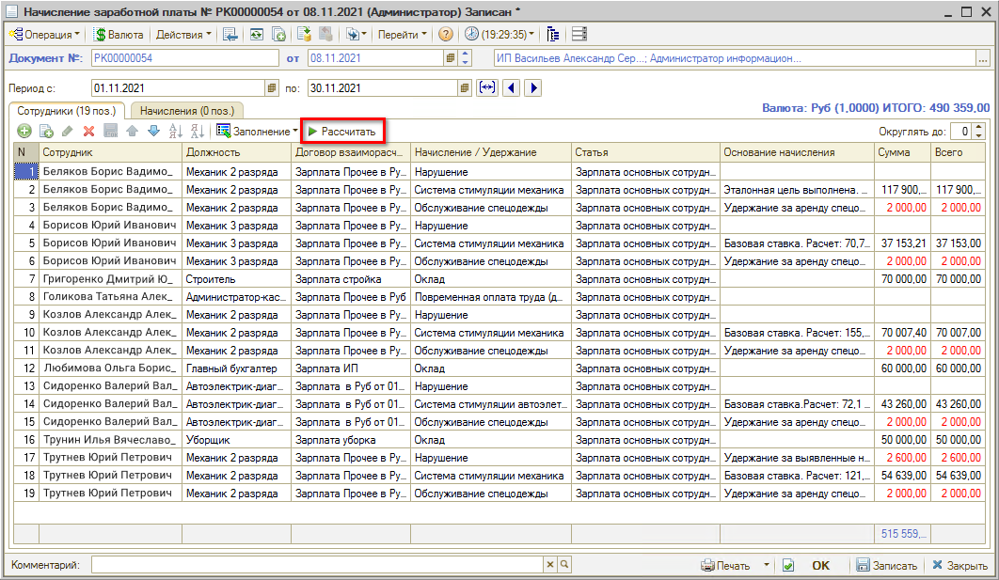

Производится заполнение всеми сотрудниками со всеми видами начисления, система делает расчет по каждому начислению за указанный период.

В столбце “Основание начисления” указывается, на основании чего система рассчитала начисление.

Красным в сумме указываются удержания.

#### Вкладка “Начисления”

На вкладке “Начисления” указаны документы начисления.

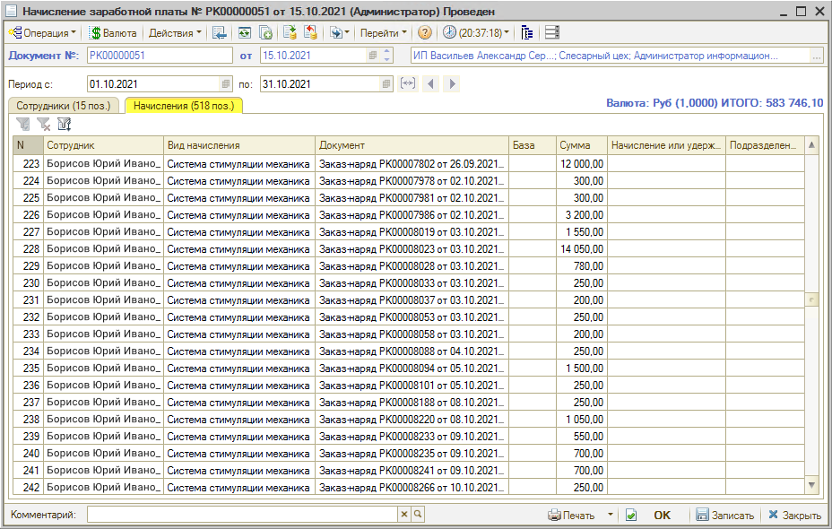

В каждом конкретном Заказ-наряде можно нажать кнопку “Перейти” и выбрать “Начисления заработной платы”.

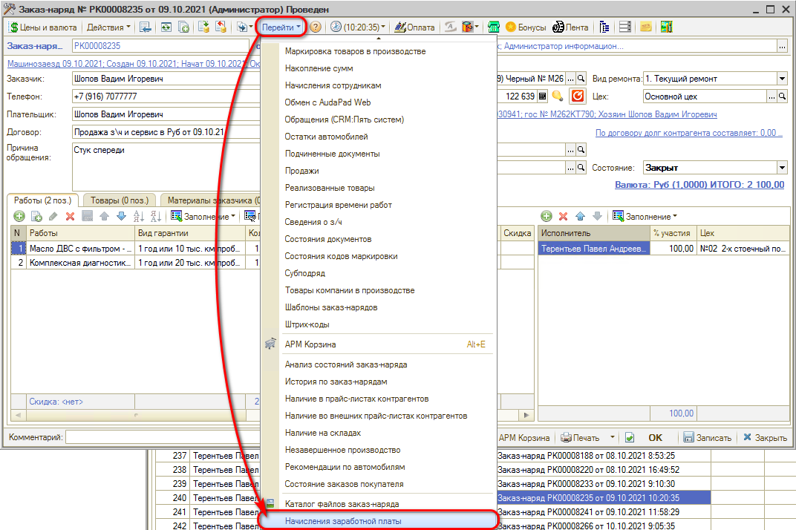

Таким образом можно увидеть, кому из сотрудников были сделаны начисления по конкретному документу.

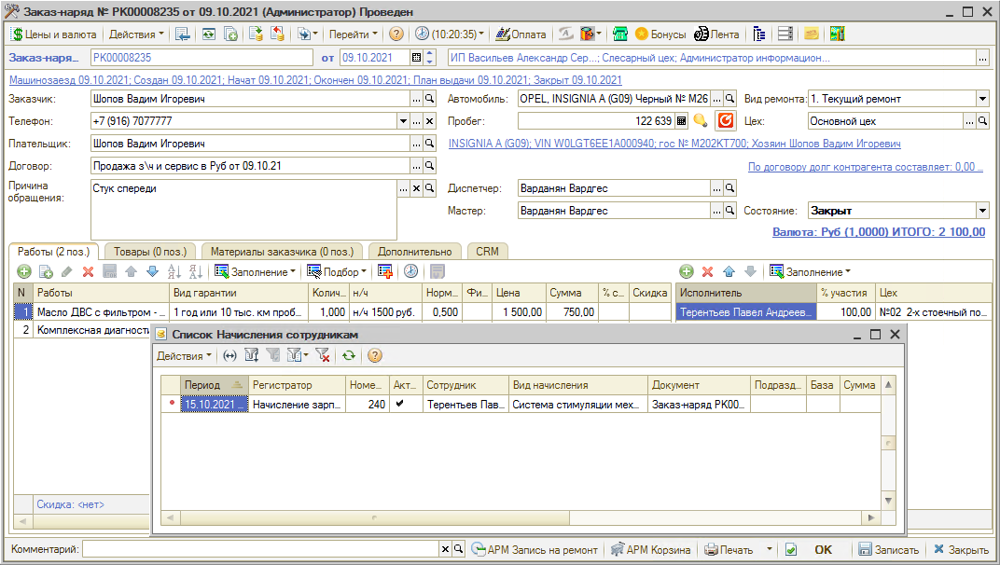

### Документ “Выплата зарплаты”

Документ **"Выплата заработной платы"** предназначен для учета выплаты денежных средств из операционной кассы компании.

После проведения документа “Начисление зарплаты” в программе формируется долг компании перед сотрудником по его зарплатному договору. Документ “Выплата заработной платы”, введенный на основании документа “Начисление зарплаты”, снимает этот долг с компании.

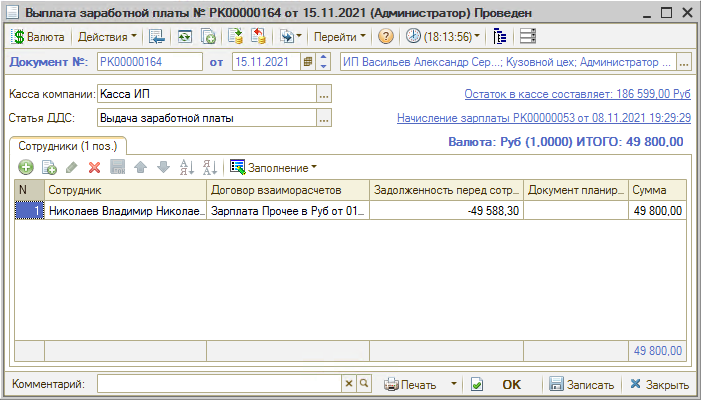

В случае создания документа "Выплата заработной платы" на основании документа "Начисление зарплаты" данные подтянутся и документ заполнится значениями автоматически.

При создании же нового документа "Выплата заработной платы" его нужно заполнить сотрудниками нажатием на кнопку "Заполнение" → "Заполнить по текущей задолженности".

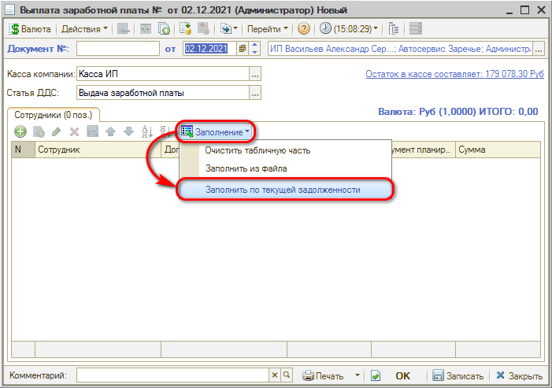

Печатные формы документа "Выплата зарплаты":

- *Выплата зарплаты* – простая печатная форма, содержит список сотрудников и информацию о выплате.
- *Платежная ведомость* – унифицированная печатная форма №Т-53, утвержденная постановлением Госкомстата России.

### Отчет “Расчет зарплаты”

Путь: *Управление персоналом → Мотивация → Отчеты → Расчет зарплаты*

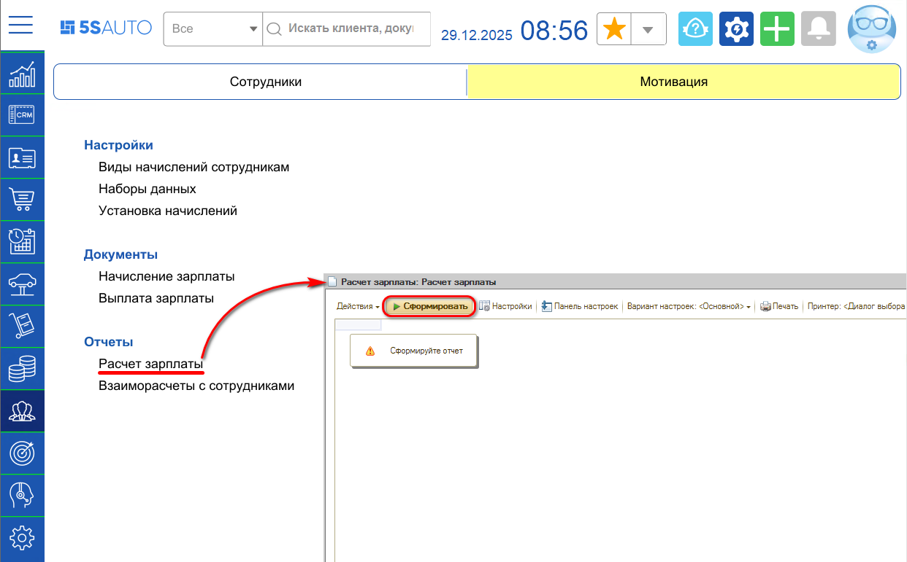

Требуется установить нужный период и нажать кнопку “Сформировать”.

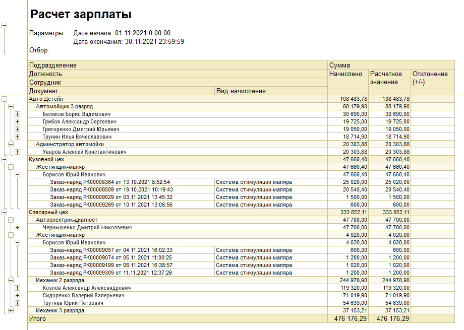

Отчет показывает “Расчетное значение” и “Начислено” в разрезе подразделений, сотрудников и документов.

Начислено – это сумма по документу “Начислено” (то, что уже ушло в долг компании перед сотрудником за месяц).

Расчетное значение – актуальное количество начислений и удержаний за выбранный период в отчете на момент его формирования.

Отклонение – это разность между “Расчетное значение” и “Начислено”. Если всё начислено корректно, этот столбец будет пустым. Если есть отклонение, значит после формирования документа “Начислено” были какие-то изменения в документах, которые попали в “Расчетное значение”: можно найти по какому конкретно документу расхождение и установить причину.

До момента начисления зарплаты отчет позволяет увидеть, сколько начислено по заданным формулам.

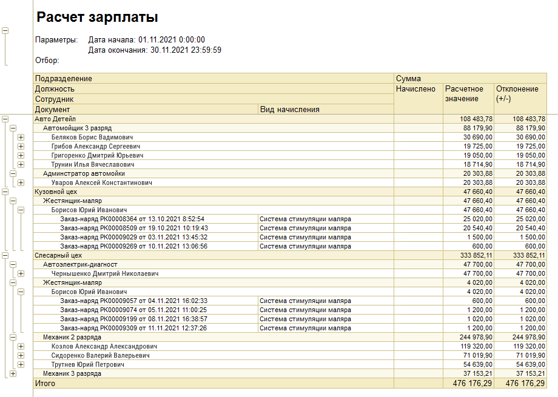

Можно показать сотруднику, сколько денег он получит за этот месяц. В разрезе документов видно, сколько начислено по документу, например, по конкретному заказ-наряду.

---

**Теги:** работа с персоналом, сотрудники, мотивация, начисление зарплаты, выплата зарплаты
