

# Табель учета рабочего времени

<table><tr><td><b>Время чтения:</b> 23 мин.</td><td><b>Обновлено:</b> 24.06.2022</td></tr></table>

Источник: https://www.5systems.ru/help/tabel-ucheta-rabochego-vremeni

## Содержание

1. [Введение](#введение)
2. [Как перейти](#как-перейти)
3. [Основные элементы табеля](#основные-элементы-табеля)
   - [Отбор и сортировка](#отбор-и-сортировка)
   - [Скрыть / Показать сотрудника](#скрыть--показать-сотрудника)
4. [Планирование рабочего времени](#планирование-рабочего-времени)
   - [Автоматическое заполнение табеля](#автоматическое-заполнение-табеля)
   - [Заполнение табеля и синхронизация с графиком работы](#заполнение-табеля-и-синхронизация-с-графиком-работы)
   - [Добавление сотрудника из другого подразделения](#добавление-сотрудника-из-другого-подразделения)
   - [Печать планового графика](#печать-планового-графика)
5. [Заполнение фактического рабочего времени](#заполнение-фактического-рабочего-времени)
   - [Заполнение вручную](#заполнение-вручную)
   - [Заполнение из BioTime](#заполнение-из-biotime)
6. [Права для редактирования табеля](#права-для-редактирования-табеля)

## Введение

***Табель учета рабочего времени*** позволяет руководителю:

1. Планировать рабочее время сотрудников.
2. Отслеживать фактически отработанное сотрудниками время.

## Как перейти

*Управление персоналом → Сотрудники → Табель УРВ → Табель учета рабочего времени* или из типового меню *CRM → Учет рабочего времени → Табель учета рабочего времени:*

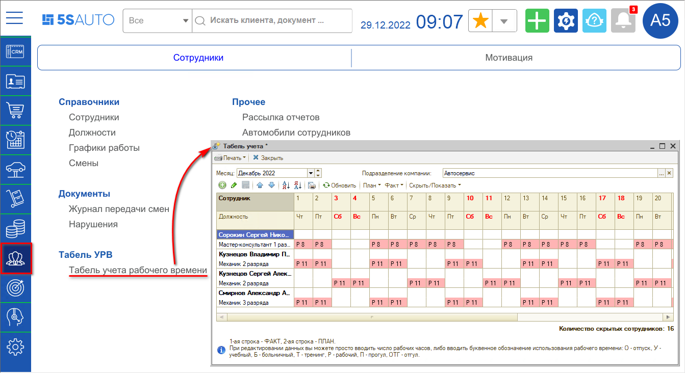

## Основные элементы табеля

### Отбор и сортировка

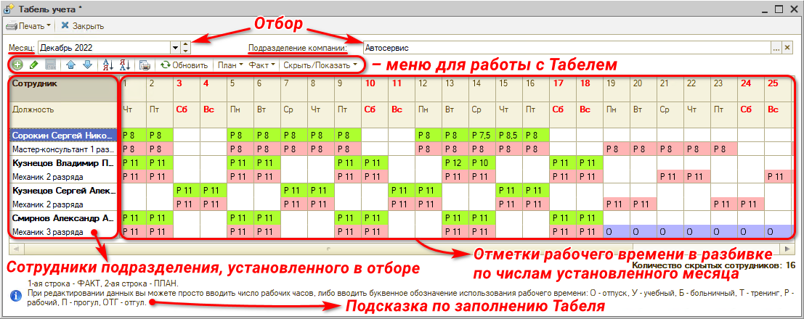

В табеле выводятся все активные сотрудники подразделения, выбранного в соответствующем параметре Отбора. По умолчанию стоит сортировка по должности по возрастанию. Можно изменить порядок сортировки по должностям или отсортировать по сотрудникам. Для сортировки по сотрудникам нужно установить курсор на колонку с сотрудником и выбрать нужный порядок сортировки в Меню табеля:

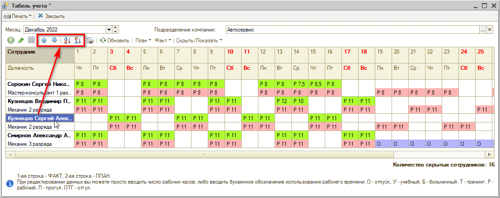

Помимо всех активных сотрудников подразделения в табеле могут отображаться уволенные сотрудники и сотрудники других подразделений, если по ним есть записи по рабочему времени.

### Скрыть / Показать сотрудника

По умолчанию в Табеле отображаются все сотрудники по выбранному подразделению. При необходимости можно скрыть отдельных сотрудников (например, руководство), если нет необходимости отслеживать время их работы. Для этого требуется кликнуть Ф.И.О. сотрудника, нажать кнопку «Скрыть/Показать» и «Скрыть сотрудника».

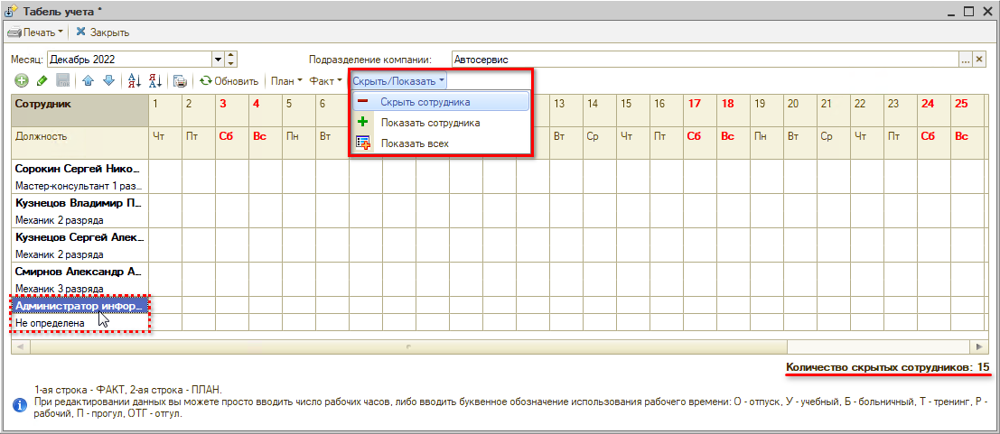

Количество скрытых сотрудников отображается под таблицей.

Если нужно будет снова вывести сотрудника в Табель: нажать кнопку «Скрыть/Показать» и в открывшемся окне выбрать сотрудника из списка скрытых (или «Показать всех»).

## Планирование рабочего времени

### Автоматическое заполнение табеля

Чтобы автоматически заполнить плановое рабочее время сотрудника в Табеле до конца месяца:

- выделите ячейку во второй строке на дату, с которой нужно заполнить плановое рабочее время по сотруднику;
- кликните на меню ***«Заполнить»*** и выберите один из доступных шаблонов графиков:  
  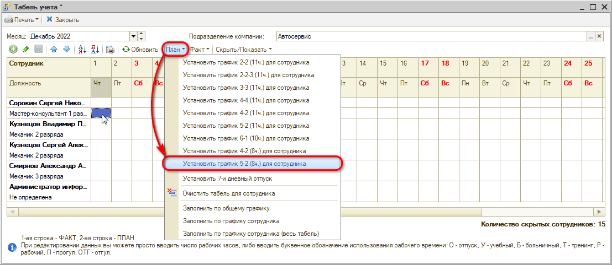
- подтвердите заполнение до конца месяца.  
  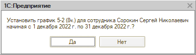  
  ***Примечание**: период, на который программа предложит заполнить табель (до конца недели/месяца/года), зависит от того, какая периодичность установлена в [графике работы сотрудника](../../Запись%20на%20ремонт/Начальные%20настройки%20для%20работы%20в%20АРМ%20Запись%20на%20ремонт/nachalnye-nastroyki-dlya-raboty-v-arm-zapis-na-remont.md). Рекомендуется указывать произвольную периодичность (в данном случае Табель будет заполняться на месяц).* 
  *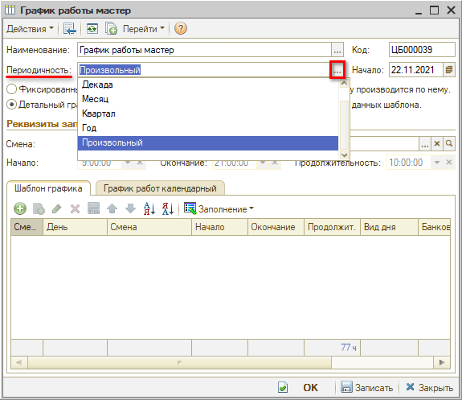*

В результате по сотруднику заполнится плановое рабочее время (нижняя строка).

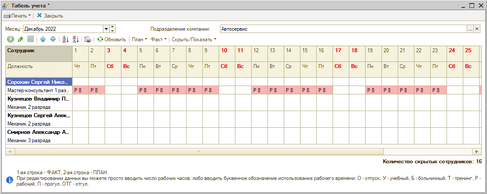

При условии, если у сотрудника заполнен календарный график работы, можно заполнить его табель по кнопке ***«Заполнить по графику сотрудника»***. Нажатие на кнопку ***«Заполнить по графику сотрудника (весь табель)»*** заполнит табель для всех сотрудников по их графикам.

При планировании отпусков, учебных мероприятий или рабочих часов в рамках месяца, плановое рабочее время добавляется/изменяется вручную. Для этого необходимо в ячейку второй строки ввести количество рабочих часов или буквенное обозначение:

- **О** - отпуск,
- **У** - учебный,
- **Б** - больничный,
- **Т** - тренинг,
- **ОТГ** - отгул.

Можно ***установить 7-дневный отпуск***, нажав соответствующую кнопку в меню «Заполнить».

Для уволенных сотрудников рекомендуется очищать рабочее время, чтобы он не отображался больше в табеле. Для этого:

- установите курсор на вторую строку с рабочим временем и на дату, с которой нужно очистить рабочее время по сотруднику,
- кликните на меню «Заполнить» и далее ***«Очистить график для сотрудника»***.

Функцией очистки еще можно воспользоваться, если необходимо изменить график для сотрудника.

### Заполнение табеля и синхронизация с графиком работы

При заполнении табеля вручную автоматически заполняется индивидуальный детальный график сотрудника. Это происходит при условии, что включены соответствующие [права](#права-для-редактирования-табеля) и у сотрудника в Карточке сотрудника привязан индивидуальный график, в котором установлена опция "Детальный график":

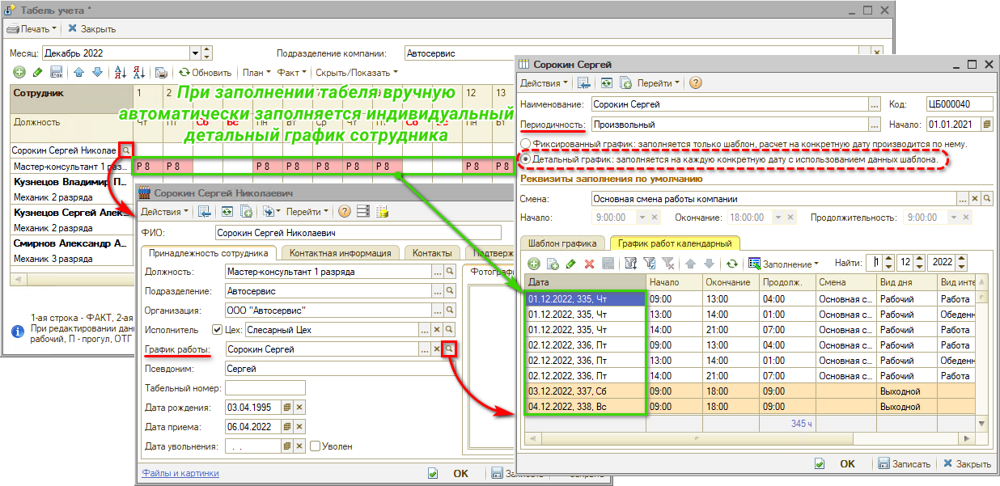

Данная возможность упрощает ведение индивидуальных графиков сотрудников и позволяет правильно планировать работы по исполнителям через [АРМ "Запись на ремонт"](https://5systems.ru/help/rabota-v-arm-zapis-na-remont).

### Добавление сотрудника из другого подразделения

В Табель можно внести сотрудника любого другого подразделения: для этого добавьте его вручную через Меню табеля:

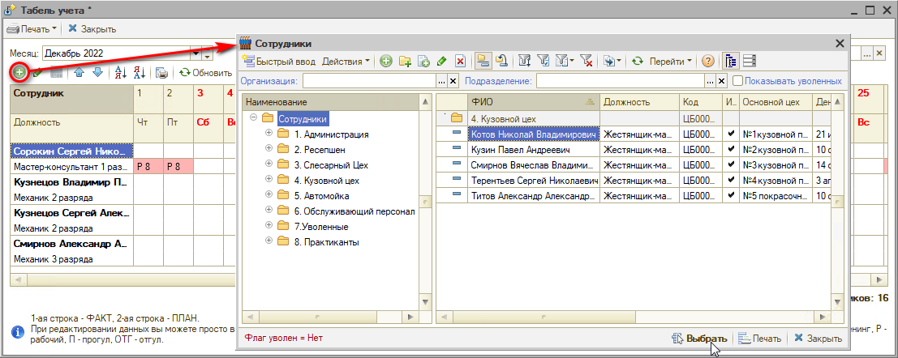

После чего запланируйте для него рабочее время.

В результате данный сотрудник всегда будет отображаться в табеле учета текущего подразделения.

### Печать планового графика

Чтобы распечатать плановый график, перейдите в меню "Печать", далее "Плановый график":

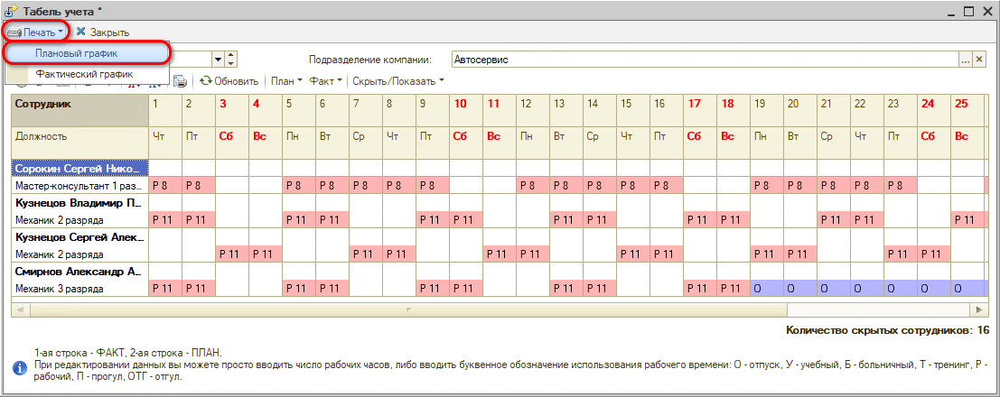

В появившемся окне параметров печати:

1. при необходимости измените период и состав/порядок должностей, который будет применен для печати,
2. нажмите кнопку "Печать":  
   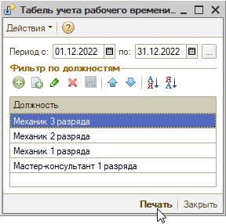

В результате отобразится печатная форма плана-графика:

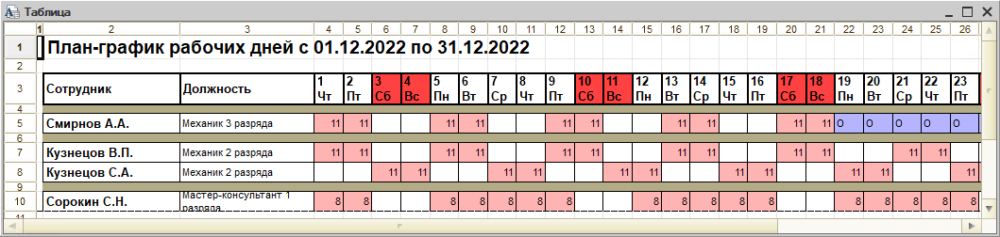

## Заполнение фактического рабочего времени

### Заполнение вручную

Фактическое время проставляется руководителем подразделения вручную. Для заполнения введите в первую строку фактически отработанное количество часов или одно из буквенных обозначений:

- **Б** - больничный,
- **О** - отпуск,
- **П** - прогул,
- **У** - учебный,
- **Т** - тренинг.

При необходимости можно распечатать фактический график рабочего времени:

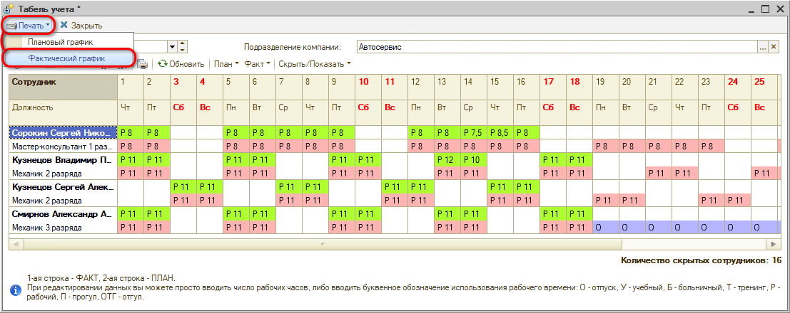

### Заполнение из BioTime

Фактическое время в табеле рабочего времени можно автоматически заполнить данными из системы BioTime при наличии настроенной [*интеграции*](../../Интеграция%20с%20внешними%20сервисами/Интеграция%20с%20BioTime/integraciya-s-biotime.md).

#### Выбор периода

Для загрузки данных *за месяц* следует нажать кнопку *"Факт → BioTime → Загрузить данные за месяц → По всем/По текущей строке”:*

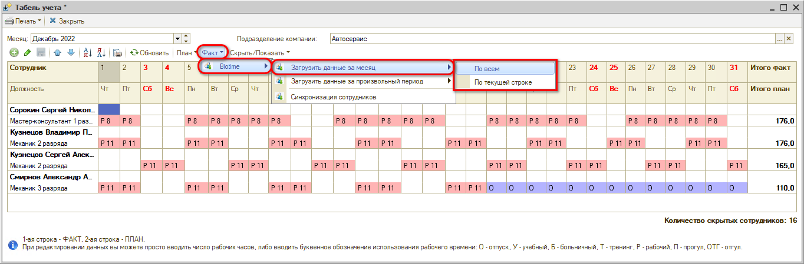

Далее, если в программе создана не одна интеграция с BioTime, следует выбрать нужную интеграцию:

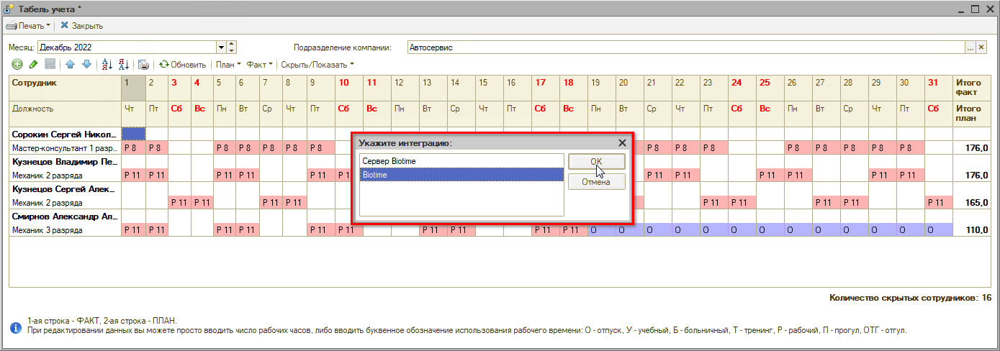

Для загрузки данных *за произвольный период* нужно нажать кнопку "Факт → BioTime → Загрузить данные за произвольный период → По всем/По текущей строке”:

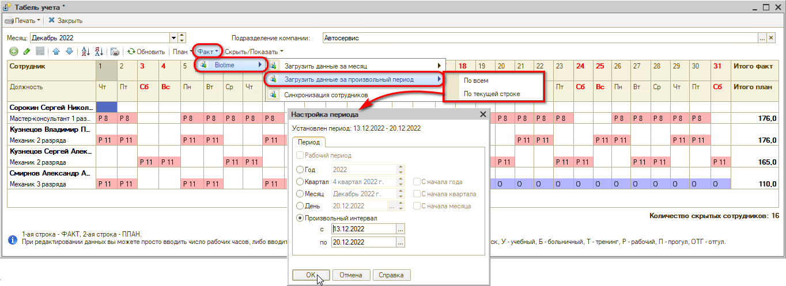

В открывшемся окне “Настройка периода” следует выбрать период или установить произвольный интервал – и нажать “ОК”.

#### Отображение данных из BioTime

В результате загрузки первая строка табеля – фактическое время – по каждому / по выбранному сотруднику заполнится значениями из BioTime. Загружаемые из BioTime данные отображаются бирюзовым цветом:

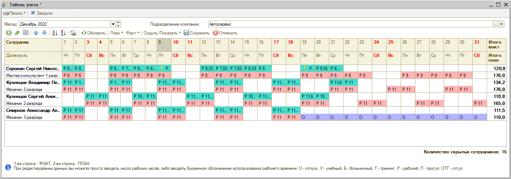

*Знак “!”* рядом с фактическим временем из BioTime в ячейке может означать два типа предупреждений:

1. Сотрудник опоздал;
2. Сотрудник не отметил уход: при этом устанавливается рабочее время по графику и отображается предупреждение.

Если кликнуть на ячейку со знаком “!” – отобразится причина предупреждения:

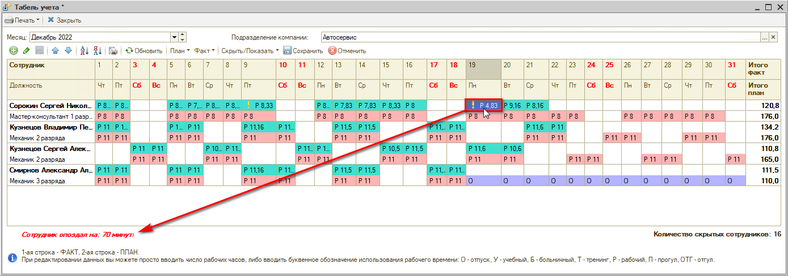

Чтобы посмотреть подробную информацию по каждому сотруднику за день, следует *правой кнопкой мыши* вызвать выпадающее меню и нажать кнопку *“Показать подробнее”:*

*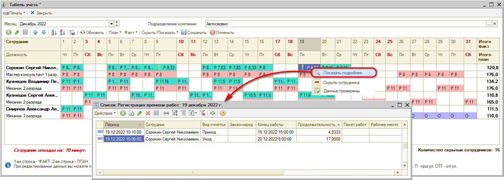*

После проверки данных можно их скорректировать и нажать кнопку *“Данные проверены”* – при этом знак “!” исчезнет:

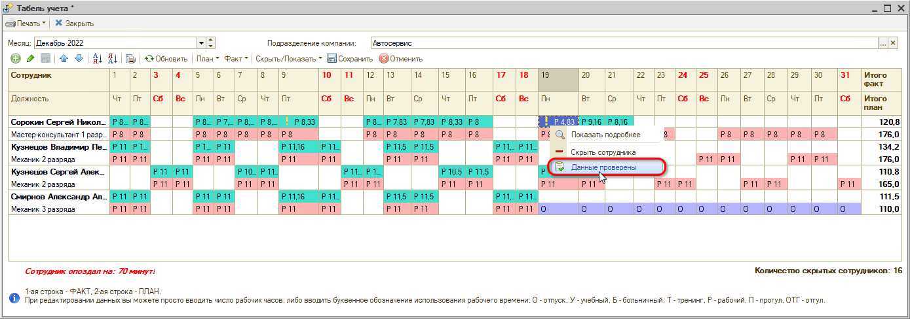

Заполнение фактического времени по данным BioTime в табеле следует сохранить нажатием на кнопку “Сохранить”:

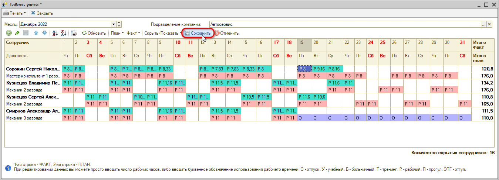

Отменить заполнение данных из BioTime можно нажатием на кнопку “Отменить”:

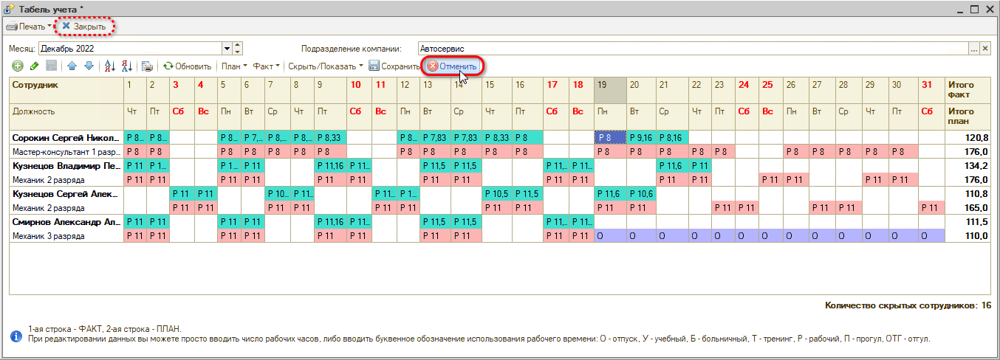

Либо просто выйти без сохранения – при этом фактическое время из BioTime в табеле не сохранится.

## Права для редактирования табеля

*Подробнее о работе с правами и настройками см. статью [Установка прав и настроек](https://5systems.ru/help/ustanovka-prav-i-nastroek-polzovatelya).*

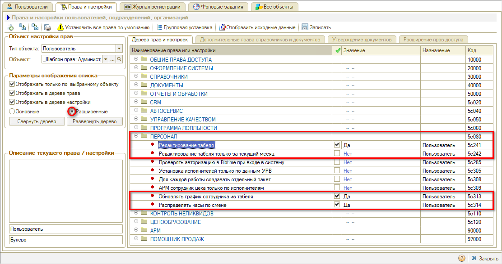

***Права для редактирования табеля*:**

| **Название** | **Описание** |
| --- | --- |
| ***Редактирование табеля*** | Устанавливается для пользователей, которые имеют право редактировать табель за любой период |
| ***Редактирование табеля только за текущий месяц*** | Устанавливается для пользователей, которые имеют право редактировать табель только за текущий месяц |
| ***Обновлять график сотрудника из табеля*** | При правке плана в табеле 5 систем будет редактироваться стандартный детальный график |
| ***Распределять часы по смене*** | Работает при включенном праве "Обновлять график сотрудника из табеля", в случае включения текущего права график будет заполняться из смены, не принимая во внимание что ввел пользователь в табель |

---

**Теги:** работа с персоналом, сотрудники, табель, рабочее время, график работы

