

# Обучающие видеоролики

<table><tr><td><b>Время чтения:</b> 10 мин.</td><td><b>Обновлено:</b> 17.09.2024</td></tr></table>

Источник: https://www.5systems.ru/help/obuchayuschie-videoroliki

## Содержание

1. [Работа в Корзине](#работа-в-корзине)
2. [Работа с онлайн-каталогом](#работа-с-онлайн-каталогом)
3. [Работа с Поиском цен](#работа-с-поиском-цен)
4. [Запись на ремонт](#запись-на-ремонт)
5. [Работа с Заказ-нарядами](#работа-с-заказ-нарядами)
6. [АРМ Клиенты и автомобили](#арм-клиенты-и-автомобили)

## Работа в Корзине

1. [Назначение и интерфейс АРМ "Корзина"](../../Проценка%20запчастей%20и%20работ/Назначение%20и%20интерфейс%20АРМ%20Корзина/naznachenie-i-interfeys-arm-korzina.md):

2. [Как подбирать запасные части в АРМ Корзина](../../Проценка%20запчастей%20и%20работ/Как%20подбирать%20запасные%20части%20в%20АРМ%20Корзина/kak-podbirat-zapasnye-chasti-v-arm-korzina.md):

   

3. [Как добавить варианты поставки в Корзину](../../Проценка%20запчастей%20и%20работ/Как%20добавить%20варианты%20поставки%20в%20Корзину/kak-dobavit-varianty-postavki-v-korzinu.md):

   

4. [Информационные вкладки Корзины](../../Проценка%20запчастей%20и%20работ/Информационные%20вкладки%20Корзины/informacionnye-vkladki-korziny.md):

   

5. [Как подбирать автоработы в АРМ Корзина](../../Проценка%20запчастей%20и%20работ/Как%20подбирать%20автоработы%20в%20АРМ%20Корзина/kak-podbirat-avtoraboty-v-arm-korzina.md):

   

>

6. [Как создать автомобиль в Корзине](../../Проценка%20запчастей%20и%20работ/Как%20создать%20автомобиль%20в%20Корзине/kak-sozdat-avtomobil-v-korzine.md):

   

7. [Как распечатать Корзину или отправить в мессенджер](../../Проценка%20запчастей%20и%20работ/Как%20распечатать%20Корзину%20или%20отправить%20в%20мессенджер/kak-raspechatat-korzinu-ili-otpravit-v-messendzher.md):

   

8. [Как выгрузить Корзину в другие АРМ](../../Проценка%20запчастей%20и%20работ/Как%20выгрузить%20Корзину%20в%20другие%20АРМ/kak-vygruzit-korzinu-v-drugie-arm.md):

   

9. [Как создать документы на основании Корзины](../../Проценка%20запчастей%20и%20работ/Как%20создать%20документы%20на%20основании%20Корзины/kak-sozdat-dokumenty-na-osnovanii-korziny.md):

   

10. [Помощник оформления заказа покупателя в АРМ Корзина:](../../Проценка%20запчастей%20и%20работ/Помощник%20оформления%20Заказа%20покупателя%20в%20АРМ%20Корзина/pomoschnik-oformleniya-zakaza-pokupatelya-v-arm-korzina.md)

    

11. [Добавление детали в применяемость](https://youtu.be/ST5MvO1xW5Y):

    [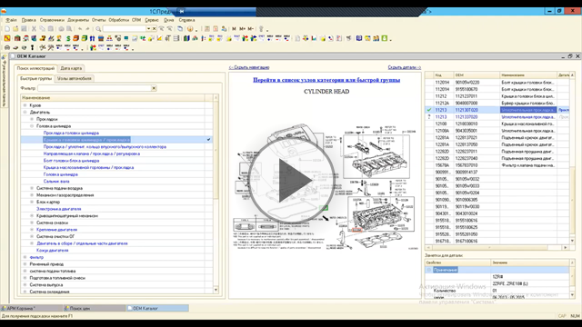](https://edu.5systems.ru/video/archive/5S_AUTO_Rabota_v_Korzine_Dobavlenie_detali_v_primenyaemost.mp4)

## Работа с онлайн-каталогом

1. [Обзор интерфейса Онлайн-каталога](../../Проценка%20запчастей%20и%20работ/Обзор%20интерфейса%20Онлайн-каталога/obzor-interfeysa-onlayn-kataloga.md):

   

2. [Как перейти в Онлайн-каталог:](../../Проценка%20запчастей%20и%20работ/Как%20перейти%20в%20Онлайн-каталог/kak-pereyti-v-onlayn-katalog.md)

   

3. [Как идентифицировать автомобиль в Онлайн-каталоге](../../Проценка%20запчастей%20и%20работ/Идентификация%20автомобиля%20в%20Онлайн-каталоге/kak-identificirovat-avtomobil-v-onlayn-kataloge.md):

   

4. [Как найти деталь в Онлайн-каталоге](../../Проценка%20запчастей%20и%20работ/Как%20найти%20деталь%20в%20Онлайн-каталоге/kak-nayti-detal-v-onlayn-kataloge.md):

   

5. [Действия с подобранными деталями в Онлайн-каталоге:](../../Проценка%20запчастей%20и%20работ/Действия%20с%20подобранными%20деталями%20в%20Онлайн-каталоге/deystviya-s-podobrannymi-detalyami-v-onlayn-kataloge.md)

   

## Работа с Поиском цен

1. [Назначение и интерфейс Поиска цен](../../Проценка%20запчастей%20и%20работ/Назначение%20и%20интерфейс%20Поиска%20цен/naznachenie-i-interfeys-poiska-cen.md):

   

2. [Что отображается в предложениях поставщиков](../../Проценка%20запчастей%20и%20работ/Что%20отображается%20в%20предложениях%20поставщиков/chto-otobrazhaetsya-v-predlozheniyakh-postavschikov.md):

   

3. [Как перейти в Поиск цен](../../Проценка%20запчастей%20и%20работ/Как%20перейти%20в%20Поиск%20цен/kak-pereyti-v-poisk-cen.md):

   

4. [Как проценить деталь по артикулу](../../Проценка%20запчастей%20и%20работ/Как%20проценить%20деталь%20по%20артикулу/kak-procenit-detal-po-artikulu.md):

   

5. [Как работает фильтрация и сортировка в Поиске цен](../../Проценка%20запчастей%20и%20работ/Как%20работает%20фильтрация%20и%20сортировка%20в%20Поиске%20цен/kak-rabotaet-filtraciya-i-sortirovka-v-poiske-cen.md):

   

6. [Как работать с аналогами в Поиске цен](../../Проценка%20запчастей%20и%20работ/Как%20работать%20с%20аналогами%20в%20Поиске%20цен/kak-rabotat-s-analogami-v-poiske-cen.md):

   

7. [Как изменить параметры Поиска цен](../../Проценка%20запчастей%20и%20работ/Как%20изменить%20параметры%20Поиска%20цен/kak-izmenit-parametry-poiska-cen.md):

   

## Запись на ремонт

1. [Назначение и интерфейс АРМ Запись на ремонт](../../Запись%20на%20ремонт/Назначение%20и%20интерфейс%20АРМ%20Запись%20на%20ремонт/naznachenie-i-interfeys-arm-zapis-na-remont.md):

   [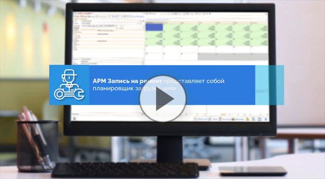](https://edu.5systems.ru/video/Zapis_na_remont/Zapis_na_remont-1_Naznachenie_i_interfeys.mp4)

2. [Как записать клиента из Корзины](../../Запись%20на%20ремонт/Как%20записать%20клиента%20из%20Корзины/kak-zapisat-klienta-iz-korziny.md):

   [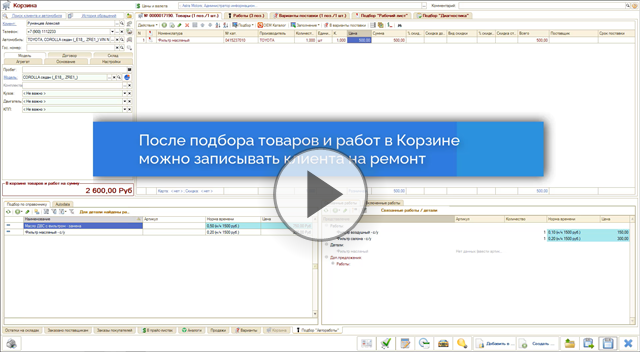](https://edu.5systems.ru/video/Zapis_na_remont/Zapis_na_remont-2_Zapis_iz_Korziny.mp4)

3. [Как записать клиента из Заказ наряда](../../Запись%20на%20ремонт/Как%20записать%20клиента%20из%20Заказ%20наряда/kak-zapisat-klienta-iz-zakaz-naryada.md):

   [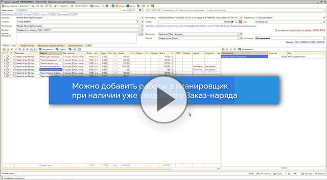](https://edu.5systems.ru/video/Zapis_na_remont/Zapis_na_remont-3_Zapis_iz_Zakaz-naryada.mp4)

4. [Как подобрать автоработы из АРМ Запись на ремонт](../../Запись%20на%20ремонт/Как%20подобрать%20автоработы%20из%20АРМ%20Запись%20на%20ремонт/kak-podobrat-avtoraboty-iz-arm-zapis-na-remont.md):

   [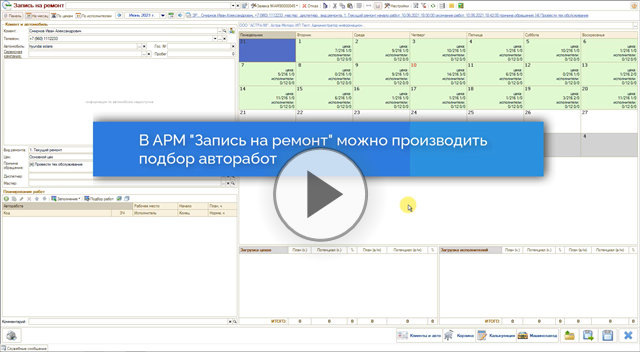](https://edu.5systems.ru/video/Zapis_na_remont/Zapis_na_remont-4_Podbor_rabot_iz_Zapisi_na_remont.mp4)

5. [Как редактировать запись на ремонт](../../Запись%20на%20ремонт/Как%20редактировать%20запись%20на%20ремонт/kak-redaktirovat-zapis-na-remont.md):

   [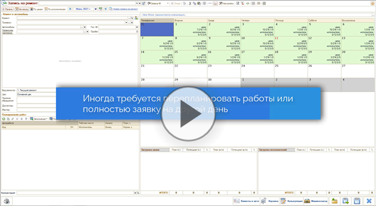](https://edu.5systems.ru/video/Zapis_na_remont/Zapis_na_remont-5_Redaktirovanie_zapisi.mp4)

6. [Настройки АРМ Запись на ремонт](../../Запись%20на%20ремонт/Настройки%20АРМ%20Запись%20на%20ремонт/nastroyki-arm-zapis-na-remont.md):

   [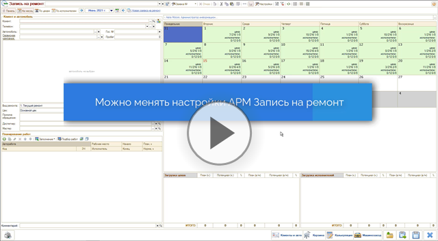](https://edu.5systems.ru/video/Zapis_na_remont/Zapis_na_remont-6_Nastroyki.mp4)

## Работа с Заказ-нарядами

1. [Обзор интерфейса Заказ-наряда](../../Автосервис/Работа%20с%20Заказ-нарядами/Обзор%20интерфейса%20Заказ-наряда/obzor-interfeysa-zakaz-naryada.md):

   

2. [Как создать Заказ-наряд](../../Автосервис/Работа%20с%20Заказ-нарядами/Как%20создать%20Заказ-наряд/kak-sozdat-zakaz-naryad.md):

   

3. [Как добавить работы в Заказ-наряд](../../Автосервис/Работа%20с%20Заказ-нарядами/Как%20добавить%20работы%20в%20Заказ-наряд/kak-dobavit-raboty-v-zakaz-naryad.md):

   [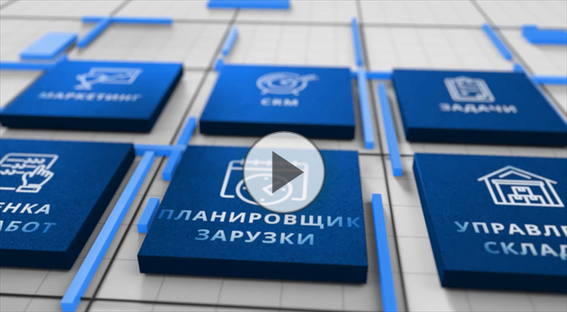](https://edu.5systems.ru/video/Zakaz-naryad/Zakaz-naryad_3-Spisok_rabot_Zakaz-naryada.mp4)

4. [Как добавить детали в Заказ-наряд](../../Автосервис/Работа%20с%20Заказ-нарядами/Как%20добавить%20детали%20в%20Заказ-наряд/kak-dobavit-detali-v-zakaz-naryad.md):

   

5. [Как принять оплату по Заказ-наряду](../../Автосервис/Работа%20с%20Заказ-нарядами/Как%20принять%20оплату%20по%20Заказ-наряду/kak-prinyat-oplatu-po-zakaz-naryadu.md):

   

6. [Как закрыть Заказ-наряд](../../Автосервис/Работа%20с%20Заказ-нарядами/Как%20закрыть%20Заказ-наряд/kak-zakryt-zakaz-naryad.md):

   

7. [Как распечатать Заказ-наряд](../../Автосервис/Работа%20с%20Заказ-нарядами/Как%20распечатать%20Заказ-наряд/kak-raspechatat-zakaz-naryad.md):

   

8. [Как работать с реестром Заказ-нарядов](../../Автосервис/Работа%20с%20Заказ-нарядами/Как%20работать%20с%20реестром%20Заказ-нарядов/kak-rabotat-s-reestrom-zakaz-naryadov.md):

   

## АРМ Клиенты и автомобили

1. [Интерфейс АРМ Клиенты и автомобили:](https://www.5systems.ru/help/interfeys-arm-klienty-i-avtomobili)

   [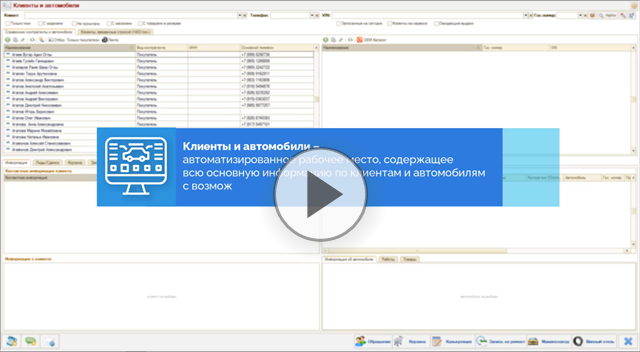](https://edu.5systems.ru/video/Klienty_i_Avtomobili/Klienty_i_Avtomobili_1-Naznachenie_i_interfeys.mp4)

2. [Как найти клиента в АРМ Клиенты и автомобили](https://www.5systems.ru/help/kak-nayti-klienta-v-arm-klienty-i-avtomobili):

   [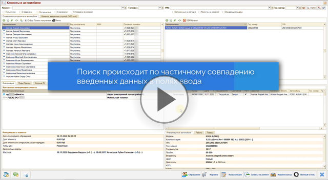](https://edu.5systems.ru/video/Klienty_i_Avtomobili/Klienty_i_Avtomobili_2-Stroki_poiska.mp4)

3. [Дополнительные критерии поиска в АРМ Клиенты и автомобили](https://www.5systems.ru/help/dopolnitelnye-kriterii-poiska-v-arm-klienty-i-avtomobili):

   [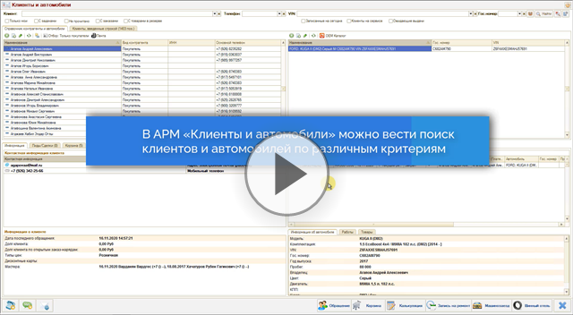](https://edu.5systems.ru/video/Klienty_i_Avtomobili/Klienty_i_Avtomobili_3-Filtry.mp4)

4. [Вкладки АРМ Клиенты и автомобили](https://www.5systems.ru/help/vkladki-arm-klienty-i-avtomobili):

   [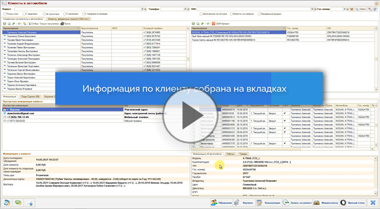](https://edu.5systems.ru/video/Klienty_i_Avtomobili/Klienty_i_Avtomobili_4-Informacionnye_zakladki.mp4)

5. [Как создать обращение в АРМ Клиенты и автомобили](https://www.5systems.ru/help/kak-sozdat-obraschenie-v-arm-klienty-i-avtomobili):

   [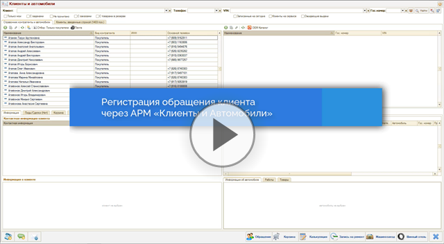](https://edu.5systems.ru/video/Klienty_i_Avtomobili/Klienty_i_Avtomobili_5-Sozdanie_obrashcheniya_vruchnuyu.mp4)

6. [Как перейти в другие АРМ из Клиенты и автомобили](https://www.5systems.ru/help/kak-pereyti-v-drugie-arm-iz-klienty-i-avtomobili):

   [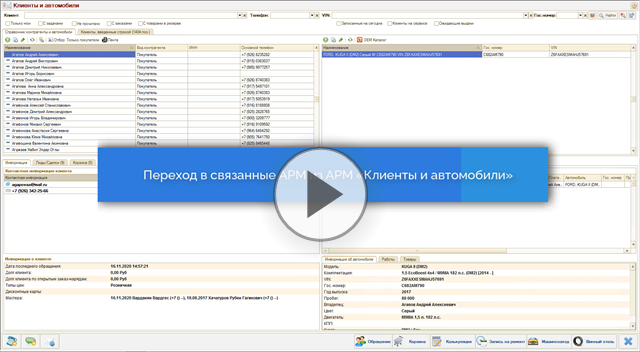](https://edu.5systems.ru/video/Klienty_i_Avtomobili/Klienty_i_Avtomobili_6-Perehod_v_drugie_ARM.mp4)

---

**Теги:** полезное, обучение, видеоролики, уроки

