

# Пользователи

<table><tr><td><b>Время чтения:</b> 30 мин.</td><td><b>Обновлено:</b> 14.06.2022</td></tr></table>

Источник: https://www.5systems.ru/help/polzovateli

## Содержание

1. [Введение](#введение)
2. [Видео](#видео)
3. [Справочник "Пользователи"](#справочник-пользователи)
4. [Создание новой учетной записи для сотрудника](#создание-новой-учетной-записи-для-сотрудника)
5. [Создание контрагента](#создание-контрагента)
6. [Дополнительные настройки](#дополнительные-настройки)

## Введение

В рамках данной статьи рассматривается, как добавлять новых ***пользователей*** и ***сотрудников*** для работы в системе 1С, создавать и настраивать ***шаблоны прав***.

## Видео

[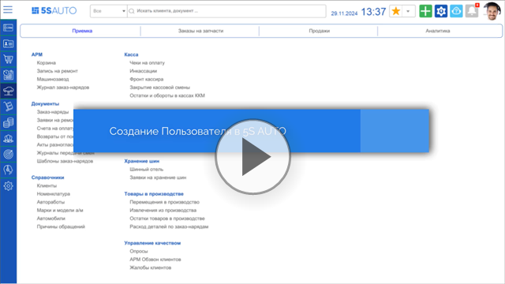](https://edu.5systems.ru/video/Polzovateli/Sozdanie_polzovatelya.mp4)

## Справочник "Пользователи"

Справочник "Пользователи" находится в меню интерфейса системы в разделе *Администрирование → Сервис → Пользователи и права → Пользователи* или в стандартном меню *Справочники → Структура компании → Пользователи:*

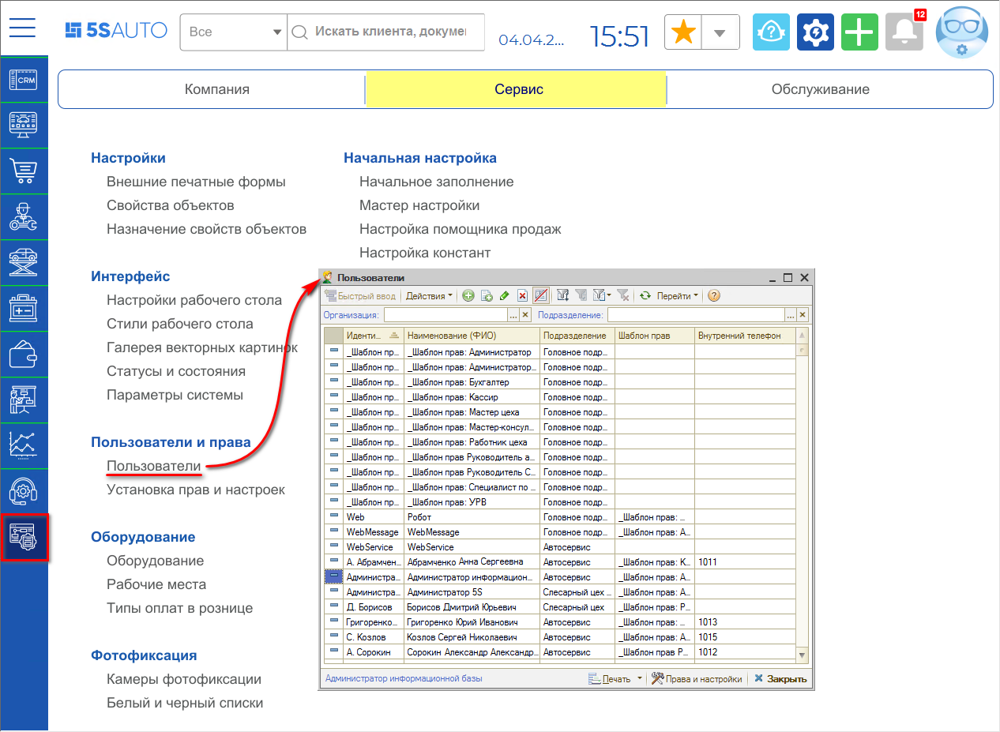

## Создание новой учетной записи для сотрудника

Основным способом ввода новых пользователей в систему является инструмент ["Мастер быстрого ввода пользователя и сотрудников"](../Мастер%20быстрого%20ввода%20пользователей%20и%20сотрудников/master-bystrogo-vvoda-polzovateley-i-sotrudnikov.md). Также новую учетную запись для сотрудника можно создать добавлением  на панели управления, либо копированием подобной учетной записи .

В строку ***"Имя (идентификатор)"*** рекомендуется сразу вводить полные фамилию, имя и отчество, чтобы сделать пользователя максимально индивидуальным. В строку *"Полное имя (ФИО)"* продублировать данные.

### Вкладка "Доступ"

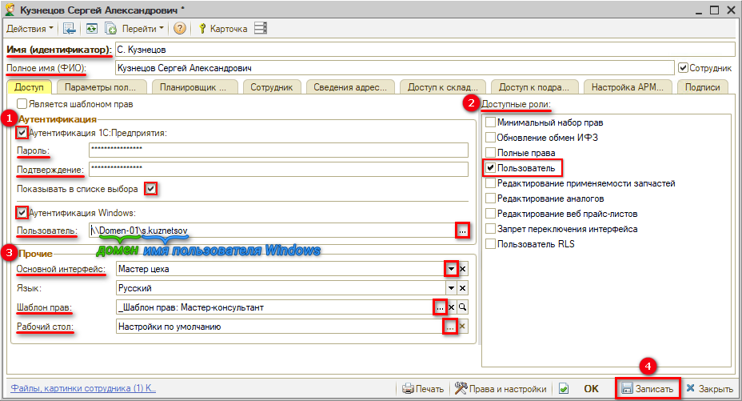

**1. Аутентификация**

В поле "Аутентификация" требуется поставить флажок ***"Аутентификация 1С:Предприятия"*** и ввести пароль пользователя и его подтверждение. 
*Примечание:* При *увольнении* сотрудника требуется обязательно *снять флажок "Аутентификация 1С:Предприятия"* и записать изменения.

Обязательно нужно поставить флажок ***"Показывать в списке выбора"***: если этого не сделать, то при входе в 1С в раскрывающемся списке данного пользователя не будет, нужно будет вводить его вручную.

Флажок ***"***А***утентификация Windows"*** отвечает за возможность авторизации с помощью имени пользователя операционной системы - нужно для автоматического входа: если пользователь зашел на сервер, то 1С уже не будет запрашивать логин и пароль, а будет автоматически подключать именно этого пользователя.

В строке ***"Пользователь"*** требуется указать адрес домена и имя пользователя, например: *\\\\Domen-01\\i.ivanov*. 
Для этого нужно нажать кнопку "Выбрать"   – откроется окно с перечнем всех зарегистрированных пользователей на этом сервере, - и выбрать нужного пользователя (адрес автоматически подгрузится). Это делается для упрощения доступа к 1С, если с данной учетной записи постоянно работает один и тот же человек.

Затем требуется обязательно выбрать *Доступные роли для пользователя*.

**2. Доступные роли**

*Роли* пользователя определяют его *права доступа* к различным модулям и документам программы. Подробнее см. в статье "[Роли пользователей](../Роли%20пользователей/roli-polzovateley.md)".

При настройке учетной записи для руководителя или системного администратора следует выбрать роль *"Полные права"*. Эта роль открывает полные права для работы с программой: и пользовательские, и администраторские, включая редактирование “Прав и настроек”, создание и редактирование пользователей, обновление конфигурации, доступ к редактированию всех справочников, документов и т.д.

Рядовым сотрудникам необходимо установить роль *"Пользователь"* – это обязательная минимальная роль для рядовых сотрудников, предоставляющая пользователю доступ ко всем основным АРМ, справочникам и документам, и исключающая права администрирования базы.

*Важно!* Роли пользователя суммируются, а не исключают друг друга. Если у пользователя выбрано две роли, по одной из которых есть доступ, например, к справочнику "Номенклатура", а по второй – нет, то доступ будет.

**3. Основной интерфейс**

Разные интерфейсы нужны для того, чтобы ограничить пользователю возможности в программе: убираются некоторые кнопки и пункты меню, доступ к определенным документам и отчетам. 
Пустой интерфейс закрывает для пользователя все меню полностью. У него будет доступ к некоторым инструментам только через главное меню. 
Полный интерфейс предоставляет доступ ко всем кнопкам и пунктам меню.

**4. Шаблон прав**

Шаблон прав выбирается нажатием кнопки "Выбрать"   – в соответствии с должностью пользователя. Подробнее про *Шаблоны прав* см. далее.

Введенные данные следует <u>*записать*</u>.

### Вкладка "Параметры пользователя"

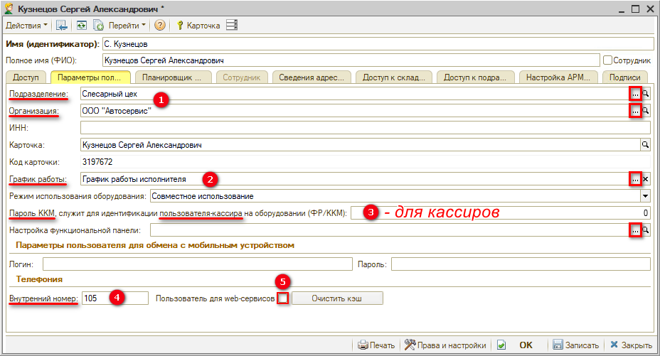

1. Требуется указать ***Подразделение*** и ***Организацию** –* например, конкретный филиал – в соответствующих строках.
2. Можно установить ***график работы***, если графики сотрудников учитываются в АРМ Запись на ремонт (в случае ведения записи на механиков либо на мастеров-приемщиков). Тогда нужно создать на сотрудника его собственный график и привязать к нему. Они отображаются в *Записи на ремонт* соответственно тому, как работают. Если это не имеет значения – можно выбрать стандартный "график работы компании" или не выбирать ничего.
3. Для кассиров нужно указать ***пароль ККМ*** – этот идентификатор также настраивается в драйвере устройства и в справочнике "Оборудование". Этот пароль должен быть индивидуален для каждого кассира, чтобы в чеке пробивался именно этот сотрудник.

*Поле "Телефония":*

4. Еще один важный реквизит во вкладке "Параметры пользователя" - это ***Внутренний номер***. Он заполняется только в том случае, если данный сотрудник (либо он и его сменщик) всегда работает с этим номером. Если трубки между сотрудниками постоянно передаются – внутренний номер указывать не нужно.
5. ***"Пользователь для web-сервисов":*** для обычного пользователя данный флажок устанавливать ***не нужно*** – он устанавливается при создании пользователя web-сервисов (робота).

На этом этапе *пользователь уже создан*. Теперь нужно указать, что этот пользователь является ***сотрудником***. Для этого нужно поставить флажок. По этому флажку становится активной вкладка "Сотрудник".

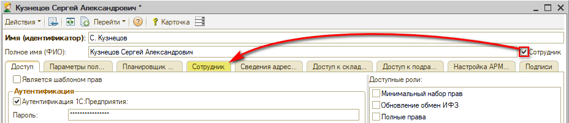

### Вкладка "Сотрудник"

В этой вкладке можно отдельно ничего не заполнять – карточка будет создана автоматически при записи сотрудника, т.е. требуется нажать кнопку *"Записать":*

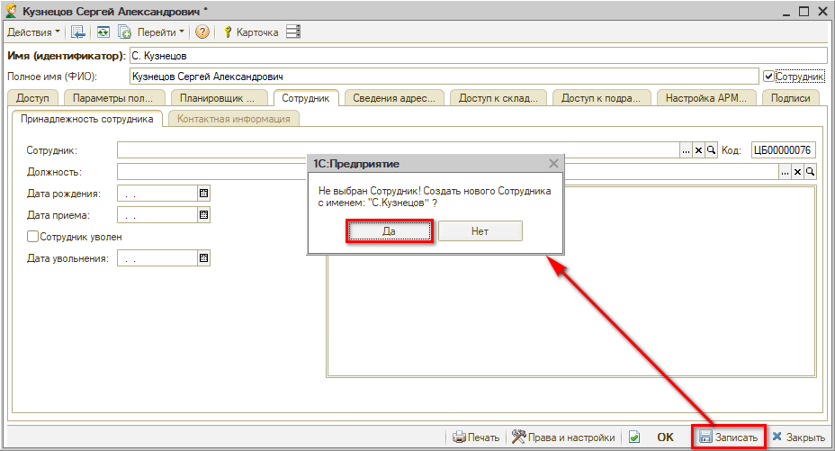

Выйдет окно с вопросом: *«Не выбран Сотрудник! Создать нового Сотрудника с именем "…"?»* Следует выбрать *"Да"*.

Создастся сотрудник, но *Должность "Не определена"*. Чтобы ее определить можно указать ее здесь или в карточке самого сотрудника:

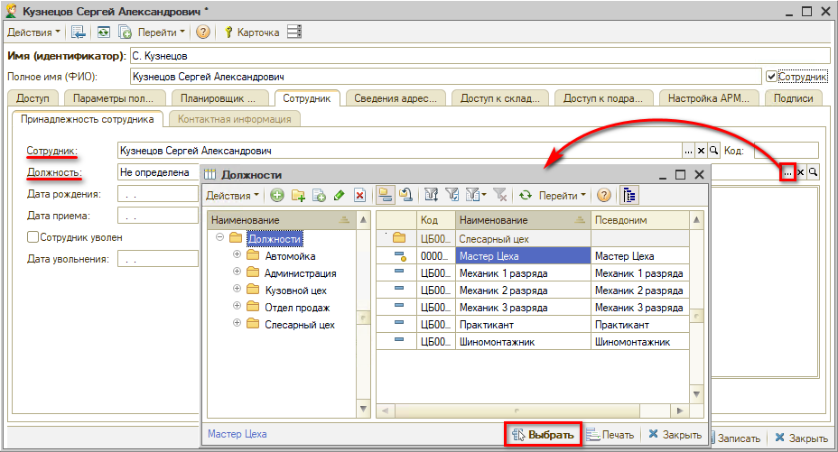

Можно перейти в *карточку сотрудника* нажатием на кнопку "Открыть"   и выбрать должность или, если нет такой должности, создать ее:

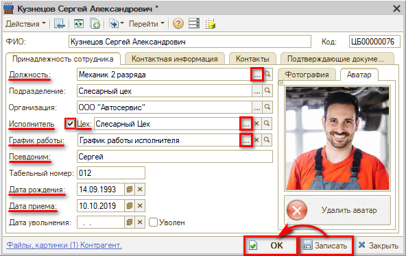

*Примечание:* см. статью [*Начальные настройки для работы в АРМ "Запись на ремонт"*](../../Запись%20на%20ремонт/Начальные%20настройки%20для%20работы%20в%20АРМ%20Запись%20на%20ремонт/nachalnye-nastroyki-dlya-raboty-v-arm-zapis-na-remont.md).

При необходимости ставится флажок, что сотрудник ***является исполнителем работ***, выбирается ***цех***. В этой карточке также можно выбрать ***график работы*** при необходимости. Можно указать ***псевдоним*** или сокращение имени – для того, чтобы более коротко отображать сотрудников в Записи на ремонт. Можно заполнить ***контактную информацию*** по сотруднику в соответствующих вкладках.

Можно указать ***дату рождения***, желательно ставить ***дату приема***, а когда сотрудник увольняется – ставится ***дата увольнения***, флажок ***"Уволен"*** (если сразу поставить флажок – автоматически пропишется текущая дата). Нажать ***"Запись"*** и ***"Ок"***.

После заполнения сотрудника автоматически подтягивается *должность* в Карточку пользователя.

## Создание контрагента

При записи нового сотрудника программа предлагает создать нового контрагента для данного сотрудника: выбрать *"Да"*. Можно создавать контрагента в отдельной папке "Сотрудники":

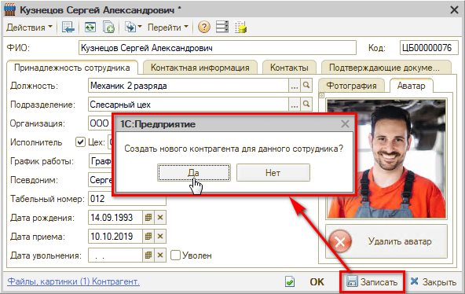

Подтягиваются все необходимые значения, *Тип клиента – "Частное лицо"*, *Основной вид отношений – Подотчетное лицо"* – при выборе данного вида отношений появляется поле *"Сотрудник":*

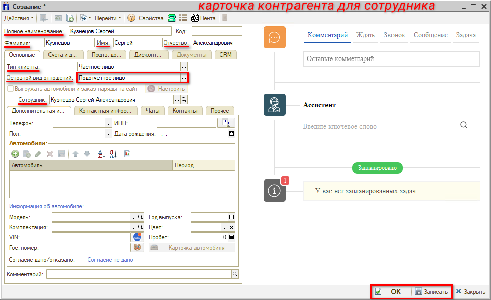

Далее следует сохранить карточку нажатием на кнопку *"Записать"* или *"ОК"*. Если такой пользователь уже есть, программа выдаст предупреждение о создании дублирующейся записи:

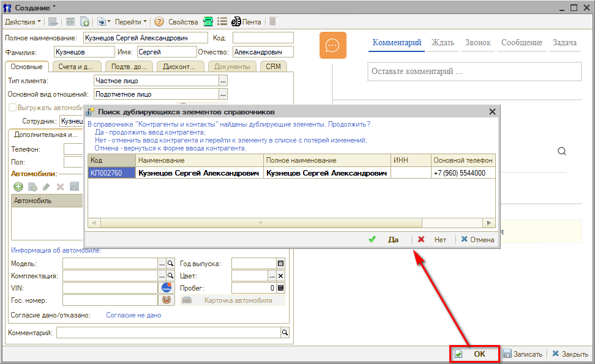

Если найден тот же самый контрагент, то создавать новую карточку не нужно, можно нажать кнопку "Нет"  , перейти к существующей карточке и установить в ней указанные выше параметры. Если найден другой человек с такими же Ф.И.О., следует продолжить ввод нового контрагента нажатием на кнопку "Да"  .

Далее необходимо перейти к *установке прав и настроек* (см. отдельную статью [*Установка прав и настроек*](../Установка%20прав%20и%20настроек%20пользователя/ustanovka-prav-i-nastroek-polzovatelya.md)). Для пользователей, которые будут работать с торговым оборудованием, также необходимо настроить [Рабочие места](https://5systems.ru/help/rabochie-mesta).

## Дополнительные настройки

### Тонкости по карточкам пользователей

Если, например, один из сотрудников иногда работает в другом филиале, можно создать на этого сотрудника второго пользователя, настроить его на другое подразделение, а привязать карточку того же самого сотрудника. При этом нужна осторожность, т.к. при записи карточки пользователя автоматически меняется вся информация в карточке сотрудника. В карточке сотрудника должно остаться то подразделение, в котором он работает обычно, чтобы в отчетах выработка шла именно по этому подразделению.

Оборудование привязывается к пользователю, а не к сотруднику – нужно только создать дополнительно рабочее место.

### Регистр "Сведения адресации"

См. статью [*Адресация задач в CRM по исполнителям*](../../Задачи/Адресация%20задач%20в%20CRM%20по%20исполнителям/adresaciya-zadach-v-crm-po-ispolnitelyam.md), а также видеоинструкцию в указанной статье.

На *вкладке "Сведения адресации"* настраиваются роли пользователей для корректной адресации задач и новых сделок. Внесенные данные по каждому пользователю записываются в общий *регистр "Сведения адресации".*

Данный регистр можно открыть через меню интерфейса *Администрирование → Компания → CRM → Сведения адресации* или через стандартное меню *CRM → Все операции → Регистры сведений → Сведения адресации:*

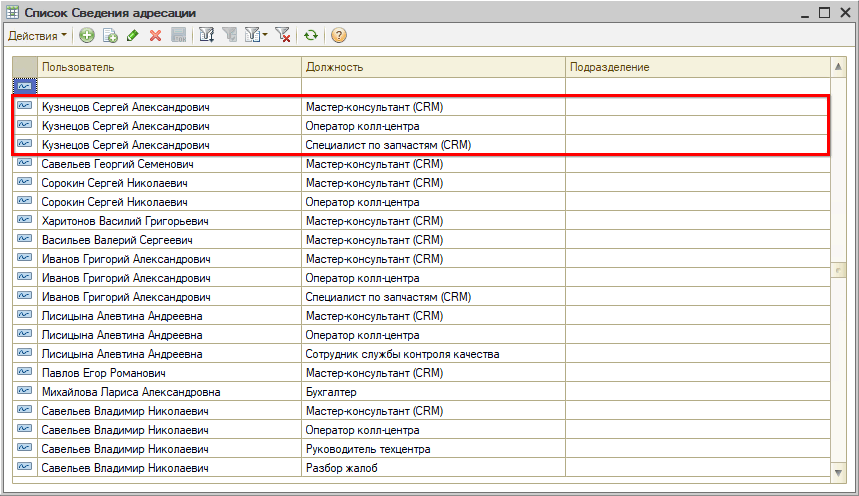

Регистр "Сведения адресации" обязателен к заполнению. Если сотрудник работает с CRM или задачами, то он должен в данном регистре фигурировать с какой-либо должностью.

- ***Мастер-консультант (CRM)***: для маршрутизации на должность звонков по статусу заказа (если в окне Заказ-наряда указан Мастер – подтягивается, если указать его в Заявке на ремонт).
- ***Оператор кол-центра**:* получает все задачи по чатам (если клиент пишет в чат). Подразделение здесь указывать не нужно, потому что чаты создаются на корневое подразделение, и если выбрать подразделение, то задача сотруднику не придет.
- ***Специалист по запчастям*** ***(CRM)***: имеет право выполнять задачи "Подберите запчасти", которые создаются из Заказ-наряда или автоматически из Записи на ремонт.

### Регистр "Внутренние телефоны пользователей текущей смены"

Регистр *"Внутренние телефоны пользователей текущей смены"* можно открыть через меню интерфейса *Администрирование → Компания → CRM →* *Внутренние телефоны* или через стандартное меню *CRM → Все операции → Регистры сведений →* *Внутренние телефоны пользователей:*

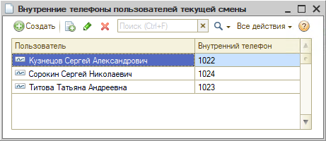

*Примечание:* см. статью [*Настройка внутренних телефонов сотрудников*](https://5systems.ru/help/nastroyka-vnutrennikh-telefonov-sotrudnikov).

Чтобы правильно работала маршрутизация и у пользователя при звонке на его внутренний номер на экране открывалась сделка, здесь обязательно должен быть указан каждый пользователь CRM: Пользователь и Внутренний телефон. Это делается автоматически, если в карточке пользователя стоит внутренний номер. Эта строка появляется в регистре при входе пользователя в систему под своей учетной записью и исчезает, когда пользователь из системы выходит.

Если внутренние номера не привязаны к конкретным сотрудникам, а меняются каждый день – можно в начале рабочего дня вручную заполнять этот регистр: прописывать пользователей и телефоны по факту – кто работает на каком номере.

***Внимание!*** Если пользователь работает одновременно с двух учетных записей на разных компьютерах, а затем с одной из учетных записей выйдет, то из регистра исчезнет строка с данным пользователем и его внутренним телефоном. Сотруднику нужно будет ввести ее вручную на том компьютере, где он продолжает работать. Иначе ему на внутренний телефон будут адресоваться звонки, но не будут открываться сделки.

---

**Теги:** пользователи и права, сотрудники, контрагенты, справочник пользователи, учетная запись, доступ, параметры пользователя

