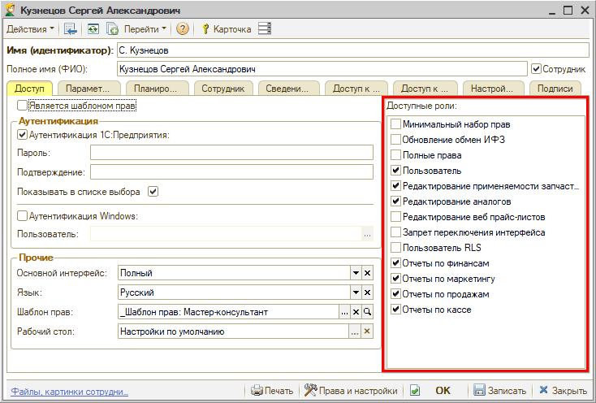

# Роли пользователей

<table><tr><td><b>Время чтения:</b> 5 мин.</td><td><b>Обновлено:</b> 28.02.2025</td></tr></table>

Источник: https://www.5systems.ru/help/roli-polzovateley

## Содержание

1. [Введение](#введение)
2. [Описание ролей](#описание-ролей)
3. [Особенности настройки](#особенности-настройки)

## Введение

При создании новой карточки пользователя в программе (см. *[статью](../Пользователи/polzovateli.md))* необходимо выбрать для него ***роли**,* которые будут определять *права доступа* пользователя к различным модулям и документам программы.

При настройке учетной записи для рядового сотрудника, для руководителя или для системного администратора должны быть выбраны разные роли.

## Описание ролей

**1) Основные:**

- ***Минимальный набор прав*** – роль, разрешающая пользователю вход в базу и просмотр всех основных пользовательских модулей, но запрещающая их редактирование.
- ***Полные права*** – роль для руководителя или системного администратора, открывающая полные права для работы с программой: и пользовательские, и администраторские, включая редактирование “Прав и настроек”, создание и редактирование пользователей, обновление конфигурации, доступ к редактированию всех справочников, документов и т.д.
- ***Пользователь*** – обязательная минимальная роль для рядовых сотрудников, предоставляющая пользователю доступ ко всем основным АРМ, справочникам и документам, и исключающая права администрирования базы.
- ***Пользователь RLS*** – ограничивает права доступа пользователя к данным по подразделениям, см. статью *“[Доступ к данным по подразделениям (RLS)](../../Администрирование%20и%20настройка%20системы/Доступ%20к%20данным%20по%20подразделениям%20%28RLS%29/dostup-k-dannym-po-podrazdeleniyam-rls.md)”.* Роль “Пользователь RLS” можно сочетать с другими дополнительными ролями, но основные роли при ее установке необходимо отключать, иначе они перекроют ограничения доступа.

**2) Дополнительные:**

- ***Обновление обмен ИФЗ*** – право обновления конфигурации программы, устанавливается для программиста, которому не нужно работать в интерфейсе программы.
- ***Редактирование применяемости запчастей*** – роль для сотрудника, ответственного за сохранение применяемости через заказ-наряд (см. [статью](../../Склад%20и%20запчасти/Применяемость%20запчастей/Автозаполнение%20применяемости%20из%20заказ-наряда/avtozapolnenie-primenyaemosti-iz-zakaz-naryada.md)).
- ***Редактирование аналогов*** – также устанавливается для специалиста по подбору запчастей, ответственного за создание записей о применяемости.
- ***Запрет переключения интерфейса*** – при установке данной роли пользователю у него будет недоступна кнопка переключения интерфейса.

*Дополнительные роли по отчетам (начиная с релиза 2.8.2):*

- ***Отчеты по финансам*** – при установке данной роли пользователю будут доступны финансовый отчеты;
- ***Отчеты маркетингу*** – при установке данной роли пользователю будут доступны маркетинговые отчеты;
- ***Отчеты по продажам*** – при установке данной роли пользователю будут доступны отчеты, связанные с продажами товаров и услуг;
- ***Отчеты по кассе*** – при установке данной роли пользователю будут доступны отчеты, связанные с кассовыми операциями.

## Особенности настройки

***Важно:*** Роли пользователя суммируются, а не исключают друг друга. Если у пользователя выбрано две роли, по одной из которых есть доступ, например, к справочнику "Номенклатура", а по второй – нет, то доступ будет.

*Основные роли* открывают доступ к документам, *дополнительные роли* не предоставляют доступа к документам. Это следует учитывать при настройке прав, например, для пользователя RLS: основные роли необходимо будет отключить, иначе они снимут ограничения этой роли. В то же время дополнительные роли можно сочетать с ролью “Пользователь RLS” – подробнее см. в [статье](../../Администрирование%20и%20настройка%20системы/Доступ%20к%20данным%20по%20подразделениям%20%28RLS%29/dostup-k-dannym-po-podrazdeleniyam-rls.md#роль-пользователь-rls).

---

**Теги:** пользователи и права, администрирование, роли, права доступа, настройка ролей
