

# Установка прав и настроек пользователя

<table><tr><td><b>Время чтения:</b> 18 мин.</td><td><b>Обновлено:</b> 22.11.2024</td></tr></table>

Источник: https://www.5systems.ru/help/ustanovka-prav-i-nastroek-polzovatelya

## Содержание

1. [Введение](#введение)
2. [Переход к установке Прав и настроек](#переход-к-установке-прав-и-настроек)
3. [Шаблоны прав](#шаблоны-прав)
   - [Создание шаблона прав](#создание-шаблона-прав)
4. [Установка прав и настроек](#установка-прав-и-настроек)
   - [Описание прав](#описание-прав)
   - [Объект настройки прав](#объект-настройки-прав)
   - [Параметры отображения списка](#параметры-отображения-списка)
   - [Основные и расширенные права](#основные-и-расширенные-права)
   - [Поиск прав](#поиск-прав)
   - [Установка выбранного права](#установка-выбранного-права)
      - [Установка на выбранный шаблон прав](#установка-на-выбранный-шаблон-прав)
      - [Групповая установка прав](#групповая-установка-прав)
   - [Ограничение доступа к справочникам и документам](#ограничение-доступа-к-справочникам-и-документам)
   - [Дополнительные настройки прав доступа](#дополнительные-настройки-прав-доступа)
   - [Завершение настройки](#завершение-настройки)

## Введение

Работа механизмов системы и доступ к отдельным функциям в программе определяется **Правами и настройками пользователей**. *Права* дают доступ, а *настройки* обеспечивают работу определенных механизмов. Права и настройки различаются по маркеру в дереве прав: права маркируются красным цветом, настройки – зеленым.

При необходимости можно изменить *Права и настройки* для конкретного пользователя. Изменять права и настройки – как свои, так и других пользователей – может только пользователь с включенным правом "Разрешить изменение прав доступа и настроек". Рядовой пользователь не может изменять ничьи права, в том числе свои – их устанавливает администратор. Изменять для себя личные настройки (не права) пользователь может, если у него включено право "Разрешить изменение личных настроек".

## Переход к установке Прав и настроек

Перейти к установке Прав и настроек можно через главное меню *Администрирование → Сервис → Пользователи и права → Установка прав и настроек:*

А также нажатием кнопки *"Права и настройки"  * в справочнике "Пользователи" или карточке пользователя:

## Шаблоны прав

Права и настройки каждого сотрудника определяются **шаблоном прав**, который назначается пользователю при создании. Основные шаблоны прав созданы в базе по умолчанию: можно их настроить для своей компании.

При этом в системе также есть возможность настраивать права и на каждого отдельного пользователя, но такой путь не является оптимальным. Шаблоны прав нужно будет настроить только один раз, и затем просто выбирать их для новых пользователей.

Настройка шаблонов прав по должностям дает возможность предоставить либо закрыть доступ определенным сотрудникам к отдельным документам и справочникам программы. Также в программе есть некоторые механизмы, заточенные на права: например, одному пользователю нужно, чтобы расходные материалы добавлялись в Заказ-наряд, другому пользователю не нужно. Для удобства настройки этих механизмов создаются шаблоны прав по должностям.

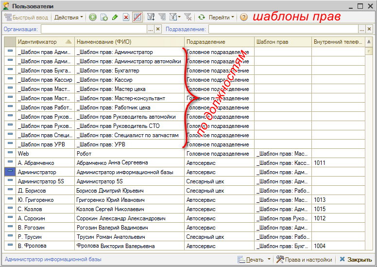

При необходимости можно создавать шаблоны прав не только по должностям, но и по подразделениям, т.к. в разных подразделениях, в разных филиалах у сотрудников с одинаковыми должностями могут быть разные права.

### Создание шаблона прав

Когда шаблон прав создается первый раз или если появляется новая должность, требуется заполнить следующие параметры.

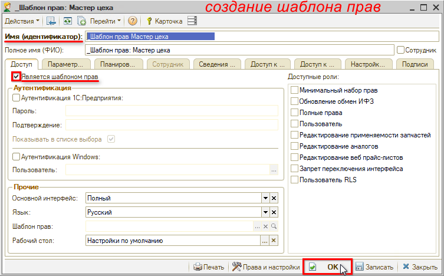

***«Имя (идентификатор)»***, или наименование шаблона, лучше начинать с символа «_» - «подчеркивание», чтобы шаблоны в списке группировались вверху и не перемешивались с реальными пользователями.

Например: *«_Шаблон прав: Мастер цеха»*

Обязательно проставить флажок ***«Является шаблоном прав»***. Больше в шаблоне делать ничего не нужно, сразу нажать ***«Ок»***. Далее требуется присвоить этот шаблон нужному пользователю. Дальнейшая настройка ведется уже именно на шаблон, а на пользователя права не настраиваются.

Чтобы быстро перейти в настройку прав, требуется зайти в созданный шаблон и нажать внизу кнопку *«Права и настройки»  *.

В *Правах и настройках* при создании шаблона прав требуется нажать кнопку ***"Скопировать текущий набор прав"***. Форма *"Копирование набора прав"* открывается в контексте текущего объекта: необходимо выбрать ***Объект-источник*** – шаблон, с которого требуется скопировать права, и ***Объект-приемник*** – новый созданный шаблон, который нужно настроить. И нажать кнопку ***"Скопировать"***.

Затем требуется произвести донастройку *Прав и настроек* на создаваемый шаблон прав (см. далее).

## Установка прав и настроек

Выбор прав производится на вкладке *"Дерево прав и настроек"*.

### Описание прав

Описание каждого права/настройки находится в соответствующем поле: чтобы с ним ознакомиться, требуется выделить нужное право в списке.

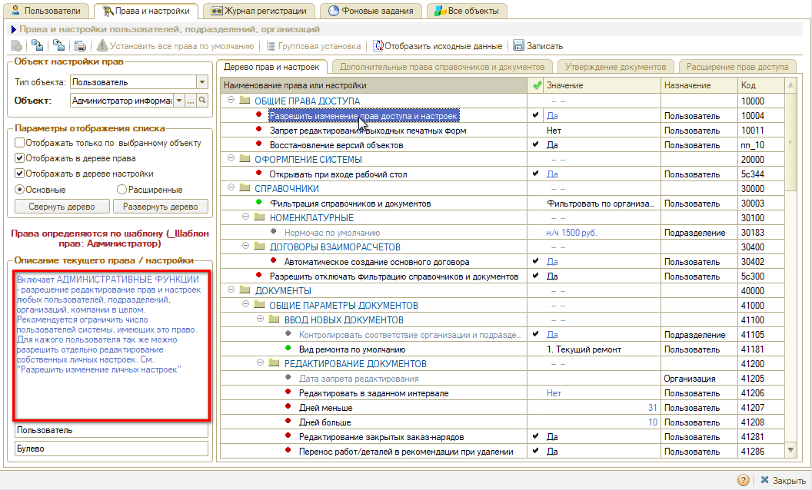

### Объект настройки прав

Права настраиваются на объект. Объект – это пользователь, организация или 
подразделение, для которого задаются права и настройки.

Окно прав и настроек открывается в контексте объекта шаблона прав текущего пользователя. Подгружаются значения: *"Тип объекта: Пользователь"*, *"Объект настройки прав:<наименование шаблона>"*.

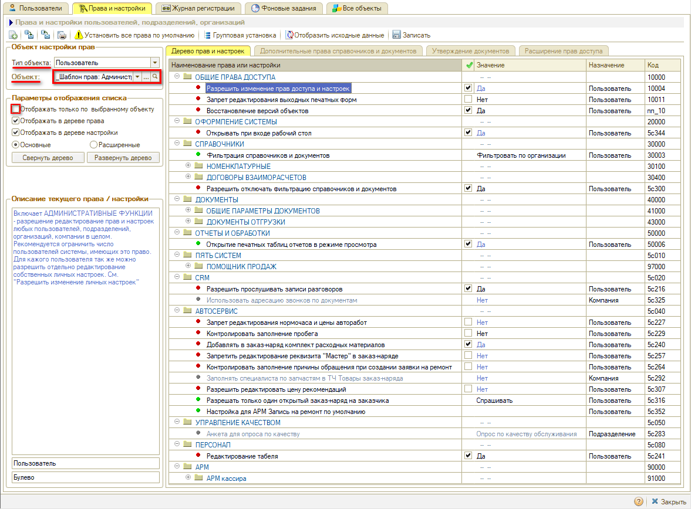

### Параметры отображения списка

**Отображение в дереве прав и/или настроек**

В дереве настройки обязательно будет установлен один из флажков – "Отображать в дереве права" и "Отображать в дереве настройки", либо оба флажка.

Если установлен флажок *"Отображать в дереве права",* то в дереве будут отображаться права (красная отметка). Права обеспечивают доступ пользователей к различным элементам системы. Рядовой пользователь не может изменять ничьи права, их устанавливает администратор с включенным правом "Разрешить изменение прав доступа и настроек".

Если установлен флажок *"Отображать в дереве настройки",* то в дереве будут отображаться настройки (зеленая отметка). Настройка позволяет обычному пользователю выбрать для себя режим работы какого-либо механизма, если у него включено право "Разрешить изменение личных настроек".

**Отображение прав и настроек только по выбранному объекту**

Если в поле *"Параметры отображения списка"* стоит флажок *"Отображать только по выбранному объекту"*, то отображаются только права по объекту "Пользователь", т.е. только права, у которых назначение "Пользователь". Права, завязанные на компанию, на подразделение и т.д. – не отображаются. Поэтому некоторые права в таком виде можно не найти.

Если не ставить этот флажок, то будут отображаться все права, но те, которые не относятся к пользователю, будут написаны серым цветом, и их невозможно будет редактировать. Для того, чтобы их можно было редактировать, требуется выбрать другой ***тип объекта*** – который указан в назначении этих прав:

- ***Компания*** – это все организации
- ***Организация*** – конкретная организация
- ***Подразделение*** – подразделение организации или филиал
- ***Пользователь*** – определенный пользователь или шаблон прав

Если выбрать, например, "Компанию", - то права на пользователя будут отображаться серыми, а права на компанию станут черными и активными – можно их редактировать.

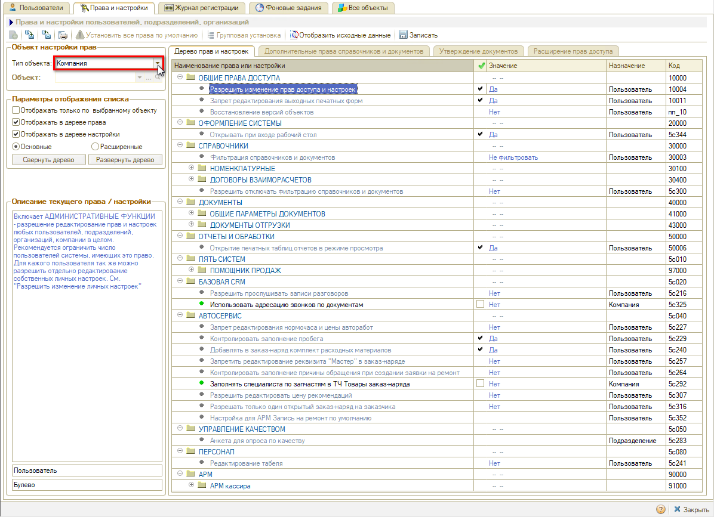

Чтобы поменять значение «Объект», можно нажать «Выбрать из списка» Выбор  , или, если там нет нужного варианта и нужен другой пользователь – нажать «Выбрать»  и выбрать нужный шаблон прав. Дальнейшая настройка идет на выбранный шаблон.

### Основные и расширенные права

Для удобства работы с функционалом прав и настроек можно переключить вариант отображения: *основные* или *расширенные*.

По умолчанию открываются **основные** права и настройки. Отображаемых в данном варианте прав достаточно для настройки стандартного пользователя.

**Расширенные** – это полный список прав и настроек.

### Поиск прав

Поиск основных прав осуществляется по *дереву прав и настроек* – по умолчанию оно развернуто и содержит небольшой перечень прав, среди которых можно быстро найти нужное.

Найти нужное право в расширенном списке всех прав бывает сложно, т.к. их очень много. Можно *свернуть* Дерево прав и настроек, чтобы увидеть разделы, если точно известно в каком разделе искомое право.

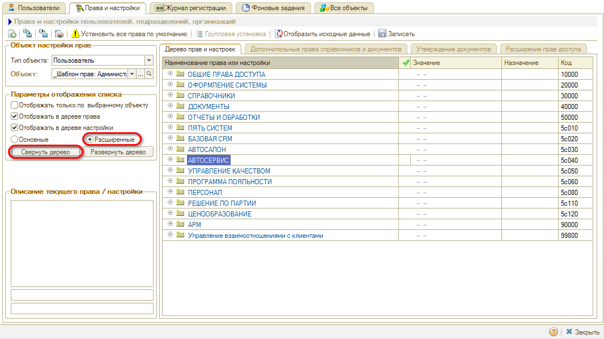

Если неизвестно, в каком разделе искать, можно *развернуть* Дерево и найти право через *«поиск»* на верхней стандартной панели. В строку поиска нужно ввести название права или часть его названия. Далее нажать Enter либо воспользоваться кнопками  рядом со строкой поиска. Программа находит последовательно права, содержащие в названии введенное слово или часть слова.

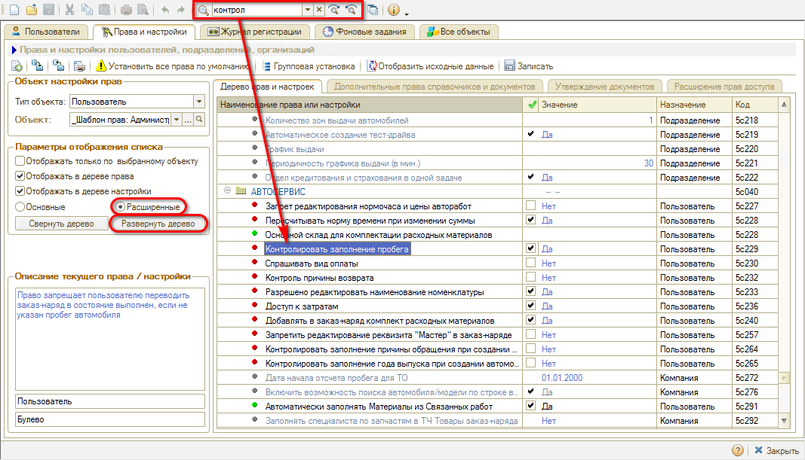

Типовые права и настройки собраны в разделах: Общие права доступа, Оформление системы, Справочники, Документы, Отчеты и обработки и т.д.

Права и настройки от 5SYSTEMS – по CRM, Автосервису, Корзине и т.д. собраны в разделе "ПЯТЬ СИСТЕМ" и других дополнительных папках.

### Установка выбранного права

#### Установка на выбранный шаблон прав

Для установки выбранного права или настройки на отдельный шаблон требуется отметить нужные права галочками, установить требуемое значение в соответствующем столбце и записать.

Кнопка "Установить все права по умолчанию" позволяет вернуть значения прав и настроек по умолчанию для выбранного объекта.

#### Групповая установка прав

Часто требуется настроить право сразу на все шаблоны. Для этого удобно сделать групповую установку: требуется выделить нужное право и нажать кнопку *"Групповая установка"*.

В открывшемся окне можно увидеть, для каких шаблонов или пользователей назначено данное право, поменять значение для определенных шаблонов, а также изменить значение для всех объектов: для этого нужно задать значение у одного шаблона, выделить его и нажать кнопку «Установить для всех»  . Можно восстановить значение права по умолчанию для всех – соответствующей кнопкой .

Для установки выбранных параметров нажать кнопку *"Записать"*.

### Ограничение доступа к справочникам и документам

При необходимости можно ограничить или закрыть доступ к определенным Документам и Справочникам в соответствующих разделах: задать права для каждой должности – в столбце «Значение права» выбрать значение, например, «Чтение» или «Нет доступа».

### Дополнительные настройки прав доступа

Для некоторых прав есть возможность задавать дополнительные настройки. 
Дополнительные настройки прав производятся на следующих вкладках: “Дополнительные права и справочники документов”, “Утверждение документов” и “Расширение прав доступа”:

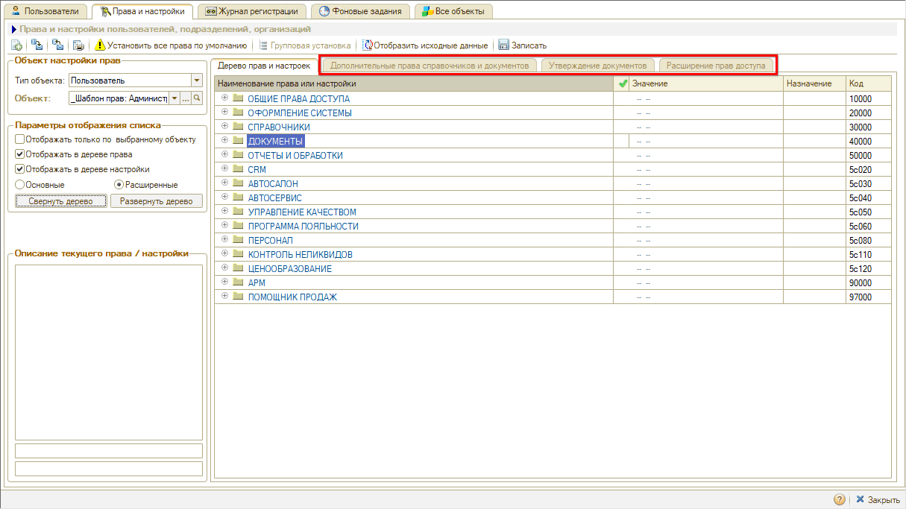

Данные вкладки не всегда активны – их активность зависит, как правило, от настройки прав.

*Примечание:* Все настройки по данным вкладкам при необходимости требуется делать отдельно для каждого шаблона прав или пользователя – они не переносятся при [копировании](#kopy) прав.

**1. Вкладка “Дополнительные права и справочники документов”**

На вкладке "Дополнительные права и справочники документов" указывается доступ по подразделениям или пользователям – можно добавить подразделения или пользователей, которым будет открыт доступ.

**2. Вкладка “Утверждение документов”**

Настраивается аналогично.

**3. Вкладка “Расширение прав доступа”**

Данная вкладка становится активной, когда по праву можно задать значение для отдельных документов.

Например, при стандартной настройке прав "Редактирование проведенных документов" и "Проведение задним числом" запрет распространяется на все документы. Однако часто возникает ситуация, что клиент решил перезаписаться, но сотрудник не может перенести запись, потому что у него нет права редактировать документы.

В таких случаях используется *расширение прав доступа:*

1. В основном праве должно быть  установлено значение “Нет”, т.е. сотрудник не может редактировать проведенные документы и проводить документы задним числом:  
   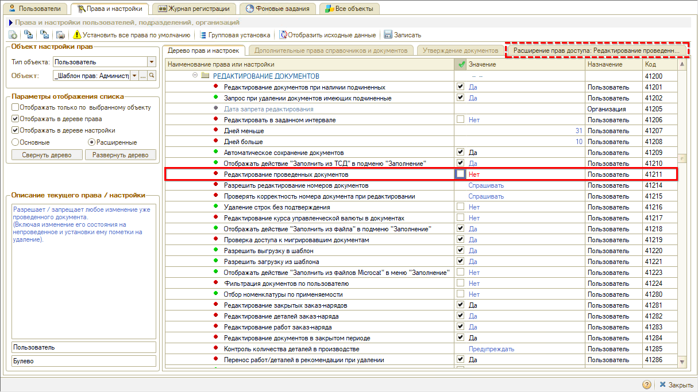
2. Затем следует перейти на вкладку “Расширение прав доступа”, добавить документ “Заявка на ремонт”, установить значение "Да" и Записать:  
   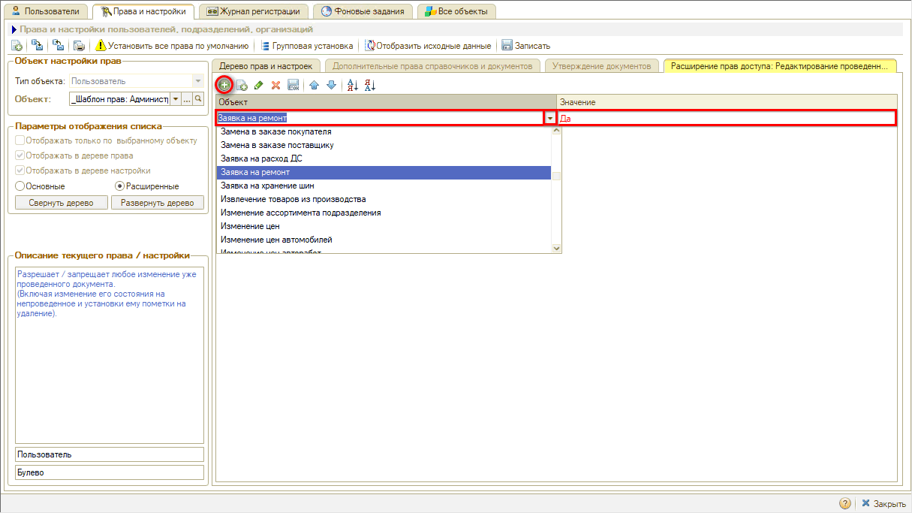

При такой настройке у сотрудника появится возможность редактировать только документ "Запись на ремонт".

Либо наоборот, может быть настроен доступ проводить все документы задним числом, т.е. в основных настройках права установлено значение “Да”, а в расширении указано, для каких документов будет установлен запрет, т.е. значение "Нет".

### Завершение настройки

Чтобы сохранить произведенные настройки, требуется обязательно в Правах и настройках нажать кнопку *"Записать"*:

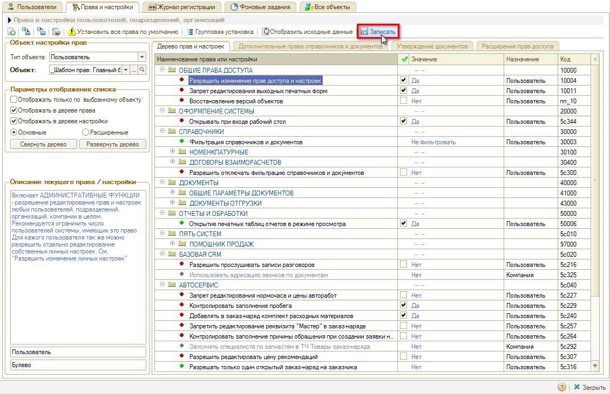

---

**Теги:** пользователи и права, права доступа, настройки пользователя, шаблоны прав, ограничение доступа

