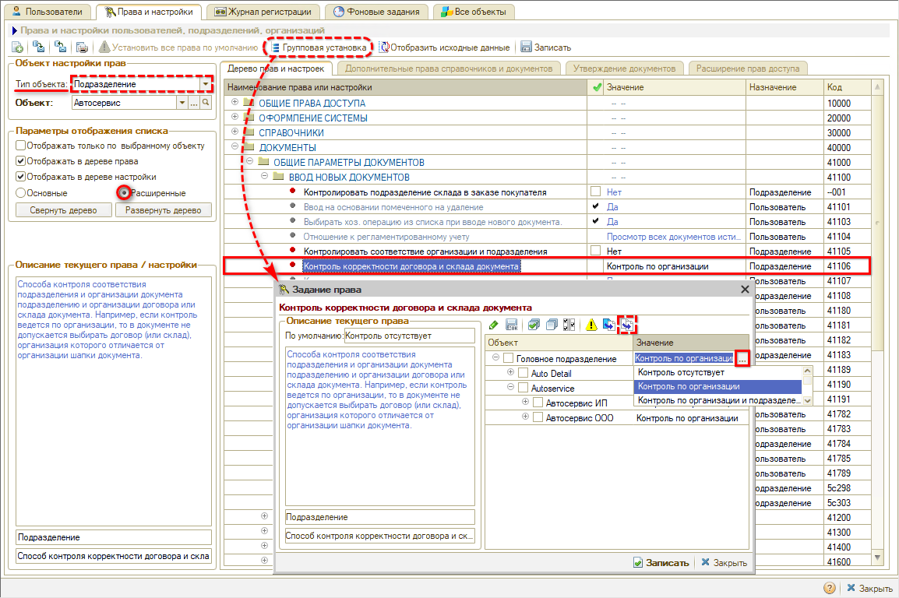
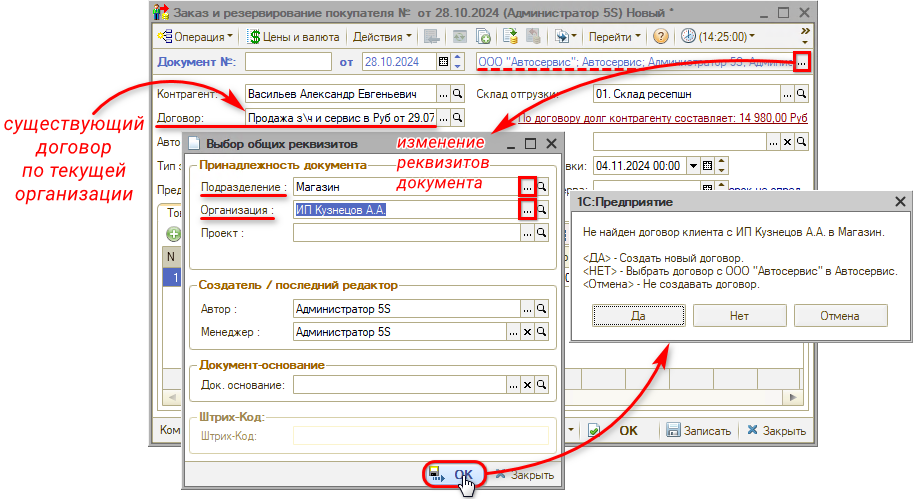
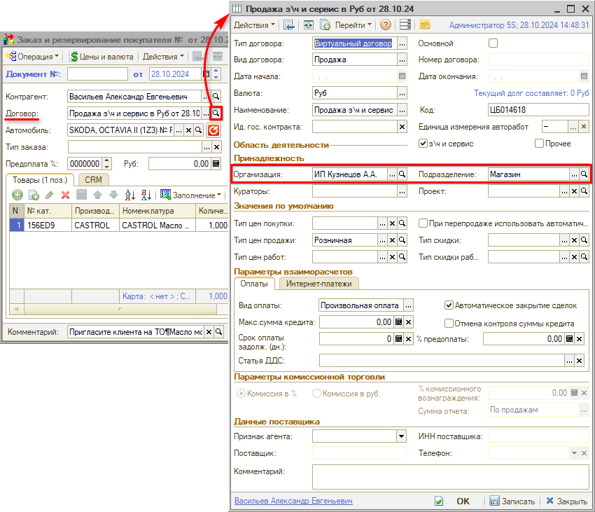
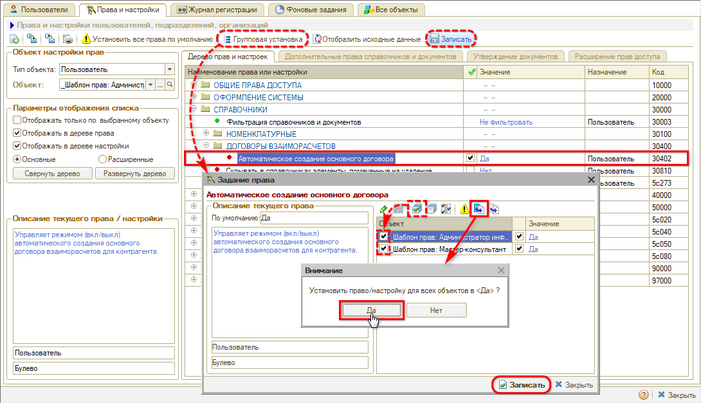

# Автоматическое создание договора с контрагентом

<table><tr><td><b>Время чтения:</b> 5 мин.</td><td><b>Обновлено:</b> 30.10.2024</td></tr></table>

Источник: https://www.5systems.ru/help/avtomaticheskoe-sozdanie-dogovora-s-kontragentom

## Содержание

1. [Введение](#введение)
2. [Контроль организации и подразделения в договоре](#контроль-организации-и-подразделения-в-договоре)
3. [Автоматическое создание основного договора](#автоматическое-создание-основного-договора)

## Введение

Для работы с документами в программе необходимо наличие *[договора взаиморасчетов](../../Учет%20взаиморасчетов/Взаиморасчеты%20с%20контрагентами/vzaimoraschety-s-kontragentami.md#договор-взаиморасчетов-с-контрагентом) с контрагентом.*

Для корректной работы программы рекомендуется настроить *контроль соответствия организации документа и организации договора,* а также *автоматическое создание договоров.* В противном случае пользователям придется создавать договора вручную, а несоответствие организаций будет приводить к ошибкам в учете.

За работу данного функционала отвечают две настройки:

1. Контроль организации и подразделения в договоре;
2. Автоматическое создание нового договора.

## Контроль организации и подразделения в договоре

Контроль наличия договора по подразделению и организации документа регулируется правом *“Контроль корректности договора и склада документа”.* Право устанавливается *на подразделение.*

Рекомендуется выбрать способ контроля *“Контроль по организации”,* либо, если требуется, можно выбрать *“Контроль по организации и подразделению”.*

Для корректной работы функционала рекомендуется сделать *групповую установку* права сразу на все подразделения компании:

*Подробнее о настройке прав см. статью “[Установка прав и настроек пользователя](../../Пользователи%20и%20права/Установка%20прав%20и%20настроек%20пользователя/ustanovka-prav-i-nastroek-polzovatelya.md#групповая-установка-прав)”.*

При включенном праве при создании новых документов, а также при изменении организации и подразделения в реквизитах документов будет производиться проверка наличия договора взаиморасчетов с контрагентом по организации и/или подразделению:

*Примечание:* При создании новых документов проверка производится по организации и подразделению текущего пользователя, которые подтягиваются в шапку документа.

Следует выбрать вариант “Да” – при этом будет создан новый договор по установленной организации и/или подразделению и подтянется в создаваемый документ:

## Автоматическое создание основного договора

Автоматическое создание договора регулируется правом *“Автоматическое создание основного договора”.*

Данное право устанавливается на пользователя. Рекомендуется установить данное право *для всех шаблонов прав* по умолчанию:

*Подробнее о настройке прав см. статью “[Установка прав и настроек пользователя](../../Пользователи%20и%20права/Установка%20прав%20и%20настроек%20пользователя/ustanovka-prav-i-nastroek-polzovatelya.md#групповая-установка-прав)”.*

---

**Теги:** практики, договор, контрагент, автоматическое создание, взаиморасчеты
