

# Анализ и установка цен

<table><tr><td><b>Время чтения:</b> 22 мин.</td><td><b>Обновлено:</b> 19.11.2024</td></tr></table>

Источник: https://www.5systems.ru/help/analiz-i-ustanovka-cen

## Содержание

1. [Введение](#введение)
2. [Заполнение таблицы товаров](#заполнение-таблицы-товаров)
   - [Заполнение из Номенклатуры](#заполнение-из-номенклатуры)
   - [Кнопки панели управления](#кнопки-панели-управления)
   - [Заполнение из прайс-листов](#заполнение-из-прайс-листов)
3. [Способы установки цен](#способы-установки-цен)
   - [Ручная установка наценок](#ручная-установка-наценок)
   - [Использование алгоритмов](#использование-алгоритмов)
   - [Расчет цен на основании документа](#расчет-цен-на-основании-документа)
4. [Установка новых цен](#установка-новых-цен)

## Введение

Обработка "Анализ и установка цен" позволяет установить новую цену на товары одним из возможных способов и зафиксировать ее.

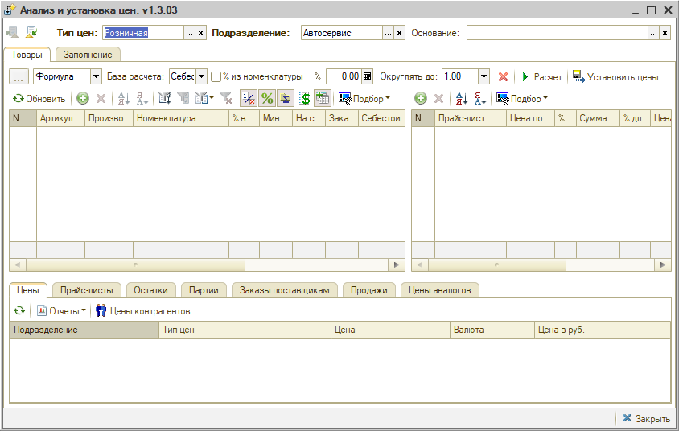

Для того, чтобы воспользоваться данным инструментом, необходимо заполнить позиции, по которым будет производиться анализ.

## Заполнение таблицы товаров

### Заполнение из Номенклатуры

Для заполнения таблицы обработки используется *вкладка “Заполнение”*.

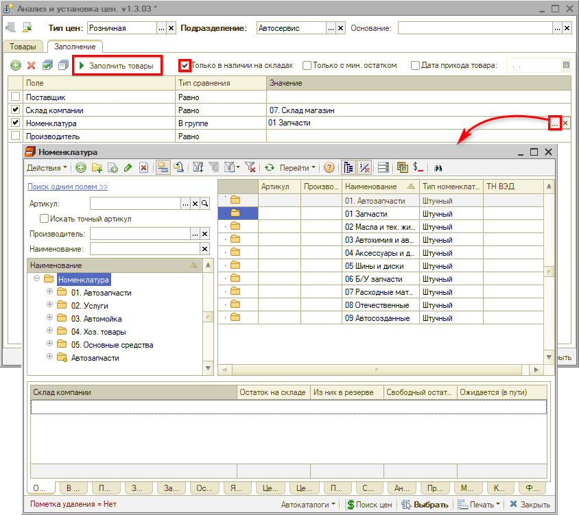

Можно использовать отборы: *“Только в наличии”*, *“Только с мин. остатком”* и *“Только полученные”*.

Нажатием на кнопку *“Заполнить товары”* производится заполнение.

По умолчанию по каждой строке отображаются данные:

- количество товара на складе на настоящий момент,
- количество товара в заказе поставщикам,
- реальная себестоимость товара по получении,
- процент и сумма наценки на себестоимость,
- старая цена,
- процент и сумма наценки на старую цену до новой цены,
- новая цена.

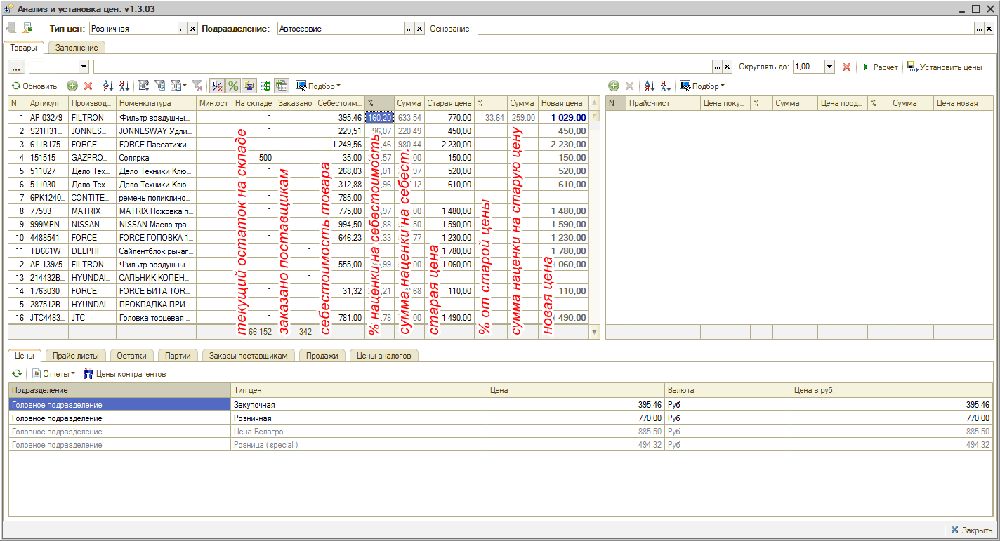

### Кнопки панели управления

Можно настроить внешний вид формы для своего удобства – отобразить или скрыть таблицу цен поставщиков и панель информации:

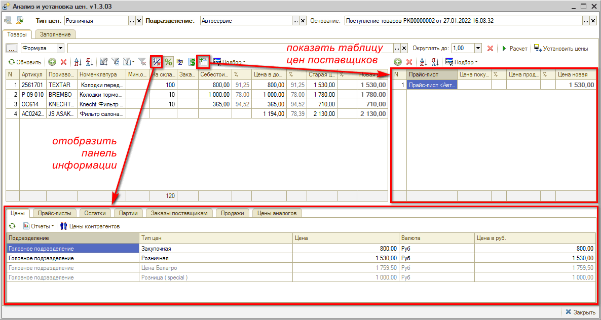

Можно убрать или вывести колонки “%” и “Сумма” наценки:

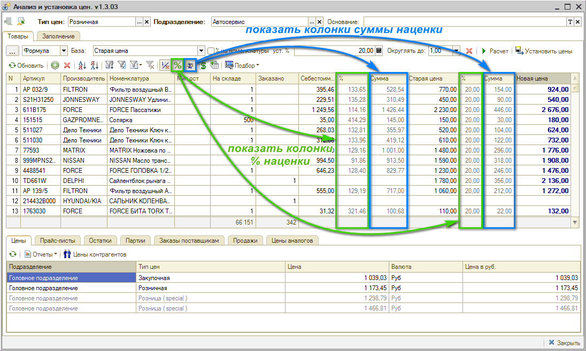

При работе с прайс-листами используется кнопка “Показать цены поставщиков” (см. [ниже](#заполнение-из-прайс-листов)).

Кнопка “Подбор”: для анализа может использоваться подбор в Поиске цен.

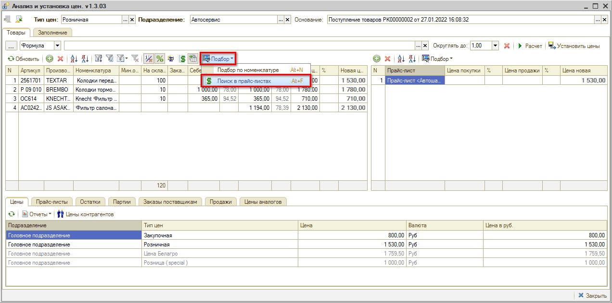

### Заполнение из прайс-листов

При работе с прайс-листами поставщиков используется кнопка заполнения:

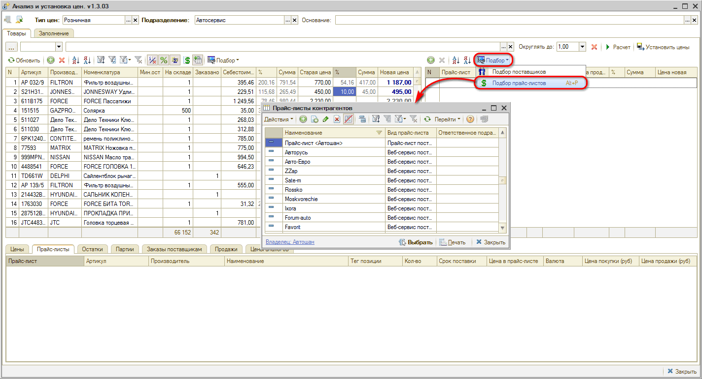

Для того, чтобы понять, какие позиции есть в наличии, нужно нажать кнопку “Показать цены поставщиков”. При этом появляются дополнительные колонки с информацией из прайс-листа, если она есть:

- прайс покупки,
- минимальная цена покупки,
- процент от минимальной цены покупки,
- прайс минимальной цены продажи,
- минимальная цена продажи,
- процент от минимальной цены продажи.

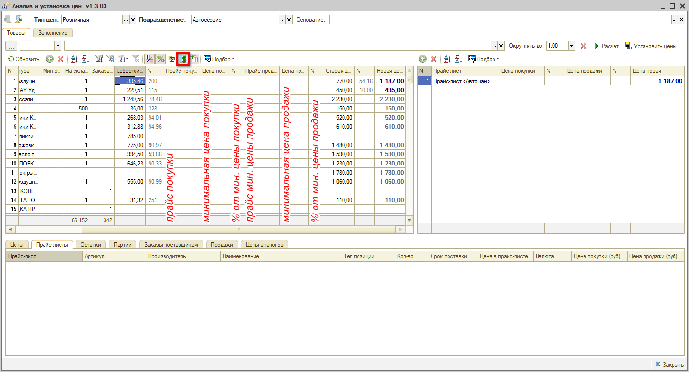

Если добавить несколько прайс-листов, обработка позволит произвести анализ цен покупки и продажи: будут выведены данные того поставщика, у которого цена ниже.

В нижнем окне на вкладке “Прайс-листы” отображаются все имеющиеся прайс-листы, и можно их отсюда добавить в таблицу цен для анализа.

## Способы установки цен

### Ручная установка наценок

Можно вручную установить произвольный процент наценки от себестоимости: цена тут же будет пересчитана, при этом отображается процент относительно старой цены.

Например, установим наценку 200%: программа пересчитывает новую цену, сумму наценки от себестоимости, процент и сумму наценки относительно старой цены.

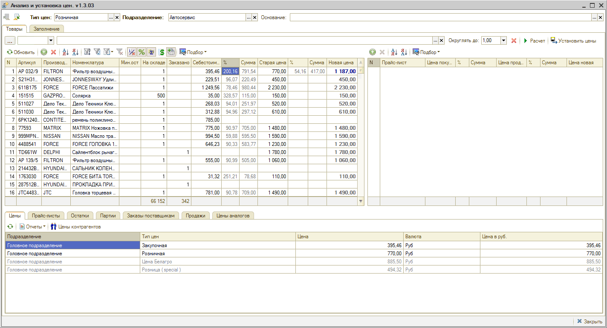

Можно поднять процент относительно старой цены: в столбце “% от старой цены” требуется ввести нужное значение: будет пересчитана новая цена и все остальные показатели.

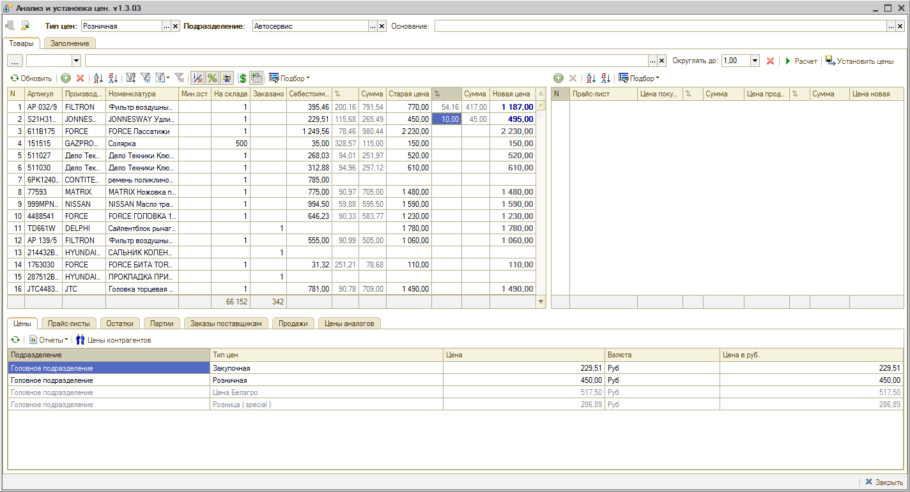

Также можно установить наценку не в процентах, а в рублях, путем ввода определенной суммы наценки в соответствующие колонки таблицы.

Можно задать непосредственно новую цену в соответствующей колонке: при этом отобразятся процент и сумма наценки от себестоимости и от старой цены.

### Использование алгоритмов

Для автоматического расчета цен можно использовать *формулы*.

Например, взять за основу минимальную цену покупки, прибавить к ней 80% и рассчитать:

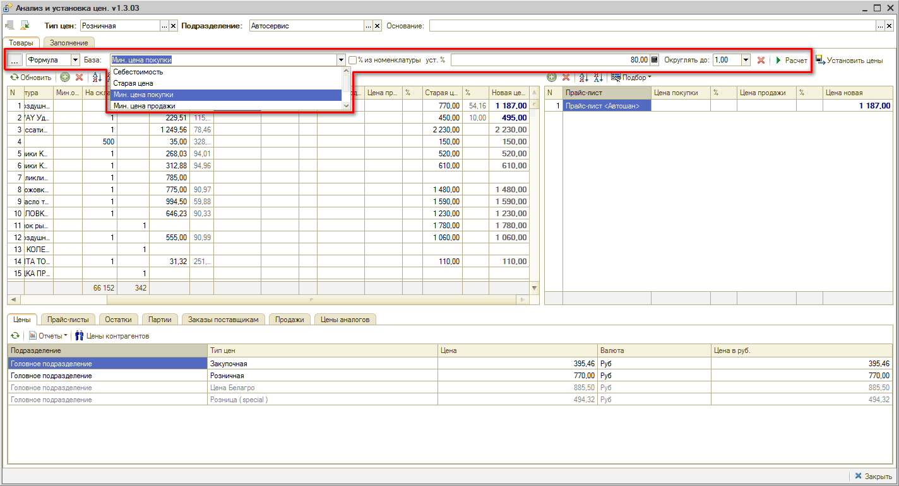

Или поднять цены, например, на 20% от старой цены:

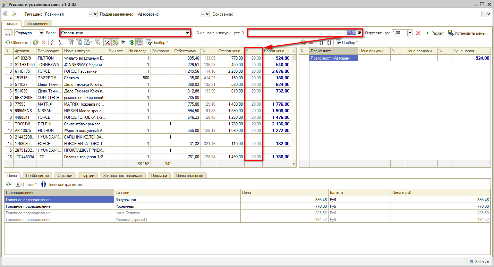

Либо можно задать свой собственный *алгоритм расчета*:

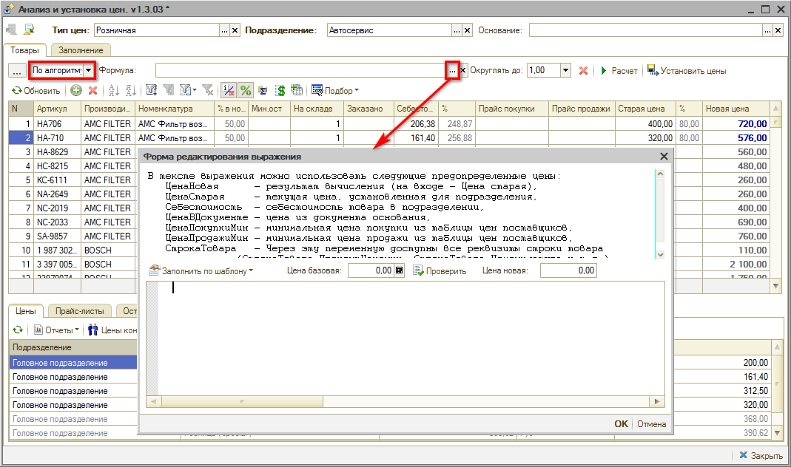

### Расчет цен на основании документа

Можно рассчитывать цену на основании документа “Поступление товаров” в зависимости от *цены в документе*. Колонка “Себестоимость” в данном случае заполнится, только если товар есть на остатках склада.

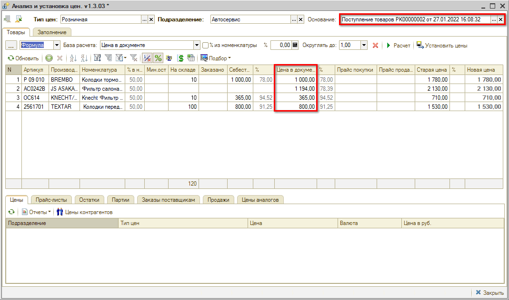

Можно произвести автоматический расчет по правилам, установленным для поставщика.

При выборе способа *“Автоматически”* появляется поле “Правила для поставщика” – в него подставляется поставщик из основания “Поступление товаров”. Расчет производится согласно всем алгоритмам, установленным для данного поставщика.

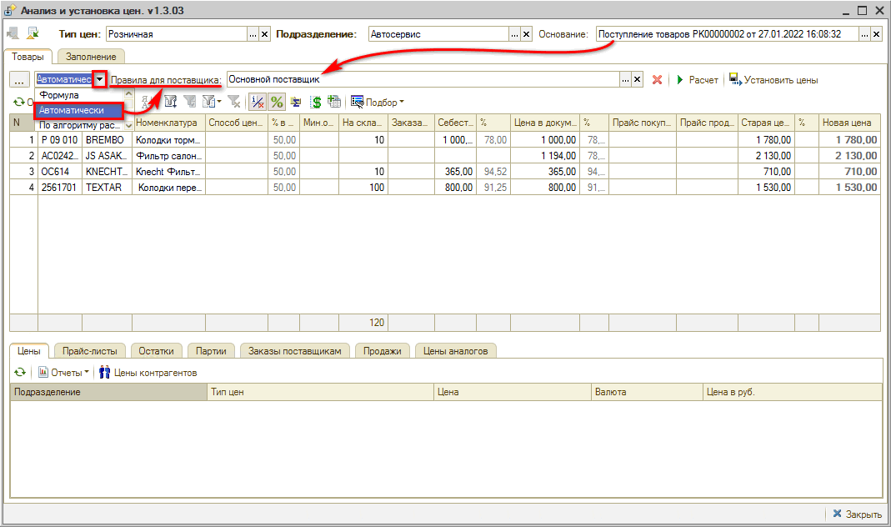

Можно также делать расчет по формуле – по своим шаблонам: задать базу расчета и процент наценки (см. выше: п. “[Использование алгоритмов](#использование-алгоритмов)”), либо задать свой собственный алгоритм расчета.

Все использованные правила сохраняются программой и затем доступны для быстрого выбора по кнопке [...].

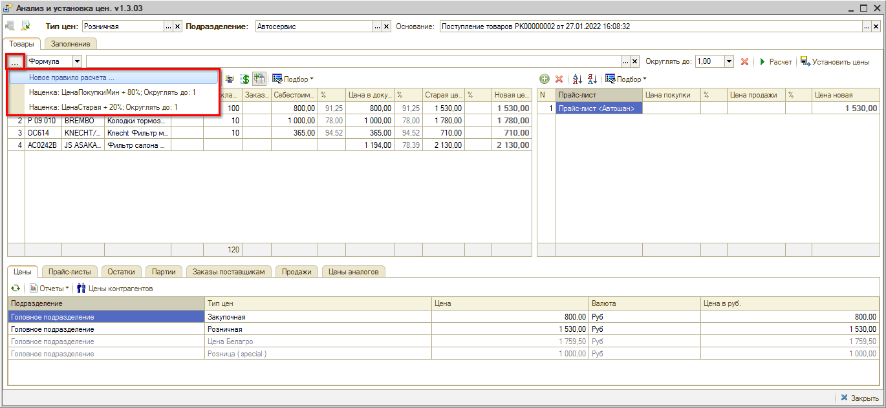

## Установка новых цен

После установки новых цен требуется нажать кнопку “Установить цены”. При этом формируется документ “Изменение цен”: созданный документ – это конечный итог данной обработки.

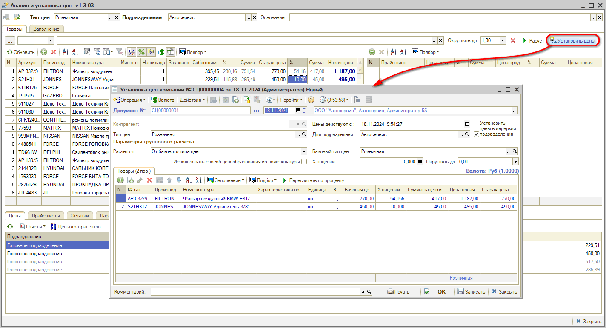

После нажатия “Ок” в документе все измененные цены установятся в программе.

Галочка “Установить цены в иерархии подразделения” используется при наличии двух и более подразделений для установки одинаковых цен для всех подразделений.

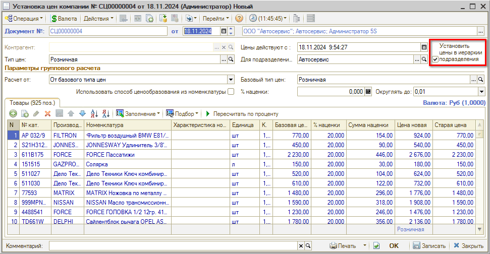

---

**Теги:** практики, цены, наценки, прайс-листы, анализ цен, ценообразование

