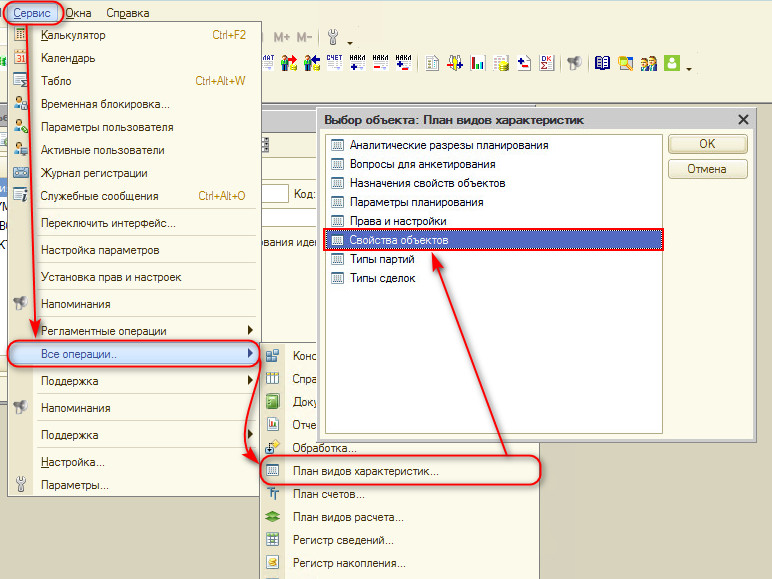
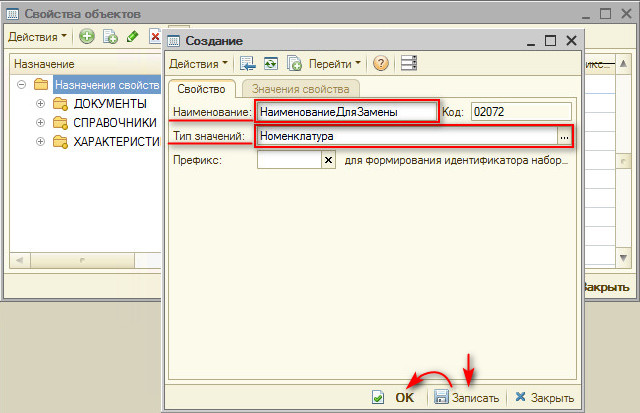
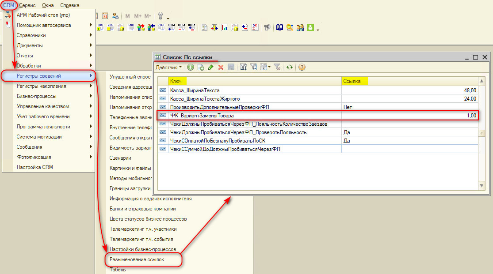
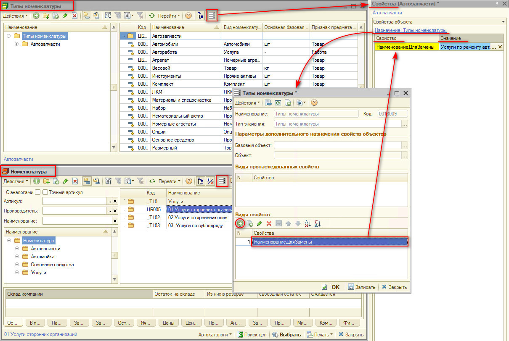

# Замена товара услугой при пробитии чека

<table><tr><td><b>Время чтения:</b> 6 мин.</td><td><b>Обновлено:</b> 24.06.2022</td></tr></table>

Источник: https://www.5systems.ru/help/zamena-tovara-uslugoy-pri-probitii-cheka

Открыть *План видов характеристик* ***«Свойства объектов»*** (Сервис → Все операции → План видов характеристик).

Сюда требуется добавить  новое *свойство* с именем ***«НаименованиеДляЗамены»*** и с указанием *типа значений* ***«Номенклатура»***.

В *Регистре сведений* ***«Разыменование ссылок»*** нужно добавить  новую запись:

*Ключ* = ***«ФК_ВариантЗаменыТовара»***

*Ссылка* = ***1*** *(Выбор типа данных = Число)*

В справочнике *«Типы номенклатуры»* либо в самом справочнике *«Номенклатура»* открыть ***Список свойств*** и добавить  ранее созданное *свойство* ***НаименованиеДляЗамены***. В *значении* необходимо указать *номенклатуру, на которую будет производиться замена*.

---

**Теги:** практики, чек, товар, услуга, касса
