

# Запрос на отзыв довольного клиента об автосервисе

<table><tr><td><b>Время чтения:</b> 16 мин.</td><td><b>Обновлено:</b> 12.01.2024</td></tr></table>

Источник: https://www.5systems.ru/help/zapros-na-otzyv-dovolnogo-klienta-ob-avtoservise

## Содержание

1. [Введение](#введение)
2. [Предварительная настройка](#предварительная-настройка)
3. [Шаблон сообщения "Запрос на отзыв"](#шаблон-сообщения-запрос-на-отзыв)
   - [1. Создание шаблона сообщения](#создание-шаблона-сообщения)
   - [2. Создание действия "Запрос на отзыв"](#создание-действия-запрос-на-отзыв)
4. [Добавление сервисов, на которых можно оставить отзыв](#добавление-сервисов-на-которых-можно-оставить-отзыв)

## Введение

Если клиент остался доволен работой автосервиса (выясняется в результате [опроса](../../Управление%20качеством%20обслуживания/Опрос%20клиента%20о%20качестве%20обслуживания/opros-klienta-o-kachestve-obsluzhivaniya.md)), можно попросить его оставить отзыв на сайте при помощи следующего механизма.

## Предварительная настройка

*Также см. статьи [Создание типовой анкеты](../../Администрирование%20и%20настройка%20системы/Создание%20типовой%20анкеты/sozdanie-tipovoy-ankety.md), [Настройка автоматической отправки сообщений через мессенджеры](../../Сообщения/Настройка%20автоматической%20отправки%20сообщений%20через%20мессенджеры/nastroyka-avtomaticheskoy-otpravki-soobscheniy-cherez-messendzhery.md) и [Опрос клиента о качестве обслуживания](../../Управление%20качеством%20обслуживания/Опрос%20клиента%20о%20качестве%20обслуживания/opros-klienta-o-kachestve-obsluzhivaniya.md).*

Необходимо настроить условия, при которых будет происходить действие по отправке запроса. В разделе меню *Администрирование → Компания → CRM → Значимые события → Отзыв* создается элемент ***"Запрос на отзыв"**:*

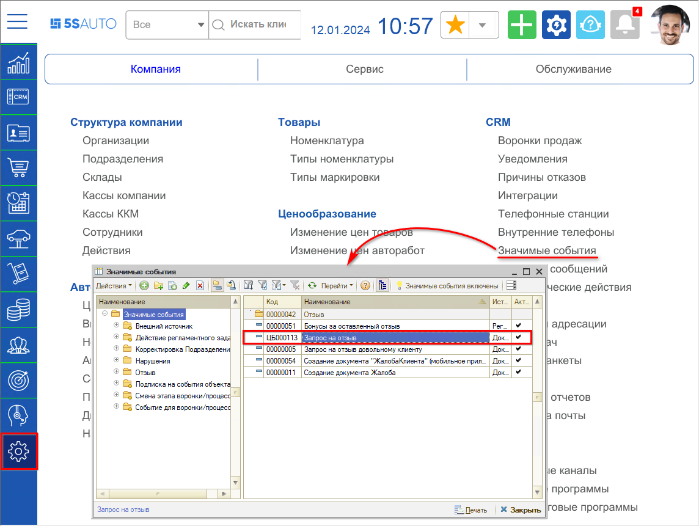

В данном событии нужно прописать ***условия***, при которых будет происходить это действие:

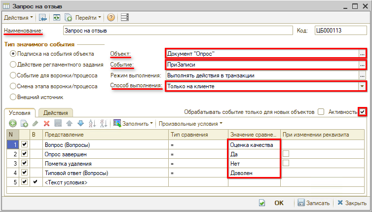

Должны быть заполнены ***параметры:***

1. Наименование документа: *Запрос на отзыв*
2. Объект (источник): *Документ "Опрос"*  
   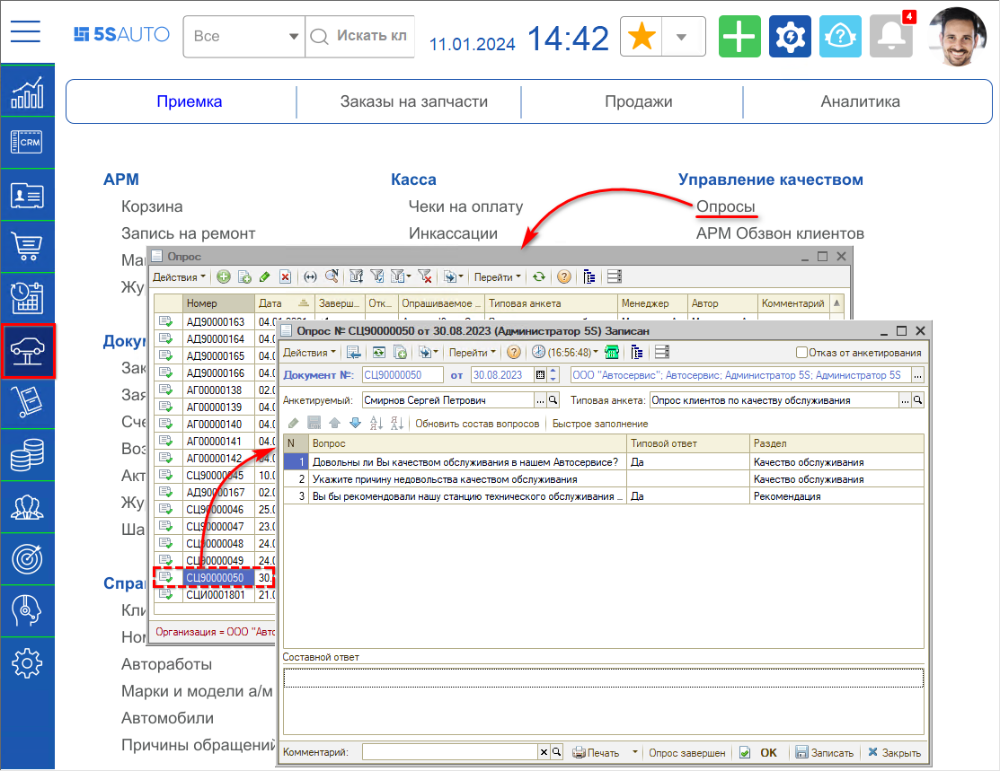
3. Событие: *ПриЗаписи*
4. Способ выполнения: *Только на клиенте*
5. Должен быть проставлен флажок *"Активность"*.

***Вкладка "Условия":***

1. Вопрос (Вопросы) = *Оценка качества*
2. Опрос завершен = *Да*
3. Пометка удаления = *Нет*
4. Типовой ответ (Вопросы) = *Доволен* (т.е. это событие будет происходить только когда клиент отвечает, что *доволен*, - если *"Не доволен"* - то оно не срабатывает).

На ***вкладке "Действия"*** создать действие *"Запрос отзыва":*

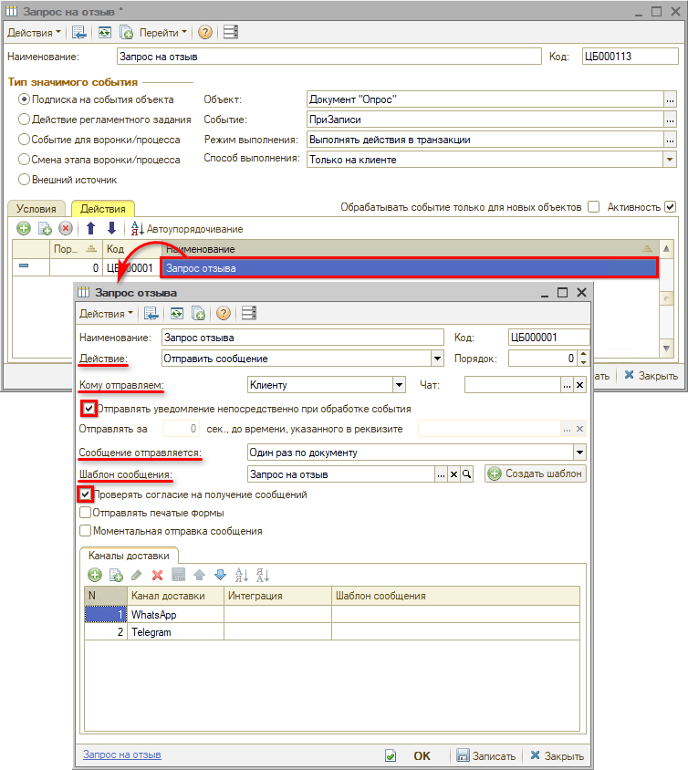

1. Наименование: *Запрос отзыва*
2. Действие: *Отправить сообщение*
3. Кому отправляем: *Клиенту*
4. Сообщение отправляется (вариант отправки): *Один раз по документу*
5. Флажки *"Отправлять уведомление непосредственно при обработке события"* и *"Проверять согласие на получение сообщений"*

Должен быть создан *шаблон сообщения* ***"Запрос на отзыв"***.

## Шаблон сообщения "Запрос на отзыв"

### Создание шаблона сообщения

*Подробную инструкцию создания шаблонов сообщений см. в статье [Шаблоны сообщений](../../Сообщения/Шаблоны%20сообщений/shablony-soobscheniy.md).*

Справочник шаблонов сообщений находится в разделе меню *Маркетинг → Маркетинговые программы → Сообщения → Шаблоны текстовых сообщений:*

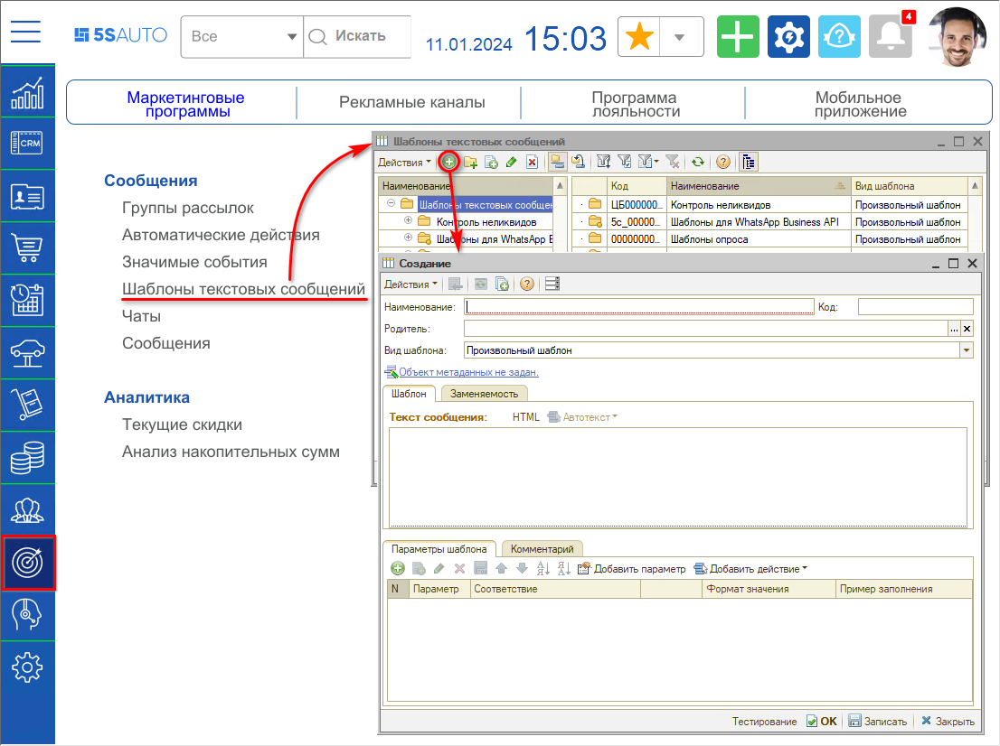

В создаваемом шаблоне можно прописать любой нужный текст, вставить действия.

Сначала действия добавляются в табличную часть, затем кнопкой "Добавить" они добавляются в шаблон сообщения:

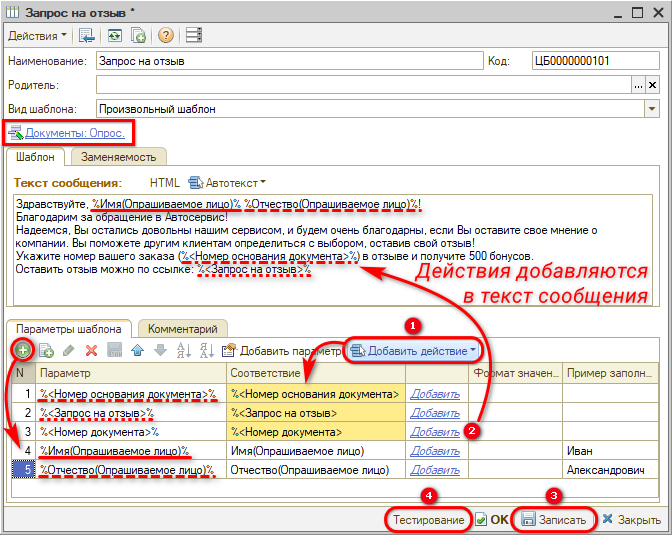

Когда сообщение сформируется, имя опрашиваемого лица, номер заказа и ссылка на сайт подставятся в текст.

Чтобы проверить, как будет выглядеть сообщение – нажать "Записать", затем "Тестирование":

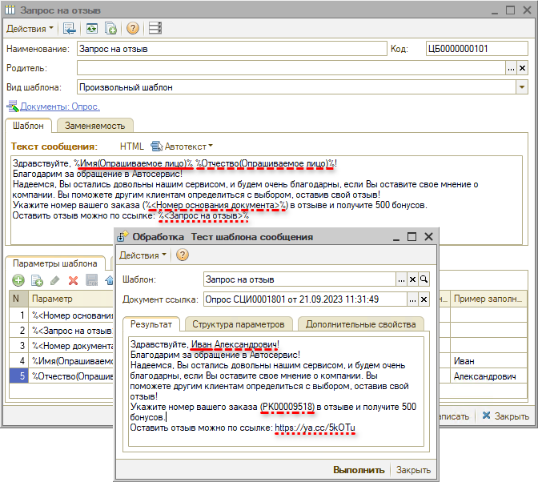

### Создание действия "Запрос на отзыв"

Действие "Запрос на отзыв" нужно создать и настроить, для этого следует перейти в справочник действий – *Администрирование → Компания → Структура компании* *→ Действия:*

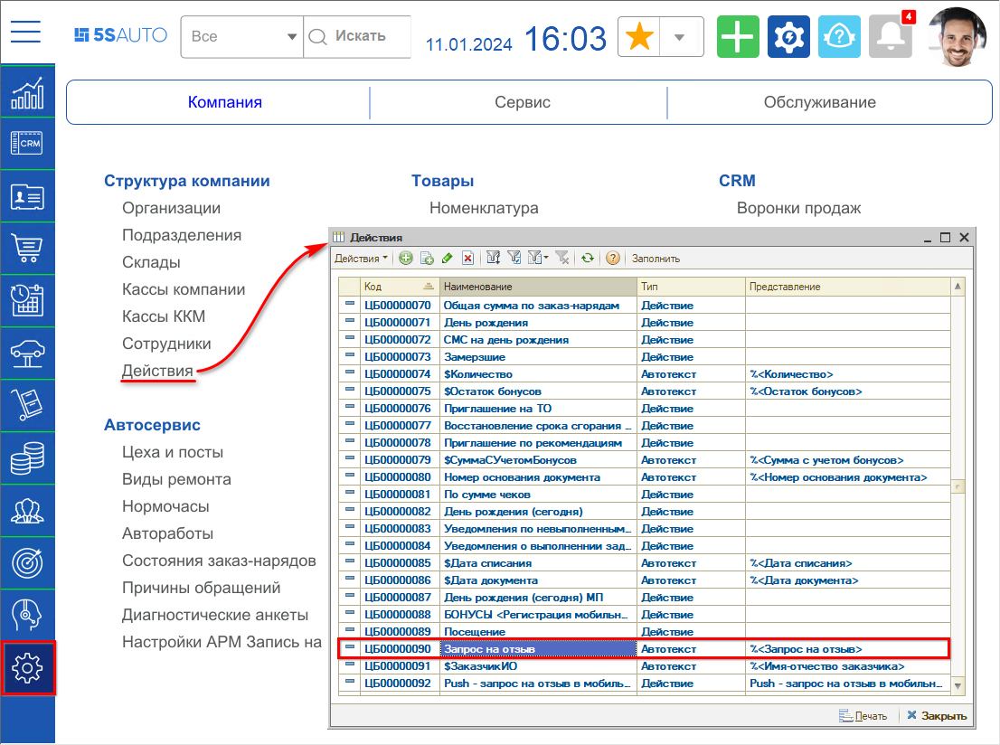

В данном действии в формате кода 1С прописываются нужные условия для вывода автотекста, в том числе добавляются *ссылки на ресурсы,* на которых можно оставить отзыв о компании:

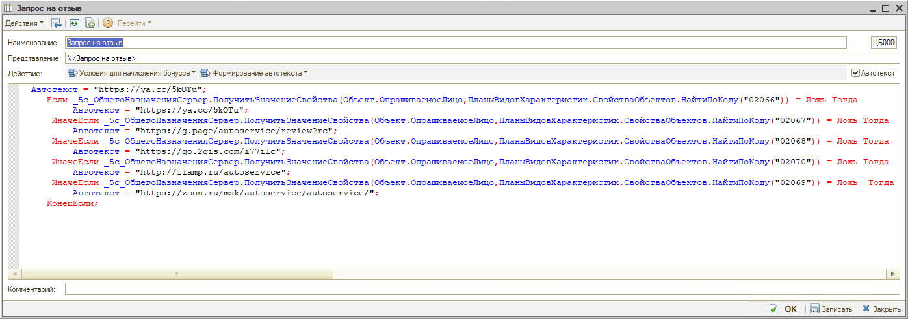

Созданное действие нужно сохранить и подставлять его в шаблоне сообщения (см. [выше](#создание-шаблона-сообщения)).

## Добавление сервисов, на которых можно оставить отзыв

В справочнике "Контрагенты" добавляются свойства на панели свойств – "Отзыв Яндекс", "Отзыв Google" и т.д.:

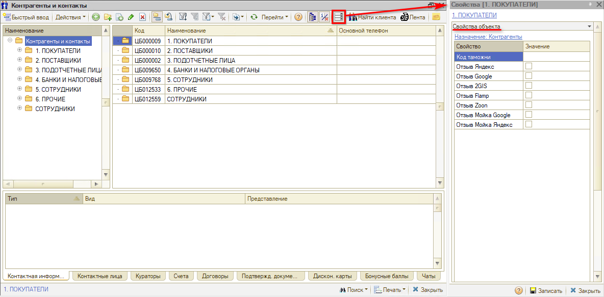

Тип значения свойств настраивается через *План видов характеристик* (Администрирование → Сервис → Настройки → Свойства объектов):

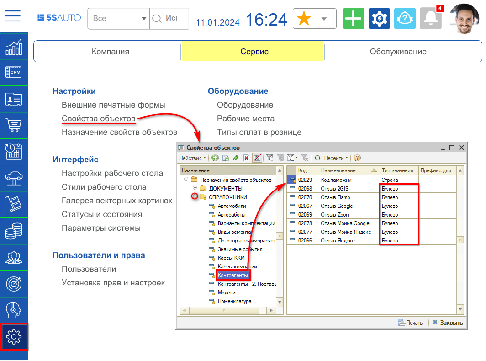

В плане видов характеристик "Свойства объектов" следует перейти в папку "Справочники → Контрагенты" и установить тип значения "Булево".

Когда клиент оставит отзыв, например, на Яндексе, менеджер проставляет галочку на панели свойств у этого контрагента:

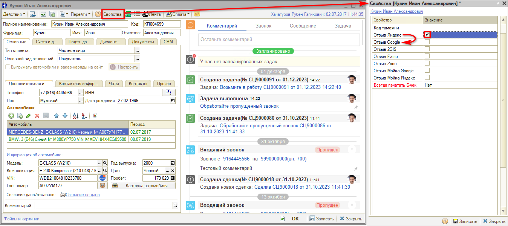

В действии пропишется условие, что *если "Яндекс отзыв" = Истина,* то должна подставляться следующая ссылка, например, на Google. Второй раз сервис не позволяет оставлять отзыв, поэтому в следующий раз клиенту отправляется ссылка на другой сервис. А также данная настройка позволяет собирать хорошие отзывы довольных клиентов на разных ресурсах.

---

**Теги:** практики, отзыв клиента, шаблон сообщения, автоматическое действие, качество обслуживания

