

# Особенности реализации подакцизных товаров

<table><tr><td><b>Время чтения:</b> 14 мин.</td><td><b>Обновлено:</b> 06.02.2025</td></tr></table>

Источник: https://www.5systems.ru/help/osobennosti-realizacii-podakciznykh-tovarov

## Содержание

1. [Введение](#введение)
2. [Настройка организации](#настройка-организации)
3. [Настройка подразделений](#настройка-подразделений)
4. [Настройка номенклатуры](#настройка-номенклатуры)
5. [Оплата](#оплата)

*Статья редактируется*

## Введение

Если организация реализует товары в розницу, используя патентную систему налогообложения (ПСН), необходимо учитывать нюансы, связанные с реализацией подакцизных товаров, указанных в [статье 181 НК РФ](https://www.consultant.ru/document/cons_doc_LAW_28165/c4dda76950086823809763473e10fa70d9707463/#:~:text=6)%20%D0%B0%D0%B2%D1%82%D0%BE%D0%BC%D0%BE%D0%B1%D0%B8%D0%BB%D0%B8%20%D0%BB%D0%B5%D0%B3%D0%BA%D0%BE%D0%B2%D1%8B%D0%B5,10)%20%D0%BF%D1%80%D1%8F%D0%BC%D0%BE%D0%B3%D0%BE%D0%BD%D0%BD%D1%8B%D0%B9%20%D0%B1%D0%B5%D0%BD%D0%B7%D0%B8%D0%BD.), например, [моторных масел](https://www.consultant.ru/document/cons_doc_LAW_28165/c4dda76950086823809763473e10fa70d9707463/#:~:text=9)%20%D0%BC%D0%BE%D1%82%D0%BE%D1%80%D0%BD%D1%8B%D0%B5%20%D0%BC%D0%B0%D1%81%D0%BB%D0%B0%20%D0%B4%D0%BB%D1%8F%20%D0%B4%D0%B8%D0%B7%D0%B5%D0%BB%D1%8C%D0%BD%D1%8B%D1%85%20%D0%B8%20(%D0%B8%D0%BB%D0%B8)%20%D0%BA%D0%B0%D1%80%D0%B1%D1%8E%D1%80%D0%B0%D1%82%D0%BE%D1%80%D0%BD%D1%8B%D1%85%20(%D0%B8%D0%BD%D0%B6%D0%B5%D0%BA%D1%82%D0%BE%D1%80%D0%BD%D1%8B%D1%85)%20%D0%B4%D0%B2%D0%B8%D0%B3%D0%B0%D1%82%D0%B5%D0%BB%D0%B5%D0%B9%3B). Их реализация не попадает под определение розничной торговли, приведенное в [п/п 1 пункта 3 статьи 346.43 НК РФ](https://www.consultant.ru/document/cons_doc_LAW_28165/dfe87d3a71d81daff6243d64c49ef41c5c3302eb/#:~:text=1)%20%D1%80%D0%BE%D0%B7%D0%BD%D0%B8%D1%87%D0%BD%D0%B0%D1%8F%20%D1%82%D0%BE%D1%80%D0%B3%D0%BE%D0%B2%D0%BB%D1%8F,181%20%D0%BD%D0%B0%D1%81%D1%82%D0%BE%D1%8F%D1%89%D0%B5%D0%B3%D0%BE%20%D0%9A%D0%BE%D0%B4%D0%B5%D0%BA%D1%81%D0%B0). Другими словами, на ПСН запрещено продавать подакцизные товары – соответственно, их продажу необходимо учитывать по УСН или ОСНО, то есть, совмещать базовую систему и патент.

Подробнее о настройках системы налогообложения см. [урок](https://5systems.ru/help/kak-nastroit-sistemu-nalogooblozheniya).

В программе предусмотрена возможность автоматического деления чеков по подакцизным товарам и прочим товарам для организаций, использующих ПСН. Для этого предварительно необходимо произвести следующие настройки:

1. Настроить налогообложение в организации – выбрать базовую систему и указать патенты.
2. Настроить подразделения:
   - 1\) Завести виртуальное подразделение для реализации подакцизных товаров, задать в нем настройку для проведения неподакцизных товаров по подразделению с ПСН и включить использование налогообложения по организации;
   - 2\) Настроить налогообложение для подразделения с ПСН, через которое будет осуществляться основная продажа неподакцизных запчастей, и указать в нем созданное виртуальное подразделение для проведения подакцизных товаров.
3. Настроить номенклатуру.

## Настройка организации

В карточке организации указывается базовый вид налогообложения компании, а также существующие патенты:

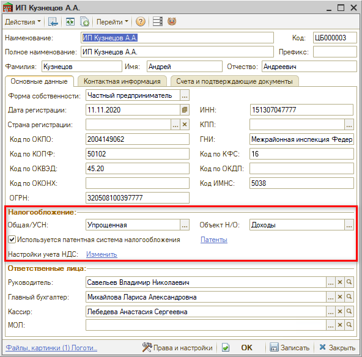

## Настройка подразделений

При использовании патентной системы налогообложения операции, попадающие под патент, учитываются отдельным порядком. Для этого рекомендуется создавать под патент отдельное подразделение в справочнике и настраивать налогообложение по нему.

Для учета продажи подакцизных товаров следует создать отдельное подразделение – удобно делать его дочерним к существующему подразделению с ПСН, которое реализует остальные товары, услуги и автоработы:

1. Установим флаг “Патентная система налогообложения” – при этом появляется ссылка “не задано”, нажатием на которую открывается окно настройки системы налогообложения:  
   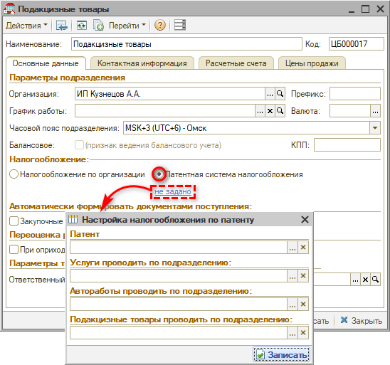
2. В полях “Услуги проводить по подразделению” и “Автоработы проводить по подразделению” укажем подразделение с ПСН, по которому будут проводиться услуги и автоработы:  
   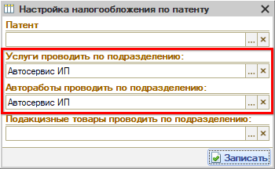
3. Сохраним настройки, нажав кнопку "Записать".
4. Установим налогообложение по организации – таким образом для продажи подакцизных товаров будет использоваться УСН – и сохраним изменения:  
   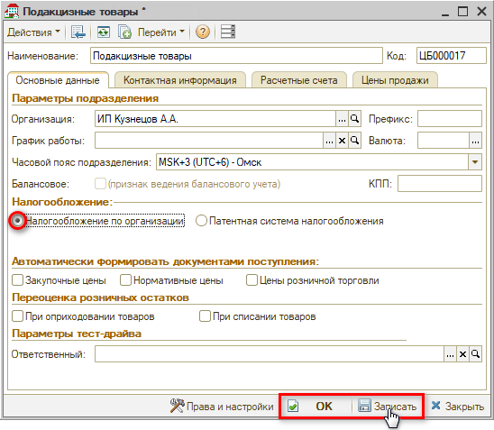

В подразделении с ПСН укажем созданное подразделение в настройке "Подакцизные товары проводить по подразделению":

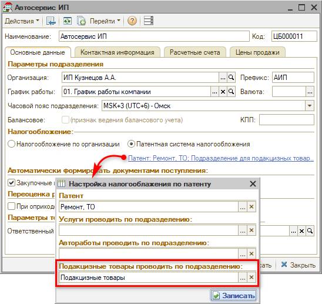

## Настройка номенклатуры

Создайте или отредактируйте *[тип номенклатуры](../../Склад%20и%20запчасти/Номенклатура/nomenklatura.md#типы-номенклатуры),* который используется для подакцизных товаров. У типа номенклатуры должен стоять признак "Подакцизный товар" для того, чтобы проводить оплату подакцизных товаров отдельным чеком:

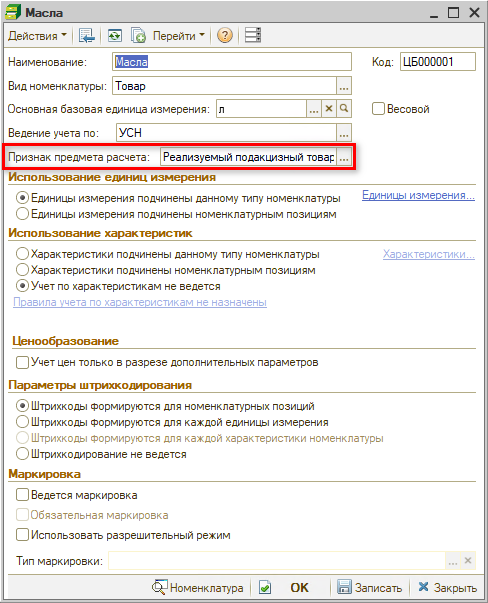

***Обратите внимание!*** Изменение типа номенклатуры требует административных прав и может привести к непредсказуемым последствиям, если данный тип номенклатуры уже участвовал в движениях. Как вариант, можно создать новый тип номенклатуры с признаком "подакцизный товар" и завести новую номенклатуру данного типа.

## Оплата

Любой документ в программе может включать подакцизные товары и прочие товары. При оплате документа программа анализирует его товарный состав и, если по подакцизным товарам выделено виртуальное подразделение, то сформируется два чека на оплату:

1. первый чек сформируется по подразделению из документа, где не будет подакцизных товаров (анализ признака типа номенклатуры);
2. второй чек сформируется с перечнем подакцизных товаров по виртуальному подразделению, которое указано для проведения подакцизных товаров у подразделения из документа.

Режим налогообложения при пробитии чека ККМ берется из настроек подразделения чека на оплату.

Рассмотрим пример одновременной оплаты подакцизных и прочих товаров в документе "Реализация товаров":

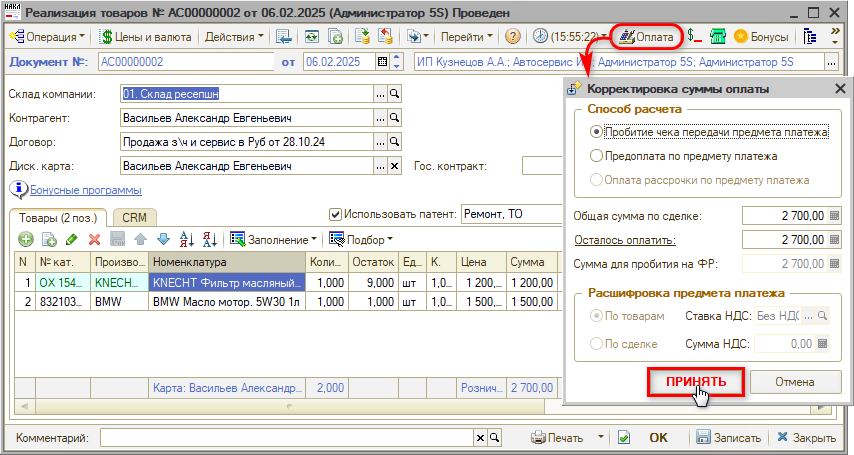

После перехода к пробитию чека программа предупредит, что создано 2 чека. Нажмем кнопку "ОК":

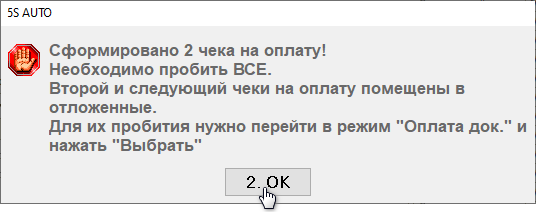

<table><tr><td>Пробьем первый чек:</td><td>Перейдем в режим "Оплата док." и нажмем кнопку "Выбрать":</td></tr><tr><td>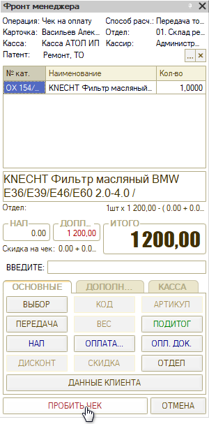</td><td>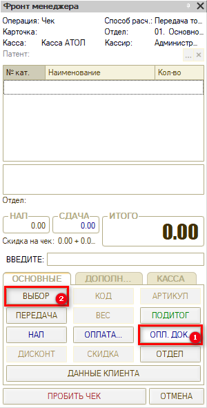</td></tr></table>

<table><tr><td>Выберем отложенный чек двойным кликом левой клавиши мыши:</td><td>Пробьем загруженный во фронт кассира отложенный чек:</td></tr><tr><td>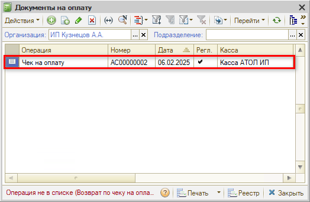</td><td>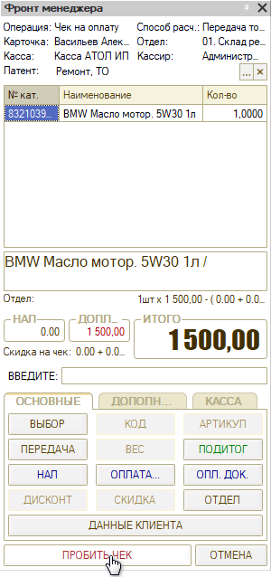</td></tr></table>

В результате по документу сформировалась 2 чека на оплату по разным подразделениям:

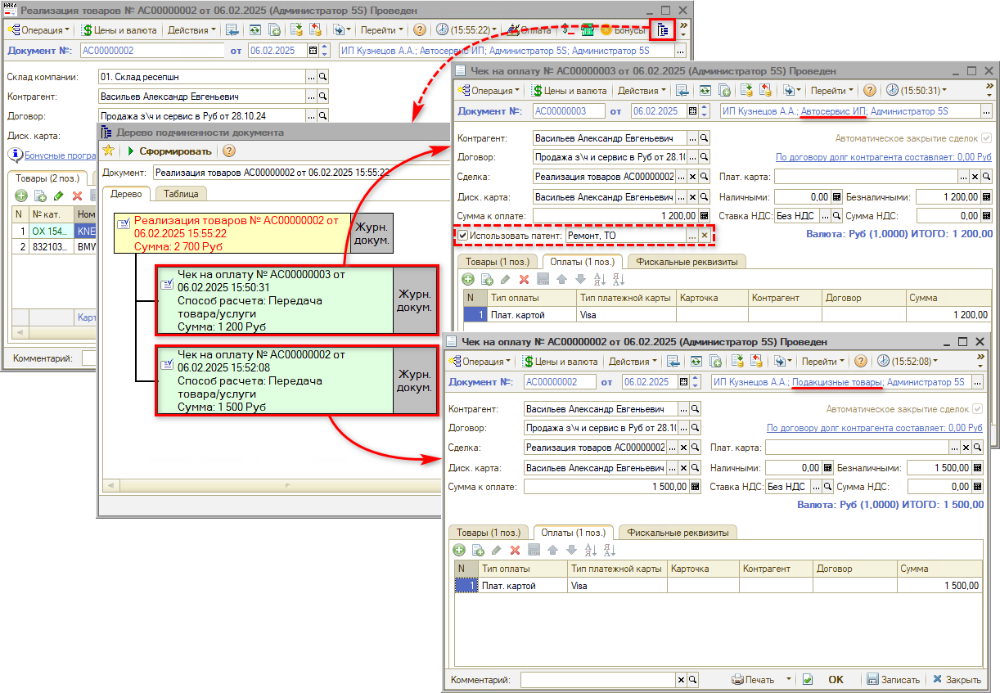

---

**Теги:** практики, подакцизные товары, акциз, налогообложение, номенклатура, чек

