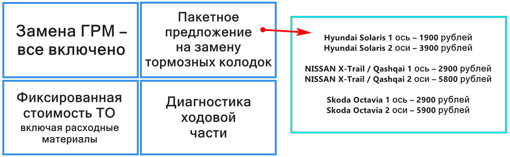
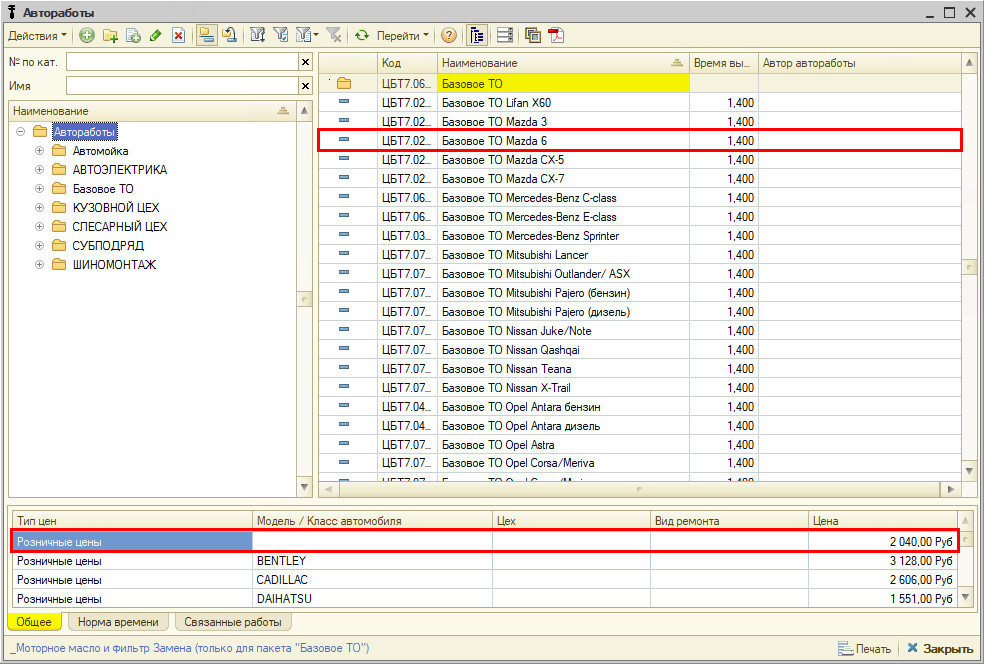
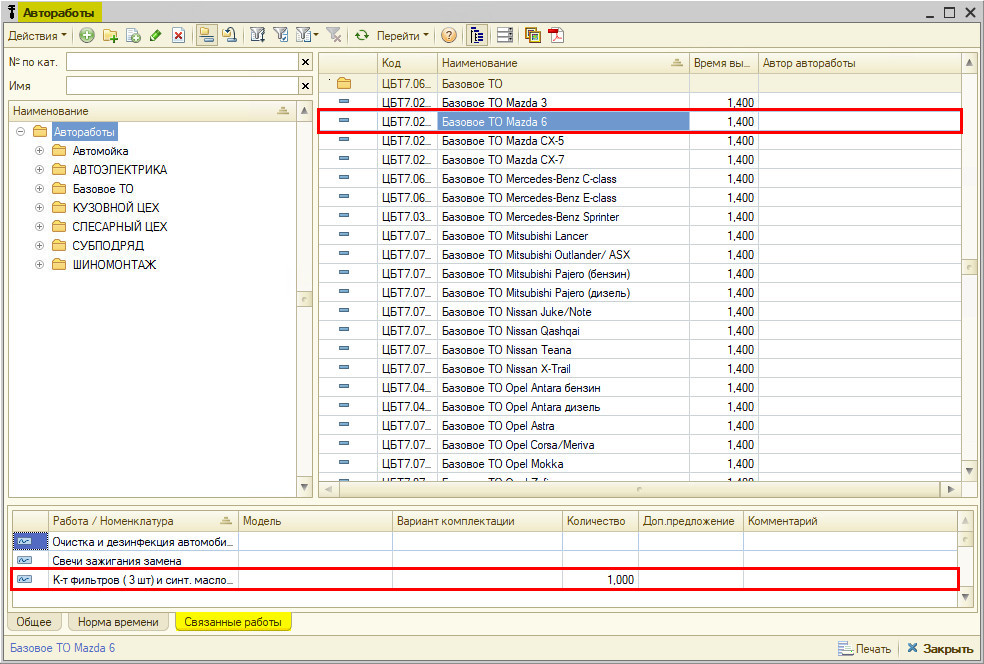
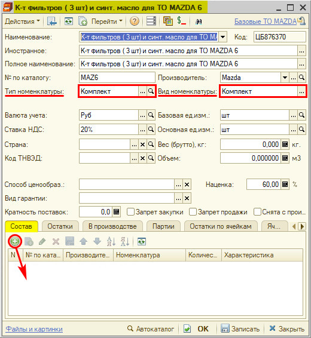
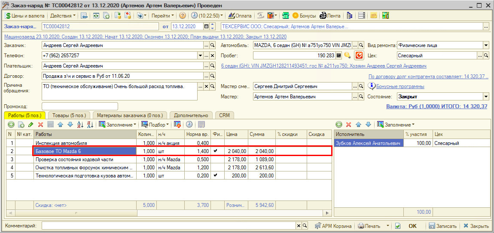
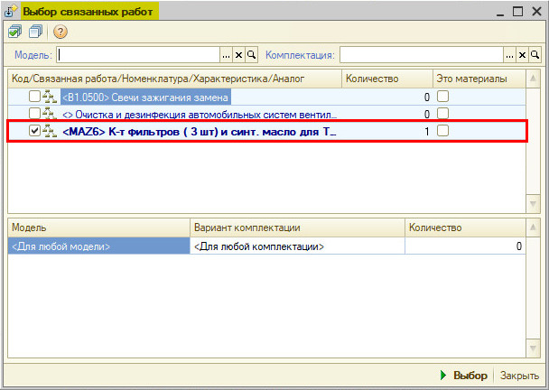
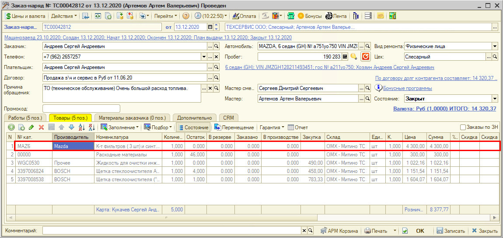
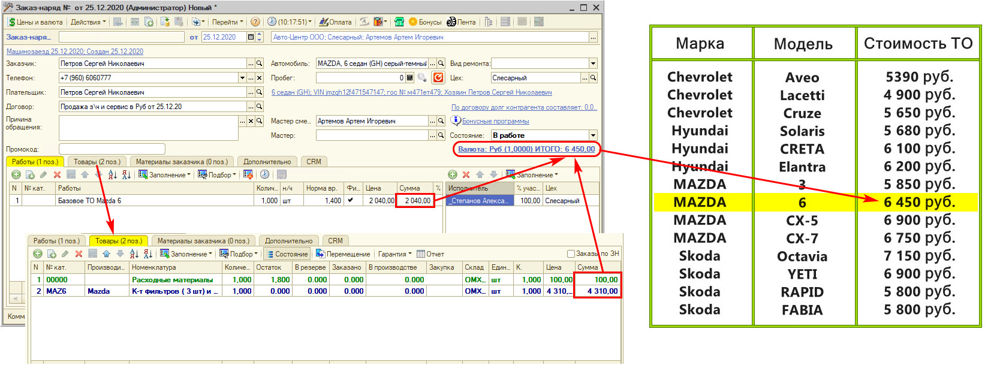
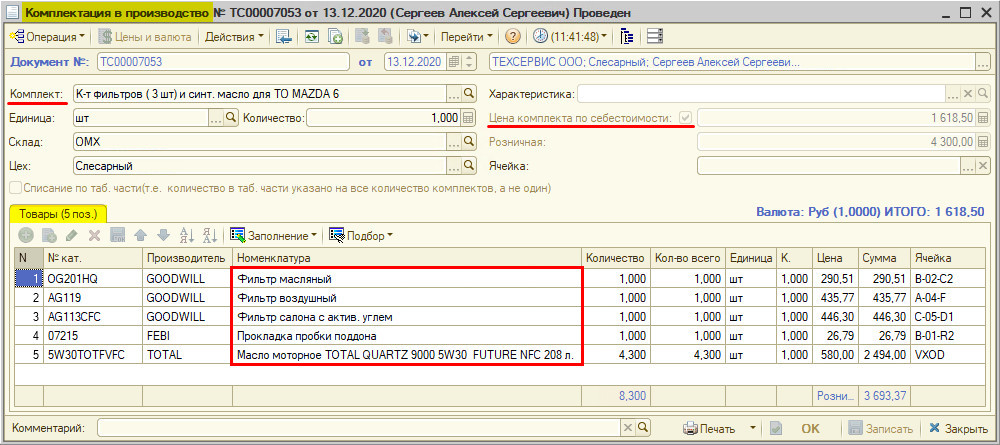

# Пакетные предложения

<table><tr><td><b>Время чтения:</b> 15 мин.</td><td><b>Обновлено:</b> 24.06.2022</td></tr></table>

Источник: https://www.5systems.ru/help/paketnye-predlozheniya

## Содержание

1. [Назначение](#назначение)
2. [Вариант реализации механизма](#вариант-реализации-механизма)
3. [Методика работы с функционалом](#методика-работы-с-функционалом)
   - [Создание автоработы](#создание-автоработы)
   - [Создание комплекта деталей](#создание-комплекта-деталей)
   - [Добавление работы и связанного комплекта в Заказ-наряд](#добавление-работы-и-связанного-комплекта-в-заказ-наряд)
   - [Создание документа «Комплектация в производство»](#создание-документа-комплектация-в-производство)

## Назначение

***Пакетные предложения*** – это маркетинговый инструмент, который позволяет определенный набор услуг и/или товаров предложить за фиксированную стоимость.

Если набирать эти услуги по-отдельности, то они как правило будут стоить дороже, и их стоимость может варьироваться, – особенно если речь идет о взаимозаменяемых деталях.

Таким образом, пакетные предложения привлекательны для клиента. Для сервиса использование данного механизма удобно тем, что он значительно упрощает проценку и ускоряет работу менеджеров, а также помогает привлекать новых клиентов.

## Вариант реализации механизма

Удобно делать пакетные предложения на самые популярные услуги: замена ГРМ, замена тормозных колодок, замена фильтров, диагностика ходовой части и др.

Указывается фиксированная стоимость предложения для автомобилей разных марок и моделей.

## Методика работы с функционалом

Рассмотрим методику работы с функционалом на примере ТО.

### Создание автоработы

В справочнике «Автоработы» создаются элементы, каждый из которых представляет собой работу и связанный с ней комплект деталей – для каждой модели автомобиля.

Справочники → Автосервис → Автоработы → Базовое ТО

К автоработе вида «Базовое ТО <марка>» в «Связанных работах» привязана номенклатура «Комплект фильтров». На номенклатуру назначена определенная цена.

### Создание комплекта деталей

Комплект фильтров имеет тип номенклатуры «Комплект». В рассматриваемом примере в него входят: фильтр масляный, фильтр воздушный, фильтр салона с актив.углем, прокладка пробки поддона и масло моторное.

Во вкладке «Состав» можно указать состав – что входит в состав комплекта по умолчанию. Тогда при создании на основании Заказ-наряда документа «Комплектация в производство» указанные товары будут подтягиваться отсюда (см. *ниже*).

Второй вариант, – если комплект динамический, и в него каждый раз могут входить разные детали, – не указывать состав комплекта в карточке номенклатуры, а заполнять комплектацию каждый раз из Корзины.

### Добавление работы и связанного комплекта в Заказ-наряд

В Заказ-наряд добавляется работа «Базовое ТО».

Программа предлагает выбрать связанный с работой комплект фильтров.

Выбранный комплект будет отображаться во вкладке «Товары» Заказ-наряда.

Итоговая стоимость пакетного предложения на сайте включает автоработу «Базовое ТО», товар «Комплект фильтров» и расходные материалы.

Стоимость автоработы реальная (автоматически рассчитывается по нормочасу, по ней будет рассчитываться выработка исполнителю), стоимость расходных материалов рассчитывается в процентах от нее. Стоимость комплекта деталей можно вручную скорректировать так, чтобы итоговая стоимость выходила ровно такой же, как цена данного пакетного предложения на сайте.

### Создание документа «Комплектация в производство»

Чтобы произошло списание комплекта деталей со склада, нужно его скомплектовать в производство. Для этого на основании Заказ-наряда создается документ «Комплектация в производство»: в нем требуется выбрать нужный комплект. Товары *подтягиваются из карточки номенклатуры*, либо добавляются вручную. Должна стоять «галочка» «Цена комплекта по себестоимости», чтобы товары списывались со склада по себестоимости.

---

**Теги:** практики, пакетные предложения, наборы, ценообразование, продажи
