

# Применение НДС при УСН

<table><tr><td><b>Время чтения:</b> 17 мин.</td><td><b>Обновлено:</b> 19.01.2026</td></tr></table>

Источник: https://www.5systems.ru/help/primenenie-nds-pri-usn

> *Актуально начиная с версии релиза 5S AUTO **2.8.3.12**.*

## Содержание

1. [Введение](#введение)
2. [Настройки](#настройки)
   - [1. Настройка справочника ставок НДС](#1-настройка-справочника-ставок-ндс)
   - [2. Настройка в карточке организации](#2-настройка-в-карточке-организации)
   - [3. Настройка в справочнике “Оборудование”](#3-настройка-в-справочнике-оборудование)
   - [4. Настройки для совмещения режимов УСН и ПСН](#4-настройки-для-совмещения-режимов-усн-и-псн)

## Введение

С 2025 года организации и индивидуальные предприниматели, применяющие упрощенную систему налогообложения, были признаны плательщиками налога на добавленную стоимость.

Согласно Федеральному закону № 176-ФЗ с 01.01.2025 г. стало обязательным при доходах свыше 60 млн рублей начислять НДС с реализации и выставлять счета-фактуры с налогом, для уплаты которого доступно два варианта:

- платить налог по обычной ставке (20% или 10%) и применять вычеты;
- платить налог по пониженной ставке (5% или 7%), но без применения вычетов входного НДС.

Также в 2025 году ИП на ПСН утрачивали право на применение этого спецрежима, если их доход превышал 60 миллионов рублей.

**С 01.01.2026 г. вступают в силу поправки, внесенные новым [Федеральным законом № 425-ФЗ](http://publication.pravo.gov.ru/document/0001202511280017):**

1. увеличена базовая ставка НДС до 22%. При этом сохраняется НДС 10% для некоторых групп социально-значимых товаров, например, продуктов питания;
2. снижен порог доходов для компаний, применяющих специальные налоговые режимы, позволяющий применять УСН без уплаты НДС: плательщиками НДС обязаны стать компании, достигшие дохода в *20 миллионов рублей* по итогам 2025 года.

   *Примечание:* Поправками предусмотрено поэтапное ежегодное снижение порога доходов для уплаты НДС на УСН. В 2026 году он составит 20 млн руб., в 2027 году – 15 млн руб., а начиная с 2028 года – 10 млн руб. При этом налогоплательщиков на УСН сразу не будут привлекать к ответственности за непредставление первой декларации при уплате НДС по новым правилам;

3. снижен порог для ИП на ПСН до 20 миллионов, т.е. ПСН не смогут применять ИП, которые совокупно за 2025 год получили доход выше 20 млн руб.

*Примечание:* Доход по патенту рассчитывается по книге учета доходов и расходов.  Если патентов у ИП было несколько на разные виды деятельности, то при определении общего объема выручки доход суммируется.

Налогоплательщики, применяющие УСН и впервые ставшие плательщиками НДС, смогут выбрать либо общую ставку НДС 22%, либо специальные ставки 5% или 7%. Размер пониженной ставки зависит от суммы доходов:

- 5% – если годовой доход составляет от 20 миллионов до 272,5 миллионов рублей (ранее – 250 миллионов);
- 7% – если доходы с начала года превысили 272,5 миллионов, но не достигли 490,5 миллионов рублей (ранее – 450 миллионов).

При этом общая ставка НДС 22% позволяет принимать к вычету налог, предъявленный продавцами, а специальные ставки 5% и 7% не дают возможности применять налоговые вычеты при расчете налога.

Для компаний на УСН предусмотрены особые условия выбора ставок:

- переход с общей ставки 22% на пониженную ставку 5% или 7% осуществляется с первого числа любого налогового периода (квартала);
- с пониженной ставки 5% или 7% перейти на общую ставку 22% можно в течение первых четырех кварталов ее применения;
- компании и ИП на УСН, которые впервые перешли на уплату НДС по ставке 5% или 7%, в течение первого года смогут от них отказаться, не дожидаясь истечения 3-летнего срока (ранее, в 2025 г., было необходимо применять пониженные ставки непрерывно три года подряд).

Также есть операции, в отношении которых, несмотря на переход на пониженные ставки 5% и 7%, налог нужно рассчитывать по иным ставкам:

- ввоз товаров в Российскую Федерацию – облагаются по общеустановленным ставкам;
- для экспортных операций сохраняется льготный НДС 0%.

Если компания работает на ПСН + ОСНО, есть возможность перейти на УСН. Заявление о переходе на УСН необходимо подать ***до конца 2025 года**.* Если этого не сделать, компания автоматически останется на ОСНО до конца следующего года.

**Автоматизированная упрощенная система налогообложения (АУСН)**

*АУСН (или АвтоУСН)* – это вариант упрощенной системы налогообложения, при котором налоги рассчитываются автоматически, причем налоговым органом и банками, а не самим налогоплательщиком. Это экспериментальная система, установленная законом от 25.02.2022 N 17-ФЗ, срок эксперимента – до 31 декабря 2027 года.

Автоматизированная упрощенная система с 01.01.2026 г., скорее всего, меняться не будет, законопроект ее не затрагивает. Прежними на этом режиме остаются:

- лимит дохода – 60 млн рублей в год;
- НДС не взимается;
- ставки налога УСН – 8% для объекта налогообложения “Доходы” и 20% для объекта “Доходы уменьшенные на величину расходов”. Ставку можно выбрать при переходе на АУСН, а также раз в год с 1 января.

Перейти на АвтоУСН могут налогоплательщики, применяющие УСН или НПД, с 1 числа любого месяца года. У компаний на УСН или НПД есть возможность перейти на АУСН, не дожидаясь конца текущего года. С остальных налоговых режимов переход разрешен с января 2026 года – уведомление необходимо подать ***не позже 31.12.2025**.*

Применять АУСН могут применять только организации и индивидуальные предприниматели, у которых одновременно соблюдаются следующие условия:

- регистрация в налоговых органах (место нахождения организации или место жительства физического лица (для ИП)) субъекта РФ, в котором проводится эксперимент по АвтоУСН;
- численность работников не более 5 человек;
- годовой доход не более 60 млн руб.;
- остаточная стоимость основных средств не более 150 млн руб.;
- расчетные счета открыты только в [уполномоченных банках](https://ausn.nalog.gov.ru/#block07ancor);
- заработная плата работникам выплачивается только в безналичной форме;
- не применяют иные специальные налоговые режимы;
- иные условия, установленные п. 2 ст. 3 Федерального закона от 05.02.2022 № 17-ФЗ.

Совмещение АвтоУСН с иными режимами налогообложения не допускается.

Подробности см. на [сайте ФНС](https://www.nalog.gov.ru/rn77/taxation/taxes/autotax_system/).

Следует учитывать, что АУСН – это экспериментальная система, поэтому нельзя исключать, что до окончания срока эксперимента какие-либо условия могут поменяться.

**Подробнее по вопросу применения новых ставок НДС см. материалы:**

1. Статья на сайте ФНС: [С 1 января 2026 года изменятся условия для применения спецрежимов](https://www.nalog.gov.ru/rn92/news/activities_fts/16586778/);
2. Памятка на сайте ФНС: [Налоги 2026](https://www.nalog.gov.ru/new2026/);
3. [Методические рекомендации по НДС для УСН’2026](https://data.nalog.ru/html/sites/www.new.nalog.ru/doc/metod_usn_nds_2026.pdf) на сайте ФНС;
4. Статья на сайте компании “Гарант”: [Налоговая реформа – 2026: ставка НДС 22%, новые пороги доходов для МСБ, преференции для бизнеса и льготы для граждан](https://www.garant.ru/news/1913232/);
5. Статья на сайте 1С: [НДС на УСН в 2026 году: ответы на самые актуальные вопросы налогоплательщиков](https://v8.1c.ru/metod/article/nds-na-usn-v-2026-godu-otvety-na-samye-aktualnye-voprosy-nalogoplatelshchikov.htm) и другие [материалы по теме Налоги 2026](https://v8.1c.ru/metod/tag-nalogi-2026/);
6. Статья на сайте 1С: [Что выбрать рознице 2026 году при утрате права на патент?](https://v8.1c.ru/metod/article/chto-vybrat-roznitse-2026-godu-pri-utrate-prava-na-patent.htm)
7. Статья на сайте ФНС: [Автоматизированная упрощенная система налогообложения](https://www.nalog.gov.ru/rn77/taxation/taxes/autotax_system/), а также [сайт АУСН](https://ausn.nalog.gov.ru/).

***При переходе на новые налоговые ставки необходимо:***

- обновить кассу до ФФД 1.2;
- обновить прошивку кассы на актуальную версию;
- обновить драйвер ККТ;
- произвести настройки в программе для отражения в учете операций с новыми ставками НДС;
- пересмотреть ценовую политику (например, включить увеличившуюся налоговую нагрузку в стоимость товаров).

*Примечание:* Если компания работала на ставке 5% или 7%, и продолжит работать на них в 2026 году (а также если компания работала на ПСН и останется на ПСН согласно новым условиям), то обновление кассовой программы и перепрошивка кассы не требуются.

## Настройки

### 1. Настройка справочника ставок НДС

Для настройки новых налоговых ставок следует перейти в справочник *“Ставки НДС”* – *Администрирование → Компания → Прочие классификаторы → Ставки НДС.* В справочник добавлены (в актуальной версии релиза программы) предопределенные элементы с налоговыми ставками 5%, 7% и 22%:

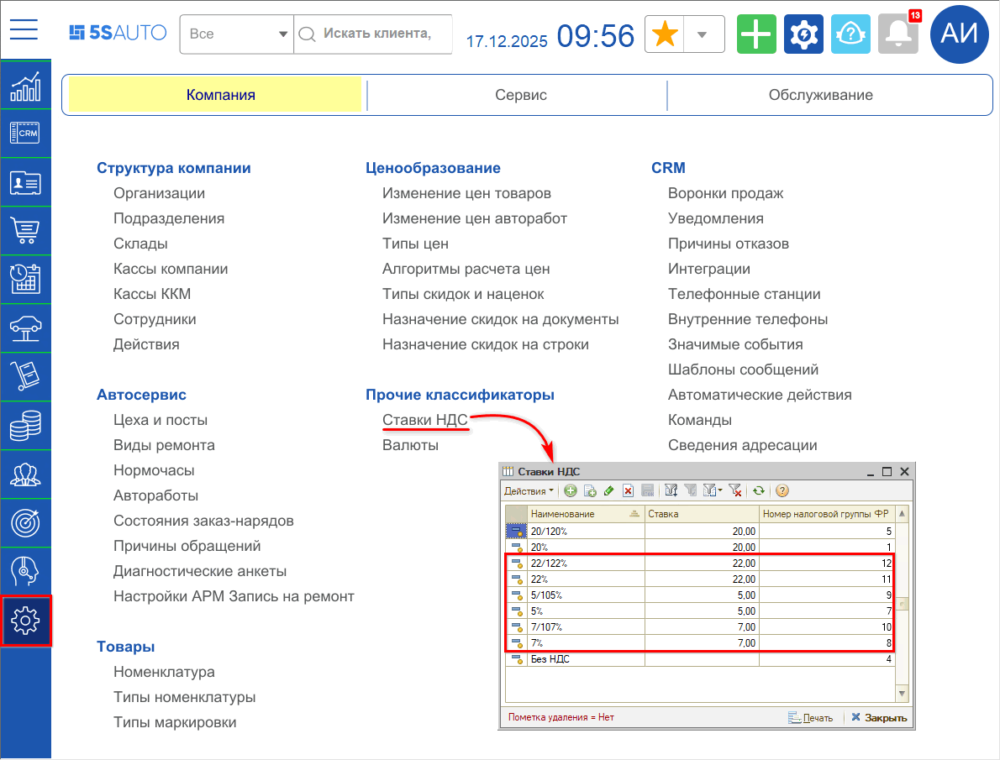

Необходимо задать *номер налоговой группы,* который указан *в настройках драйвера ФР* (на скриншоте приведен пример настройки налоговых групп для кассы “ШТРИХ-М”). Также см. описание в статье *"[Подключение кассы ККМ → Ставки НДС и налоговые группы](../../Торговое%20оборудование/Подключение%20кассы%20ККМ/podklyuchenie-kassy-kkm.md#ставки-ндс-и-налоговые-группы)".*

***Важно!*** *Требования к кассам:*

- прошивка кассы должна быть обновлена на актуальную версию;
- обязателен ФФД 1.2 – требуется обновить, если это не было сделано ранее;
- установлен новый драйвер;
- если несколько организаций – обновление и настройку касс необходимо выполнить для каждой организации.

**Соответствие номеров налоговых групп и ставок НДС**

1. Для кассы "Штрих":
   - 1 – 20%;
   - 4 – Без НДС;
   - 5 – 20/120%;
   - 7 – 5%;
   - 8 – 7%;
   - 9 – 5/105%;
   - 10 – 7/107%;
   - 11 – 22%;
   - 12 – 22/122.
2. Для кассы “АТОЛ”:
   - 6 – Без НДС;
   - 7 – 20%;
   - 8 – 20/120%;
   - 9 – 5%;
   - 10 – 7%;
   - 11 – 5/105%;
   - 12 – 7/107%;
   - 13 – 22%
   - 14 – 22/122.

*Примечание:* Т.к. для настроек касс “ШТРИХ-М” и “АТОЛ” применяются разные номера налоговых групп, то в случае использования разных брендов касс в компании необходимо дополнительно настроить соответствие налоговых групп в справочнике “Оборудование” – для каждой кассы (см. [ниже](#3-настройка-в-справочнике-оборудование)). В случае использования касс одного производителя следует настроить налоговые группы в общем справочнике “Ставки НДС”, в оборудовании в данном случае их можно не настраивать.

### 2. Настройка в карточке организации

В случае работы по УСН необходимо настроить *ставку НДС по умолчанию* в *[карточке “Организации”](../../Структура%20компании/Справочник%20Организации/spravochnik-organizacii.md):*

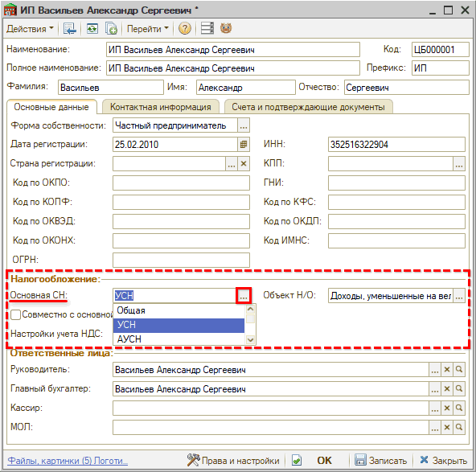

Есть возможность выбрать одно из 3-х значений:

1. Общая система налогообложения (ОСН/ОСНО)
2. УСН – Упрощенная система налогообложения
3. АУСН – Автоматическая упрощенная система налогообложения

Также следует выбрать *объект Н/О* (налогообложения): “Доходы”, либо “Доходы, уменьшенные на величину расходов” – в соответствии с налоговой политикой компании.

При выборе упрощенной системы налогообложения (УСН) становится активной кнопка-ссылка *изменения настройки учета НДС:*

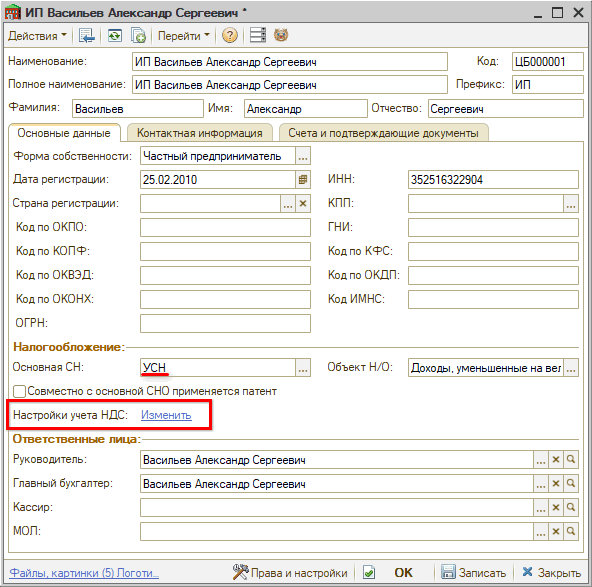

При нажатии на данную ссылку открывается *окно выбора ставки НДС:*

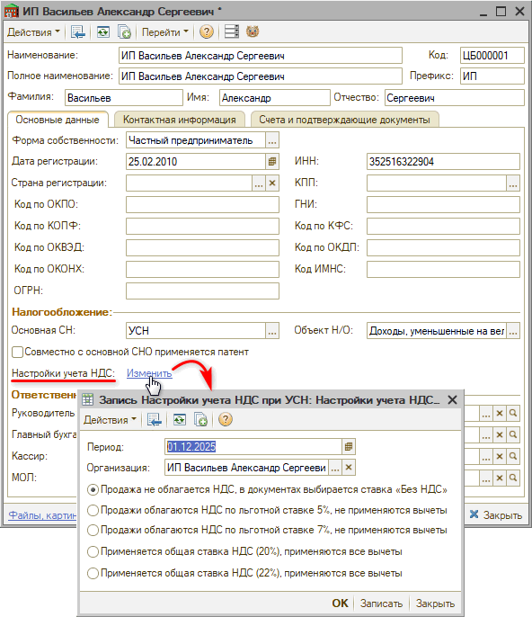

Требуется задать *период,* с которого начинает действовать новая ставка (автоматически устанавливается на начало текущего месяца): *01.01.2026 г.*

Также необходимо выбрать нужную ставку НДС в соответствии с налоговой политикой компании и записать изменения:

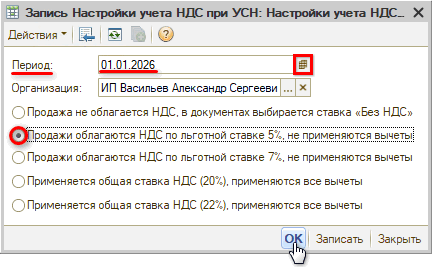

История установки ставок сохраняется в специальном регистре.

После записи изменений ставка НДС из настроек налогообложения организации будет автоматически подтягиваться в документы продажи начиная с заданной в настройках даты:

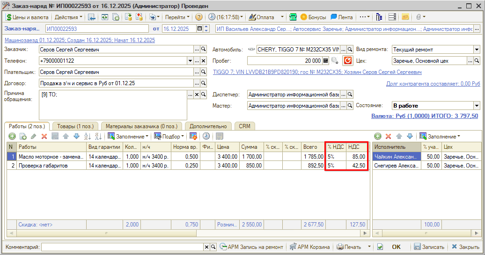

### 3. Настройка в справочнике “Оборудование”

В случае использования нескольких касс разных производителей (Штрих/АТОЛ) номера налоговых групп в настройках ставок НДС будут различаться. Необходимо для каждого вида кассы ККМ задать свою нумерацию налоговых групп.

Настройку *соответствий налоговых групп* следует произвести в справочнике “Оборудование” *для каждого* используемого ФР. Для этого следует активировать строку с нужным оборудованием и перейти по кнопке *“Оборудование → Настроить налоговые группы ФР”:*

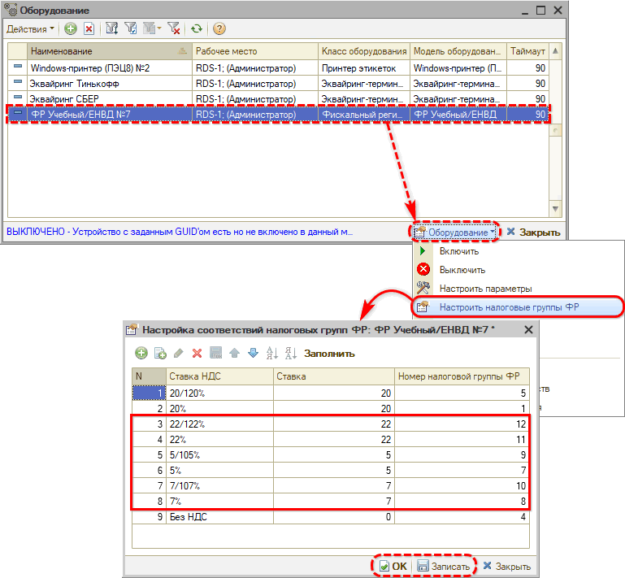

Необходимо указать номера налоговых групп из настроек драйверов ФР. Прошивка кассы должна быть обновлена на актуальную версию и установлен новый драйвер.

Настройка номера налоговой группы в карточке оборудования будет выше по приоритету, чем настройка в справочнике ставок НДС (см. [выше](#1-настройка-справочника-ставок-ндс)), т.е. налоговая группа будет подтягиваться в кассовые документы в первую очередь из настроек оборудования.

1. Пример настройки для касс “ШТРИХ-М”:

   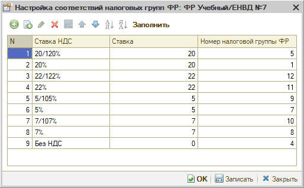

2. Пример настройки для касс “АТОЛ”:

   

### 4. Настройки для совмещения режимов УСН и ПСН

> *Актуально начиная с релиза **2.8.3.12**.*

**Особенности совмещения режимов УСН и ПСН**

В случае если компания совмещает режимы налогообложения УСН и ПСН – например, патент на автоработы, – для продажи запчастей и для оказания услуг должны использоваться разные ставки НДС, например, 5% на товары (по УСН) и "без НДС" – для авторабот (по патенту).

Настройка применения патентной СН производится в *карточках подразделений.* Для рассматриваемого примера сочетания систем налогообложения рекомендуется в настройках основного подразделения выбрать патент, создать второе (виртуальное) подразделение для пробития товаров, в нем указать проведение авторабот по основному подразделению и вернуть переключатель на "Налогообложение по организации" – подробное описание настроек см. в статьях "[Как настроить систему налогообложения](https://www.5systems.ru/help/kak-nastroit-sistemu-nalogooblozheniya)" и "[Особенности реализации подакцизных товаров](../Особенности%20реализации%20подакцизных%20товаров/osobennosti-realizacii-podakciznykh-tovarov.md)".

Для подразделения, в котором выбран патент, ставка "Без НДС" будет устанавливаться на все строки документов – и на товары, и на услуги. Для того, чтобы в Корзине, Заявках на ремонт и Заказ-нарядах на товары устанавливалась ставка НДС по УСН (например, 5%), требуется произвести дополнительные настройки в карточке *[вида ремонта](../../Автосервис/Виды%20ремонта/vidy-remonta.md).*

*Примечание:* При выборе в настройках подразделения варианта "Налогообложение по организации", система налогообложения для подразделения будет подтягиваться из карточки организации (см. [выше](#2-настройка-в-карточке-организации)), к которой принадлежит данное подразделение.

**Настройка НДС в карточке "Вида ремонта"**

О работе со справочником *“Виды ремонта”* см. [основную статью](../../Автосервис/Виды%20ремонта/vidy-remonta.md). В карточке вида ремонта следует перейти на *вкладку **“НДС”*** – настройки по умолчанию на данной вкладке выглядят следующим образом:

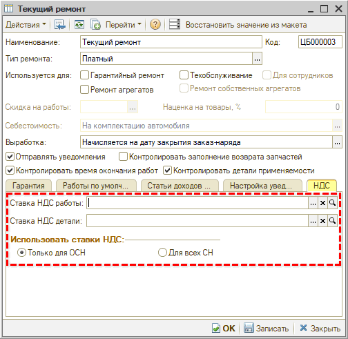

1. *Установка ставок НДС для работ и деталей*

   Для корректного учета ставок НДС в случае совмещения ПСН и УСН следует установить в настройках вида ремонта, который будет использоваться в документах патентного подразделения, следующие значения:

   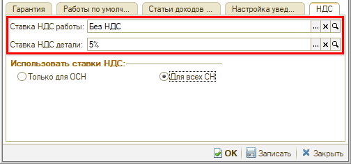

   - *Ставка НДС работы* – следует оставить параметр пустым (тогда будет подтягиваться ставка НДС по патентному подразделению) либо указать значение ставки “Без НДС”;
   - *Ставка НДС детали* – установить значение ставки НДС в соответствии с УСН, например, 5%.

     *Примечание:* Настройка ставок НДС в карточке вида ремонта имеет более высокий приоритет, чем настройки учета НДС в карточках организации (см. [выше](#2-настройка-в-карточке-организации)) и подразделения. В случае, если параметры "Ставка НДС работы" и "Ставка НДС детали" в виде ремонта не будут заполнены, значения ставок НДС в документы будут подтягиваться из настроек учета НДС по подразделению.

2. *Настройка использования ставок НДС*

   В разделе *“Использовать ставки НДС”* по умолчанию установлен переключатель “Только для ОСН” – при выборе данной настройки указанные в виде ремонта ставки будут действовать только для общей системы налогообложения (ОСН).

   Для применения указанных ставок ко всем остальным системам налогообложения необходимо установить переключатель на вариант *“Для всех СН”:*

   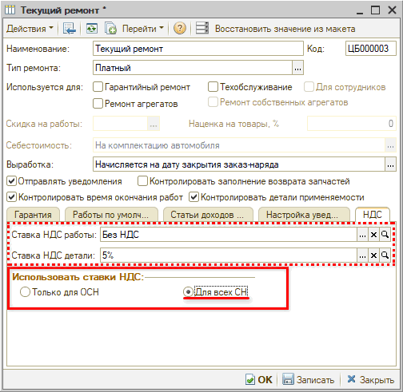

   При выборе данного варианта указанные выше ставки будут действовать для всех систем налогообложения. Таким образом, в случае совмещения УСН и ПСН, в Корзине, Заявках на ремонт и Заказ-нарядах для товаров будет устанавливаться НДС 5%, для работ – без НДС:

   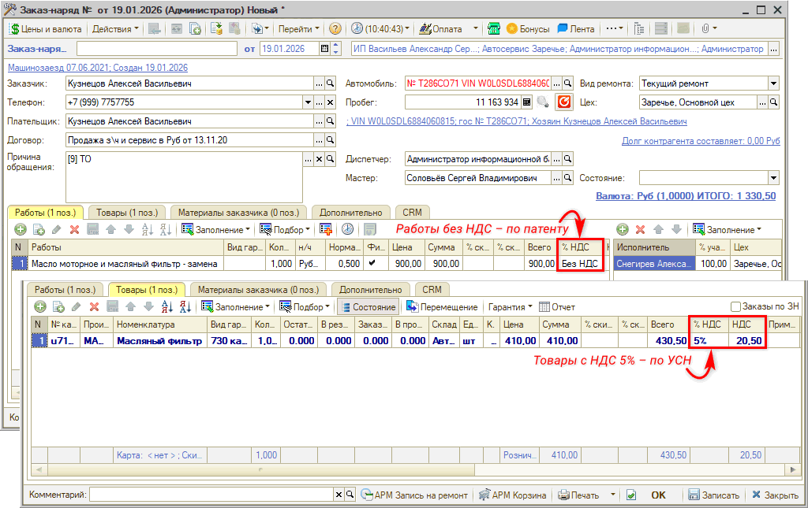

---

**Теги:** практики, ндс, усн, псн, ставки ндс, организация, касса

