

# Разделение чеков ККМ

<table><tr><td><b>Время чтения:</b> 24 мин.</td><td><b>Обновлено:</b> 04.06.2024</td></tr></table>

Источник: https://www.5systems.ru/help/razdelenie-chekov-kkm

> *Актуально начиная с версии релиза 5S AUTO **2.7.1**.*

## Содержание

1. [Введение](#введение)
2. [Раздельное пробитие чеков](#раздельное-пробитие-чеков)
   - [1. Принятие предоплаты](#1-принятие-предоплаты)
   - [2. Окончательный расчет](#2-окончательный-расчет)
   - [3. Частичная оплата](#3-частичная-оплата)
   - [4. Безналичная оплата](#4-безналичная-оплата)
   - [5. Возврат](#5-возврат)
   - [Выбор кассы ККМ](#выбор-кассы-ккм)
   - [Возможные ошибки](#возможные-ошибки)
3. [Настройки](#настройки)
   - [Настройка принадлежности подразделения](#настройка-принадлежности-подразделения)
   - [Настройка прав](#настройка-прав)
   - [Настройка оборудования](#настройка-оборудования)

## Введение

В случае работы компании по упрощенной системе налогообложения (УСН) предусмотрены лимиты по выручке. Если всю оплату проводить через одну организацию, есть риск выйти за пределы лимитов.

Работа на патентной системе также несет за собой ограничения на доход и на численность сотрудников. Помимо этого, если автосервис работает на патенте, то пробивать можно только оплату за услуги. Такая схема не подходит в случае, если компания занимается дополнительно продажей запчастей и автожидкостей или оказывает смежные услуги, например, установку сигнализаций и автозвука. Требуется оформлять отдельный патент для продажи товаров либо проводить их реализацию по УСН.

В таких ситуациях возникает необходимость раздельного пробития чеков для товаров и услуг, и эта функция представляет собой легальную схему разделения выручки с целью уменьшения налоговых сумм.

Если у компании зарегистрировано две или более организаций, и на каждую из них оформлена касса, есть возможность разбивать чек ККМ на два и пробивать товары и услуги на разных кассах, подключенных к одному рабочему месту кассира в программе.

## Раздельное пробитие чеков

### 1. Принятие предоплаты

Функционал раздельного пробития чеков используется для приема *оплаты по заказ-нарядам,* в которых присутствуют товары и работы.

После включения права раздельного пробития чеков по товарам и работам на форме приема оплаты они будут автоматически выводиться двумя разными строками:

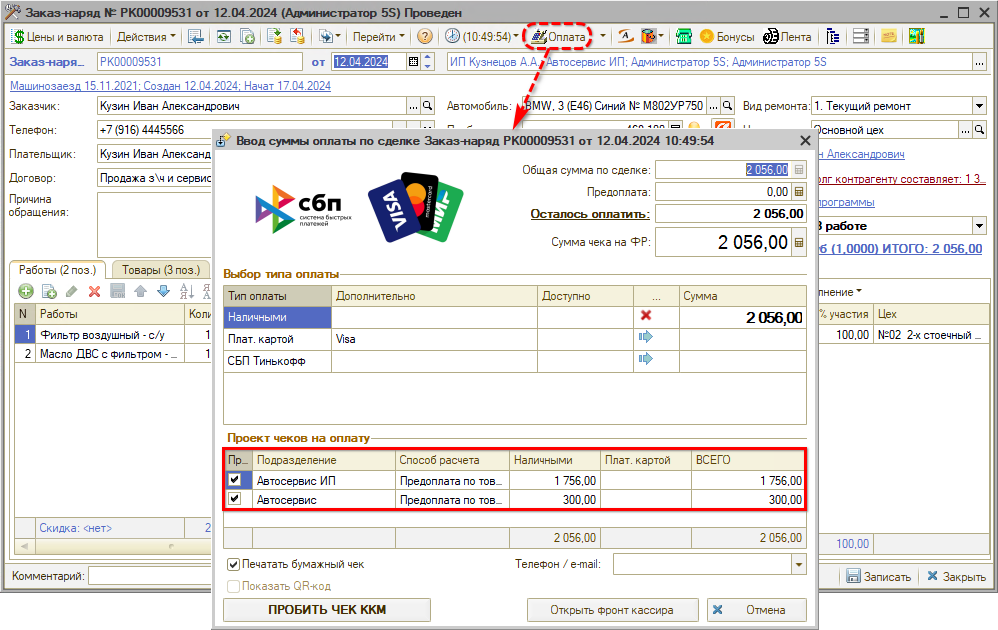

*Примечание:* По умолчанию установлены обе галочки в столбце “Пробить чек” – при необходимости их можно снимать.

Есть возможность вывести организацию в таблицу через *Настройку списка:*

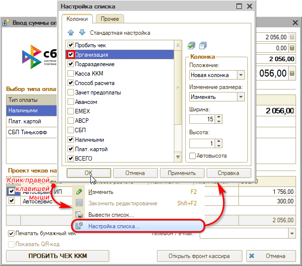

Результат настройки:

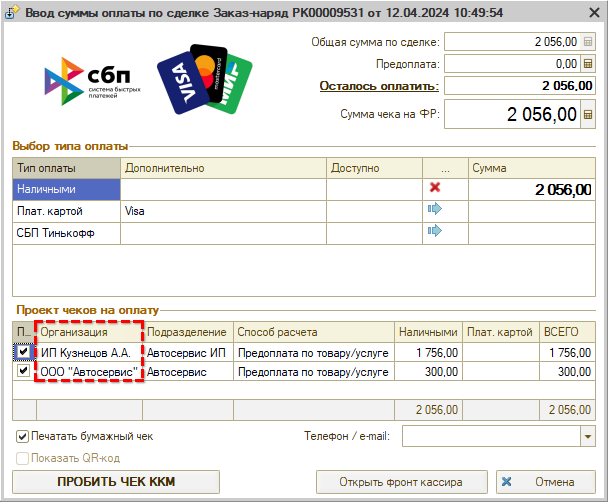

Также настройка позволяет вывести колонку “Кассы ККМ” для возможности *выбора нужной кассы* для пробития чека – см. [ниже](#выбор-кассы-ккм).

При нажатии кнопки “Пробить чек ККМ” пробиваются два[\*](#snoska) чека на разных кассовых аппаратах, по разным организациям – первый по товарам, второй по услугам. В случае отсутствия нужного договора для пробития чека по услугам он формируется программой автоматически.

*\*При условии, если включено право, если в заказ-наряде есть и товары, и работы, и если сумма превышает стоимость товаров.*

В *дереве подчиненности документа* можно проверить, что сформировано два чека на оплату по данному заказ-наряду:

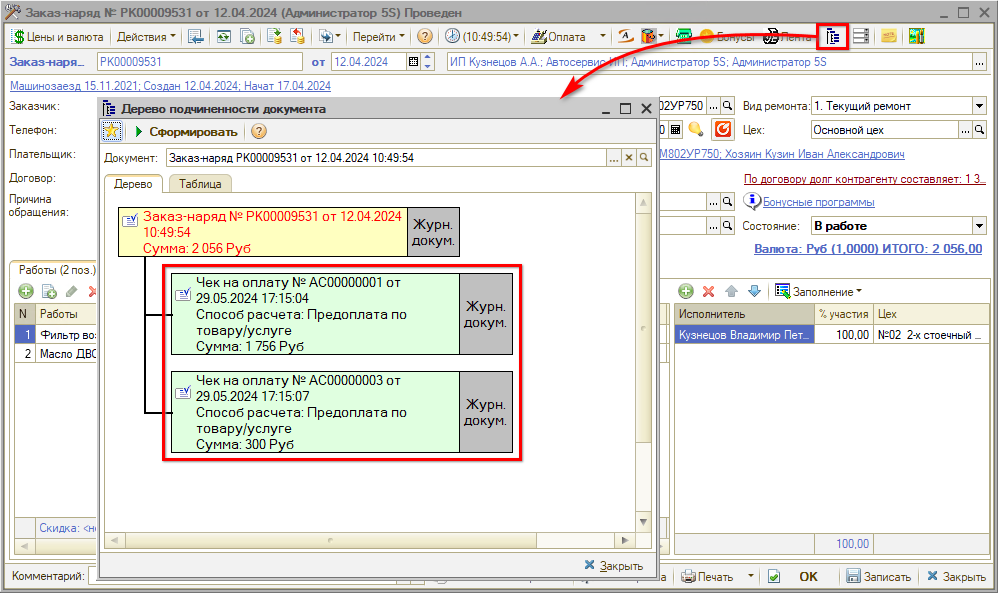

Первый чек пробивается по товарам, второй – по работам, каждый по своей организации:

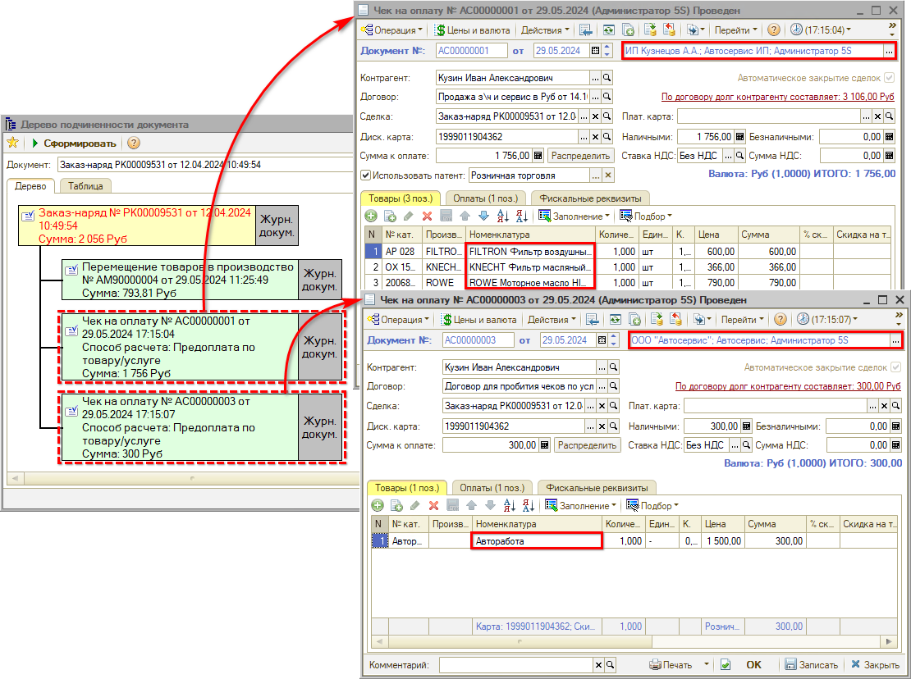

На вкладке “Фискальные реквизиты” отображаются кассы ККМ и фискальные регистраторы, в каждом чеке отдельный порядок номеров смен и номеров чеков:

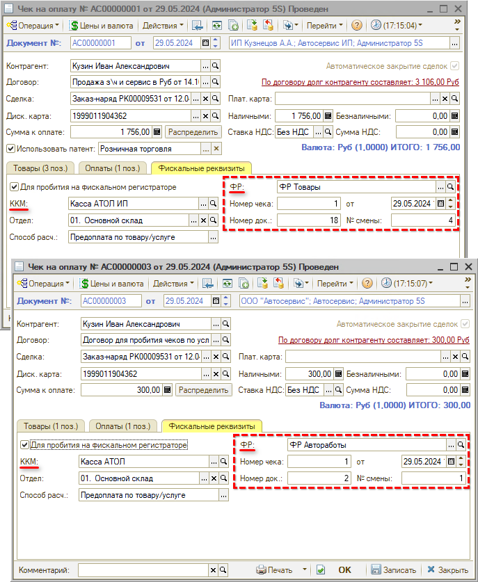

### 2. Окончательный расчет

При закрытии Заказ-наряда и пробитии чека окончательного расчета аналогично формируются два чека, а также документ “Корректировка долга”:

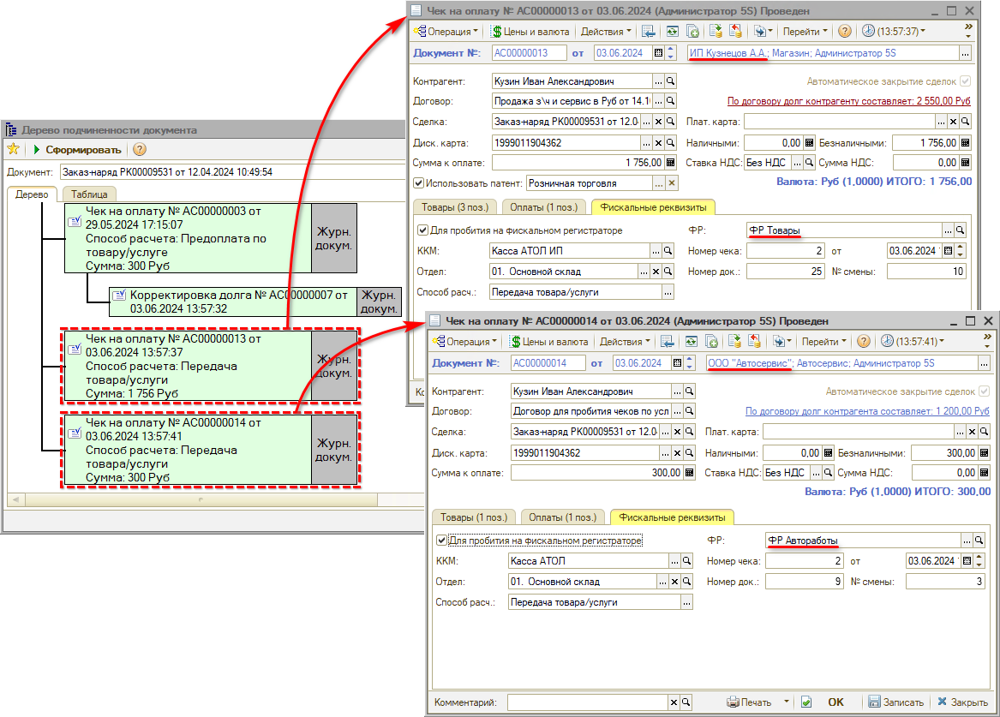

В списке документов “Чек на оплату” можно проследить, что создано по два чека на предоплату и окончательный расчет по разным организациям:

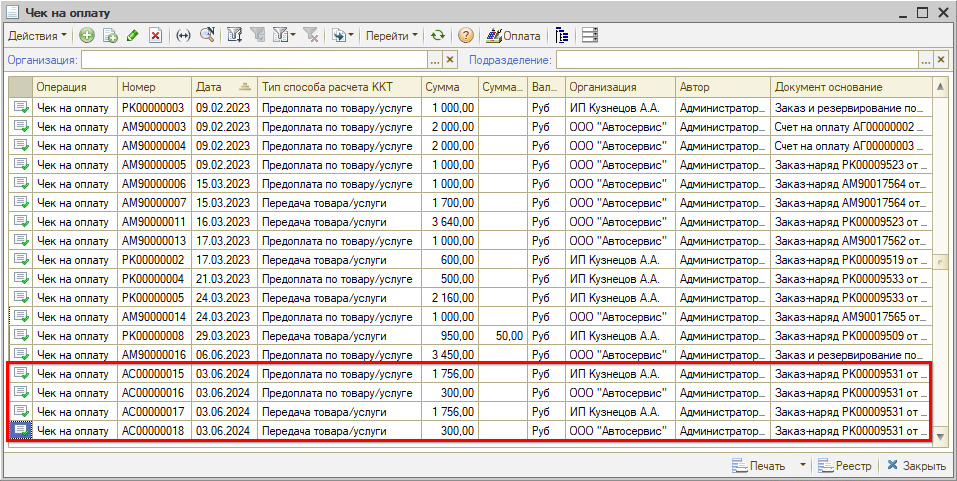

Документ “Корректировка долга” формируется для того, чтобы долг контрагента был перенесен на другую организацию, и заказ-наряд считался программой полностью оплаченным:

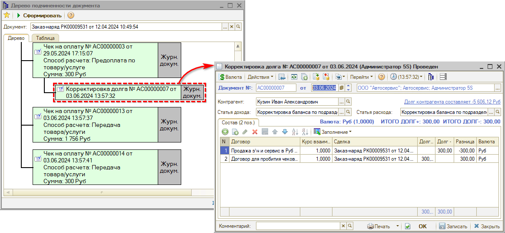

### 3. Частичная оплата

В случае приема частичной оплаты платеж согласно приоритету сначала покрывает стоимость товаров, т.е. сумма распределяется сначала на товары, а потом на услуги:

Если вносимая сумма покрывает только стоимость товаров, то платеж будет распределен только на товары:

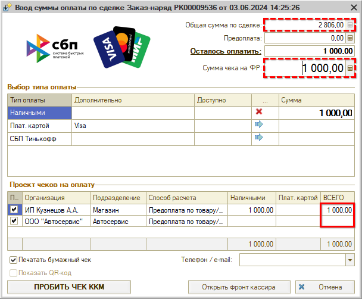

Таким образом, в приведенном примере будет пробит только один чек – предоплата по товарам.

### 4. Безналичная оплата

В случае приема безналичной оплаты и единственного эквайринга при пробитии чека открывается окно с сообщением “Выберите отдел” – чеки по товарам и услугам следует пробить по-отдельности.

### 5. Возврат

Возврат в случае необходимости производится также *отдельно по товарам и услугам,* по своим организациям.

1. Для возврата оплаты по товарам и по услугам сначала необходимо корректно оформить документы возврата в программе – подробнее см. в статье “[Порядок работы с кассами ККМ](../../Касса/Порядок%20работы%20с%20кассами%20ККМ/poryadok-raboty-s-kassami-kkm.md#возврат)”.
2. Для возврата *переплаты* по сделке следует в документе нажать на стрелку рядом с кнопкой *“Оплата”* и выбрать кнопку *“Возврат остатка”.* На форме “Возврат остатка” необходимо выбрать строку с оплатой, по которой требуется сделать возврат:

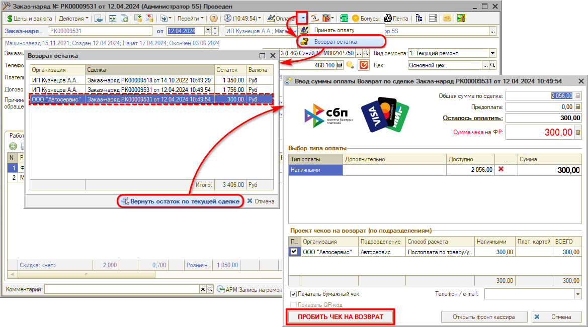

Форма будет автоматически заполнена данными из документа, следует проверить сумму и нажать кнопку “Пробить чек на возврат”. См. также описание в статье “[Упрощенный фронт кассира](../../Касса/Упрощенный%20Фронт%20кассира/uproschennyy-front-kassira.md#возврат-переплаты)”.

### Выбор кассы ККМ

При необходимости есть возможность выбора кассы ККМ для пробития чеков по каждой организации. Для этого должно быть включено право “Разрешить изменять кассу ККМ в упрощенном фронте кассира” – см. [ниже](#3-разрешить-изменять-кассу-ккм-в-упрощенном-фронте-кассира), а также необходимо вывести колонку “Касса ККМ” в таблицу. Для изменения кассы следует правой клавишей мыши по ячейке с кассой вызвать контекстное меню и нажать кнопку “Изменить”:

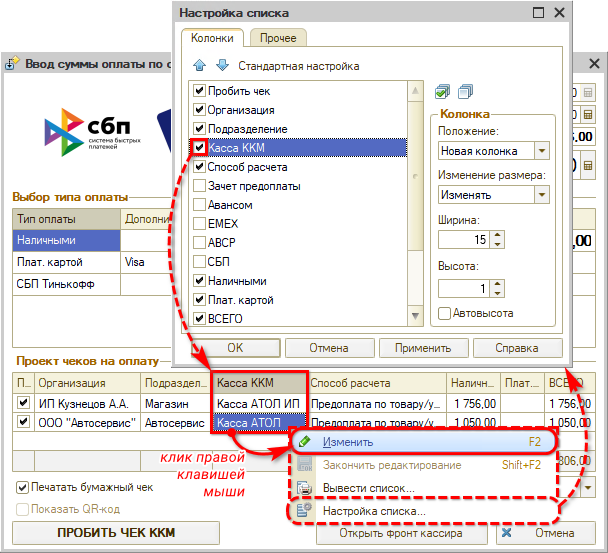

После этого в ячейке появляется кнопка выбора, нажатием на которую открывается справочник “Кассы ККМ”, в котором следует выбрать нужную кассу для пробития чека.

### Возможные ошибки

**1. Не пробивается чек**

Если чек не пробивается, открывается окно с сообщением “Не был пробит” и появляется аналогичное служебное сообщение:

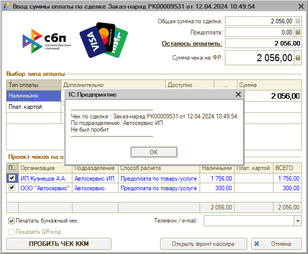

Наиболее частая причина данной ошибки – выбранный тип оплаты не указан в настройках параметров оборудования. Следует проверить настройки данного ФР – подробнее см. в [статье](../../Торговое%20оборудование/Подключение%20кассы%20ККМ/podklyuchenie-kassy-kkm.md#настройка-оборудования).

***Примечание:*** Если по какой-либо причине один из чеков пробился некорректно, то после устранения причины и при повторном пробитии чека можно в таблице “Проект Чеков на оплату” в колонке “Пробить чек” снять галочку со строки, по которой чек пробился успешно.

**2. Наличие переплаты по заказ-наряду**

В случае переплаты по заказ-наряду не получится пробить чек до тех пор, пока не будет сделан возврат переплаты:

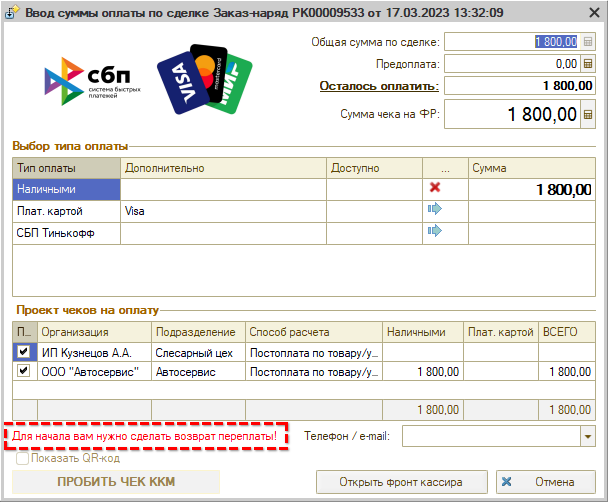

Как сделать возврат – см. [выше](#5-возврат).

## Настройки

### Настройка принадлежности подразделения

Предварительно настраивается соответствие – по какой организации и на какой кассе должны пробиваться позиции товаров и авторабот из заказ-наряда.

В настройках организации добавлен реквизит “Подразделение для пробития чеков по услугам”, который позволяет установить принадлежность подразделения другой организации:

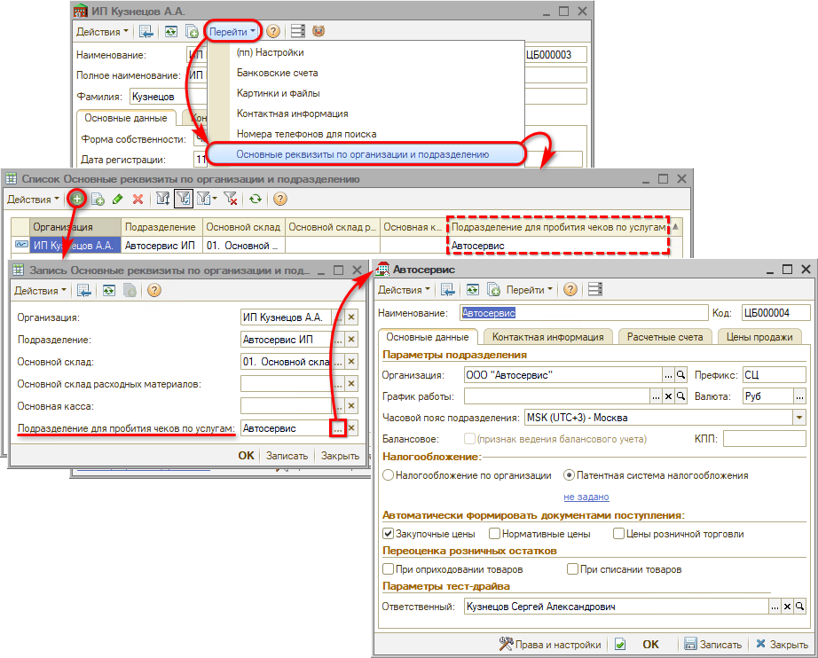

При пробитии чеков программа будет определять, по какому подразделению необходимо пробивать услуги.

### Настройка прав

#### 1. Разрешить раздельное пробитие чеков для товаров и услуг

Для раздельного пробития чеков необходимо включить настройку “Разрешить раздельное пробитие чеков для товаров и услуг”:

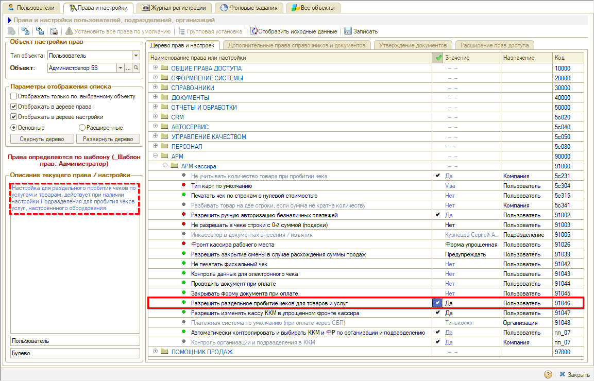

После включения данной настройки при работе с формой приема оплаты у кассира будут отображаться две строки – “Товары” и “Услуги”.

#### 2. Автоматически контролировать и выбирать ККМ и ФР по организации и подразделению

Для того чтобы в чеки для авторабот подтягивалось нужное оборудование, необходимо включить право "Автоматически контролировать и выбирать ККМ и ФР по организации и подразделению":

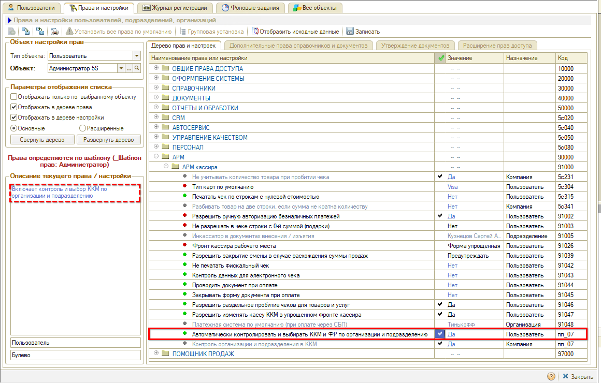

#### 3. Разрешить изменять кассу ККМ в упрощенном фронте кассира

Право “Разрешить изменять кассу ККМ в упрощенном фронте кассира” позволяет [изменять кассу ККМ](#выбор-кассы-ккм) в упрощенном фронте кассира в таблице “Проект чеков”:

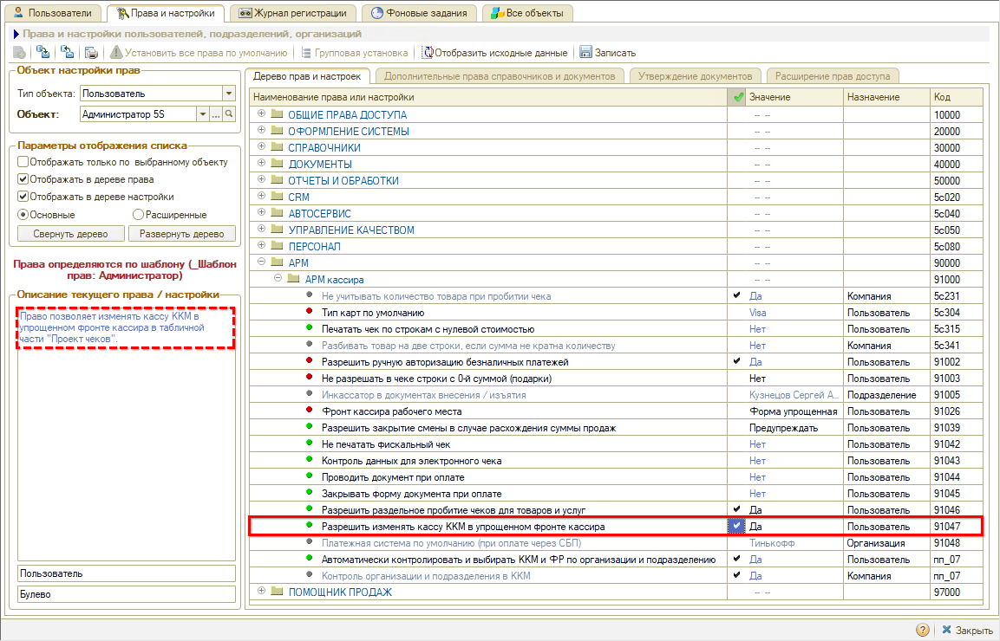

### Настройка оборудования

#### 1. Настройка оборудования для пробития чеков по товарам

Для пробития чеков по товарам следует настроить основные параметры фискального регистратора в карточке оборудования:

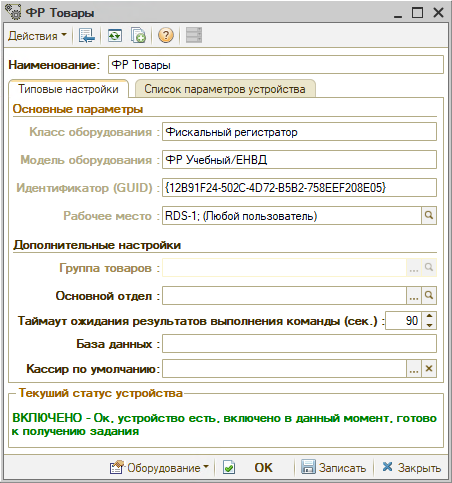

Затем нужно выбрать данный фискальный регистратор в поле “Оборудование” в настройках Рабочего места:

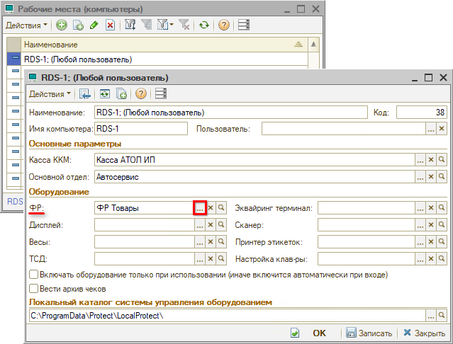

Для пробития чеков по товарам больше ничего заполнять не нужно.

#### 2. Настройка оборудования для пробития чеков по услугам

В карточке оборудования для пробития чеков по автоработам, – как ФР, так и эквайринга, – помимо основных параметров обязательно следует заполнить *Основной отдел:*

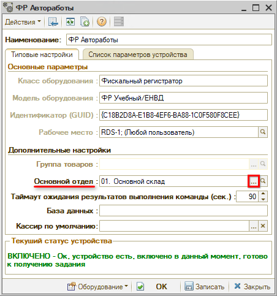

Основной отдел должен принадлежать тому подразделению, на которое была настроена принадлежность для пробития чеков по услугам:

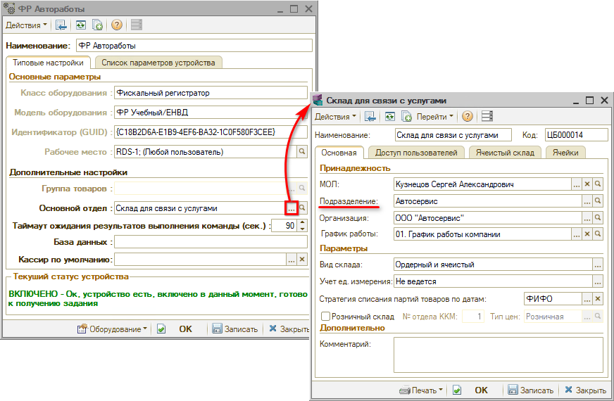

---

**Теги:** практики, чеки ккм, разделение чеков, предоплата, касса, подразделения

