# Уведомление покупателю о поступлении заказа

<table><tr><td><b>Время чтения:</b> 13 мин.</td><td><b>Обновлено:</b> 29.06.2023</td></tr></table>

Источник: https://www.5systems.ru/help/uvedomlenie-pokupatelyu-o-postuplenii-zakaza

## Содержание

1. [Введение](#введение)
2. [Настройка отправки уведомления](#настройка-отправки-уведомления)
   - [1. Настройка Автоматического действия](#настройка-автоматического-действия)
   - [2. Настройка шаблона](#настройка-шаблона)

## Введение

В системе реализована возможность отправки клиенту шаблонов сообщений через [WhatsApp](../../Сообщения/WhatsApp/) – подробное описание см. в статье [Настройка шаблонов WhatsApp Business API](../../Сообщения/WhatsApp/Настройка%20шаблонов%20WhatsApp%20Business%20API/nastroyka-shablonov-whatsapp-business-api.md), а также [Пример индивидуальной настройки WABA](../../Сообщения/WhatsApp/Пример%20индивидуальной%20настройки%20WABA/primer-individualnoy-nastroyki-waba.md). В частности, можно настроить отправку ***уведомлений клиенту о поступлении заказанных им запчастей***.

При поступлении товара по Заказу покупателя клиенту отправляется уведомление, о том, что заказанные для него запчасти поступили:

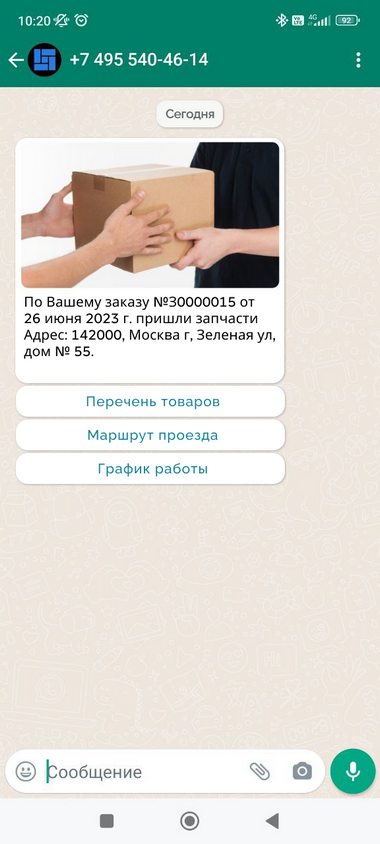

При нажатии клиентом на кнопки система отправляет ему новые сообщения:

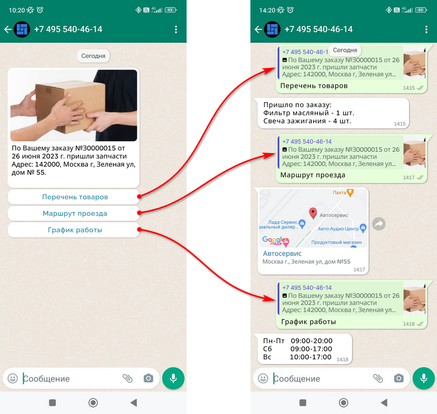

*Примечание:* На текущий момент кнопки поддерживает только WhatsApp (WABA) – для других способов отправки сообщения требуется отдельный шаблон сообщений.

## Настройка отправки уведомления

### Настройка Автоматического действия

Для того, чтобы клиентам отправлялись уведомления о поступлении товаров по заказу, должно быть настроено автоматическое действие “Напоминание о поступлении запчастей клиенту”. Справочник “Автоматические действия” расположен в меню программы *Администрирование → Компания → CRM → Автоматические действия:*

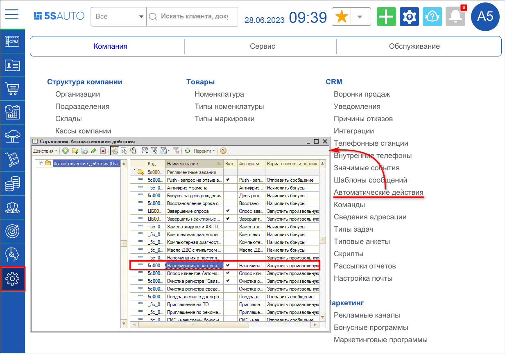

#### 1. Расписание

На вкладке “Расписание” рекомендуется задать свое расписание уведомлений:

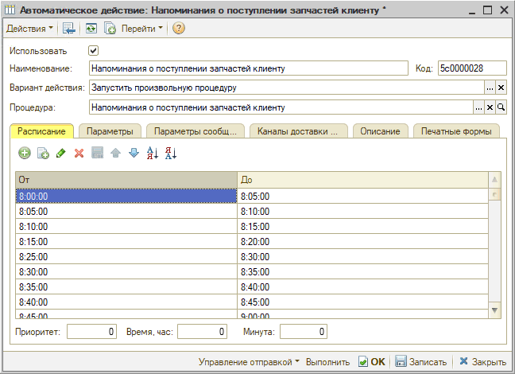

Если не задать расписание, автоматическое действие будет срабатывать 1 раз в 15 минут, в том числе ночью – т.е. уведомление может быть отправлено клиенту в любое время суток.

#### 2. Параметры

На вкладке “Параметры” производятся следующие настройки:

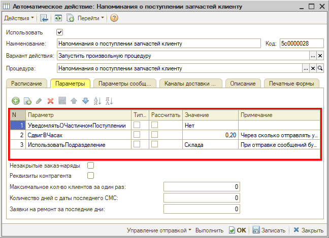

1. *УведомлятьОЧастичномПоступлении:* по умолчанию значение “Нет”, т.е. предполагается уведомление клиента только при полном поступлении заказа.
2. *СдвигВЧасах:* указывается количество часов после поступления товара, когда следует отправить уведомление клиенту – см. пояснение в колонке “Примечание”. Значение задается в часах, например, по умолчанию установлено 0,20 часа, т.е. 12 минут.
3. *ИспользоватьПодразделение:* указывается подразделение, которое будет использоваться при отправке уведомления – по умолчанию это подразделение склада, на который оформлен заказ (см. пояснение в колонке “Примечание”). Если параметр не указывать, то уведомление будет отправляться по подразделению заказа покупателя.

Остальные параметры на данной вкладке заполнять *не требуется*.

#### 3. Параметры сообщения

На вкладке “Параметры сообщения” должен быть указан [шаблон сообщения](../../Сообщения/WhatsApp/Настройка%20шаблонов%20WhatsApp%20Business%20API/nastroyka-shablonov-whatsapp-business-api.md#настройка-шаблонов):

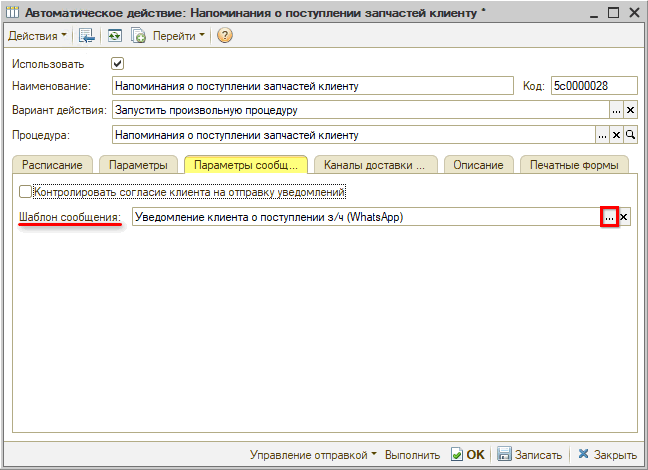

Подробнее о настройке шаблона уведомления о доставке см. [ниже](#настройка-шаблона).

#### 4. Каналы доставки сообщений

На вкладке “Каналы доставки сообщений” необходимо указать канал доставки и интеграцию, через которую следует отправлять сообщение – в данном случае WhatsApp:

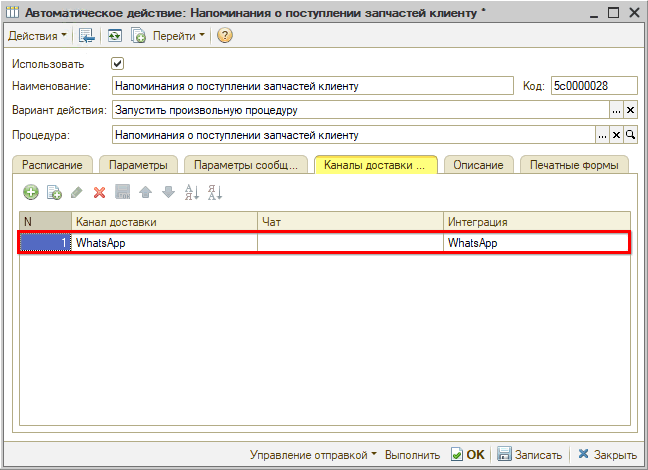

Если будет указано несколько каналов доставки, то автоматическое действие будет производить отправку по ним в том порядке, в котором они расположены в таблице.

После настройки необходимо *записать* изменения, установить *галочку* ***“Использовать”*** и сохранить настройки нажатием на кнопку ***“ОК”***.

### Настройка шаблона

В случае отправки уведомлений через WABA шаблон должен быть верифицирован – см. [статью](../../Сообщения/WhatsApp/Настройка%20шаблонов%20WhatsApp%20Business%20API/nastroyka-shablonov-whatsapp-business-api.md).

По умолчанию шаблон имеет следующий вид:

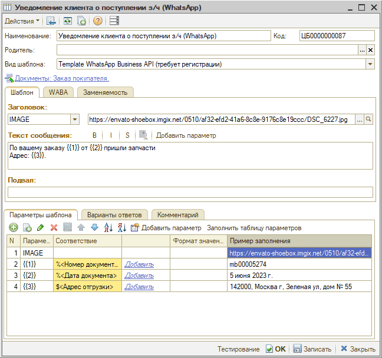

При необходимости можно отправить измененный шаблон на верификацию – подробнее см. в [статье](../../Сообщения/WhatsApp/Настройка%20шаблонов%20WhatsApp%20Business%20API/nastroyka-shablonov-whatsapp-business-api.md#izmenshabl):

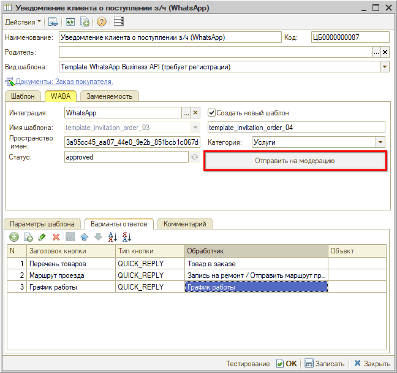

Шаблон для WABA с уведомлением клиента о поступлении запчастей имеет 3 кнопки с запрограммированными действиями:

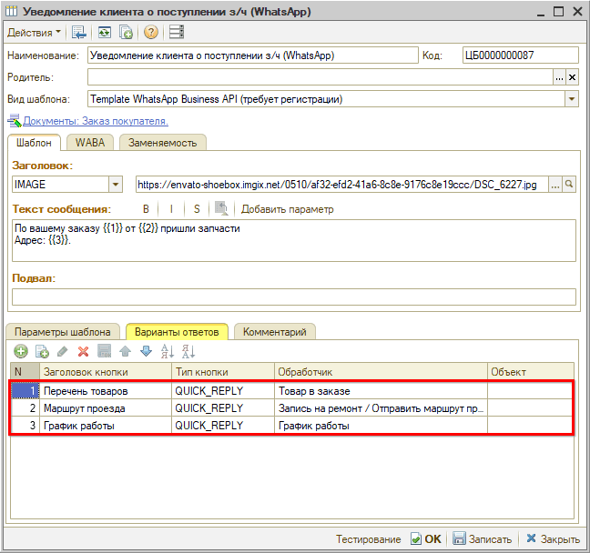

1. “Перечень товаров” – при нажатии клиентом кнопки система отправляет сообщение с перечнем товаров, который поступил по Заказу.
2. “Маршрут проезда” – при нажатии кнопки система отправляет геометку на местоположение подразделения, заданного в [Параметрах](#2-параметры). Координаты местоположения задаются в настройках подразделения на вкладке "Контактная информация" *(см. статью "[Настройки шаблонов WABA](../../Сообщения/WhatsApp/Настройка%20шаблонов%20WhatsApp%20Business%20API/nastroyka-shablonov-whatsapp-business-api.md#marshrut)")*.
3. “График работы” – при нажатии кнопки система отправляет график работы:

Текст сообщения с графиком работы требуется заполнить самостоятельно в шаблоне сообщения “График работы”:

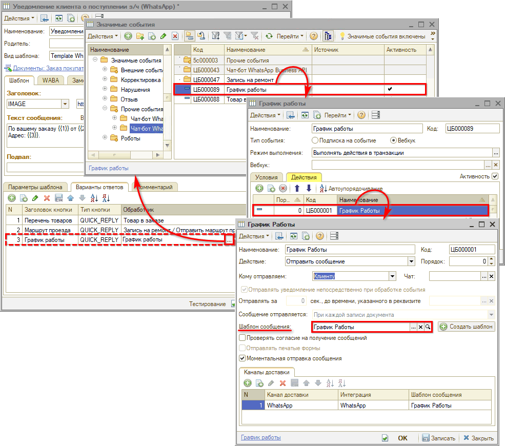

На вкладке “Шаблон” в поле “Текст сообщения” следует задать текст сообщения с информацией о графике работы:

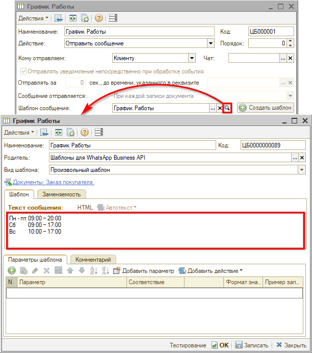

При необходимости настройки других кнопок можно изменить макет самостоятельно (см. [статью](../../Сообщения/WhatsApp/Настройка%20шаблонов%20WhatsApp%20Business%20API/nastroyka-shablonov-whatsapp-business-api.md#настройка-шаблонов) по настройке и верификации шаблонов) либо обратиться в техподдержку 5SYSTEMS.

---

**Теги:** практики, уведомление, заказ покупателя, шаблон сообщения, whatsapp, автоматическое действие
