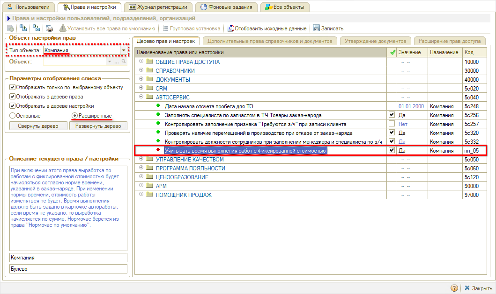
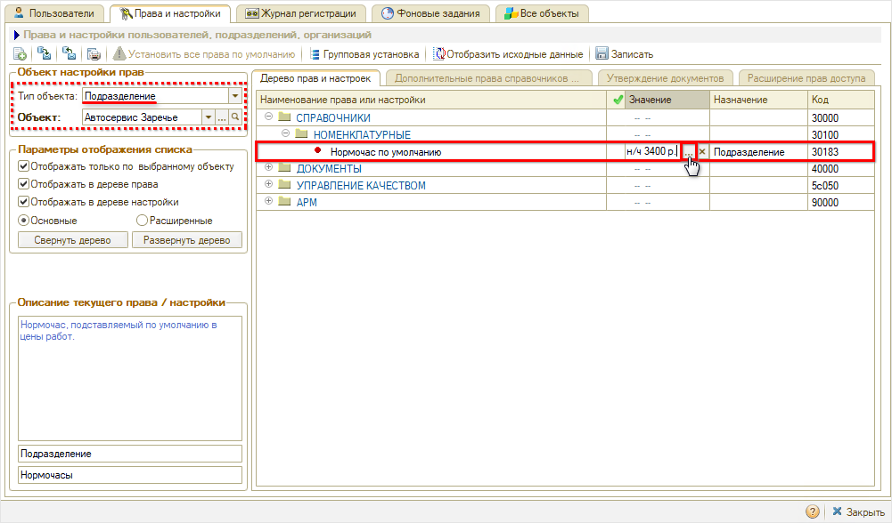
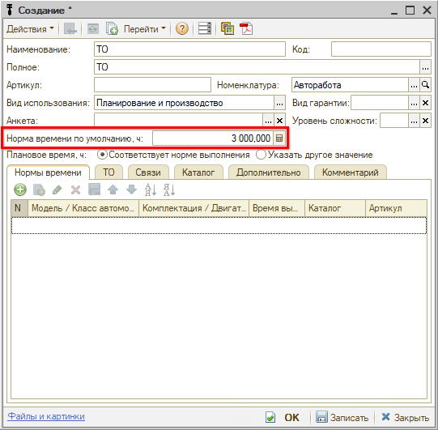
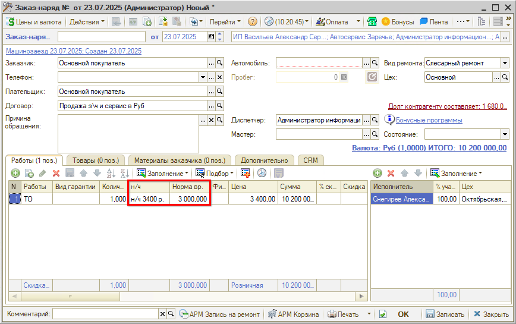

# Учет выработки исполнителей по нормочасам для работ с фиксированной стоимостью

<table><tr><td><b>Время чтения:</b> 4 мин.</td><td><b>Обновлено:</b> 23.07.2025</td></tr></table>

Источник: https://www.5systems.ru/help/uchet-vyrabotki-ispolniteley-po-normochasam-dlya-rabot-s-fiksirovannoy-stoimostyu

## Содержание

1. [Введение](#введение)
2. [Настройка учета нормочасов по автоработам с фиксированной стоимостью](#настройка-учета-нормочасов-по-автоработам-с-фиксированной-стоимостью)

## Введение

Одним из способов начисления заработной платы автослесарям или механикам автосервиса является расчет по выработанным ими нормочасам за отчетный период.

Для просмотра выработки сотрудников автосервиса в программе предусмотрен ***отчет "Выработка исполнителей"*** *(Отчеты → Автосервис → Выработка исполнителей).*

См. [видеокурс](https://www.youtube.com/watch?v=ET2pTaWQVHw&t=1813s) с 30:12:

Когда расчет стоимости автоработы происходит через нормочас, то проблем с учетом выработки по нормочасам нет. Если же у автоработы назначена фиксирования стоимость (настроено ценообразование с указанием цены, а не нормочаса, см. [*Настройка ценообразования для работ*](../../Ценообразование/Настройка%20ценообразования%20для%20работ/nastroyka-cenoobrazovaniya-dlya-rabot.md)), то нормочасы для нее в заказ-наряде не учитываются и, следовательно, не отражаются в отчете "Выработка исполнителей".

Для того, чтобы количество нормочасов по автоработам с фиксированной стоимостью учитывалось в заказ-наряде и отражалось в отчете "Выработка исполнителей" необходимо произвести дополнительные настройки в программе.

## Настройка учета нормочасов по автоработам с фиксированной стоимостью

**1. Установка прав и настроек**

1. для компании: "Учитывать время выполнения работ с фиксированной стоимостью" (расширенные, группа "АВТОСЕРВИС") = "Да":

   

2. для подразделения: "Нормочас по умолчанию" (основные, СПРАВОЧНИКИ → НОМЕНКЛАТУРНЫЕ) установить значение из справочника "Нормочасы", отличное от предопределенного значения "Рубль":

   

**2. Установка норм времени для авторабот**

У авторабот, по которым планируется учитывать выработку исполнителей при фиксированной стоимости, необходимо задать норму времени в карточках авторабот:

***В результате*** при добавлении в заказ-наряд работы с фиксированной стоимостью, по умолчанию будет подставляться нормочас из настройки "Нормочас по умолчанию" и норма времени из карточки автоработы:

Норму времени для работы в заказ-наряде можно при необходимости изменять, это не будет отражаться в сумме строки, также как и изменение суммы строки не будет влиять на норму времени.

В отчете по исполнителю отразятся нормочасы по работе исполнителя, учтенные в заказ-наряде.

---

**Теги:** практики, выработка, нормочасы, автоработы, фиксированная стоимость, мотивация
