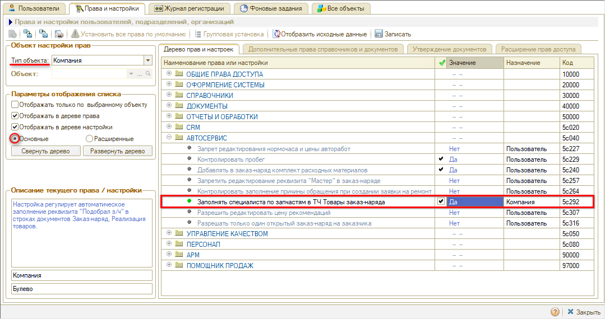
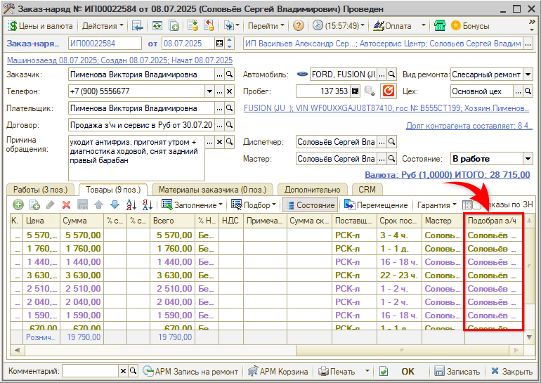
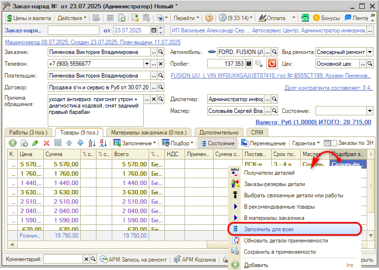

# Учет выработки специалистов по запчастям в Заказ-нарядах

<table><tr><td><b>Время чтения:</b> 4 мин.</td><td><b>Обновлено:</b> 23.07.2025</td></tr></table>

Источник: https://www.5systems.ru/help/uchet-vyrabotki-specialistov-po-zapchastyam-v-zakaz-naryadakh

## Содержание

1. [Введение](#введение)
2. [Предварительная настройка](#предварительная-настройка)
3. [Заполнение специалиста по запчастям в заказ-наряде](#заполнение-специалиста-по-запчастям-в-заказ-наряде)
4. [Анализ выработки специалистов по запчастям](#анализ-выработки-специалистов-по-запчастям)

## Введение

Если подбором запчастей занимается отдельный специалист по запчастям, то для учета его выработки необходимо вести и заполнять колонку "Подобрал з/ч" в Заказ-наряде.

## Предварительная настройка

Чтобы колонка "Подобрал з/ч" появилась в Заказ-наряде, установите [настройку](../../Пользователи%20и%20права/Установка%20прав%20и%20настроек%20пользователя/ustanovka-prav-i-nastroek-polzovatelya.md) *"Заполнять специалиста по запчастям в ТЧ Товары заказ-наряда"* (Установка прав и настроек, Основные, тип объекта "Компания", группа "АВТОСЕРВИС") = "Да":

Отображение колонки "Подобрал з/ч" в Заказ-наряде:

***Обратите внимание!*** При установке права "Заполнять специалиста по запчастям в ТЧ Товары заказ-наряда" = "Да" не только появляется колонка "Подобрал з/ч", но и колонка "Менеджер" переименовывается в "Мастер".

## Заполнение специалиста по запчастям в заказ-наряде

Специалист по запчастям заполняется в колонке "Подобрал з/ч" вручную. Если подобрано несколько товаров одним и тем же сотрудником, то достаточно заполнить колонку "Подобрал з/ч" для одного товара, а для остальных разнести. Чтобы заполнить специалиста по запчастям по всем строкам с товарами:

1. кликните правой клавишей мыши на выбранного сотрудника,
2. выберите пункт контекстного меню "Заполнить для всех":  
   

## Анализ выработки специалистов по запчастям

Проанализировать результаты подбора и продажи запчастей отдельными специалистами можно с помощью [*отчета "Продажи СОЗЧ"*](../../Отчеты/Отчет%20Продажи%20СОЗЧ/otchet-prodazhi-sozch.md).

---

**Теги:** практики, выработка, специалист по запчастям, заказ-наряд, созч

