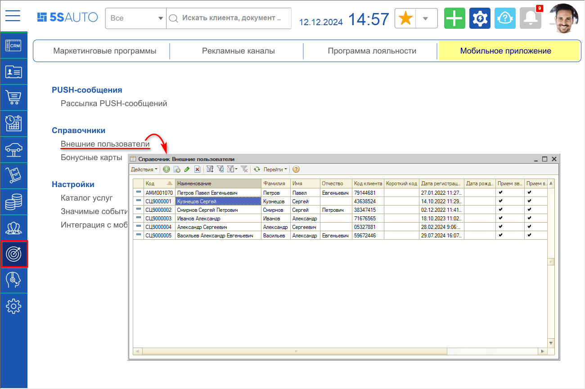
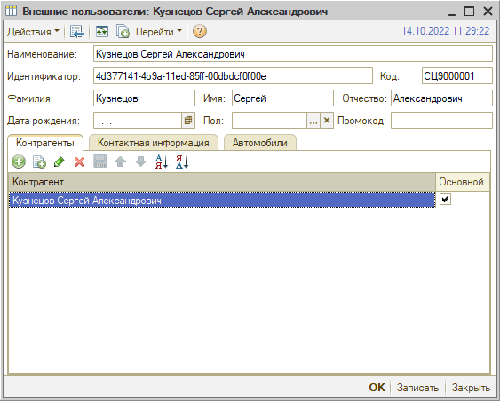

# Внешние пользователи

<table><tr><td><b>Время чтения:</b> 3 мин.</td><td><b>Обновлено:</b> 17.01.2025</td></tr></table>

Источник: https://www.5systems.ru/help/vneshnie-polzovateli

## Содержание

1. [Справочник](#справочник)
2. [Карточка пользователя](#карточка-пользователя)

## Справочник

Справочник "Внешние пользователи" находится в меню *Маркетинг → Мобильное приложение → Справочники.* Данный справочник содержит всех пользователей Мобильного приложения:

## Карточка пользователя

Карточка пользователя приложения имеет следующий вид:

Параметры в карточке заполняются автоматически – подтягиваются из приложения. *“Промокод”* заполняется, когда пользователь приглашает друга – после того, как приглашенный пользователь регистрируется в приложении.

*Вкладки:*

1. На *вкладке "Контрагенты"* отображается связь пользователя приложения с контрагентом в программе. За счет данной таблицы происходит взаимодействие приложения и программы – заявки, заказ-наряды и пр. Т.е., если здесь не задан контрагент, то считается, что для пользователя приложения нет карточки контрагента в программе, и при заезде клиента нужно будет создавать новую карточку.

   В таблице может быть добавлено несколько контрагентов – в данном случае, когда пользователь зайдет в приложение под своим номером телефона, у него будут отображаться автомобили, заказ-наряды и бонусы общей суммой по всем указанным контрагентам.

   Если к пользователю по ошибке был привязан неправильный контрагент, можно в данной таблице выбрать нужного контрагента и сделать привязку к нему.

2. *Вкладка "Контактная информация"* содержит телефон, под которым пользователь входит в приложение. Дополнительно можно добавить другие телефоны и прочую контактную информацию.
3. На *вкладке "Автомобили"* отображаются данные об автомобиле, которые пользователь добавил в приложении.

---

**Теги:** 5s link, внешние пользователи, справочник, карточка пользователя
