

# Push-сообщения

<table><tr><td><b>Время чтения:</b> 11 мин.</td><td><b>Обновлено:</b> 09.12.2024</td></tr></table>

Источник: https://www.5systems.ru/help/push-soobscheniya

> *Актуально для 5S LINK версии* ***v1***.

## Содержание

1. [Введение](#введение)
2. [Способы отправки push-сообщений](#способы-отправки-push-сообщений)
   - [1. Из сделки](#1-из-сделки)
   - [2. Из карточки контрагента](#2-из-карточки-контрагента)
   - [3. Из Ленты событий](#3-из-ленты-событий)
   - [4. Через документ Сообщение](#4-через-документ-сообщение)

## Введение

Отправка *push-сообщений* через мобильное приложение – это удобный канал коммуникации с клиентом. Основная функция push-сообщений в *5S LINK v1* – это отправка клиентам [запросов на отзыв](../Отзывы%20в%205S%20LINK/otzyvy-v-5s-link.md) об обслуживании в автосервисе. Также есть возможность отправить через мобильное приложение любое [автоматическое сообщение](../../../Сообщения/Настройка%20автоматической%20отправки%20сообщений%20через%20мессенджеры/nastroyka-avtomaticheskoy-otpravki-soobscheniy-cherez-messendzhery.md).

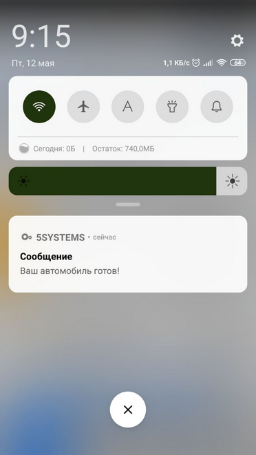

Проверить, установлено ли у клиента приложение, можно в карточке контрагента на вкладке *CRM → Мобильное приложение –* в таблице “Внешние пользователи” должна быть запись о [внешнем пользователе](../Настройки%20интеграции%20программы%20с%205S%20LINK/nastroyki-integracii-programmy-s-5s-link.md#внешние-пользователи) и стоять отметка о регистрации в приложении “Да”:

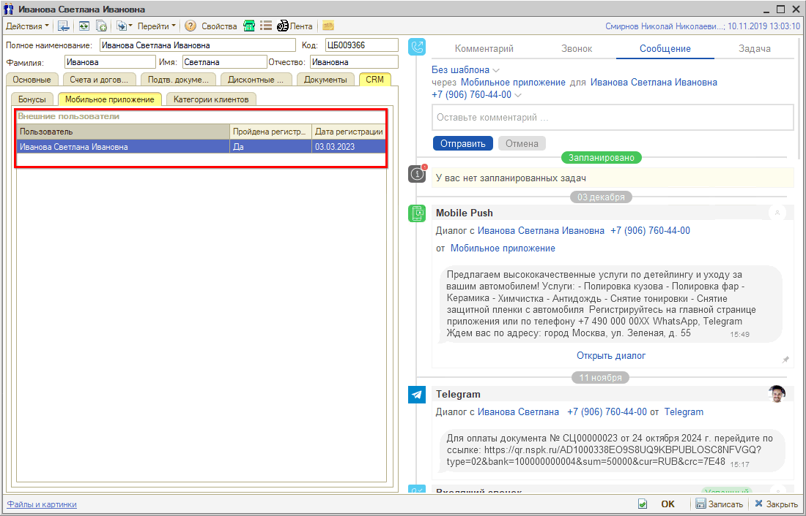

Если клиент зарегистрировался в приложении, а записи в таблице нет, то следует установить связь с данным контрагентом в карточке Внешнего пользователя: см. статью *[Настройки интеграции программы → Внешние пользователи](../Настройки%20интеграции%20программы%20с%205S%20LINK/nastroyki-integracii-programmy-s-5s-link.md#внешние-пользователи).*

## Способы отправки push-сообщений

Существует 4 варианта отправки push-сообщений:

### 1. Из сделки

Чтобы отправить сообщение через Мобильное приложение из [Сделки](../../../CRM/Работа%20со%20сделкой/rabota-so-sdelkoy.md), следует перейти на вкладку “Сообщение” в *[событиях сделки](../../../CRM/События%20сделки/sobytiya-sdelki.md#soobshchenie),* выбрать канал связи *“Мобильное приложение”,* написать сообщение, при необходимости загрузить файл и нажать кнопку “Отправить”:

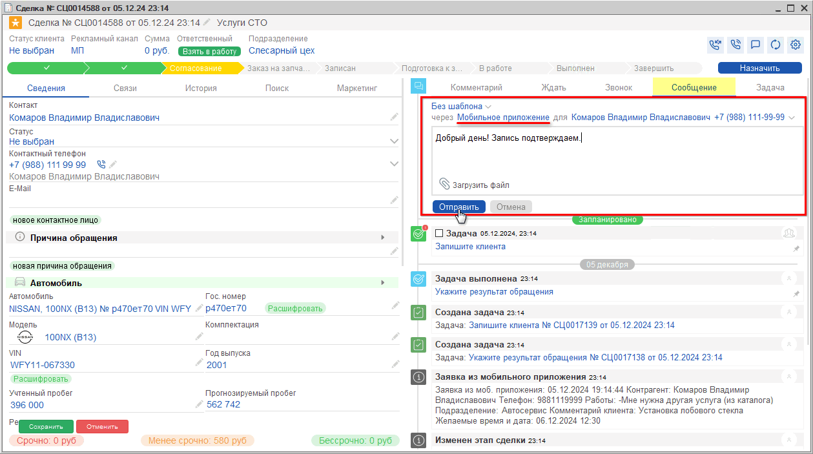

### 2. Из карточки контрагента

Для отправки сообщения через карточку [контрагента](../../../Работа%20с%20клиентами/Контрагенты%20и%20контакты/kontragenty-i-kontakty.md#карточка-контрагента) необходимо на вкладке “Сообщение” выбрать канал связи “Мобильное приложение”, написать сообщение либо использовать шаблон, можно прикрепить файлы, затем нажать кнопку “Отправить”:

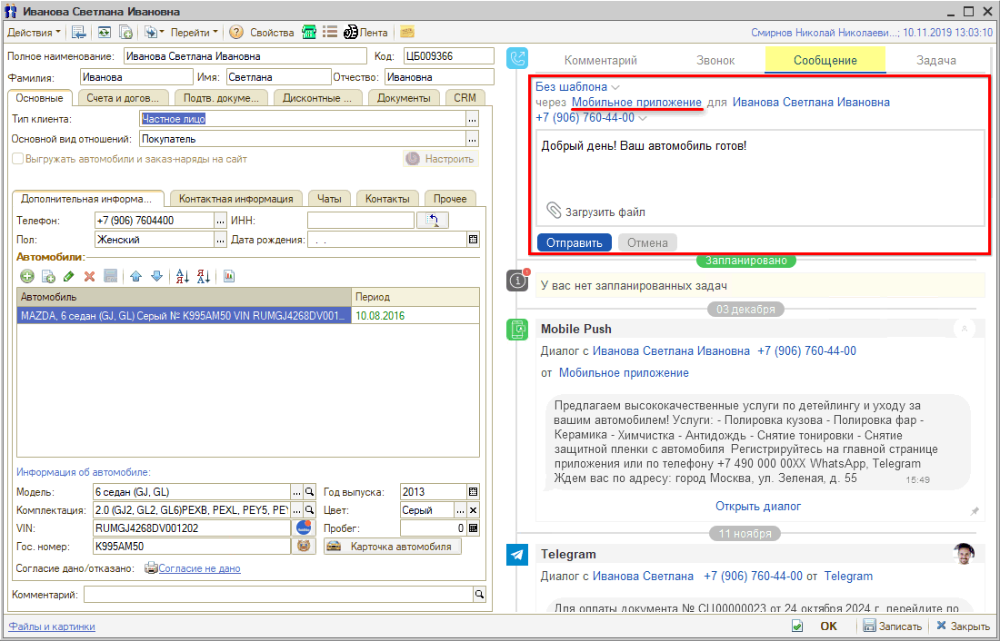

### 3. Из Ленты событий

Для того, чтобы отправить сообщение в Мобильное приложение через [Ленту событий](../../../Работа%20с%20клиентами/Лента%20событий/lenta-sobytiy.md), следует выбрать соответствующий канал связи, написать сообщение, при необходимости прикрепить файл, затем нажать кнопку “Отправить”:

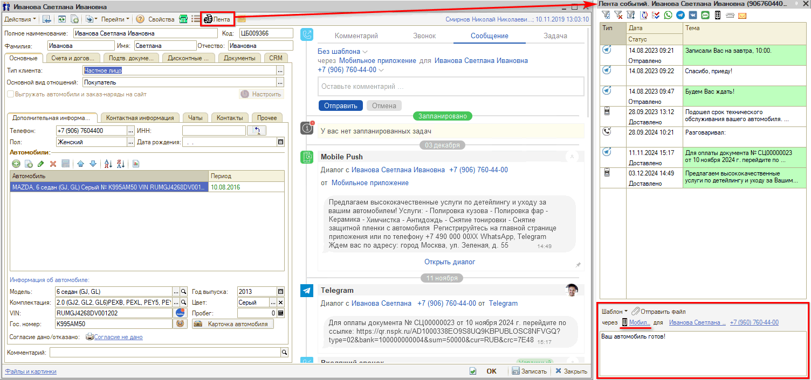

### 4. Через документ Сообщение

Функцию отправки сообщений через документ “Сообщение” удобно использовать для массовой рассылки сообщений – например, об акциях.

Для рассылки через документ “Сообщение” следует через меню программы перейти в раздел *Маркетинг → Маркетинговые программы → Сообщения → Сообщения:*

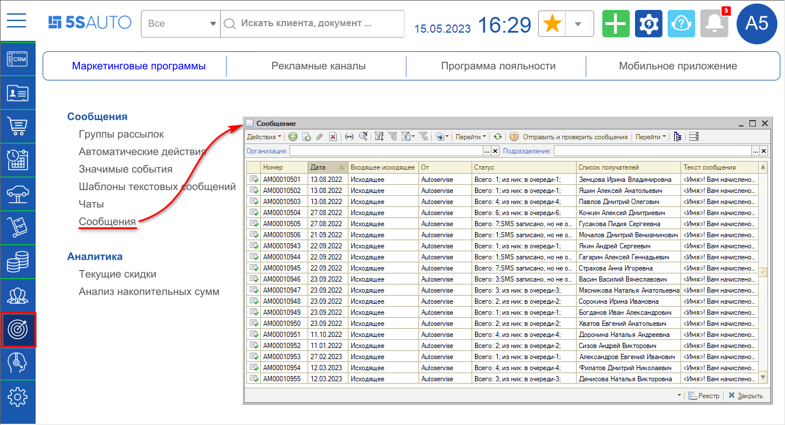

В реестре сообщений необходимо создать новый документ. На вкладке “Кому” следует добавить получателей, используя кнопку “Добавить” или автозаполнение:

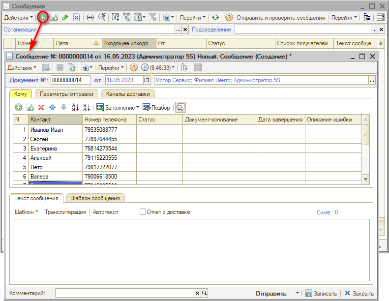

В случае большого количества клиентов рекомендуется при автозаполнении получателей использовать отбор по клиентам, у которых есть Мобильное Приложение – для этого нужно в настройках отбора на вкладке "Отбор" добавить параметр "Дата регистрации МП", значение "Заполнено":

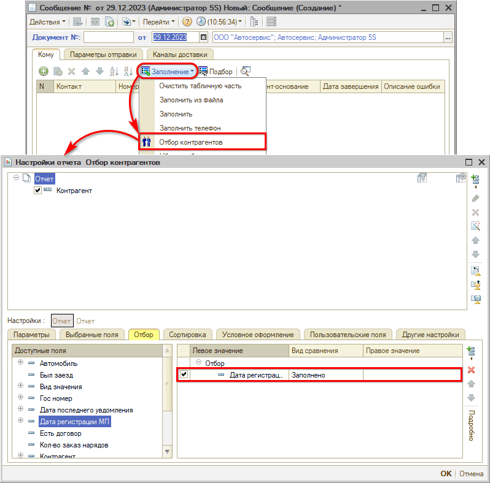

На вкладке “Параметры отправки” можно настроить время рассылки. Рекомендуется настроить *равномерную рассылку,* чтобы не отправлять сообщение всем получателям одновременно, т.к. это может привести к зависанию базы. См. статью *[Массовая рассылка сообщений по выборке клиентов](../../../Сообщения/Массовая%20рассылка%20сообщений%20по%20выборке%20клиентов/massovaya-rassylka-soobscheniy-po-vyborke-klientov.md#параметры-отправки).*

Затем следует выбрать *Вид сообщения:*

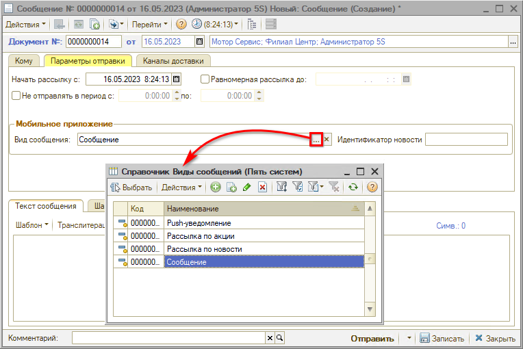

*Виды сообщений:*

*1. Push-уведомление* – будет отправлено только push-сообщение в телефон, в списке сообщений в мобильном приложении сообщение не появится.

*2. Рассылка по акции*

*3. Рассылка по новости*

*4. Сообщение* – будет отправлено и push-сообщение в телефон, и [уведомление](../Интерфейс%205S%20LINK/interfeys-5s-link.md#uved) в мобильном приложении. На вкладке “Каналы доставки” нужно добавить канал “Мобильное приложение” и выбрать интеграцию “Мобильное приложение” с обработчиком подключения apiMobileApp:

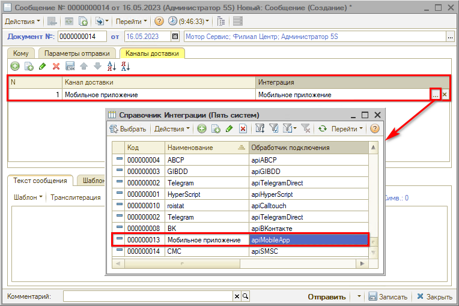

В нижней части формы на вкладке “Текст сообщения” необходимо написать текст сообщения, либо использовать шаблон:

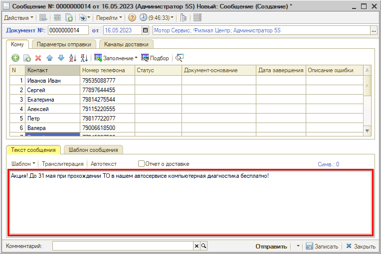

При нажатии кнопки *“Отправить”* сообщение будет разослано всем указанным клиентам.

Нажатием кнопки *“Просмотр текста”* в таблицу выводится колонка “Текст сообщения”:

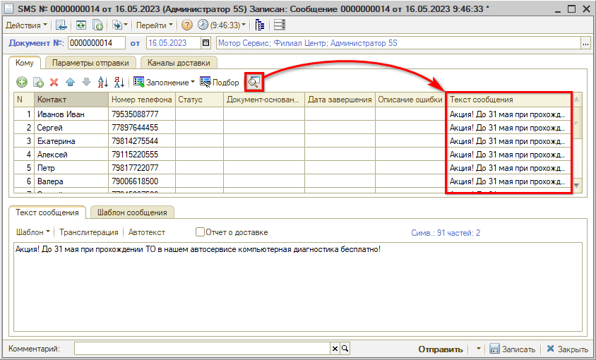

Для проведения новой рассылки рекомендуется создать *новый* документ “Сообщение” и заполнить его заново.

*Примечание:* Если изменить текст сообщения в нижнем поле в этом же документе и нажать кнопку “Отправить”, то отправится снова старый текст, который содержится в столбце “Текст сообщения”, а не тот, который написали. Для отправки нового текста столбец “Текст сообщения” должен быть пустым.

Также используя колонку “Текст сообщения”, есть возможность отправить нескольким клиентам разный текст.

---

**Теги:** 5s link, push-сообщения, сделка, контрагент, лента событий, сообщение

