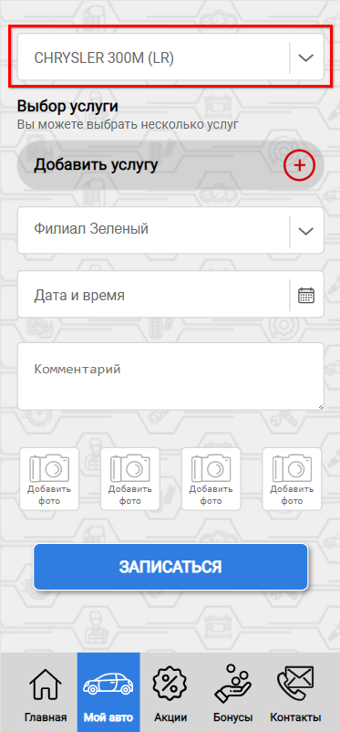
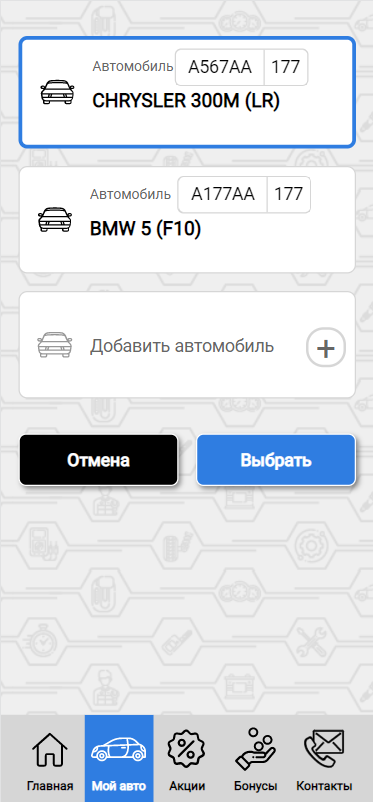
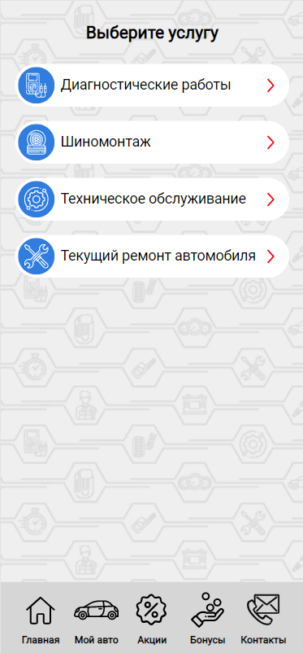
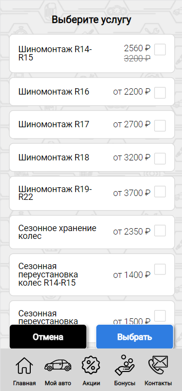
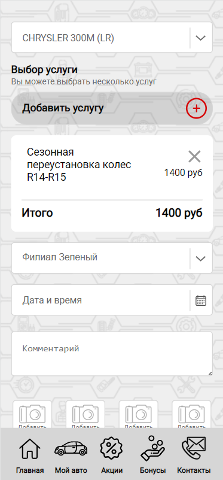
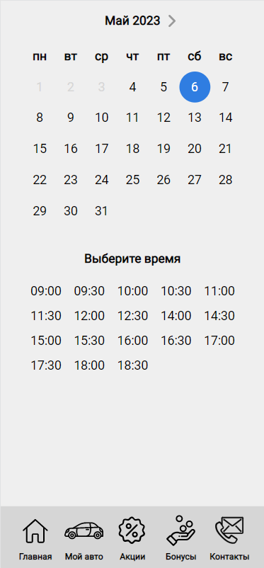
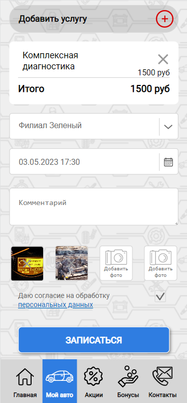
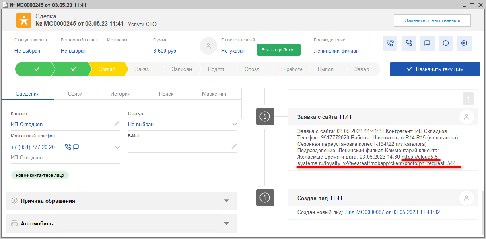

# Запись на ремонт через 5S LINK

<table><tr><td><b>Время чтения:</b> 12 мин.</td><td><b>Обновлено:</b> 10.05.2023</td></tr></table>

Источник: https://www.5systems.ru/help/zapis-na-remont-cherez-5s-link

> *Актуально для 5S LINK версии* ***v1***.

## Содержание

1. [Введение](#введение)
2. [Выбор автомобиля](#выбор-автомобиля)
3. [Выбор услуги](#выбор-услуги)
4. [Выбор даты и времени](#выбор-даты-и-времени)
5. [Прикрепление фото](#прикрепление-фото)
6. [Связь с программой](#связь-с-программой)

## Введение

***5S LINK v1*** - это мобильное приложение для клиентов автосервисов, которые доступно для пользователей системы 5S AUTO.

В данной статье рассматривается процесс записи на ремонт через приложение и принцип связи записи в приложении с программой.

Также см. статьи [Регистрация и авторизация в 5S LINK](../Регистрация%20и%20авторизация%20в%205S%20LINK/registraciya-i-avtorizaciya-v-5s-link.md), [Интерфейс 5S LINK](../Интерфейс%205S%20LINK/interfeys-5s-link.md), [Настройки интеграции программы с 5S LINK](../Настройки%20интеграции%20программы%20с%205S%20LINK/nastroyki-integracii-programmy-s-5s-link.md), [Настройки 5S LINK в Личном кабинете](../Настройки%205S%20LINK%20в%20Личном%20кабинете/nastroyki-5s-link-v-lichnom-kabinete.md).

Запись на ремонт через Мобильное приложение состоит из следующих этапов:

1. Оформление записи на ремонт в приложении;
2. Фиксация записи в CRM;
3. Связь с АРМ Запись на ремонт в программе.

## Выбор автомобиля

В верхнем поле интерфейса записи на ремонт в 5S LINK отображается автомобиль:

Можно выбрать один из существующих автомобилей или [добавить новый](../Интерфейс%205S%20LINK/interfeys-5s-link.md#newauto):

## Выбор услуги

После выбора автомобиля следует выбрать услугу:

Заголовок задается клиентом в Личном кабинете, например, “Список услуг” или “Выберите услугу”. Далее следуют категории – они являются папками в справочнике авторабот в программе “[Каталог услуг](../Настройки%20интеграции%20программы%20с%205S%20LINK/nastroyki-integracii-programmy-s-5s-link.md#настройки-каталога-услуг)”. При выборе категории раскрывается список услуг с указанной стоимостью:

Можно выбрать одну или несколько услуг. При выборе услуги открывается следующее окно:

Отображается наименование и стоимость услуги, доступен выбор подразделения мобильного приложения – т.е. филиала компании, выбор даты и времени, можно написать комментарий, который уйдет в базу, а также прикрепить фото неисправностей.

## Выбор даты и времени

Выбор времени становится доступным после выбора даты:

При условии правильной настройки в программе время строится динамически, т.е. если на эту дату на цех, в котором должна выполняться выбранная авторабота, уже есть запись, то занятый временной промежуток пропадет из доступного для записи времени в приложении. Т.е. если цех занят на это время, то данное время здесь не отобразится.

## Прикрепление фото

При необходимости клиент может прикрепить к заявке фото неисправностей:

В программе они будут отражены в форме гиперссылок в комментарии:

## Связь с программой

При нажатии кнопки “Записаться” запись фиксируется в программе – *создается* [лид](../../../CRM/Режимы%20работы%20CRM/rezhimy-raboty-crm.md) или [сделка](../../../CRM/Работа%20со%20сделкой/rabota-so-sdelkoy.md).

Помимо этого, при условии правильно настроенной интеграции, в системе создается *запись на ремонт,* т.е. устанавливается связь Мобильного приложения с [АРМ “Запись на ремонт”](../../../Запись%20на%20ремонт/Календарь%20для%20планирования%20работ/kalendar-dlya-planirovaniya-rabot.md) в программе.

---

**Теги:** 5s link, запись на ремонт, выбор услуги, дата и время, сделка

