

# Интерфейс 5S LINK

<table><tr><td><b>Время чтения:</b> 14 мин.</td><td><b>Обновлено:</b> 10.05.2023</td></tr></table>

Источник: https://www.5systems.ru/help/interfeys-5s-link

## Содержание

1. [Введение](#введение)
2. [Страницы приложения](#страницы-приложения)
   - [1. Главный экран](#главный-экран)
   - [2. Информация об автомобиле](#информация-об-автомобиле)
   - [3. Акции](#акции)
   - [4. Бонусы](#бонусы)
   - [5. Контакты](#контакты)

*Актуально для 5S LINK версии **v1***

## Введение

***5S LINK v1*** - это мобильное приложение для клиентов автосервисов, которые доступно для пользователей системы 5S AUTO.

В рамках данной статьи рассматривается *интерфейс* приложения 5S LINK v1.

Также см. статьи: [Регистрация и авторизация в 5S LINK](../Регистрация%20и%20авторизация%20в%205S%20LINK/registraciya-i-avtorizaciya-v-5s-link.md), [Запись на ремонт через 5S LINK](../Запись%20на%20ремонт%20через%205S%20LINK/zapis-na-remont-cherez-5s-link.md). О настройках интеграции см. статьи: [Настройки интеграции программы с 5S LINK](../Настройки%20интеграции%20программы%20с%205S%20LINK/nastroyki-integracii-programmy-s-5s-link.md) и [Настройки 5S LINK в Личном кабинете](../Настройки%205S%20LINK%20в%20Личном%20кабинете/nastroyki-5s-link-v-lichnom-kabinete.md).

На нижней панели экрана находятся кнопки перехода на страницы приложения:

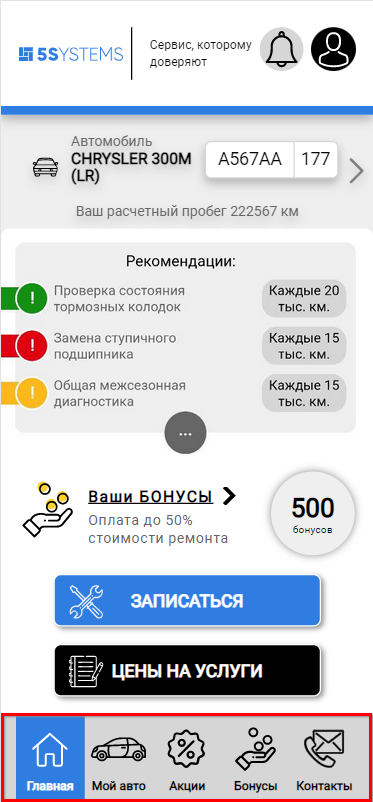

1. Главная
2. Мой авто
3. Акции
4. Бонусы
5. Контакты

## Страницы приложения

### Главный экран

На главной странице приложения отображаются следующие элементы:

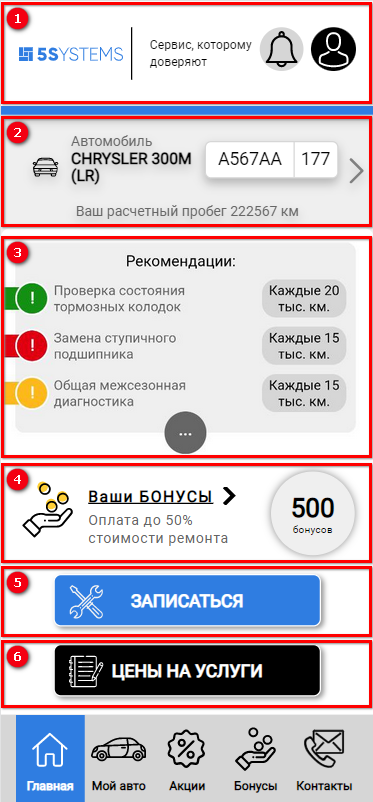

1. **Верхняя панель:**

   - Логотип;
   - Слоган компании, который заказал клиент;
   -  *Уведомления* – на кнопке с колокольчиком отображается индикатор с количеством непрочитанных сообщений, нажатием на кнопку происходит переход в раздел “Мои сообщения”:  
     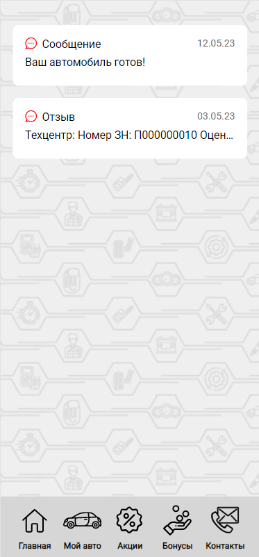
   -  ***Профиль*** – можно заполнить свои данные и установить фото профиля:  
     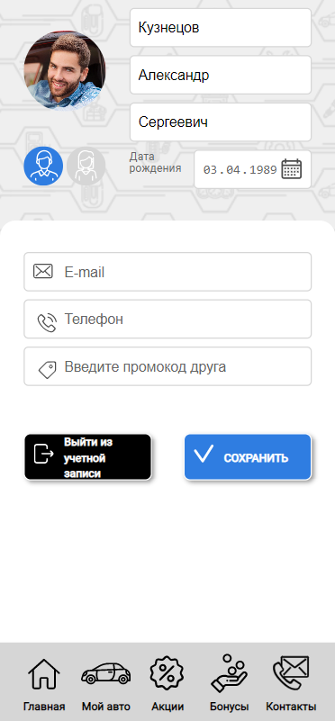  
     Телефон изменять нельзя – он автоматически привяжется после авторизации. 
     Обратите внимание на поле для ввода ***промокода друга:*** промокод друга при приглашении из мобильного приложения следует вводить именно сюда. 
     Также здесь расположены кнопки *“Выйти из учетной записи”* – переход на экран авторизации и *“Сохранить”* – передать данные в базу и перейти на основной экран.

2. **Информация об автомобиле** – можно перейти в раздел “[Мой авто](#информация-об-автомобиле)”.

   

3. **Актуальные рекомендации** – выводятся рекомендации по автоработам, добавленные ранее в программе для автомобиля клиента. Если клиент первичный, либо если для его автомобиля нет актуальных рекомендаций, то список рекомендаций наполняется из [Личного кабинета](../Настройки%205S%20LINK%20в%20Личном%20кабинете/nastroyki-5s-link-v-lichnom-kabinete.md#5-общие-рекомендации). Отображаются первые три рекомендации, полный список можно открыть нажатием на кнопку с многоточием.

4. **Бонусы** – отображается количество бонусов, значение подтягивается по бонусному счету из карточки клиента. Отсюда пользователь может перейти в раздел “[Бонусы](#бонусы)”.

5. Кнопка **“[Записаться](../Запись%20на%20ремонт%20через%205S%20LINK/zapis-na-remont-cherez-5s-link.md)”** – переход к записи на ремонт.
6. Кнопка **“Цены на услуги”**.
7. Текущие [**акции**](#акции).

### Информация об автомобиле

На странице “Мой авто” отображается информация об автомобилях пользователя, которая подтягивается из программы, а также показаны все заказ-наряды по каждому автомобилю и их стоимость:

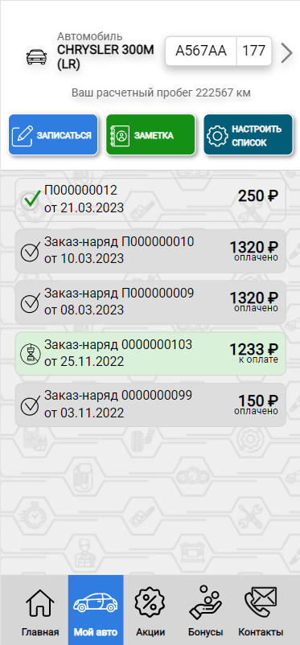

Заказ-наряд может быть в работе – тогда он выделен зеленым цветом, или завершен – выделен серым цветом. Желтым выделены заявки на ремонт.

Статус “Оплачено” на самом деле означает, что заказ-наряд закрыт, статус “К оплате” – что заказ-наряд в работе.

Нажатием на Заказ-наряд открывается следующая страница:

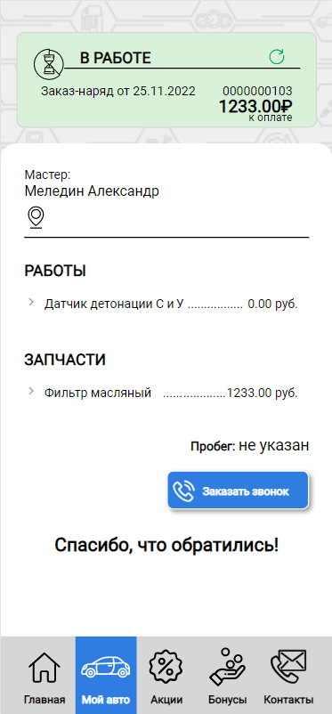

Можно просмотреть информацию по данному Заказ-наряду. По закрытому заказ-наряду можно написать отзыв, а также сделать запрос по гарантии.

Если автомобилей несколько, то переключение между ними на странице “Мой авто” осуществляется путем перелистывания страниц или нажатия на стрелки “Влево <” и “Вправо >”.

Если автомобиля в базе нет, страница имеет следующий вид:

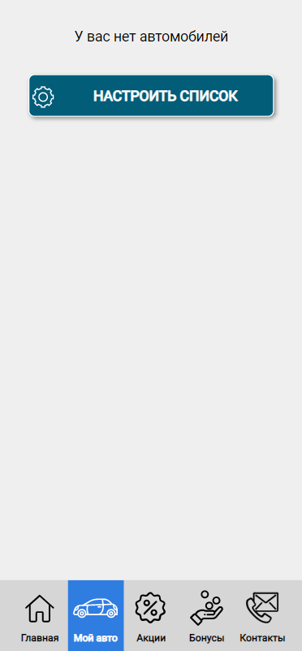

Есть возможность самостоятельно добавить автомобиль и ввести всю необходимую информацию:

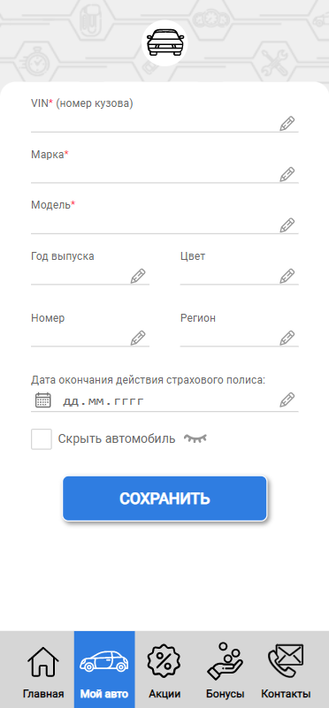

При добавлении нового авто следует обязательно заполнить поля, отмеченные “звездочкой”.

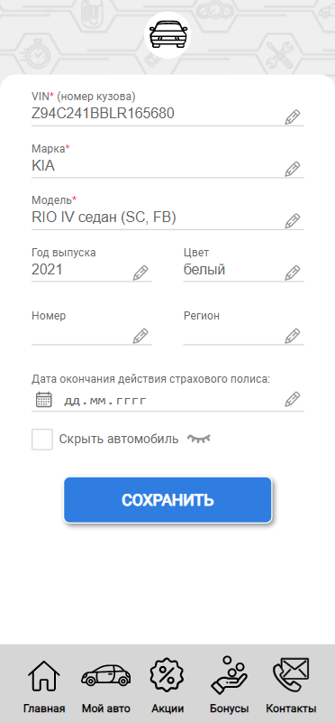

Введенные данные следует сохранить – после этого автомобиль можно будет записывать на ремонт.

Если в системе уже есть автомобиль, то на странице “Мой авто” отображаются следующие кнопки:

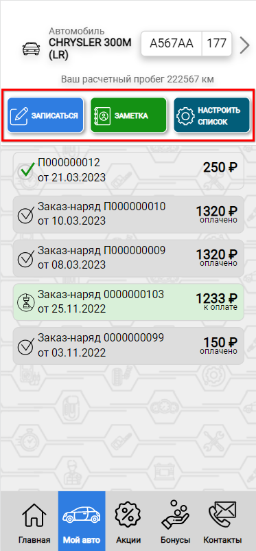

1. **“Записаться”** – кнопка аналогична кнопке на главном экране, переход к [записи на ремонт](../Запись%20на%20ремонт%20через%205S%20LINK/zapis-na-remont-cherez-5s-link.md);

2. **“Заметка”** – пользователь может добавить для себя заметку по автомобилю, например о том, что он сделал какую-либо работу в другом техцентре:

   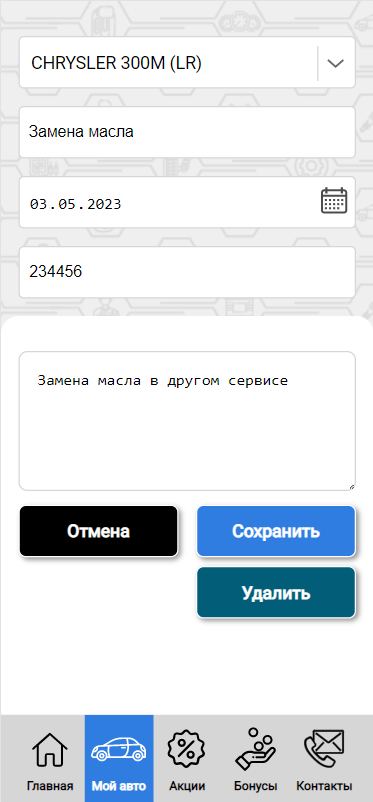

   После сохранения заметки она будет отображаться на экране “Мой авто”:

   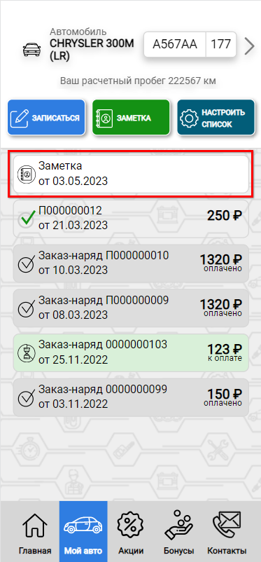

   В программе данные заметки нигде не отображаются.

3. **“Настроить список”** – переход на страницу со списком всех автомобилей пользователя, с возможностью добавить новый автомобиль.

### Акции

На странице “Акции” находится информация обо всех актуальных акциях автосервиса, которые клиент добавил в [Личном кабинете маркетолога](../Настройки%205S%20LINK%20в%20Личном%20кабинете/nastroyki-5s-link-v-lichnom-kabinete.md#1-акции):

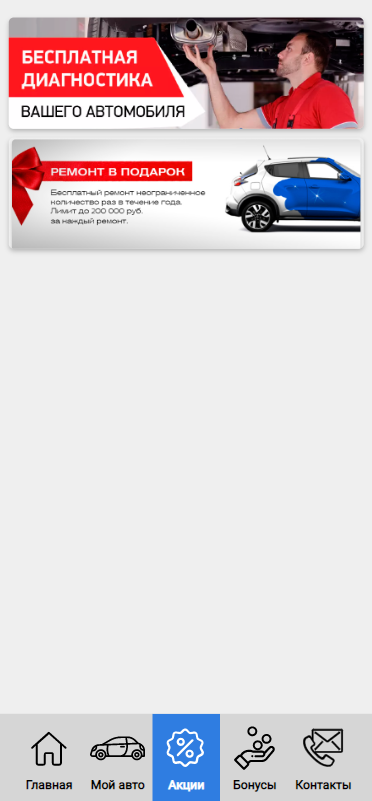

Нажатием на превью акции открывается окно с более подробной информацией о ней:

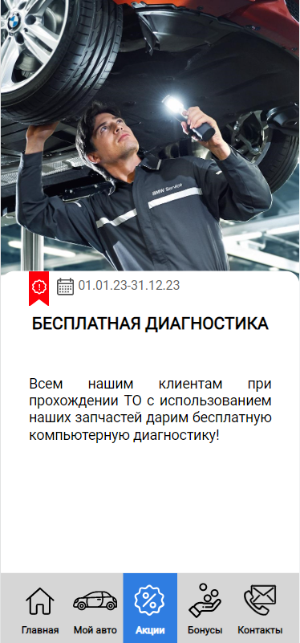

На странице акции находятся:

1) изображение; 
2) сроки действия акции; 
3) заголовок; 
4) описание.

### Бонусы

На данном экране собрана информация по бонусной программе:

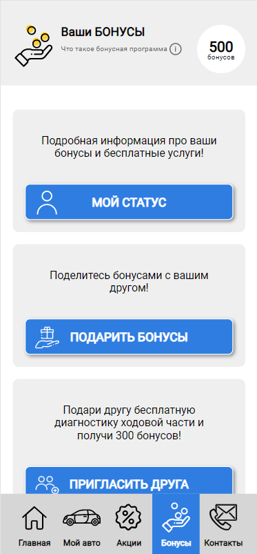

1. На верхней панели расположена кнопка “🛈” – *информация о бонусной программе,* а также показано количество бонусов пользователя;

2. ***Мой статус*** – отображается статус пользователя-участника бонусной программы, количество накоплений для перехода на следующий уровень, количество бонусов и история начислений:

   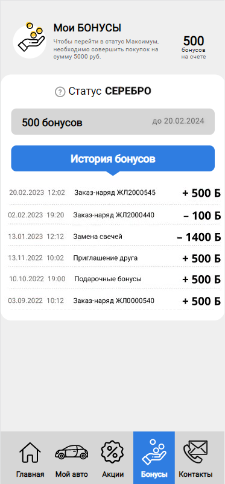

   Информация по текущим накоплениям подтягивается из системы по бонусной карточке, а описания уровней – из [Личного кабинета](../Настройки%205S%20LINK%20в%20Личном%20кабинете/nastroyki-5s-link-v-lichnom-kabinete.md#2-бонусы).

3. ***Подарить бонусы:***

   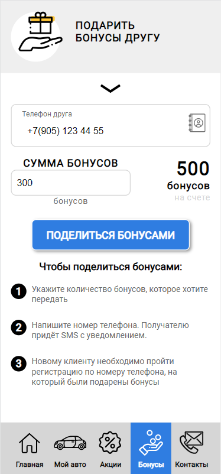 
   Для того, чтобы воспользоваться данной функцией, необходимо указать телефон клиента, который обязательно должен быть в базе, а также должны быть бонусы на счете у текущего пользователя. Помимо этого, для того, чтобы поделиться бонусами, у текущего пользователя должен быть минимум один заказ-наряд, т.е. чтобы это был реально существующий действующий клиент – это нужно для исключения махинаций с бонусами;

4. ***Пригласить друга:***

   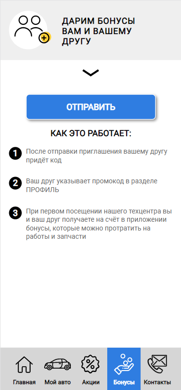

   Воспользоваться данной функцией также может только пользователь, который реально обращался в техцентр.

   Когда клиент в мобильном приложении отправляет приглашение другу, в программе создаются промокоды в справочнике “Маркетинговые программы” → “Пригласить друга” в кол-ве 2 шт.

   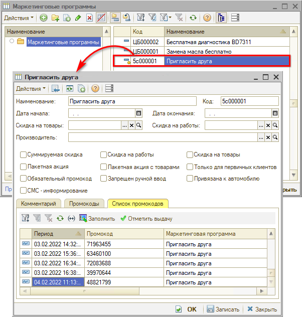

   Тот пользователь, который отправляет приглашение, получает промокод – он никуда не отправляется, просто сохраняется в базе.

   Приглашенному другу промокод отправляется в сообщении, и он может ввести его в своем профиле при регистрации в Мобильном приложении: см. [выше](#profil).

   *Условия:*

   - 1\) У пользователя, которого приглашают, не должно быть никаких обращений, взаиморасчетов или заказ-нарядов. Если пригласить пользователя, который уже зарегистрирован в базе и уже заказывал ремонт или делал покупки, то ему не будут подарены бонусы.
   - 2\) После регистрации в приложении клиент должен заехать, и его заказ-наряд должен быть закрыт. Бонусы начисляются в момент закрытия заказ-наряда нового пользователя. При соблюдении данных условий подаренные бонусы начисляются двоим пользователям – получателю и тому, кто его пригласил.

   В случае если контрагента не было в базе или не был указан номер телефона, то при регистрации в приложении автоматически создается дисконтная карточка по автоматическому событию: "Регистрация мобильного приложения", на которую и будут начислены бонусы в том количестве, которое указано в бонусной. Если не было клиента в базе и не было дисконтной карты, то при создании Заказ-наряда все должно будет сопоставиться. В случае если был контрагент, была карточка, но не было номера телефона и сотрудники добавили после регистрации, то необходимо будет объединить дисконтные карточки (т.к. их две: 1-я – была, 2-я – создалась из МП) или воспользоваться документом Корректировка бонусов.

### Контакты

Отображается информация из [Личного кабинета](../Настройки%205S%20LINK%20в%20Личном%20кабинете/nastroyki-5s-link-v-lichnom-kabinete.md#6-техцентры):

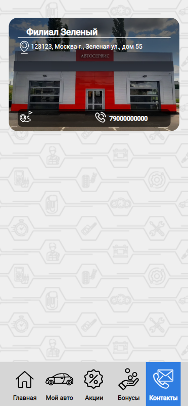

На странице подразделения содержится информация: Фото, Название филиала, Часы работы, Контактный телефон, Адрес, а также следующие кнопки:

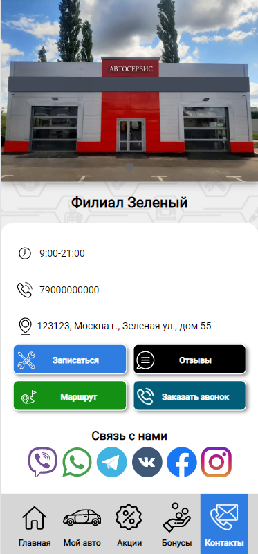

1. **“Записаться”** – переход к [записи на ремонт](../Запись%20на%20ремонт%20через%205S%20LINK/zapis-na-remont-cherez-5s-link.md);

2. **“Отзывы”** – можно почитать отзывы об автосервисе:

   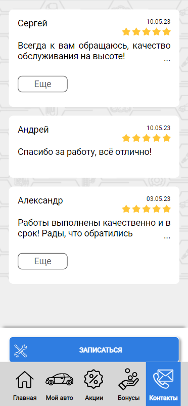

   Свой отзыв можно оставить после завершения Заказ-наряда: согласно настройкам – по умолчанию через 3 дня – клиенту приходит [push-сообщение](../Push-сообщения/push-soobscheniya.md) с запросом отзыва. Нажатием на push-сообщение открывается окно отзыва. Необходимо поставить оценку – количество “звездочек”, написать комментарий и нажать кнопку “Отправить”:

   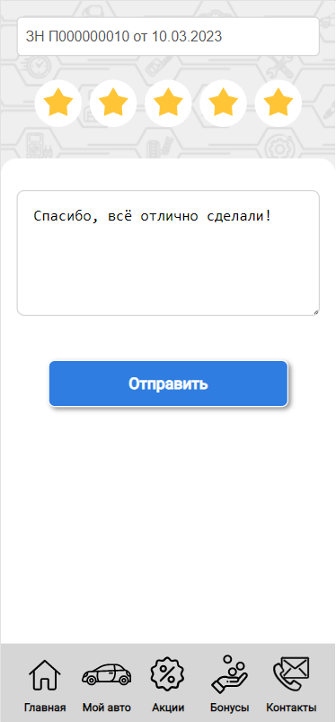

   После этого пользователь увидит следующее сообщение:

   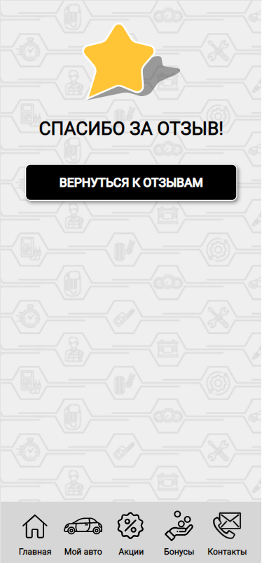

   Подробнее см. статью “[Отзывы в 5S LINK](../Отзывы%20в%205S%20LINK/otzyvy-v-5s-link.md)”.

   

3. **“Маршрут”** – проложить маршрут в автосервису. При нажатии на кнопку открывается окно выбора, с помощью какого приложения, установленного на смартфоне пользователя, открыть карту:

   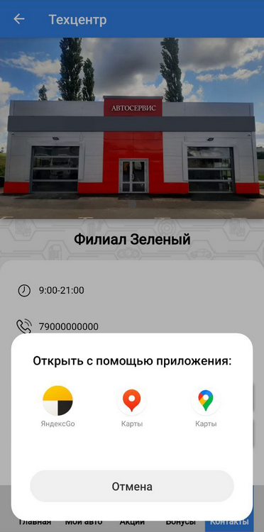

   При нажатии на приложение открывается карта с координатами, которые введены в Личном кабинете:

   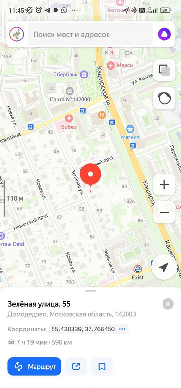

4. **“Заказать звонок”** – при нажатии на кнопку открывается форма заказа обратного звонка:

   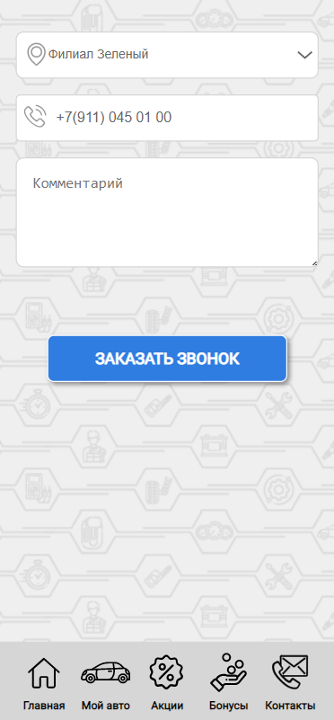

   Здесь следует выбрать филиал, номер телефона подтягивается автоматически, но при необходимости можно ввести другой номер, можно написать комментарий, затем нажать кнопку “Заказать звонок”.

   Предварительно должны быть сделаны настройки на уровне телефонии. При нажатии на кнопку на телефон сотрудника автосервиса отправляется запрос перезвонить. Сотрудник слышит уведомление “Заявка с сайта”/”Обратный звонок”, и начинается дозвон до клиента – сотрудник слышит в трубке гудки. Если в сервисе никто не поднимет трубку, то звонок будет зарегистрирован как пропущенный.

---

**Теги:** 5s link, интерфейс, главный экран, автомобиль, акции, бонусы

