# Настройки 5S LINK в Личном кабинете

<table><tr><td><b>Время чтения:</b> 19 мин.</td><td><b>Обновлено:</b> 10.05.2023</td></tr></table>

Источник: https://www.5systems.ru/help/nastroyki-5s-link-v-lichnom-kabinete

> *Актуально для 5S LINK версии* ***v1***.

## Содержание

1. [Введение](#введение)
2. [Вход в Личный кабинет](#вход-в-личный-кабинет)
3. [Вкладки](#вкладки)
   - [1. Акции](#1-акции)
   - [2. Бонусы](#2-бонусы)
   - [3. Категории](#3-категории)
   - [4. Марки и Модели](#4-марки-и-модели)
   - [5. Общие рекомендации](#5-общие-рекомендации)
   - [6. Техцентры](#6-техцентры)
   - [7. Отзывы](#7-отзывы)
   - [8. Пользователи](#8-пользователи)
   - [9. Email](#9-email)
   - [10. Настройки](#10-настройки)

## Введение

Настройки интеграции программы с мобильным приложением включают в себя следующие блоки:

1. Настройки в программе: в справочнике “Интеграции”, настройки Каталога услуг и Филиалов компании, Пользователи моб. приложения, настройка бонусной программы;
2. Настройки в Личном кабинете.

В рамках данной статьи рассматриваются настройки интеграции в программе и логика совместной работы программных решений 5S AUTO и 5S LINK v1. О настройках в программе см. статью [Настройки интеграции программы с 5S LINK](../Настройки%20интеграции%20программы%20с%205S%20LINK/nastroyki-integracii-programmy-s-5s-link.md).

Также см. статьи: [Регистрация и авторизация в 5S LINK](../Регистрация%20и%20авторизация%20в%205S%20LINK/registraciya-i-avtorizaciya-v-5s-link.md), [Интерфейс 5S LINK](../Интерфейс%205S%20LINK/interfeys-5s-link.md) и [Запись на ремонт через 5S LINK](../Запись%20на%20ремонт%20через%205S%20LINK/zapis-na-remont-cherez-5s-link.md).

## Вход в Личный кабинет

“Личный кабинет” представляет собой сайт управления Мобильным приложением.

Логин и пароль менеджера для входа в Личный кабинет выдается на внедрении.

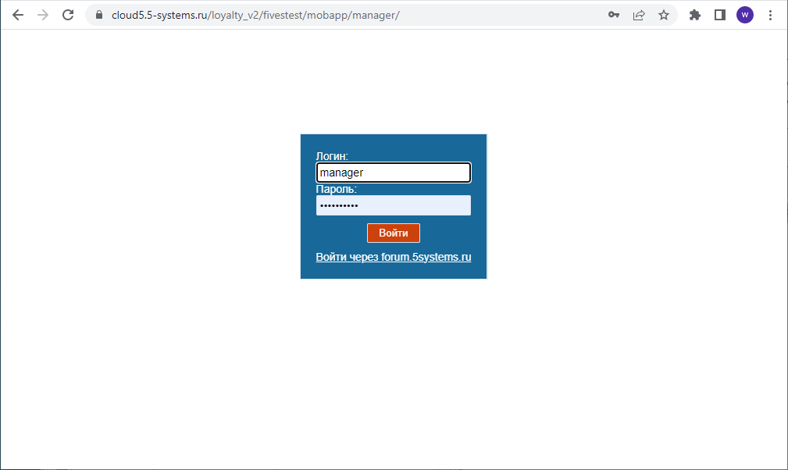

Настройки производятся на следующих вкладках:

1. Акции
2. Бонусы
3. Категории
4. Марки и Модели
5. Общие рекомендации
6. Техцентры
7. Отзывы
8. Пользователи
9. Email
10. Настройки

## Вкладки

### 1. Акции

На данной вкладке производится добавление новых [акций](../Интерфейс%205S%20LINK/interfeys-5s-link.md#акции) и редактирование имеющихся:

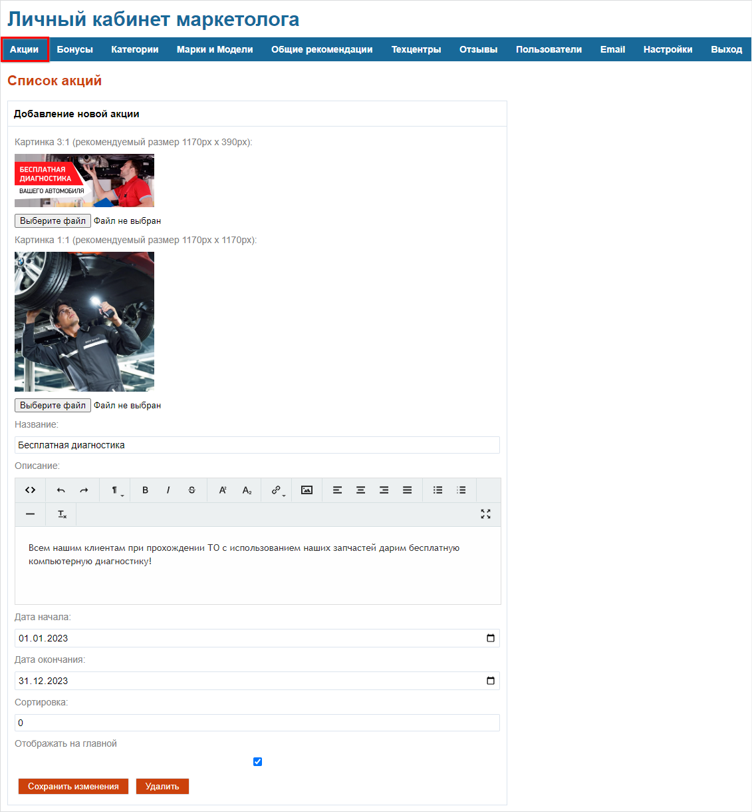

Необходимо загрузить две картинки – для превью и основную в соответствии с указанными размерами, ввести название и описание, задать даты начала и окончания акции, галочка “Отображать на главной”.

### 2. Бонусы

На вкладке “Бонусы” настраивается информация по [бонусной системе](../Интерфейс%205S%20LINK/interfeys-5s-link.md#бонусы):

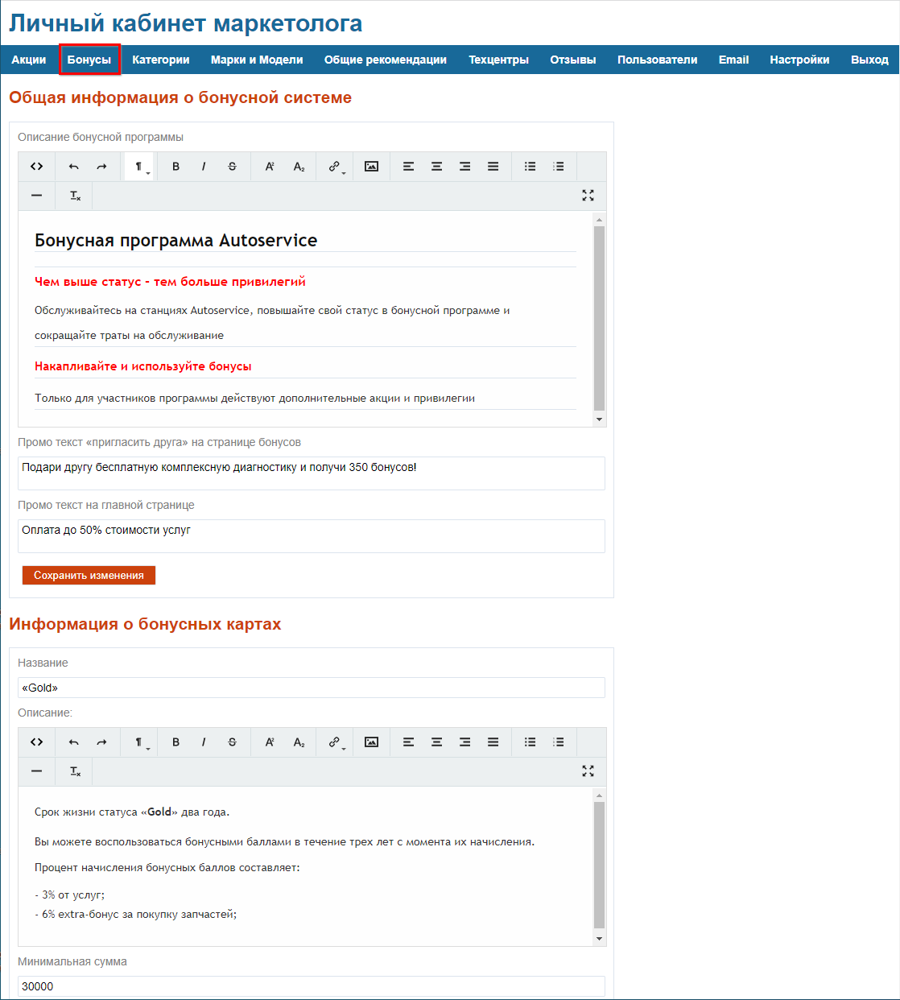

### 3. Категории

В программе в [Каталоге услуг](../Настройки%20интеграции%20программы%20с%205S%20LINK/nastroyki-integracii-programmy-s-5s-link.md#настройки-каталога-услуг) создаются папки с автоработами. Они будут отображаться в личном кабинете в разделе “Категории” и будут доступны для выбора при [записи](../Запись%20на%20ремонт%20через%205S%20LINK/zapis-na-remont-cherez-5s-link.md#выбор-услуги) в приложении, если в настройках папок и входящих в них работ будет поставлена галочка “Отображать в Мобильном приложении”, а также если не будут установлены ограничения в поле “Каталоги услуг для внешних сервисов” в [настройках интеграции](../Настройки%20интеграции%20программы%20с%205S%20LINK/nastroyki-integracii-programmy-s-5s-link.md#katalogy):

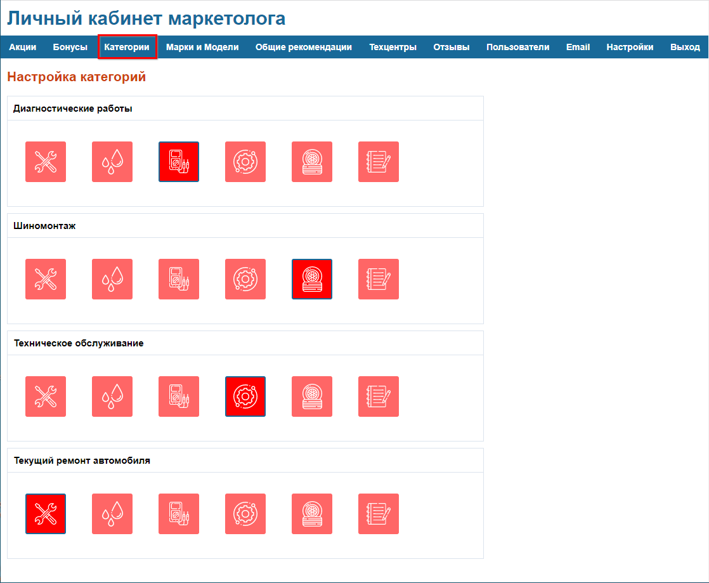

Из предложенных здесь картинок можно выбрать любую – они будут отображаться в списке авторабот при [записи на ремонт](../Запись%20на%20ремонт%20через%205S%20LINK/zapis-na-remont-cherez-5s-link.md#выбор-услуги).

### 4. Марки и Модели

В данном разделе можно для определенных марок и моделей автомобилей задать порядок отображения, чтобы они выводились вверху списка – например, если компания специализируется на определенной марке автомобилей:

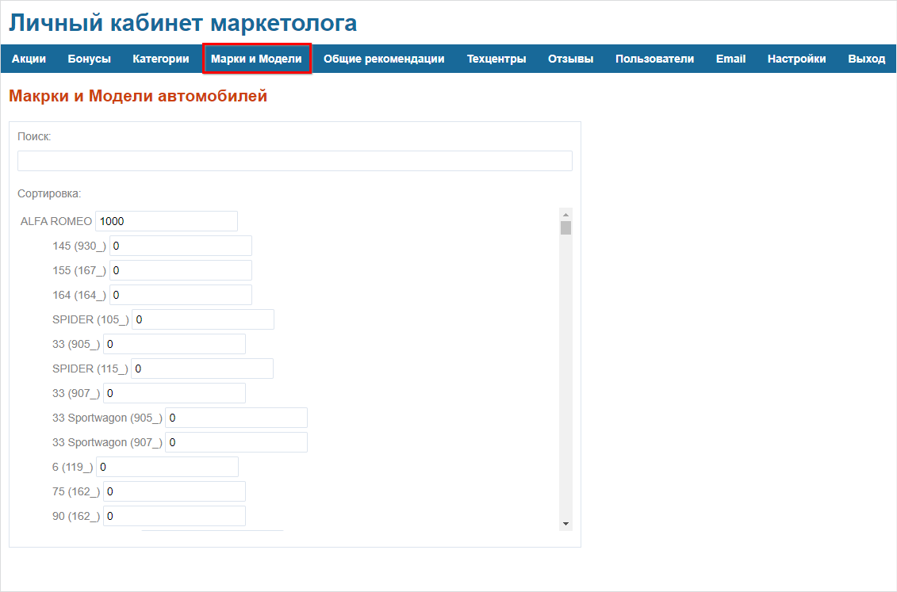

### 5. Общие рекомендации

Если нет конкретных рекомендаций по автомобилю пользователя, то система подтянет отсюда общие рекомендации в [поле с рекомендациями](../Интерфейс%205S%20LINK/interfeys-5s-link.md#aktualnyerek) на [главном экране](../Интерфейс%205S%20LINK/interfeys-5s-link.md#главный-экран):

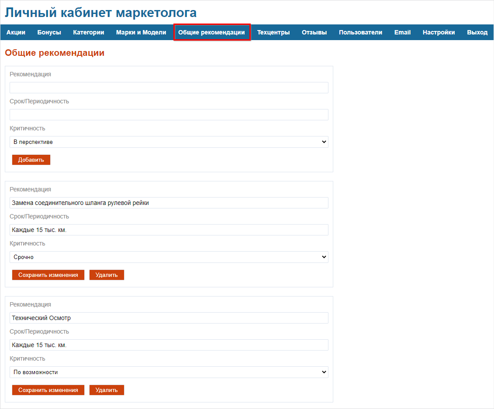

Можно добавлять сюда новые рекомендации, указывать название, периодичность и критичность.

### 6. Техцентры

Самая важная для заполнения вкладка. Это информация, которая будет выводиться в МП на странице “[Контакты](../Интерфейс%205S%20LINK/interfeys-5s-link.md#контакты)”.

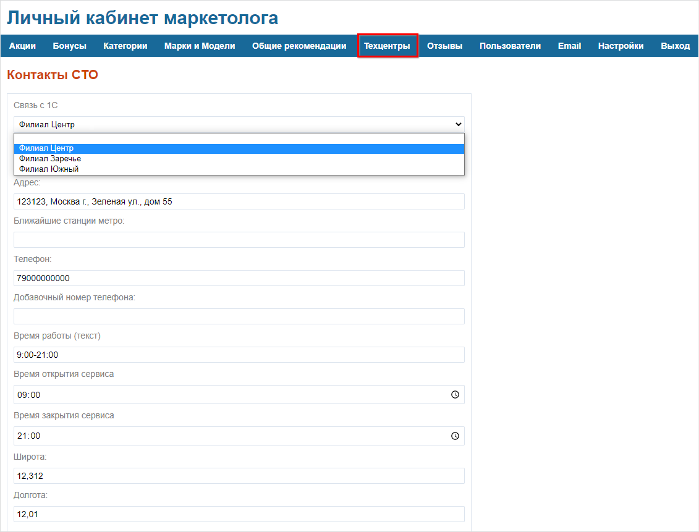

- *Связь с 1С* – самый важный параметр. Чтобы в ЛК маркетолога появилась возможность установить связь, необходимо в программе создать филиалы компании. Нельзя создавать более одного на одну связь. Разные подразделения в ЛК должны связываться с разными объектами в 1С, т.е. следует создать на каждое подразделение свой объект в 1С, свой элемент в справочнике.
- Название;
- Адрес и станции метро;
- Телефон;
- Время работы – текстом;
- Время открытия и закрытия сервиса;
- Широта и Долгота – для работы кнопки “[Проложить маршрут](../Интерфейс%205S%20LINK/interfeys-5s-link.md#prolozhit)”;
- Телефоны в мессенджерах и ссылки на соцсети – появятся в контактах в виде кнопок:  
  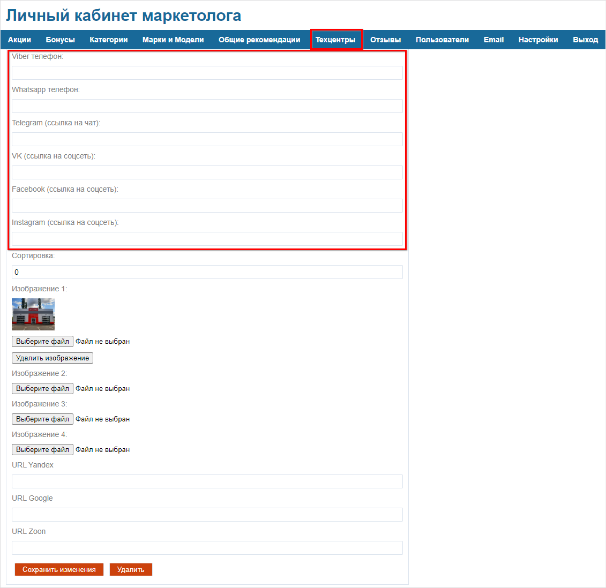  
  Пример отображения в приложении:  
  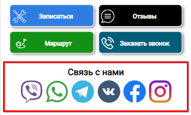
- Изображения: можно загрузить несколько фото и соотнести их по порядку;
- Ссылки на компанию на сервисах Google, Yandex, Zoon.

После добавления или изменения информации необходимо нажать кнопку “Сохранить изменения”.

### 7. Отзывы

На данной странице можно увидеть все [отзывы](../Отзывы%20в%205S%20LINK/otzyvy-v-5s-link.md), которые кто-либо оставлял. Записи недоступны для редактирования. Можно написать ответ на отзыв:

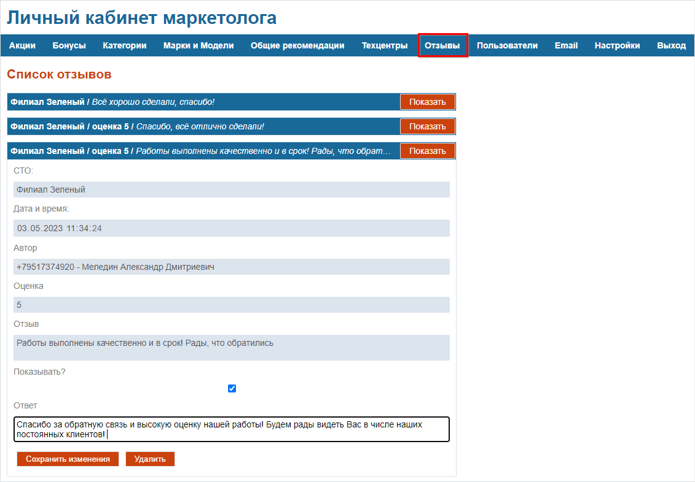

Он будет отображен в приложении:

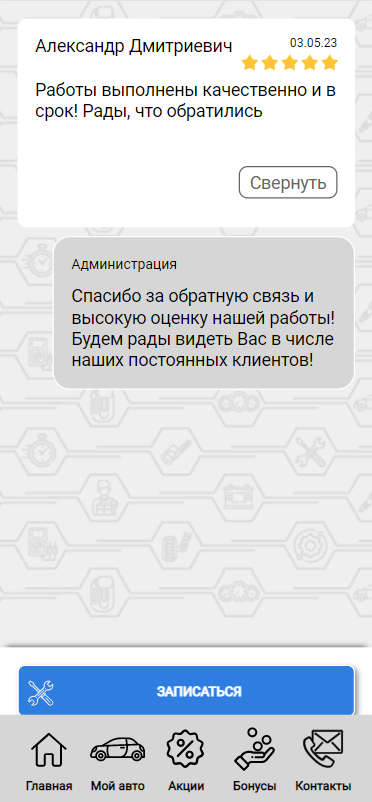

Также можно поставить или снять галочку “Показывать” – например, скрыть плохой отзыв.

### 8. Пользователи

Для входа в ЛК маркетолога. ФИО, логин и пароль, тип – администратор или пользователь.

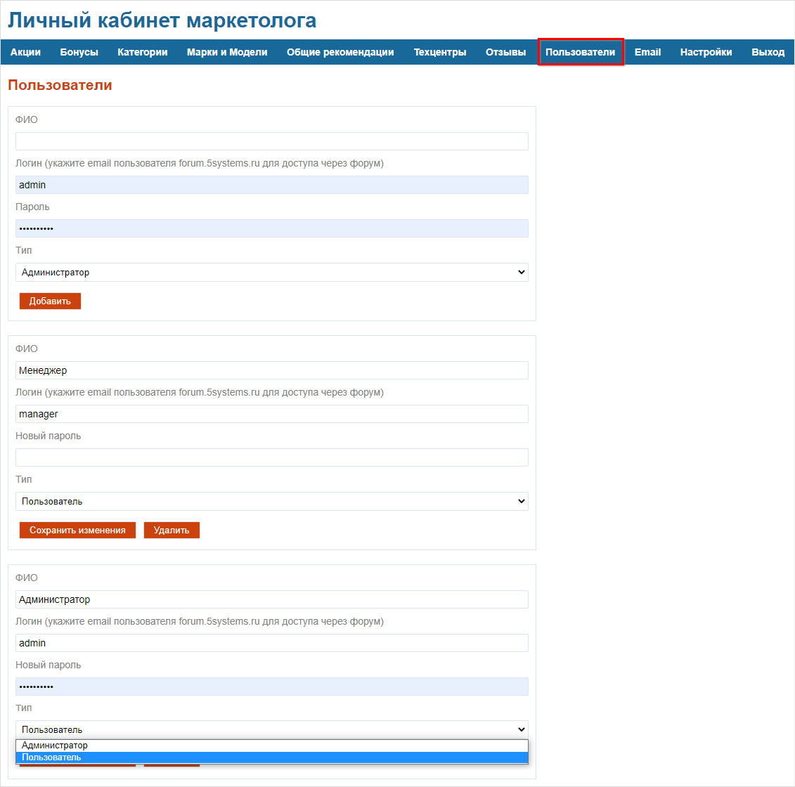

Можно добавить своего пользователя, но обычно хватает администратора и менеджера.

### 9. Email

На данной вкладке можно настроить оповещения о новых отзывах, заявках и запросах по гарантии, для этого следует добавить адреса электронной почты:

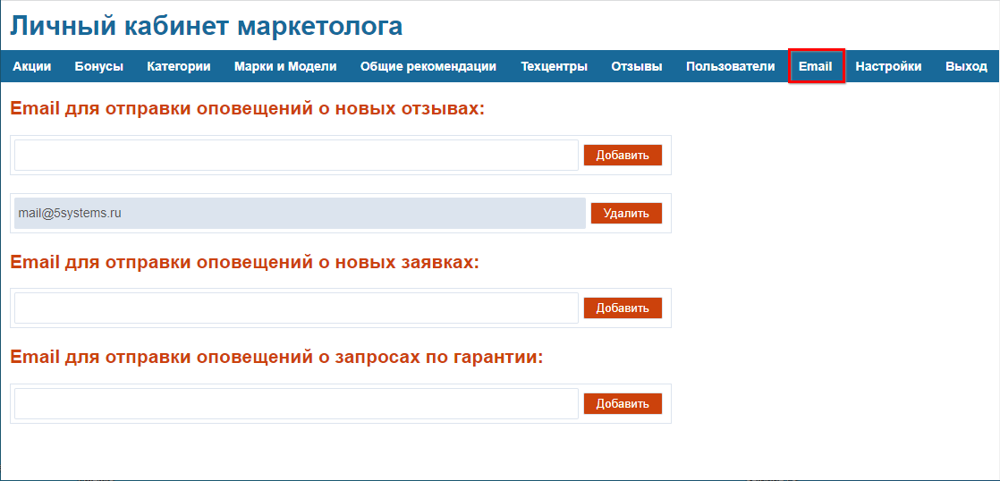

На указанный адрес будут приходить письма следующего вида:

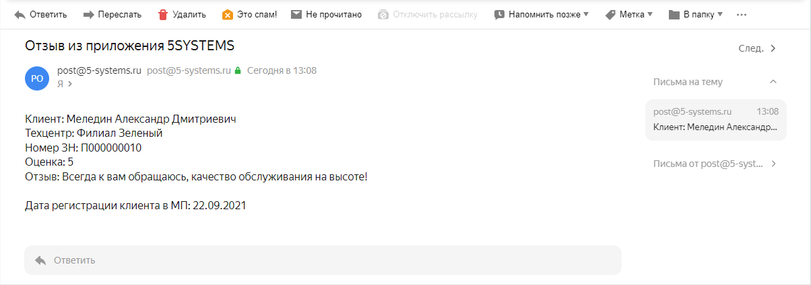

*Примечание: рекомендуется использовать Яндекс Почту.*

### 10. Настройки

На данной вкладке производятся следующие настройки:

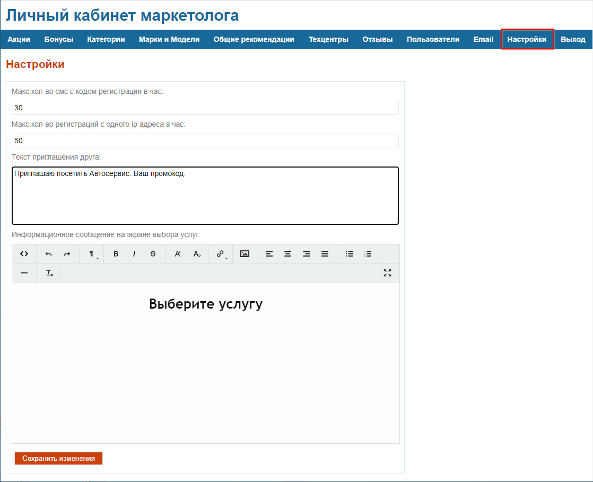

- *Макс. кол-во смс с кодом регистрации в час* – ограничение на количество попыток регистрации. После заданного здесь количества раз нажатия на кнопку “Получить код” на странице авторизации у пользователя будет заблокирована данная возможность до начала следующего часа.
- *Макс. кол-во регистраций с одного ip адреса в час* – если под одним ip-адресом заходит более указанного количества пользователей, также произойдет блокировка на час.
- *Текст приглашения друга* – sms-сообщение, которое получит пользователь, которого приглашают установить приложение.
- *Информационное сообщение на экране выбора услуг* – текст, который отображается на странице выбора авторабот при [записи](../Запись%20на%20ремонт%20через%205S%20LINK/zapis-na-remont-cherez-5s-link.md#выбор-услуги).

---

**Теги:** 5s link, личный кабинет, акции, бонусы, техцентры, отзывы, пользователи
