

# Настройки интеграции программы с 5S LINK

<table><tr><td><b>Время чтения:</b> 21 мин.</td><td><b>Обновлено:</b> 10.05.2023</td></tr></table>

Источник: https://www.5systems.ru/help/nastroyki-integracii-programmy-s-5s-link

> *Актуально для 5S LINK версии* ***v1***.

## Содержание

1. [Введение](#введение)
2. [Настройки в справочнике Интеграции](#настройки-в-справочнике-интеграции)
3. [Настройки Каталога услуг](#настройки-каталога-услуг)
4. [Настройка Филиалов компании](#настройка-филиалов-компании)
5. [Внешние пользователи](#внешние-пользователи)
6. [Настройка бонусной программы](#настройка-бонусной-программы)

## Введение

Настройки интеграции программы с мобильным приложением включают в себя следующие блоки:

1. Настройки в программе:
   - Настройки в справочнике “Интеграции”;
   - Настройки Каталога услуг;
   - Настройка Филиалов компании;
   - Пользователи моб. приложения;
   - Настройка бонусной программы;
2. Настройки в Личном кабинете.

В рамках данной статьи рассматриваются настройки интеграции в программе и логика совместной работы программных решений 5S AUTO и 5S LINK v1. О настройках в личном кабинете см. статью [Настройки 5S LINK в Личном кабинете](../Настройки%205S%20LINK%20в%20Личном%20кабинете/nastroyki-5s-link-v-lichnom-kabinete.md). Также см. статьи: [Регистрация и авторизация в 5S LINK](../Регистрация%20и%20авторизация%20в%205S%20LINK/registraciya-i-avtorizaciya-v-5s-link.md), [Интерфейс 5S LINK](../Интерфейс%205S%20LINK/interfeys-5s-link.md) и [Запись на ремонт через 5S LINK](../Запись%20на%20ремонт%20через%205S%20LINK/zapis-na-remont-cherez-5s-link.md).

## Настройки в справочнике Интеграции

Настройки интеграции с Мобильным приложением в программе производятся в справочнике “Интеграции” – *Администрирование → Компания → CRM → Интеграции либо в стандартном меню CRM → Все операции → Справочники → Интеграции:*

Карточка интеграции с Мобильным приложением должна быть заполнена следующим образом:

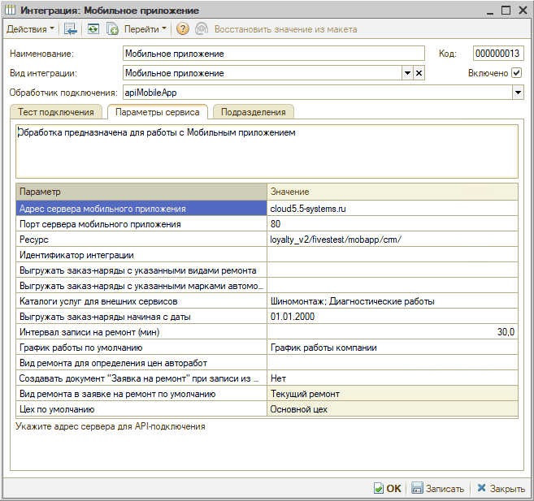

- *Наименование* – например, “Мобильное приложение”;
- *Вид интеграции* – “Мобильное приложение”;
- *Обработчик подключения* – apiMobileApp;
- Установить галочку *“Включено”.*

Основные настройки производятся на вкладке ***“Параметры”:***

1. *Адрес сервера мобильного приложения* – указывается адрес сервера 5SYSTEMS для API-подключения.
2. *Порт сервера мобильного приложения* – порт, через который доступно API-подключение, также всегда один и тот же.
3. *Ресурс* – следует указать каталог расположения скриптов для связи с мобильным приложением: loyalty_v2/projectname/mobapp/crm/. Вместо “projectname” указывается название папки на сервере для мобильного приложения. Это указывают сотрудники 5SYSTEMS при внедрении приложения. От данного параметра зависит, будут ли отправляться push-сообщения.
4. *Выгружать заказ-наряды с указанными видами ремонта* – если указать виды ремонта, то в списке заказ-нарядов в разделе “[Мой авто](../Интерфейс%205S%20LINK/interfeys-5s-link.md#информация-об-автомобиле)” будут показаны заказ-наряды только с указанными видами ремонта. Например, можно указать все виды ремонта кроме гарантийного – и он не будет выводиться. Если список видов ремонта не указан, то отбор в списке заказ-нарядов по видам ремонта не делается – т.е. будут выводиться все заказ-наряды.
5. *Выгружать заказ-наряды с указанными марками автомобилей* – если указать марки автомобилей, то в списке заказ-нарядов в разделе “Мой авто” будут выводится заказ-наряды с марками автомобилей из указанного списка. Если список марок автомобилей не заполнять, то отбор в списке заказ-нарядов по маркам автомобилей производиться не будет.

   

6. *Каталоги услуг для внешних сервисов* – указанные [каталоги услуг](#настройки-каталога-услуг) будут отображаться при [выборе клиентом услуг](../Запись%20на%20ремонт%20через%205S%20LINK/zapis-na-remont-cherez-5s-link.md#выбор-услуги), а также в Личном кабинете в разделе “[Категории](../Настройки%205S%20LINK%20в%20Личном%20кабинете/nastroyki-5s-link-v-lichnom-kabinete.md#3-категории)”. Если список каталогов не заполнять, то будут отображаться все каталоги услуг.
7. *Выгружать заказ-наряды начиная с даты* – можно ограничить показ заказ-нарядов с определенной даты. Если указать дату, то в список будут выводится заказ-наряды начиная с указанной даты. Если дата не указана, то будут показаны все заказ-наряды.
8. *Интервал записи на ремонт (мин)* – интервал в минутах, через который будут выполняться записи на ремонт. Т.е. с какими интервалами будет выводиться свободное для записи [время](../Запись%20на%20ремонт%20через%205S%20LINK/zapis-na-remont-cherez-5s-link.md#выбор-даты-и-времени). Например, 30 минут.
9. *График работы по умолчанию* – указанный график работы будет использоваться в случае, если в справочнике “Каталог услуг для внешних сервисов” не указаны цеха, в которых выполняются работы. Обычно выбирается график работы компании.
10. *Вид ремонта для определения цен авторабот* – указанный вид ремонта будет использоваться для определения цен авторабот.
11. *Создавать документ “Заявка на ремонт” при записи из моб. приложения* – Да/Нет: при нажатии пользователем кнопки “Записаться” помимо лида/сделки и Корзины в программе будет также создаваться документ “Заявка на ремонт”.
12. *Вид ремонта в заявке на ремонт по умолчанию* – если в предыдущем параметре настроено создание Заявки на ремонт при обращении из Мобильного приложения, то можно настроить вид ремонта, который будет по умолчанию устанавливаться в создаваемых Заявках на ремонт.
13. *Цех по умолчанию* – цех, который будет использоваться в случае, если в справочнике “Каталог услуг для внешних сервисов” не указаны цеха, в которых выполняются работы.

## Настройки Каталога услуг

Справочник находится в меню *Маркетинг → Мобильное приложение → Настройки:*

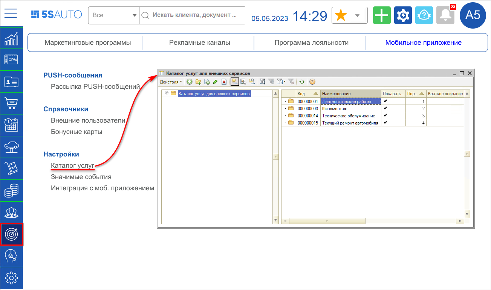

Справочник содержит папки с услугами. Если стоит галочка “Показать в списке”, то папка с услугами будет отображаться в мобильном приложении при [записи на ремонт](../Запись%20на%20ремонт%20через%205S%20LINK/zapis-na-remont-cherez-5s-link.md#выбор-услуги), а также появится в Личном кабинете в категориях. Условие: в [настройках интеграции](#katalogy) с мобильным приложением не должно быть установлено ограничений на определенные каталоги.

Если открыть папку для изменения, она будет иметь следующий вид:

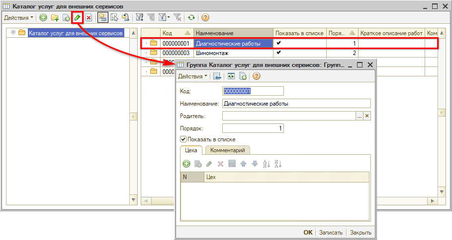

В таблице можно добавить цеха.

В папках содержатся услуги – автоработы. Карточка работы выглядит следующим образом:

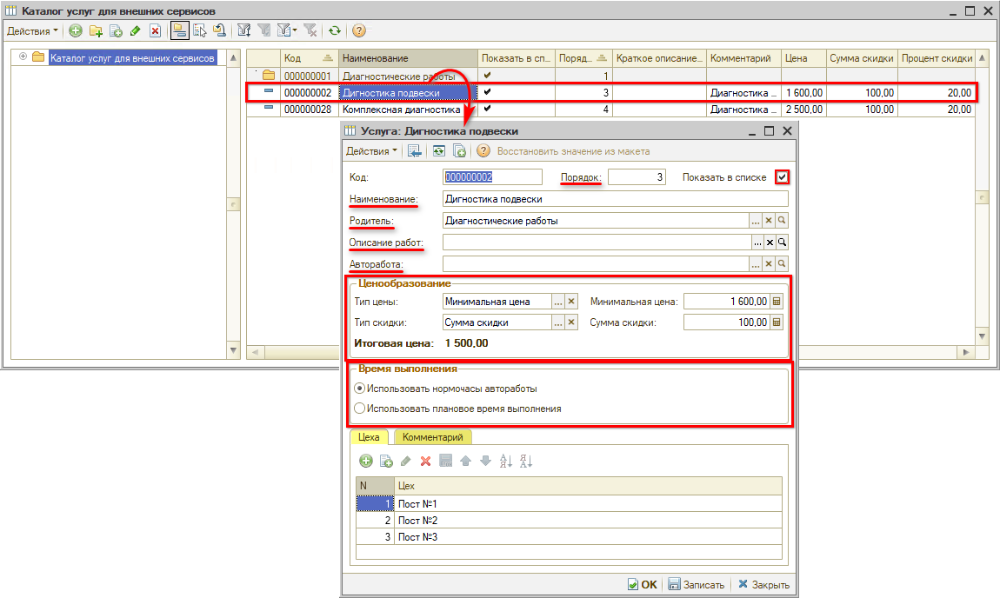

Данные карточки услуг заполняются клиентом самостоятельно, специалисты 5SYSTEMS заполняют для примера только одну-две типовые работы.

1. *Порядок* – порядок отображения по списку.
2. *Показывать в списке* – галочка для отображения услуги в списке услуг в приложении.
3. *Наименование* – название работы.
4. *Родитель* – группа, в которую входит данная работа, т.е. папка, в которой она размещена.
5. *Описание работ* – можно добавить описание.
6. *Авторабота* – можно выбрать автоработу из справочника. Если не выбирать в карточке услуги автоработу, то при создании сделки просто добавится текст в комментарии, на какую работу записывается пользователь. Если не указать в карточке услуги автоработу, то при записи из приложения она не попадет в Корзину.
7. *Ценообразование:*
   - Тип цены: можно назначить минимальную цену – тогда для услуги будет указана цена “от …”.  
     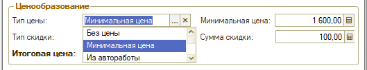  
     Если выбран вариант “Без цены”, то цена услуги указана не будет:  
     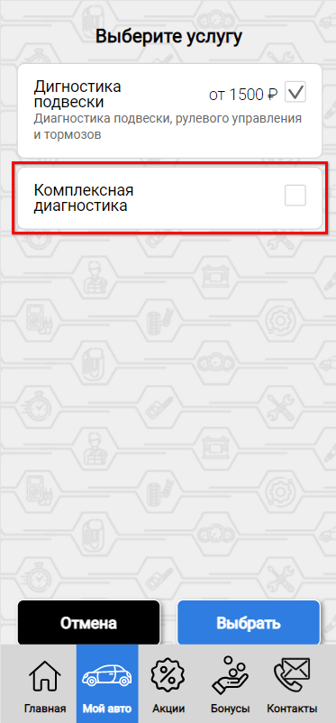  
     При выборе варианта “Из автоработы” подтянется норма времени из автоработы. 
     Указанная в приложении сумма может отличаться от реальной, она не будет указываться в заказ-наряде, данное значение будет использоваться только в мобильном приложении.
   - Тип скидки – можно задать сумму или процент скидки. Если выбран тип “Минимальная цена”, то в приложении будет отображаться сразу сумма с учетом скидки. Если выбрать цену “Из автоработы”, то стоимость в описании услуги будет отображаться следующим образом:  
     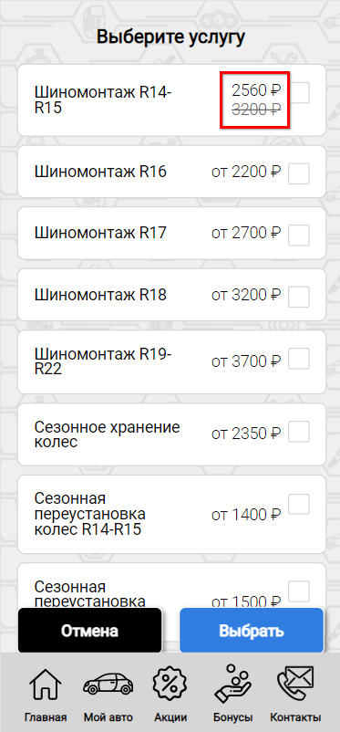  
     Т.е. указана цена автоработы, зачеркнута, и сверху над ней указана цена с учетом скидки.

8. *Время выполнения:* “Использовать нормочасы автоработы” или “Использовать плановое время выполнения” – указывается для записи на ремонт через приложение, чтобы создавался документ Запись на ремонт.

9. *Цеха:* авторабота будет записываться на указанный в данном поле цех. По указанным цехам будут определяться свободные временные отрезки для записи на ремонт, т.е. доступное свободное время, с учетом выбранного филиала.
10. *Комментарий* – то, что подтягивается в описание автоработы.

## Настройка Филиалов компании

Справочник находится в меню программы *CRM → Программа лояльности → Филиалы компании.* Данный справочник используется специально для Мобильного приложения. В справочнике следует создать карточку филиала компании, задать наименование и соотнести филиал с подразделением в программе:

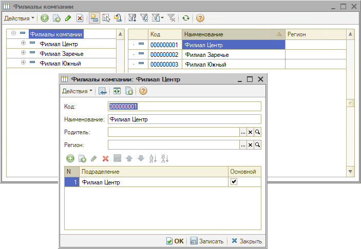

В Личном кабинете на вкладке “[Техцентры](../Настройки%205S%20LINK%20в%20Личном%20кабинете/nastroyki-5s-link-v-lichnom-kabinete.md#6-техцентры)” в поле “Связь с 1С” следует выбрать данный элемент справочника и связать его с карточкой контакта.

Таким образом, связь между карточкой филиала и подразделением в программе устанавливается через справочник “Филиалы компании” и через выбор филиала в Личном кабинете.

Эти связи важно установить для дальнейшей возможности [записи](../Запись%20на%20ремонт%20через%205S%20LINK/zapis-na-remont-cherez-5s-link.md) на ремонт через МП – в приложение подтягивается филиал, указанный в Личном кабинете, туда он подтягивается из карточки справочника “Филиалы компании”, и затем программа определяет указанное в данной карточке подразделение:

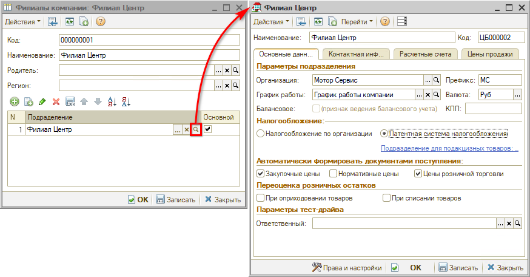

Затем в программе идет проверка на цеха, т.е. система ищет цеха с таким подразделением, и на найденные цеха производится запись.

Подразделений в карточке филиала может быть добавлено несколько, но обычно выбирается один основной – для него устанавливается галочка “Основной”. Основное подразделение будет подтягиваться в созданную при обращении через Мобильное приложение сделку, если не передалось выбранное пользователем подразделение.

## Внешние пользователи

Справочник "Внешние пользователи" содержит всех пользователей Мобильного приложения. В карточку пользователя из приложения подтягивается информация о пользователе, контактный телефон, данные о добавленных им автомобилях и т.д. Подробнее см. статью "[Внешние пользователи](../../Внешние%20пользователи/vneshnie-polzovateli.md)".

## Настройка бонусной программы

Обычно при настройке Мобильного приложения делается настройка бонусной программы. При этом клиенту предлагается создать многоуровневую бонусную систему, т.к. в Мобильном приложении все заточено под это – когда можно увидеть следующий статус и что-нужно сделать, чтобы на него перейти.

В бонусных программах можно создавать особые внешние события.

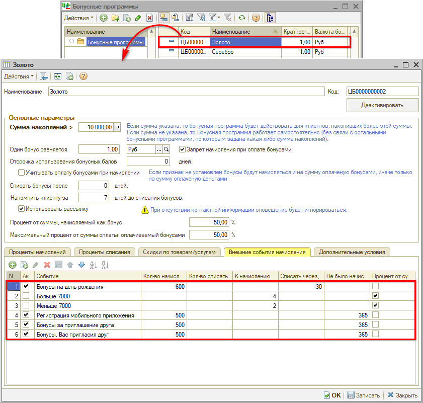

К мобильному приложению относятся следующие предопределенные внешние события:

1. *“Регистрация мобильного приложения”:*

   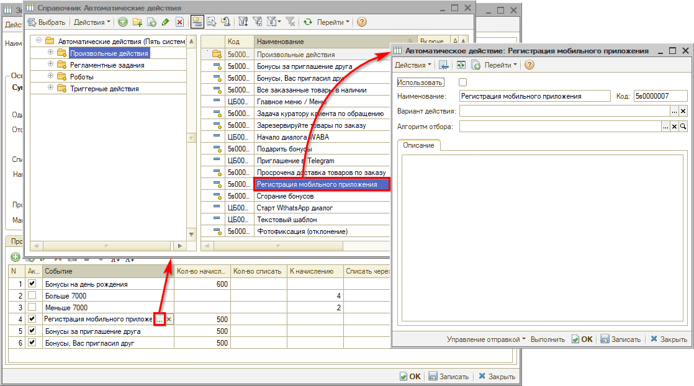

   Настраивать в нем ничего не нужно, начинает работать, когда автоматическое действие выбрано к внешнему событию бонусной системы, указано количество бонусов к начислению и активировано.

2. *“Бонусы за приглашение друга”.*
3. *“Бонусы. Вас пригласил друг”.*

Для каждого события указывается количество начисляемых бонусов. Данные внешние события есть на каждом уровне бонусной системы, но можно для более высоких уровней системы настроить большее количество начисляемых бонусов. Т.е. если постоянный клиент автосервиса, например, находится на “Золотом” уровне бонусной программы и устанавливает приложение, то он получит количество бонусов за установку приложения, определенное для данного уровня.

Обычно заполняется только колонка “Не было начислений (кол-во дней) = 365”, чтобы начисление бонусов по данным событиям осуществлялось не чаще 1 раза в год. За приглашение друга можно изменить значение – например, чтобы начислять за каждое приглашение.

---

**Теги:** 5s link, интеграция, каталог услуг, филиалы, внешние пользователи, бонусная программа

